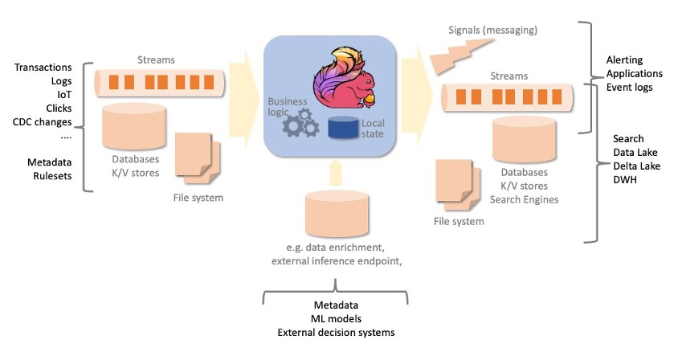
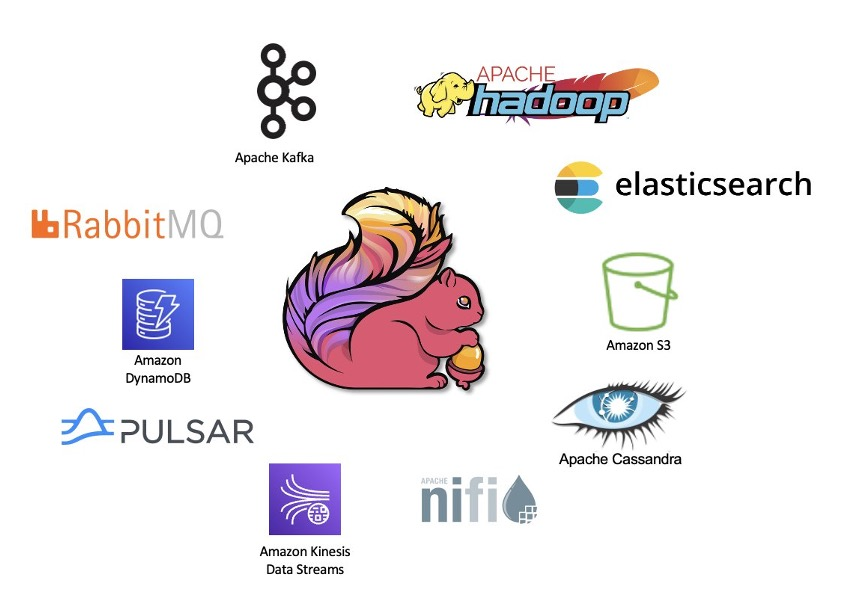
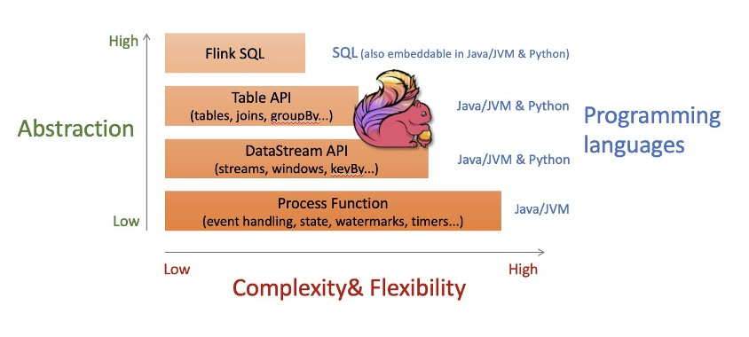

#  Apache Flink 简介
Save From : [什么是 Apache Flink？- Apache Flink 简介 - AWS](https://aws.amazon.com/cn/what-is/apache-flink/) 

什么是 Apache Flink？
-----------------

Apache Flink 是开源的分布式引擎，用于对无界限（流）和有界限（批处理）数据集进行有状态处理。流处理应用程序旨在连续运行，最大限度地减少停机时间，并在摄取数据期间对其进行处理。Apache Flink 专为低延迟处理、在内存中执行计算、实现高可用性、消除单点故障以及水平扩展而设计。  
  
Apache Flink 的功能包括具有严格一次一致性保证的高级状态管理，以及具有复杂乱序处理和延迟数据处理的事件时间处理语义。Apache Flink 专为流式传输优先而开发，为流处理和批处理提供了统一的编程接口。

为什么使用 Apache Fink？
------------------

由于 Apache Flink 具有广泛的功能，因此其可用于构建许多不同类型的流式处理和批处理应用程序。  
Apache Flink 提供支持的一些常见应用程序类型包括：

*   **事件驱动的应用程序**，其中从一个或多个事件流中摄取事件并执行计算、状态更新或外部操作。借助有状态处理，可在单一消息转换之外实现逻辑，其中结果取决于摄取事件的历史记录。
*   **数据分析应用程序**，从数据中提取信息和见解。传统上通过查询有限的数据集、重新运行查询或修改结果以纳入新数据来执行此类应用程序。借助 Apache Flink，可以通过持续更新、流式传输查询或实时处理摄取的事件、持续发出和更新结果来执行分析。
*   **数据管道应用程序**，其中转换和丰富要从一个数据存储移动到另一个数据存储的数据。传统上，提取-转换-加载（ETL）操作是定期分批执行的。借助 Apache Flink，可以持续执行该流程，将数据以低延迟移动到其目标。

Apache Flink 如何运作？
------------------

Flink 是一款高吞吐量、低延迟的流处理引擎。Flink 应用程序由任意复杂的非循环数据流图组成，图形中涵盖流和转换。数据从一个或多个数据来源提取并发送到一个或多个目标。来源系统和目标系统可以是流、消息队列或数据存储，包括文件、常用数据库和搜索引擎。转换可以是有状态的，例如随时间窗口的聚合或复杂模式检测。 

通过两种不同的机制实现容错：以检查点自动和定期检查应用程序状态，将其复制到持久性存储中，以便在出现故障时自动恢复；按需保存点，其中保存一致的执行状态映像，允许停止和恢复、更新或分流您的 Flink 作业，在停止和重启后保留应用程序状态。检查点和保存点机制是异步的，在应用程序持续处理事件的同时，在不会“停止世界转动”的情况下拍摄一致的状态快照。

.fecaf1400dff5e72907e6e6d9dc64db244349678.jpg)

Apache Flink 有哪些优点？
-------------------

### **同时处理无界限（流）和有界限（批处理）数据集**

Apache Flink 既可以处理无界限数据集，也可以处理有界限数据集，即流和批处理数据。无界限流具有起点，但实际上是无限的，永远不会结束。从理论上讲，处理永远不会停止。  
  
有界限数据（如表）是有限的，可以在有限的时间内从头到尾进行处理。  
Apache Flink 提供的算法和数据结构支持通过同一个编程接口进行有界限处理和无界限处理。处理无界限数据的应用程序会持续运行。处理有界限数据的应用程序将在到达输入数据集的末尾时结束其执行。

### 大规模运行应用程序

Apache Flink 旨在运行几乎任何规模的有状态应用程序。可以并行处理成千上万个任务，这些任务同时分布在多台计算机上。  
  
状态还进行分区和水平分布，从而可在多台计算机上维护数 TB 的容量。状态以增量方式点查到持久性存储。

### 内存中的性能

流经应用程序和状态的数据在多台计算机上进行分区。因此，可以通过访问本地数据（通常是内存中的数据）来完成计算。

### 严格一次的状态一致性

单个消息转换之外的应用程序是有状态的。业务逻辑需要记住事件或中间结果。Apache Flink 可以保证内部状态的一致性，即使在出现故障以及应用程序停止和重启时也是如此。每条消息对内部状态的影响总是严格应用一次，无论应用程序在恢复或重启时是否可能收到数据来源的副本。

### 广泛的连接器

Apache Flink 具备许多经过经验的连接器，可以连接到流行的消息传递和流式传输系统、数据存储、搜索引擎和文件系统。一些示例包括 Apache Kafka、Amazon Kinesis Data Streams、Amazon SQS、Active MQ、Rabbit MQ、NiFi、OpenSearch 和 ElasticSearch、DynamoDB、HBase 以及任何提供 JDBC 客户端的数据库。  

### 多级别的抽象

Apache Flink 为编程接口提供多级别的抽象。在较高级别的流式传输 SQL 和 Table API 中，使用熟悉的抽象，例如表、联接和分组。DataStream API 提供较低级别的抽象，但同时赋予更多的控制，包括流、窗口化和映射的语义。最后，ProcessFunction API 提供对每条消息处理的精细控制和状态的直接控制。所有编程接口均可与无界限（流）和有界限（表）日期集无缝协作。可以在同一个应用程序中使用不同级别的抽象，将其作为解决每个问题的正确工具。

### 多种编程语言

Apache Flink 可以使用多种语言进行编程，从高级流式处理 SQL 到 Python、Scala、Java，以及其他 JVM 语言，例如 Kotlin。
