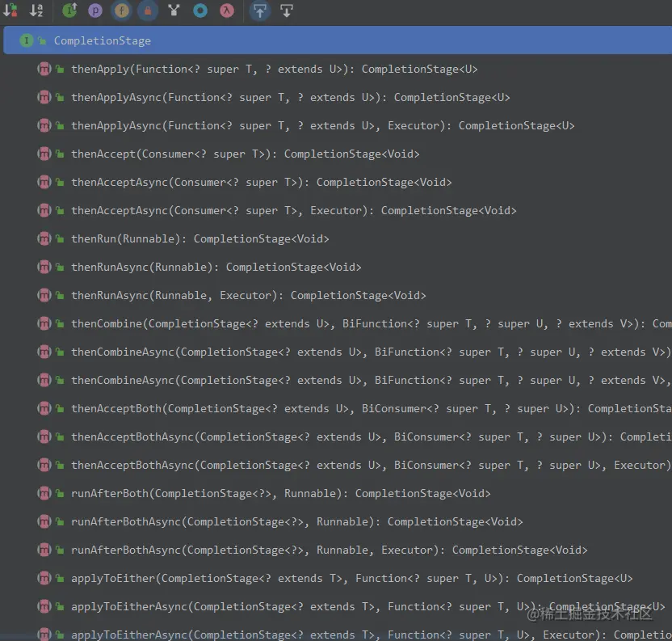
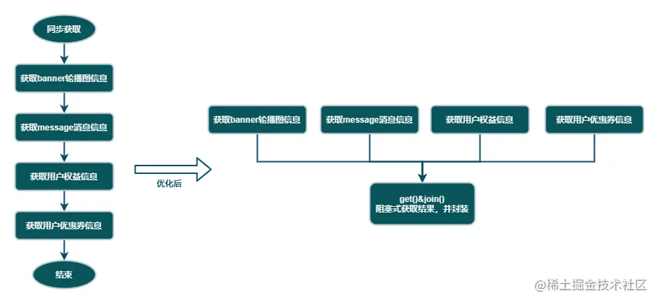
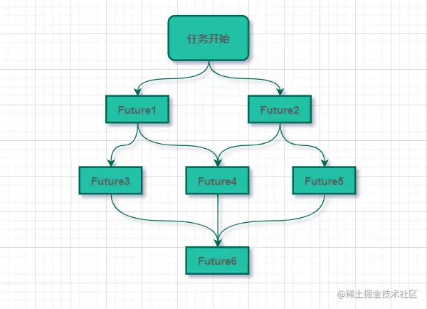
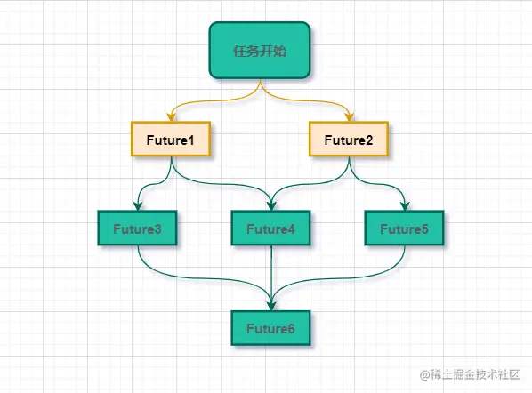
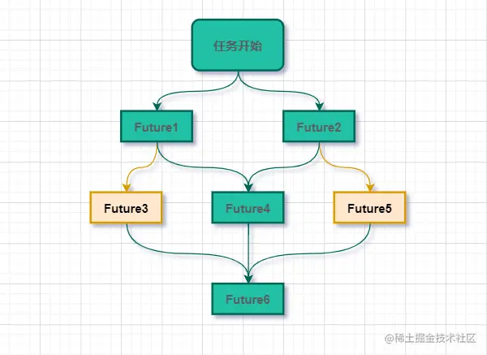
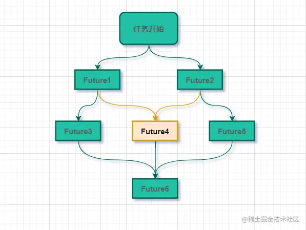
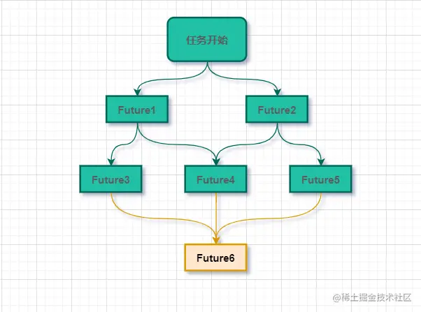

# CompletableFuture实现异步编排全面分析和总结
一、🌈CompletableFuture简介
-----------------------

> `CompletableFuture`结合了`Future`的优点，提供了非常强大的`Future`的扩展功能，可以帮助我们简化异步编程的复杂性，提供了函数式编程的能力，可以通过回调的方式处理计算结果，并且提供了转换和组合`CompletableFuture`的方法。
> 
> `CompletableFuture`被设计在`Java`中进行异步编程。异步编程意味着在主线程之外创建一个独立的线程，与主线程分隔开，并在上面运行一个非阻塞的任务，然后通知主线程进展，成功或者失败。
> 
> `CompletableFuture`是由`Java8`引入的，在`Java8`之前我们一般通过`Future`实现异步。
> 
> *   `Future`用于表示异步计算的结果，只能通过阻塞或者轮询的方式获取结果，而且不支持设置回调方法，`Java8`之前若要设置回调一般会使用`guava`的`ListenableFuture`。
> *   `CompletableFuture`对`Future`进行了扩展，可以通过设置回调的方式处理计算结果，同时也支持组合操作，支持进一步的编排，同时一定程度解决了回调地狱的问题。

### ✔本文的名词缩写：

*   _**CF：代表CompletableFuture**_
*   _**CS：代表CompletionStage**_

二、CompletableFuture 核心接口API介绍
-----------------------------

### 2.1 Future

#### 使用Future局限性

**从本质上说，Future表示一个异步计算的结果**。它提供了`isDone()`来检测计算是否已经完成，并且在计算结束后，可以通过`get()`方法来获取计算结果。在异步计算中，`Future`确实是个非常优秀的接口。但是，它的本身也确实存在着许多限制：

*   **并发执行多任务**：`Future`只提供了`get()`方法来获取结果，并且是阻塞的。所以，除了等待你别无他法；
*   **无法对多个任务进行链式调用**：如果你希望在计算任务完成后执行特定动作，比如发邮件，但`Future`却没有提供这样的能力；
*   **无法组合多个任务**：如果你运行了10个任务，并期望在它们全部执行结束后执行特定动作，那么在`Future`中这是无能为力的；
*   **没有异常处理**：`Future`接口中没有关于异常处理的方法；

| 方法 | 说明 | 描述 |
| --- | --- | --- |
| `boolean` | `cancel (boolean mayInterruptIfRunning)` | 尝试取消执行此任务。 |
| `V` | `get()` | 如果需要等待计算完成，然后检索其结果。 |
| `V` | `get(long timeout, TimeUnit unit)` | 如果需要，最多等待计算完成的给定时间，然后检索其结果（如果可用）。 |
| `boolean` | `isCancelled()` | 如果此任务在正常完成之前取消，则返回 `true` 。 |
| `boolean` | `isDone()` | 如果此任务完成，则返回 `true` 。 |

### 2.2 CompletableFuture

```csharp
public class CompletableFuture<T> implements Future<T>, CompletionStage<T> {

}

```

`JDK1.8` 才新加入的一个实现类`CompletableFuture`，而`CompletableFuture`实现了两个接口（如上面代码所示）：_**`Future<T>`、`CompletionStage<T>`**_，意味着可以像以前一样通过阻塞或者轮询的方式获得结果。

`Future`表示异步计算的结果，`CompletionStage`用于表示异步执行过程中的一个步骤`Stage`，这个步骤可能是由另外一个`CompletionStage`触发的，随着当前步骤的完成，也可能会触发其他一系列`CompletionStage`的执行。从而我们可以根据实际业务对这些步骤进行多样化的编排组合，`CompletionStage`接口正是定义了这样的能力，我们可以通过其提供的`thenAppy、thenCompose`等函数式编程方法来组合编排这些步骤。

*   **CompletableFuture是Future接口的扩展和增强**。`CompletableFuture`实现了`Future`接口，并在此基础上进行了丰富地扩展，完美地弥补了`Future`上述的种种问题。更为重要的是，
*   **CompletableFuture实现了对任务的编排能力**。借助这项能力，我们可以轻松地组织不同任务的运行顺序、规则以及方式。从某种程度上说，这项能力是它的核心能力。而在以往，虽然通过`CountDownLatch`等工具类也可以实现任务的编排，但需要复杂的逻辑处理，不仅耗费精力且难以维护。

### 2.3 CompletionStage



`CompletionStage<T>`接口提供了更多方法来更好的实现异步编排，并且大量的使用了`JDK8`引入的函数式编程概念。由`stage`执行的计算可以表示为`Function，Consumer或Runnable`（使用名称分别包括`apply 、accept或run`的方法 ），具体取决于它是否需要参数和/或产生结果。 例如：

```scss
stage.thenApply(x -> square(x)).thenAccept(x -> System.out.print(x)).thenRun(() -> System.out.println()); 

```

三、使用CompletableFuture场景
-----------------------

### 3.1 应用场景

**1️⃣** 执行比较耗时的操作时，尤其是那些依赖一个或多个远程服务的操作，使用异步任务可以改善程序的性能，加快程序的响应速度；  
**2️⃣** 使用`CompletableFuture`类，它提供了异常管理的机制，让你有机会抛出、管理异步任务执行种发生的异常；  
**3️⃣** 如果这些异步任务之间相互独立，或者他们之间的的某一些的结果是另一些的输入，你可以讲这些异步任务构造或合并成一个。

**举个常见的案例🌰**，在`APP`查询首页信息的时候，一般会涉及到不同的`RPC`远程调用来获取很多用户相关信息数据，比如：_**商品banner轮播图信息、用户message消息信息、用户权益信息、用户优惠券信息**_ 等，假设每个`rpc invoke()`耗时是`250ms`，那么基于同步的方式获取到话，算下来接口的`RT`至少大于1s，这响应时长对于首页来说是万万不能接受的，因此，我们这种场景就可以通过多线程异步的方式去优化。



### 3.2 CompletableFuture依赖链分析

根据`CompletableFuture`依赖数量，可以分为以下几类：_**零依赖、单依赖、双重依赖和多重依赖**_ 。



#### 零依赖

下图`Future1、Future2`都是零依赖的体现：



#### 单依赖：仅依赖于一个CompletableFuture

下图`Future3、Future5`都是单依赖的体现，分别依赖于`Future1`和`Future2`：



#### 双重依赖：同时依赖于两个CompletableFuture

下图`Future4`即为双重依赖的体现，同时依赖于`Future1`和`Future2`：



#### 多重依赖：同时依赖于多个CompletableFuture

下图`Future6`即为多重依赖的体现，同时依赖于`Future3`、`Future4`和`Future5`：



类似这种多重依赖的流程来说，结果依赖于三个步骤：_**`Future3、Future4、Future5`**_，这种多元依赖可以通过`allOf()`或`anyOf()`方法来实现，区别是当需要多个依赖全部完成时使用`allOf()`，当多个依赖中的任意一个完成即可时使用`anyOf()`，如下代码所示：

```ini
CompletableFuture<Void> Future6 = CompletableFuture.allOf(Future3, Future4, Future5)
CompletableFuture<String> result = Future6.thenApply(v -> {
    //这里的join并不会阻塞，因为传给thenApply的函数是在Future3、Future4、Future5全部完成时，才会执行 。
    result3 = Future3.join()
    result4 = Future4.join()
    result5 = Future5.join()
    
    // 返回result3、result4、result5组装后结果
    return assamble(result3, result4, result5)
})

```

四、CompletableFuture异步编排
-----------------------

在分析`CompletableFuture`异步编排之前，我跟大家理清一下`CompletionStage`接口下 _**（thenRun、thenApply、thenAccept、thenCombine、thenCompose）、（handle、whenComplete、exceptionally）**_ 相关方法的实际用法和它们之间的区别是什么? 带着你的想法💭往下看吧!!!

### 4.1 《异步编排API》

*   **`thenRun`**：【执行】直接开启一个异步线程执行任务，不接收任何参数，回调方法没有返回值；
*   **`thenApply`**：【提供】可以提供返回值，接收上一个任务的执行结果，作为下一个`Future`的入参，回调方法是有返回值的；
*   **`thenAccept`**：【接收】可以接收上一个任务的执行结果，作为下一个`Future`的入参，回调方法是没有返回值的；
*   **`thenCombine`**：【结合】可以结合不同的`Future`的返回值，做为下一个`Future`的入参，回调方法是有返回值的；
*   **`thenCompose`**：【组成】将上一个`Future`实例结果传递给下一个实例中。

#### ✔异步回调建议使用自定义线程池

```java

 * 线程池配置
 *
 * @author: austin
 * @since: 2023/3/12 1:32
 */
@Configuration
public class ThreadPoolConfig {

    
     * @Bean中声明的value不能跟定义的实例同名
     *
     */
    @Bean(value = "customAsyncTaskExecutor")
    public ThreadPoolTaskExecutor asyncThreadPoolExecutor() {
        ThreadPoolTaskExecutor threadPoolTaskExecutor = new ThreadPoolTaskExecutor();
        threadPoolTaskExecutor.setCorePoolSize(5);
        threadPoolTaskExecutor.setMaxPoolSize(10);
        threadPoolTaskExecutor.setKeepAliveSeconds(60);
        threadPoolTaskExecutor.setQueueCapacity(2048);
        threadPoolTaskExecutor.setWaitForTasksToCompleteOnShutdown(true);
        threadPoolTaskExecutor.setThreadNamePrefix("customAsyncTaskExecutor-");
        threadPoolTaskExecutor.setRejectedExecutionHandler(new ThreadPoolExecutor.CallerRunsPolicy());
        return threadPoolTaskExecutor;
    }

    @Bean(value = "threadPoolExecutor")
    public ThreadPoolExecutor threadPoolExecutor() {
        ThreadPoolExecutor threadPoolExecutor = new ThreadPoolExecutor(10, 10, 60L, TimeUnit.SECONDS,
                new ArrayBlockingQueue<>(10000), new ThreadPoolExecutor.CallerRunsPolicy());
        return threadPoolExecutor;
    }
}

```

如果所有异步回调都会共用该`CommonPool`，核心与非核心业务都竞争同一个池中的线程，很容易成为系统瓶颈。手动传递线程池参数可以更方便的调节参数，并且可以给不同的业务分配不同的线程池，以求资源隔离，减少不同业务之间的相互干扰。所以，**强烈建议你要根据不同的业务类型创建不同的线程池，以避免互相干扰**。通过自定义线程池`customAsyncTaskExecutor`，后面不同的异步编排方法，我们可以通过指定对应的线程池。

#### 1️⃣ runAsync()、thenRun()

```kotlin
@RestController
public class CompletableFutureCompose {

    @Resource
    private ThreadPoolTaskExecutor customAsyncTaskExecutor;

    @RequestMapping(value = "/thenRun")
    public void thenRun() {
        CompletableFuture.runAsync(() -> {
            System.out.println("thread name:" + Thread.currentThread().getName() + " first step...");
        }, customAsyncTaskExecutor).thenRun(() -> {
            System.out.println("thread name:" + Thread.currentThread().getName() + " second step...");
        }).thenRunAsync(() -> {
            System.out.println("thread name:" + Thread.currentThread().getName() + " third step...");
        });
    }
}

```

_**接口输出结果：** _

```arduino
thread name:customAsyncTaskExecutor-1 first step...
thread name:customAsyncTaskExecutor-1 second step...
thread name:ForkJoinPool.commonPool-worker-3 third step...

```

#### 2️⃣ thenApply()

```kotlin
@RequestMapping(value = "/thenApply")
public void thenApply() {
    CompletableFuture.supplyAsync(() -> {
        System.out.println("thread name:" + Thread.currentThread().getName() + " first step...");
        return "hello";
    }, customAsyncTaskExecutor).thenApply((result1) -> {
        String targetResult = result1 + " austin";
        System.out.println("first step result: " + result1);
        System.out.println("thread name:" + Thread.currentThread().getName() + " second step..., targetResult: " + targetResult);
        return targetResult;
    });
}

```

_**接口输出结果：** _

```arduino
thread name:customAsyncTaskExecutor-2 first step...
first step result: hello

thread name:customAsyncTaskExecutor-2 second step..., targetResult: hello austin

```

#### 3️⃣ thenAccept()

```csharp
@RequestMapping(value = "/thenAccept")
public void thenAccept() {
    CompletableFuture.supplyAsync(() -> {
        System.out.println("thread name:" + Thread.currentThread().getName() + " first step...");
        return "hello";
    }, customAsyncTaskExecutor).thenAccept((result1) -> {
        String targetResult = result1 + " austin";
        System.out.println("first step result: " + result1);
        System.out.println("thread name:" + Thread.currentThread().getName() + " second step..., targetResult: " + targetResult);
    });
}

```

_**接口输出结果：** _

```arduino
thread name:customAsyncTaskExecutor-3 first step...
first step result: hello

thread name:http-nio-10032-exec-9 second step..., targetResult: hello austin

```

_**`thenAccept()`和`thenApply()`的用法实际上基本上一致，区别在于`thenAccept()`回调方法是没有返回值的，而`thenApply()`回调的带返回值的。** _

**🌈细心的朋友可能会发现，上面`thenApply()`和`thenAccept()`请求线程池在不指定的情况下，两者的不同表现，`thenApply()`在不指定线程池的情况下，会沿用上一个`Future`指定的线程池`customAsyncTaskExecutor`，而`thenAccept()`在不指定线程池的情况，并没有复用上一个`Future`设置的线程池，而是重新创建了新的线程来实现异步调用。** 

#### 4️⃣ thenCombine()

```ini
@RequestMapping(value = "/thenCombine")
public void thenCombine() {
    CompletableFuture<String> future1 = CompletableFuture.supplyAsync(() -> {
        System.out.println("执行future1开始...")
        return "Hello"
    }, asyncThreadPoolExecutor)
    CompletableFuture<String> future2 = CompletableFuture.supplyAsync(() -> {
        System.out.println("执行future2开始...")
        return "World"
    }, asyncThreadPoolExecutor)
    future1.thenCombine(future2, (result1, result2) -> {
        String result = result1 + " " + result2
        System.out.println("获取到future1、future2聚合结果：" + result)
        return result
    }).thenAccept(result -> System.out.println(result))
}

```

_**接口访问，打印结果：** _

```arduino
thread name:customAsyncTaskExecutor-4 执行future1开始...
thread name:customAsyncTaskExecutor-5 执行future2开始...
thread name:http-nio-10032-exec-8 获取到future1、future2聚合结果：Hello World
Hello World

```

#### 5️⃣ thenCompose()

_我们先有`future1`，然后和`future2`组成一个链：`future1 -> future2`，然后又组合了`future3`，形成链：`future1 -> future2 -> future3`。这里有个隐藏的点：`future1、future2、future3`它们完全没有数据依赖关系，我们只不过是聚合了它们的结果。_

```kotlin
@RequestMapping(value = "/thenCompose")
public void thenCompose() {
    CompletableFuture.supplyAsync(() -> {
        
        System.out.println("thread name:" + Thread.currentThread().getName() + " 执行future1开始...");
        return "Hello";
    }, customAsyncTaskExecutor).thenCompose(result1 -> CompletableFuture.supplyAsync(() -> {
        
        System.out.println("thread name:" + Thread.currentThread().getName() + " 执行future2开始..., 第一个实例结果：" + result1);
        return result1 + " World";
    })).thenCompose(result12 -> CompletableFuture.supplyAsync(() -> {
        
        System.out.println("thread name:" + Thread.currentThread().getName() + " 执行future3开始..., 第一第二个实现聚合结果：" + result12);
        String targetResult = result12 + ", I am austin!";
        System.out.println("最终输出结果：" + targetResult);
        return targetResult;
    }));
}

```

_**接口访问，打印结果：** _

```arduino
thread name:customAsyncTaskExecutor-1 执行future1开始...
thread name:ForkJoinPool.commonPool-worker-3 执行future2开始..., 第一个实例结果：Hello
thread name:ForkJoinPool.commonPool-worker-3 执行future3开始..., 第一第二个实现聚合结果：Hello World
最终输出结果：Hello World, I am austin!

```

> **💥Note：thenCombine() VS thenCompose()，两者之间的区别**  
> 
> *   `thenCombine`结合的两个`CompletableFuture`没有依赖关系，且第二个`CompletableFuture`不需要等第一个`CompletableFuture`执行完成才开始。
> *   `thenCompose()` 可以两个 `CompletableFuture` 对象，并将前一个任务的返回结果作为下一个任务的参数，它们之间存在着先后顺序。
> *   `thenCombine()` 会在两个任务都执行完成后，把两个任务的结果合并。两个任务是并行执行的，它们之间并没有先后依赖顺序。

### 4.2 《CompletableFuture实例化创建》

```swift

public static CompletableFuture<Void> runAsync(Runnable runnable);

public static CompletableFuture<Void> runAsync(Runnable runnable, Executor executor);


public static <U> CompletableFuture<U> supplyAsync(Supplier<U> supplier);
public static <U> CompletableFuture<U> supplyAsync(Supplier<U> supplier, Executor executor);

```

_**`CompletableFuture`有两种方式实现异步，一种是`supply`开头的方法，一种是`run`开头的方法：** _

*   **`supply`** 开头：该方法可以返回异步线程执行之后的结果；
*   **`run`** 开头：该方法不会返回结果，就只是执行线程任务。

### 4.3 《获取CompletableFuture结果》

```java
public  T   get()
public  T   get(long timeout, TimeUnit unit)
public  T   getNow(T valueIfAbsent)
public  T   join()
public CompletableFuture<Object> allOf()
public CompletableFuture<Object> anyOf()

```

**使用方式，演示🌰：** 

```ini
CompletableFuture<Integer> future = new CompletableFuture<>()
Integer integer = future.get()

```

*   **`get()`**：**阻塞式获取执行结果**，如果任务还没有完成则会阻塞等待知直到任务执行完成
*   **`get(long timeout, TimeUnit unit)`**：带超时的阻塞式获取执行结果
*   **`getNow()`**：如果已完成，**立刻返回执行结果**，否则返回给定的`valueIfAbsent`
*   **`join()`**：该方法和`get()`方法作用一样， **不抛异常的阻塞式获取异步执行结果**
*   **`allOf()`**：当给定的所有`CompletableFuture`都完成时，返回一个新的`CompletableFuture`
*   **`anyOf()`**：当给定的其中一个`CompletableFuture`完成时，返回一个新的`CompletableFuture`

> **💥Note：**   
> 
> *   `join()`和`get()`方法都是 阻塞式 调用它们的线程（通常为主线程）来获取`CompletableFuture`异步之后的返回值。
> *   两者的区别在于`join()`返回计算的结果或者抛出一个`unchecked`异常`CompletionException`，而`get()`返回一个具体的异常。

### 4.4 《结果处理》

当使用`CompletableFuture`异步调用计算结果完成、或者是抛出异常的时候，我们可以执行特定的`Action`做进一步处理，比如：

```swift
public CompletableFuture<T> whenComplete(BiConsumer<? super T,? super Throwable> action) 
public CompletableFuture<T> whenCompleteAsync(BiConsumer<? super T,? super Throwable> action) 
public CompletableFuture<T> whenCompleteAsync(BiConsumer<? super T,? super Throwable> action, Executor executor)

```

### 4.5 《异常处理》

使用`CompletableFuture`编写代码时，异常处理很重要，`CompletableFuture`提供了三种方法来处理它们：_**handle()、whenComplete() 和 exceptionly()**_。

*   **`handle`**：返回一个新的`CompletionStage`，当该阶段正常或异常完成时，将使用此阶段的结果和异常作为所提供函数的参数执行，**不会将内部异常抛出**。
*   **`whenComplete`**：返回与此阶段具有相同结果或异常的新`CompletionStage`，该阶段在此阶段完成时执行给定操作。与方法`handle`不同，**会将内部异常往外抛出**。
*   **`exceptionally`**：返回一个新的`CompletableFuture`，`CompletableFuture`提供了异常捕获回调`exceptionally`，相当于同步调用中的`try/catch`。

```java
@Autowired
private RemoteDictService remoteDictService;

public CompletableFuture<Dict> getDictDataAsync(long dictId) {
    CompletableFuture<DictResult> resultFuture = remoteDictService.findDictById(dictId);
    
    return resultFuture
            .exceptionally(error -> {
                
                log.error("RemoteDictService.getDictDataAsync Exception dictId = {}", dictId, error);
                return null;
            });
}

```

#### handle() VS whenComplete(), 两者之间的区别

*   💥💥💥**核心区别在于`whenComplete`不消费异常，而`handle`消费异常**

> Two method forms support processing whether the triggering stage completed normally or exceptionally:
> 
> Method {whenComplete} allows injection of an action regardless of outcome, otherwise preserving the outcome in its completion.
> 
> Method {handle} additionally allows the stage to compute a replacement result that may enable further processing by other dependent stages.

_**翻译过来就是：** _

两种方法形式支持处理触发阶段是否 正常完成 或 异常完成：

*   **`whenComplete`**：可以访问当前`CompletableFuture`的 _结果_ 和 _异常_ 作为参数，使用它们并执行您想要的操作。此方法并不能转换完成的结果，_**会内部抛出异常**_。
*   **`handle`**：当此阶段正常或异常完成时，将使用此阶段的结果和异常作为所提供函数的参数来执行。当此阶段完成时，以 _该阶段的结果_ 和 _该阶段的异常_ 作为参数调用给定函数，并且函数的结果用于完成返回的阶段，_**不会把异常外抛出来**_。

_**这里我通过代码演示一下：** _

```csharp
public class CompletableFutureExceptionHandler {

    public static CompletableFuture handle(int a, int b) {
        return CompletableFuture.supplyAsync(() -> a / b)
                .handle((result, ex) -> {
                    if (null != ex) {
                        System.out.println("handle error: " + ex.getMessage());
                        return 0;
                    } else {
                        return result;
                    }
                });
    }

    public static CompletableFuture whenComplete(int a, int b) {
        return CompletableFuture.supplyAsync(() -> a / b)
                .whenComplete((result, ex) -> {
                    if (null != ex) {
                        System.out.println("whenComplete error: " + ex.getMessage());
                    }
                });
    }


    public static void main(String[] args) {
        try {
            System.out.println("success: " + handle(10, 5).get());
            System.out.println("fail: " + handle(10, 0).get());
        } catch (Exception e) {
            System.out.println("catch exception= " + e.getMessage());
        }

        System.out.println("------------------------------------------------------------------");

        try {
            System.out.println("success: " + whenComplete(10, 5).get());
            System.out.println("fail: " + whenComplete(10, 0).get());
        } catch (Exception e) {
            System.out.println("catch exception=" + e.getMessage());
        }
    }
}

```

_**运行结果如下显示**_：

```vbnet
success: 2
handle error: java.lang.ArithmeticException: / by zero
fail: 0
------------------------------------------------------------------
success: 2
whenComplete error: java.lang.ArithmeticException: / by zero
catch exception=java.lang.ArithmeticException: / by zero

```

_✔可以看到，`handle`处理，当程序发生异常的时候，即便是`catch`获取异常期望输出，但是并未跟实际预想那样，原因是`handle`不会把内部异常外抛出来，而`whenComplete`会将内部异常抛出。_

五、CompletableFuture线程池须知
------------------------

> **🔥Note：关于异步线程池（十分重要）**
> 
> _异步回调方法可以选择是否传递线程池参数`Executor`，这里为了实现线程池隔离，当不传递线程池时，默认会使用`ForkJoinPool`中的公共线程池`CommonPool`，这个线程池默认创建的线程数是`CPU`的核数，如果所有的异步回调共享一个线程池，核心与非核心业务都竞争同一个池中的线程，那么一旦有任务执行一些很慢的`I/O` 操作，就会导致线程池中所有线程都阻塞在`I/O`操作上，很容易成为系统瓶颈，影响整个系统的性能。因此，💥💥 **建议强制传线程池，且根据实际情况做线程池隔离，减少不同业务之间的相互干扰**。_

六、基于CompletableFuture实现接口异步revoke
---------------------------------

### 案例实现Controller层

```less
@RestController
@RequestMapping("/index")
public class IndexWebController {
    @Resource
    private ThreadPoolExecutor asyncThreadPoolExecutor;

    @RequestMapping(value = "/homeIndex", method = {RequestMethod.POST, RequestMethod.GET})
    public String homeIndex(@RequestParam(required = false) String userId, @RequestParam(value = "lang") String lang) {
        ResultData<HomeVO> result = new ResultData<>();
        
        CompletableFuture<List<BannerVO>> future1 = CompletableFuture.supplyAsync(() -> this.buildBanners(userId, lang), asyncThreadPoolExecutor);
        
        CompletableFuture<NotificationVO> future2 = CompletableFuture.supplyAsync(() -> this.buildNotifications(userId, lang), asyncThreadPoolExecutor);
        
        CompletableFuture<List<BenefitVO>> future3 = CompletableFuture.supplyAsync(() -> this.buildBenefits(userId, lang), asyncThreadPoolExecutor);
         
        CompletableFuture<List<CouponVO>> future4 = CompletableFuture.supplyAsync(() -> this.buildCoupons(userId), asyncThreadPoolExecutor);
        
        CompletableFuture<Void> allOfFuture = CompletableFuture.allOf(futrue1, futrue2, futrue3, future4);
        HomeVo finalHomeVO = homeVO;
        CompletableFuture<HomeVO> resultFuture = allOfFuture.thenApply(v -> {
            try {
                finalHomeVo.setBanners(future1.get());
                finalHomeVo.setNotifications(future2.get());
                finalHomeVo.setBenefits(future3.get());
                finalHomeVo.setCoupons(future4.get());
                return finalHomeVO;
            } catch (Exception e) {
                logger.error("[Error] assemble homeVO data error: {}", e);
                throw new RuntimeException(e);
            }
        });
        homeVO = resultFuture.join();
        result.setData(homeVO);
        return writeJson(result);
    }
}

```

### Service层

```typescript
@SneakyThrows
public List<BannerVO> buildBanners(String userId, String lang) {
    
    Thread.sleep(500);
    return new List<BannerVO>();
}

@SneakyThrows
public List<NotificationVO> buildNotifications(String userId, String lang) {
    
    Thread.sleep(500);
    return new List<NotificationVO>();
}

@SneakyThrows
public List<BenefitVO> buildBenefits(String userId, String lang) {
    
    Thread.sleep(500);
    return new List<BenefitVO>();
}

@SneakyThrows
public List<CouponVO> buildCoupons(String userId) {
    
    Thread.sleep(500);
    return new List<CouponVO>();
}

```

六、异步化带来的性能提升
------------

*   通过异步化改造，原本同步获取数据的API性能得到明显提升，大大减少了接口的响应时长(RT)。
*   接口的吞吐量大幅度提升。


#### 参考文献

*   [CompletableFuture (JAVA Platform SE8)](https://link.juejin.cn/?target=https%3A%2F%2Fdocs.oracle.com%2Fjavase%2F8%2Fdocs%2Fapi%2Fjava%2Futil%2Fconcurrent%2FCompletableFuture.html "https://docs.oracle.com/javase/8/docs/api/java/util/concurrent/CompletableFuture.html")