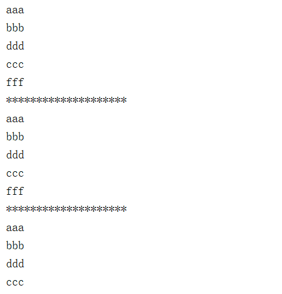
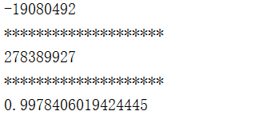
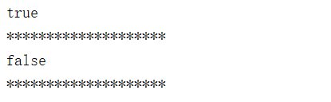

# Java8之Consumer、Supplier、Predicate和Function攻略
今天我们还讲讲**Consumer、Supplier、Predicate、Function**这几个接口的用法，在 Java8 的用法当中，这几个接口虽然没有明目张胆的使用，但是，却是润物细无声的。为什么这么说呢？

这几个接口都在 `java.util.function` 包下的，分别是Consumer（消费型）、supplier（供给型）、predicate（谓词型）、function（功能性），相信有了后面的解释，你应该非常清楚这个接口的功能了。

那么，下面，我们从具体的应用场景来讲讲这个接口的用法！

### 1 Consumer接口

从字面意思上我们就可以看得出啦，`consumer接口`就是一个消费型的接口，通过传入参数，然后输出值，就是这么简单，Java8 的一些方法看起来很抽象，其实，只要你理解了就觉得很好用，并且非常的简单。

我们下面就先看一个例子，然后再来分析这个接口。

#### 1.1 Consumer实例

```java

     * consumer接口测试
     */
    @Test
    public void test_Consumer() {
        
        Consumer<String> consumer = new Consumer<String>() {

            @Override
            public void accept(String s) {
                System.out.println(s);
            }
        };
        Stream<String> stream = Stream.of("aaa", "bbb", "ddd", "ccc", "fff");
        stream.forEach(consumer);

        System.out.println("********************");

        
        stream = Stream.of("aaa", "bbb", "ddd", "ccc", "fff");
        Consumer<String> consumer1 = (s) -> System.out.println(s);
        stream.forEach(consumer1);
        
        
        System.out.println("********************");

        
        stream = Stream.of("aaa", "bbb", "ddd", "ccc", "fff");
        Consumer consumer2 = System.out::println;
        stream.forEach(consumer);
        
        
    }

```

**输出结果**



#### 1.2 实例分析

**① `consumer`接口分析**

在代码①中，我们直接创建 `Consumer` 接口，并且实现了一个名为 `accept` 的方法，这个方法就是这个接口的关键了。

我们看一下 `accept` 方法；这个方法传入一个参数，不返回值。当我们发现 `forEach` 需要一个 `Consumer` 类型的参数的时候，传入之后，就可以输出对应的值了。

**② lambda 表达式作为 consumer**

```java
Consumer<String> consumer1 = (s) -> System.out.println(s);

```

在上面的代码中，我们使用下面的 `lambda` 表达式作为 `Consumer`。仔细的看一下你会发现，`lambda` 表达式返回值就是一个 `Consumer`；所以，你也就能够理解为什么 `forEach` 方法可以使用 lamdda 表达式作为参数了吧。

**③ 方法引用作为 consumer**

```java
Consumer consumer2 = System.out::println;

```

在上面的代码中，我们用了一个**方法引用**的方式作为一个 Consumer ，同时也可以传给 `forEach` 方法。

#### 1.3 其他 Consumer 接口

除了上面使用的 Consumer 接口，还可以使用下面这些 Consumer 接口。 `IntConsumer、DoubleConsumer、LongConsumer、BiConsumer`，使用方法和上面一样。

#### 1.4 Consumer 总结

看完上面的实例我们可以总结为几点。

① Consumer是一个接口，并且只要实现一个 `accept` 方法，就可以作为一个**“消费者”**输出信息。 ② 其实，lambda 表达式、方法引用的返回值都是 **Consumer 类型**，所以，他们能够作为 `forEach` 方法的参数，并且输出一个值。

### 2 Supplier 接口

Supplier 接口是一个**供给型**的接口，其实，说白了就是一个**容器**，可以用来存储数据，然后可以供其他方法使用的这么一个接口，是不是很明白了，如果还是不明白，看看下面的例子，一定彻底搞懂！

### 2.1 Supplier实例

```java
**
     * Supplier接口测试，supplier相当一个容器或者变量，可以存储值
     */
    @Test
    public void test_Supplier() {
        
        Supplier<Integer> supplier = new Supplier<Integer>() {
            @Override
            public Integer get() {
                
                return new Random().nextInt();
            }
        };

        System.out.println(supplier.get());

        System.out.println("********************");

        
        supplier = () -> new Random().nextInt();
        System.out.println(supplier.get());
        System.out.println("********************");

        
        Supplier<Double> supplier2 = Math::random;
        System.out.println(supplier2.get());
    }

```

**输出结果**



#### 2.2 实例分析

**① Supplier接口分析**

```java
Supplier<Integer> supplier = new Supplier<Integer>() {
            @Override
            public Integer get() {
                
                return new Random().nextInt();
            }
        };

```

看一下这段代码，我们通过创建一个 Supplier 对象，实现了一个 `get` 方法，这个方法无参数，返回一个值；所以，每次使用这个接口的时候都会返回一个值，并且保存在这个接口中，所以说是一个**容器**。

**② lambda表达式作为 Supplier**

```java

        supplier = () -> new Random().nextInt();
        System.out.println(supplier.get());
        System.out.println("********************");

```

上面的这段代码，我们使用 **lambda 表达式**返回一个 Supplier类型的接口，然后，我们调用 `get` 方法就可以获取这个值了。

**③ 方法引用作为 Supplier**

```java

        Supplier<Double> supplier2 = Math::random;
        System.out.println(supplier2.get());

```

方法引用也是返回一个Supplier类型的接口。

#### 2.3 Supplier 实例2

我们看完第一个实例之后，我们应该有一个了解了，下面再看一个。

```java

     * Supplier接口测试2，使用需要Supplier的接口方法
     */
    @Test
    public void test_Supplier2() {
        Stream<Integer> stream = Stream.of(1, 2, 3, 4, 5);
        
        Optional<Integer> first = stream.filter(i -> i > 4)
                .findFirst();

        
        
        System.out.println(first.orElse(1));
        System.out.println(first.orElse(7));

        System.out.println("********************");

        Supplier<Integer> supplier = new Supplier<Integer>() {
            @Override
            public Integer get() {
                
                return new Random().nextInt();
            }
        };

        
        System.out.println(first.orElseGet(supplier));
    }

```

**输出结果**


**代码分析**

```java
Optional<Integer> first = stream.filter(i -> i > 4)
                .findFirst();

```

使用这个方法获取到一个 Optional 对象，然后，在 Optional 对象中有 orElse 方法 和 orElseGet 是需要一个 Supplier 接口的。

```java

        
        System.out.println(first.orElse(1));
        System.out.println(first.orElse(7));

        System.out.println("********************");

        Supplier<Integer> supplier = new Supplier<Integer>() {
            @Override
            public Integer get() {
                
                return new Random().nextInt();
            }
        };

        
        System.out.println(first.orElseGet(supplier));

```

*   orElse：如果first中存在数，就返回这个数，如果不存在，就放回传入的数
*   orElseGet：如果first中存在数，就返回这个数，如果不存在，就返回supplier返回的值

#### 2.4 其他 Supplier 接口

除了上面使用的 Supplier 接口，还可以使用下面这些 Supplier 接口。 `IntSupplier 、DoubleSupplier 、LongSupplier 、BooleanSupplier`，使用方法和上面一样。

#### 2.5 Supplier 总结

① Supplier 接口可以理解为一个容器，用于装数据的。 ② Supplier 接口有一个 `get` 方法，可以返回值。

### 3 Predicate 接口

Predicate 接口是一个谓词型接口，其实，这个就是一个类似于 bool 类型的判断的接口，后面看看就明白了。

#### 3.1 Predicate 实例

```java

     * Predicate谓词测试，谓词其实就是一个判断的作用类似bool的作用
     */
    @Test
    public void test_Predicate() {
        
        Predicate<Integer> predicate = new Predicate<Integer>() {
            @Override
            public boolean test(Integer integer) {
                if(integer > 5){
                    return true;
                }
                return false;
            }
        };

        System.out.println(predicate.test(6));

        System.out.println("********************");

        
        predicate = (t) -> t > 5;
        System.out.println(predicate.test(1));
        System.out.println("********************");

    }

```

**输出结果**



#### 3.2 实例分析

**① Predicate 接口分析**

```java

        Predicate<Integer> predicate = new Predicate<Integer>() {
            @Override
            public boolean test(Integer integer) {
                if(integer > 5){
                    return true;
                }
                return false;
            }
        };

```

这段代码中，创建了一个 `Predicate` 接口对象，其中，实现类 `test` 方法，需要传入一个参数，并且返回一个 `bool` 值，所以这个接口作用就是**判断**！

```bash
System.out.println(predicate.test(6));

```

再看，调用 test 方法，传入一个值，就会返回一个 bool 值。

**② 使用lambda表达式作为 predicate**

```java

        predicate = (t) -> t > 5;
        System.out.println(predicate.test(1));
        System.out.println("********************");

```

lambda 表达式返回一个 `Predicate` 接口，然后调用 `test` 方法！

#### 3.3 Predicate 接口实例2

```java

     * Predicate谓词测试，Predicate作为接口使用
     */
    @Test
    public void test_Predicate2() {
        
        Predicate<Integer> predicate = new Predicate<Integer>() {
            @Override
            public boolean test(Integer integer) {
                if(integer > 5){
                    return true;
                }
                return false;
            }
        };

        Stream<Integer> stream = Stream.of(1, 23, 3, 4, 5, 56, 6, 6);
        List<Integer> list = stream.filter(predicate).collect(Collectors.toList());
        list.forEach(System.out::println);

        System.out.println("********************");

    }

```

**输出结果**


这段代码，首先创建一个 Predicate 对象，然后实现 `test` 方法，在 test 方法中做一个判断：**如果传入的参数大于 5 ，就返回 true，否则返回 false**；

```java
Stream<Integer> stream = Stream.of(1, 23, 3, 4, 5, 56, 6, 6);
        List<Integer> list = stream.filter(predicate).collect(Collectors.toList());
        list.forEach(System.out::println);

```

这段代码调用 `Stream` 的 `filter` 方法，`filter` 方法需要的参数就是 Predicate 接口，所以在这里只要**大于 5 的数据**就会输出。

#### 3.4 Predicate 接口总结

① Predicate 是一个谓词型接口，其实只是起到一个判断作用。 ② Predicate 通过实现一个 `test` 方法做判断。

### 4 Function 接口

Function 接口是一个功能型接口，它的一个作用就是转换作用，将输入数据转换成另一种形式的输出数据。

#### 4.1 Function 接口实例

```java

     * Function测试，function的作用是转换，将一个值转为另外一个值
     */
    @Test
    public void test_Function() {
        
        Function<String, Integer> function = new Function<String, Integer>() {
            @Override
            public Integer apply(String s) {
                return s.length();
            }
        };

        Stream<String> stream = Stream.of("aaa", "bbbbb", "ccccccv");
        Stream<Integer> stream1 = stream.map(function);
        stream1.forEach(System.out::println);

        System.out.println("********************");

    }

```

**输出结果**


#### 4.2 代码分析

**① Function 接口分析**

```java

        Function<String, Integer> function = new Function<String, Integer>() {
            @Override
            public Integer apply(String s) {
                return s.length();
            }
        };

```

这段代码创建了一个 `Function` 接口对象，实现了一个 `apply` 方法，这个方法有一个输入参数和一个输出参数。其中，泛型的第一个参数是转换前的类型，第二个是转化后的类型。

在上面的代码中，就是**获取字符串的长度，然后将每个字符串的长度作为返回值返回。** 

**② 重要应用 map 方法**

```bash
 Stream<String> stream = Stream.of("aaa", "bbbbb", "ccccccv");
        Stream<Integer> stream1 = stream.map(function);
        stream1.forEach(System.out::println);


```

在 `Function` 接口的重要应用不得不说 `Stream` 类的 `map` 方法了，`map` 方法传入一个 `Function` 接口，返回一个转换后的 `Stream`类。

#### 4.3 其他 Function 接口

除了上面使用的 Function 接口，还可以使用下面这些 Function 接口。 IntFunction 、DoubleFunction 、LongFunction 、ToIntFunction 、ToDoubleFunction 、DoubleToIntFunction 等等，使用方法和上面一样。

#### 4.4 Function 接口总结

① Function 接口是一个功能型接口，是一个转换数据的作用。 ② Function 接口实现 `apply` 方法来做转换。

### 5 总结

通过前面的介绍，已经对`Consumer、Supplier、Predicate、Function`这几个接口有详细的了解了，其实，这几个接口并不是很难，只是有点抽象，多加理解会发现很简单，并且特别好用！
