# Java业界优秀开源项目推荐 
企业级快速开发脚手架
----------

*   [renren-fast一个轻量级的，前后端分离的Java快速开发平台](https://link.juejin.cn/?target=https%3A%2F%2Fwww.renren.io%2Fguide "https://www.renren.io/guide")
*   [renren-cloud人人开源微服务](https://link.juejin.cn/?target=https%3A%2F%2Fwww.renren.io%2Fcloud "https://www.renren.io/cloud")
*   [jeecg-boot](https://link.juejin.cn/?target=http%3A%2F%2Fdoc.jeecg.com%2F2043868 "http://doc.jeecg.com/2043868")
*   [lamp中后台快速开发平台](https://link.juejin.cn/?target=https%3A%2F%2Fwww.kancloud.cn%2Fzuihou%2Fzuihou-admin-cloud%2F2003631 "https://www.kancloud.cn/zuihou/zuihou-admin-cloud/2003631")

### renren-fast

*   [Gittee](https://link.juejin.cn/?target=https%3A%2F%2Fgitee.com%2Frenrenio%2Frenren-fast "https://gitee.com/renrenio/renren-fast")
*   [开发文档](https://link.juejin.cn/?target=https%3A%2F%2Fwww.renren.io%2Fguide "https://www.renren.io/guide")

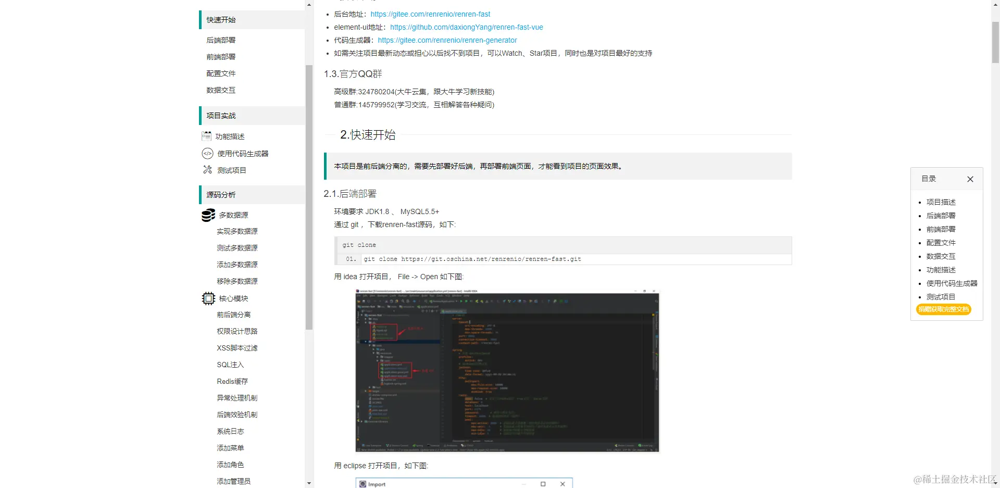

### renren-cloud 微服务

*   [项目介绍](https://link.juejin.cn/?target=https%3A%2F%2Fwww.renren.io%2Fcloud "https://www.renren.io/cloud")
*   [项目演示地址](https://link.juejin.cn/?target=http%3A%2F%2Ftenant.cloud.renren.io%2Frenren-cloud%2F%23%2Fhome "http://tenant.cloud.renren.io/renren-cloud/#/home")

账号密码：admin/admin

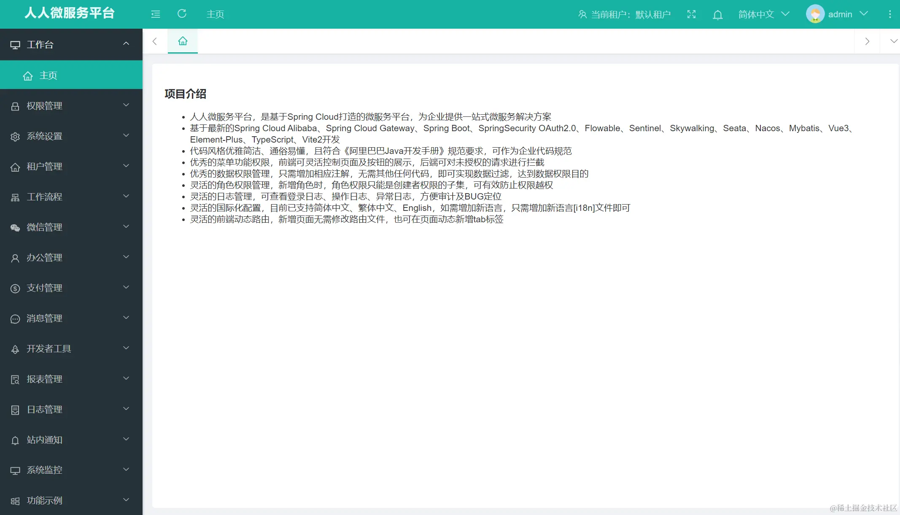

### jeecg-boot

该项目目前笔者的公司也有在用，其实总的来说在低代码框架的领域还是算可以的，目前也有微服务版本，vue3版本，开发文档也相对比较详细，建议解读一下。

*   [Gitee开源地址](https://link.juejin.cn/?target=https%3A%2F%2Fgitee.com%2Fjeecg%2Fjeecg-boot "https://gitee.com/jeecg/jeecg-boot")
*   [开发文档](https://link.juejin.cn/?target=http%3A%2F%2Fdoc.jeecg.com%2F2043868 "http://doc.jeecg.com/2043868")
*   [项目演示](https://link.juejin.cn/?target=http%3A%2F%2Fboot.jeecg.com%2F "http://boot.jeecg.com/")

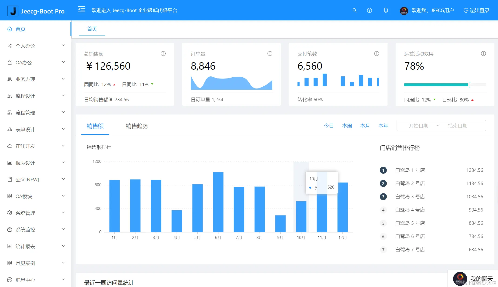

### lamp《灯灯》中后台快速开发平台

*   [Gitee开源地址](https://link.juejin.cn/?target=https%3A%2F%2Fgitee.com%2Fzuihou111%2Flamp-boot "https://gitee.com/zuihou111/lamp-boot")
*   [开发文档](https://link.juejin.cn/?target=https%3A%2F%2Fwww.kancloud.cn%2Fzuihou%2Fzuihou-admin-cloud%2F2003631 "https://www.kancloud.cn/zuihou/zuihou-admin-cloud/2003631")
*   [项目演示](https://link.juejin.cn/?target=https%3A%2F%2Fpro.tangyh.top "https://pro.tangyh.top")

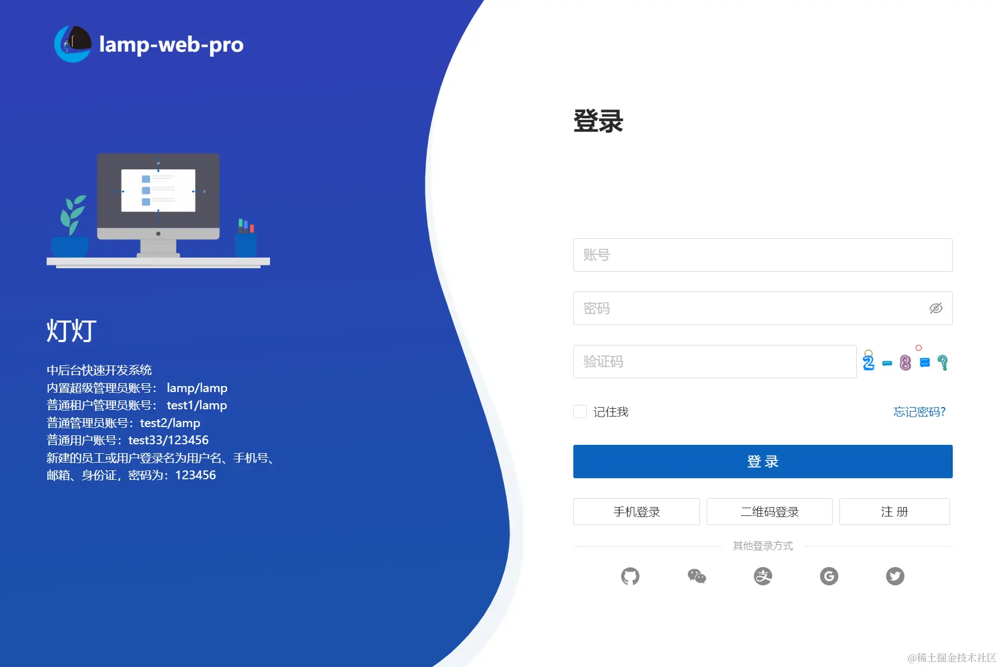

微服务
---

*   [基于微服务的权限系统Pig](https://link.juejin.cn/?target=https%3A%2F%2Fgitee.com%2Flog4j%2Fpig "https://gitee.com/log4j/pig")
*   [Cloud-Platform](https://link.juejin.cn/?target=https%3A%2F%2Fgitee.com%2Fminull%2Face-security "https://gitee.com/minull/ace-security")
*   [多功能微服务框架Apache ServiceComb](https://link.juejin.cn/?target=http%3A%2F%2Fservicecomb.incubator.apache.org%2Fcn%2F "http://servicecomb.incubator.apache.org/cn/")
*   [若依RuoYi-Cloud](https://link.juejin.cn/?target=https%3A%2F%2Fgitee.com%2Fy_project%2FRuoYi-Cloud "https://gitee.com/y_project/RuoYi-Cloud")
*   [microservices-platform](https://link.juejin.cn/?target=https%3A%2F%2Fgitee.com%2Fzlt2000%2Fmicroservices-platform "https://gitee.com/zlt2000/microservices-platform")
*   [Spring Blade微服务开发平台](https://link.juejin.cn/?target=https%3A%2F%2Fgitee.com%2Fsmallc%2FSpringBlade "https://gitee.com/smallc/SpringBlade")
*   [open-capacity-platform](https://link.juejin.cn/?target=https%3A%2F%2Fgitee.com%2Fowenwangwen%2Fopen-capacity-platform "https://gitee.com/owenwangwen/open-capacity-platform")
*   [JeeSpringCloud敏捷开发系统](https://link.juejin.cn/?target=https%3A%2F%2Fgitee.com%2FJeeHuangBingGui%2FjeeSpringCloud "https://gitee.com/JeeHuangBingGui/jeeSpringCloud")
*   [mall-swarm微服务商城系统](https://link.juejin.cn/?target=https%3A%2F%2Fgithub.com%2Fmacrozheng%2Fmall-swarm "https://github.com/macrozheng/mall-swarm")
*   [lamp-cloud中后台快速开发Saas平台](https://link.juejin.cn/?target=https%3A%2F%2Fgitee.com%2Fzuihou111%2Flamp-cloud "https://gitee.com/zuihou111/lamp-cloud")
*   [Guns](https://link.juejin.cn/?target=https%3A%2F%2Fgitee.com%2Fstylefeng%2Fguns "https://gitee.com/stylefeng/guns")

电商项目
----

*   [litemall](https://link.juejin.cn/?target=https%3A%2F%2Fgitee.com%2Flinlinjava%2Flitemall "https://gitee.com/linlinjava/litemall")
*   [mallplus+商城+APP+SaaS+uniapp+wechat](https://link.juejin.cn/?target=https%3A%2F%2Fgitee.com%2Fzscat%2Fmallplus "https://gitee.com/zscat/mallplus")
*   [mall](https://link.juejin.cn/?target=https%3A%2F%2Fgithub.com%2Fmacrozheng%2Fmall "https://github.com/macrozheng/mall")
*   [Mall4j 为中小企业打造的开源电商系统](https://link.juejin.cn/?target=https%3A%2F%2Fgitee.com%2Fgz-yami%2Fmall4j "https://gitee.com/gz-yami/mall4j")
*   [mall4cloudw微服务商城](https://link.juejin.cn/?target=https%3A%2F%2Fgitee.com%2Fgz-yami%2Fmall4cloud "https://gitee.com/gz-yami/mall4cloud")
*   [mall-swarm](https://link.juejin.cn/?target=https%3A%2F%2Fgitee.com%2Fmacrozheng%2Fmall-swarm "https://gitee.com/macrozheng/mall-swarm")
*   [XMall 基于SOA架构的分布式购物电商商城](https://link.juejin.cn/?target=https%3A%2F%2Fgitee.com%2FExrick%2Fxmall "https://gitee.com/Exrick/xmall")
*   [微同商城platform](https://link.juejin.cn/?target=https%3A%2F%2Fgitee.com%2Ffuyang_lipengjun%2Fplatform "https://gitee.com/fuyang_lipengjun/platform")
*   [分布式电商项目](https://link.juejin.cn/?target=https%3A%2F%2Fgithub.com%2FSiGuiyang%2Fspring-cloud-shop "https://github.com/SiGuiyang/spring-cloud-shop")
*   [lamp-boot中后台快速开发平台](https://link.juejin.cn/?target=https%3A%2F%2Fgitee.com%2Fzuihou111%2Flamp-boot "https://gitee.com/zuihou111/lamp-boot")
*   [newbee-mall](https://link.juejin.cn/?target=https%3A%2F%2Fgithub.com%2Fnewbee-ltd%2Fnewbee-mall "https://github.com/newbee-ltd/newbee-mall")
*   [onemall](https://link.juejin.cn/?target=https%3A%2F%2Fgithub.com%2Fnewbee-ltd%2Fnewbee-mall "https://github.com/newbee-ltd/newbee-mall")
*   [mallplus](https://link.juejin.cn/?target=https%3A%2F%2Fgitee.com%2Fcatshen%2Fzscat_sw "https://gitee.com/catshen/zscat_sw")
*   [Smart Shop](https://link.juejin.cn/?target=https%3A%2F%2Fgitee.com%2Fqisange%2Fbasemall "https://gitee.com/qisange/basemall")
*   [yshop](https://link.juejin.cn/?target=https%3A%2F%2Fgitee.com%2Fguchengwuyue%2Fyshopmall "https://gitee.com/guchengwuyue/yshopmall")
*   [CRMEB_Java电商系统](https://link.juejin.cn/?target=https%3A%2F%2Fgitee.com%2FZhongBangKeJi%2Fcrmeb_java "https://gitee.com/ZhongBangKeJi/crmeb_java")
*   [youlai-mall_有来技术团队](https://link.juejin.cn/?target=https%3A%2F%2Fgitee.com%2Fyoulaitech%2Fyoulai-mall "https://gitee.com/youlaitech/youlai-mall")
*   [谷粒商城](https://link.juejin.cn/?target=https%3A%2F%2Fgitee.com%2Fagoni_no%2Fgulimall "https://gitee.com/agoni_no/gulimall")
*   [dts-mall聚惠星商城](https://link.juejin.cn/?target=https%3A%2F%2Fgitee.com%2Fqiguliuxing%2Fdts-shop "https://gitee.com/qiguliuxing/dts-shop")
*   [刚果商城](https://link.juejin.cn/?target=https%3A%2F%2Fgitee.com%2Fnageoffer%2Fcongomall "https://gitee.com/nageoffer/congomall")

支付项目
----

*   [jeepay](https://link.juejin.cn/?target=https%3A%2F%2Fgitee.com%2Fjeequan%2Fjeepay "https://gitee.com/jeequan/jeepay")
*   [XxPay聚合支付](https://link.juejin.cn/?target=https%3A%2F%2Fgitee.com%2Fjmdhappy%2Fxxpay-master "https://gitee.com/jmdhappy/xxpay-master")
*   [龙果支付系统roncoo-pay](https://link.juejin.cn/?target=https%3A%2F%2Fgitee.com%2Froncoocom%2Froncoo-pay "https://gitee.com/roncoocom/roncoo-pay")
*   [常用的支付接口IJPay](https://link.juejin.cn/?target=https%3A%2F%2Fgitee.com%2Fjaven205%2FIJPay "https://gitee.com/javen205/IJPay")
*   [WxJava-微信开发Java SDK](https://link.juejin.cn/?target=https%3A%2F%2Fgitee.com%2Fbinary%2Fweixin-java-tools "https://gitee.com/binary/weixin-java-tools")
*   [easyPay](https://link.juejin.cn/?target=https%3A%2F%2Fgitee.com%2Fyansongda%2Fpay "https://gitee.com/yansongda/pay")
*   [轻量级支付系统Fastpay](https://link.juejin.cn/?target=https%3A%2F%2Fgitee.com%2Frobertleepeak%2Ffastpay "https://gitee.com/robertleepeak/fastpay")
*   [基于Java的支付开发工具包](https://link.juejin.cn/?target=https%3A%2F%2Fgitee.com%2Fegzosn%2Fpay-java-parent "https://gitee.com/egzosn/pay-java-parent")

### jeepay - 适合互联网企业使用的开源支支付系统 (微信支付基于最新wxjava开发)

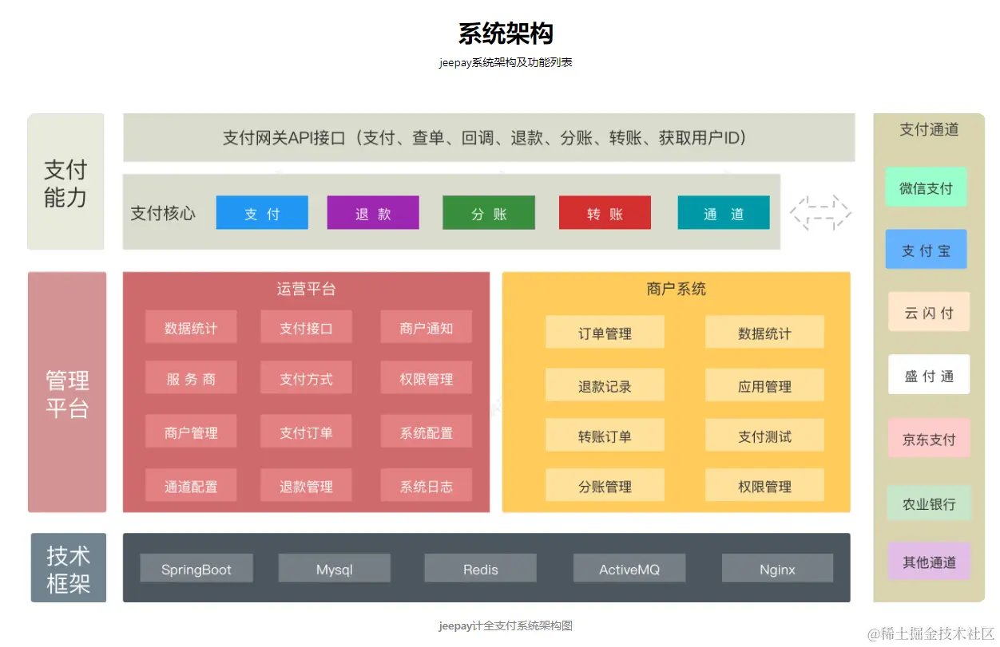

**项目介绍：**  `Jeepay`是一套适合互联网企业使用的开源支付系统，支持多渠道服务商和普通商户模式。已对接`微信支付`，`支付宝`，`云闪付`官方接口，支持聚合码支付。Jeepay使用`Spring Boot`和`Ant Design Vue`开发，集成`Spring Security`实现权限管理功能，是一套非常实用的web开发框架。

Gitee：[gitee.com/jeequan/jee…](https://link.juejin.cn/?target=https%3A%2F%2Fgitee.com%2Fjeequan%2Fjeepay "https://gitee.com/jeequan/jeepay")  
项目文档：[docs.jeequan.com/docs/jeepay…](https://link.juejin.cn/?target=https%3A%2F%2Fdocs.jeequan.com%2Fdocs%2Fjeepay%2Findex "https://docs.jeequan.com/docs/jeepay/index")

### 聚合支付系统XxPay

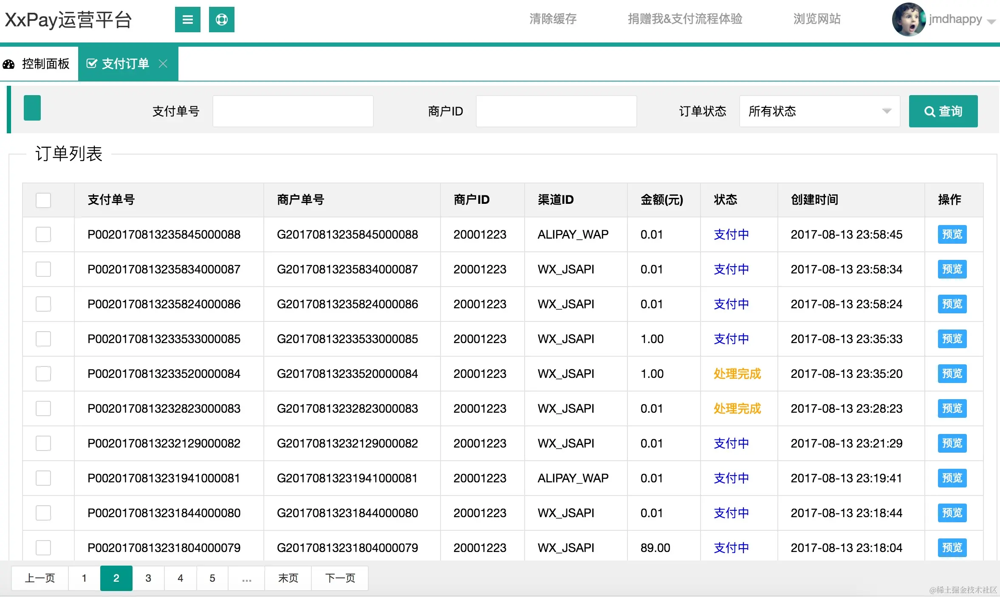

**项目介绍：** `XxPay`聚合支付使用`Java`开发，包括`Spring Cloud`、`Dubbo`、`Spring Boot`三个架构版本，已接入微信、支付宝等主流支付渠道，可直接用于生产环境。

目前已经接入支付渠道：微信(公众号支付、扫码支付、APP支付、H5支付)、支付宝(电脑网站支付、手机网站支付、APP支付、当面付)。

### 龙果支付系统roncoo-pay

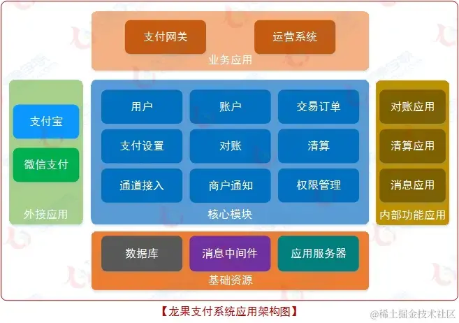

**项目介绍：**龙果支付系统核心目标是汇聚所有主流支付渠道，打造一款轻量、便捷、易用，且集支付、资金对账、资金清结算于一体的支付系统，满足互联网业务系统的收款和业务资金管理需求。

**主要特点：** 

*   具备支付系统通用的支付、对账、清算、资金账户管理、支付订单管理等功能；
*   目前已接通“支付宝即时到账”和“微信扫码支付”通道；
*   支持直连和间连两种支付模式，任君选择；
*   通过支付网关，业务系统可以轻松实现统一支付接入；
*   搭配运营后台，支付数据的监控和管理可以兼得；
*   配套完善的系统使用文档，可轻松嵌入任何需要支付的场景；

### 常用支付接口IJPay

**项目介绍：**  `IJPay`封装了微信支付、支付宝支付、银联支付常用的支付方式以及各种常用的接口。不依赖任何第三方`mvc`框架，仅仅作为工具使用简单快速完成支付模块的开发，可轻松嵌入到任何系统里。

博客项目
----

*   [多人博客系统Mblog](https://link.juejin.cn/?target=https%3A%2F%2Fgitee.com%2Fmtons%2Fmblog "https://gitee.com/mtons/mblog")
*   [forum-java](https://link.juejin.cn/?target=https%3A%2F%2Fgithub.com%2FQbian61%2Fforum-java "https://github.com/Qbian61/forum-java")
*   [halo](https://link.juejin.cn/?target=https%3A%2F%2Fgithub.com%2Fhalo-dev%2Fhalo "https://github.com/halo-dev/halo")
*   [OneBlog](https://link.juejin.cn/?target=https%3A%2F%2Fgitee.com%2Fyadong.zhang%2FDBlog "https://gitee.com/yadong.zhang/DBlog")
*   [蘑菇博客](https://link.juejin.cn/?target=https%3A%2F%2Fgitee.com%2Fmoxi159753%2Fmogu_blog_v2 "https://gitee.com/moxi159753/mogu_blog_v2")
*   [vhr微人事](https://link.juejin.cn/?target=https%3A%2F%2Fgitee.com%2Flenve%2Fvhr "https://gitee.com/lenve/vhr")
*   [JPress](https://link.juejin.cn/?target=https%3A%2F%2Fgitee.com%2FJPressProjects%2Fjpress "https://gitee.com/JPressProjects/jpress")
*   [tale](https://link.juejin.cn/?target=https%3A%2F%2Fgitee.com%2Fbiezhi%2Ftale "https://gitee.com/biezhi/tale")
*   [开源社区系统Echo](https://link.juejin.cn/?target=https%3A%2F%2Fgitee.com%2Fveal98%2FEcho "https://gitee.com/veal98/Echo")

多租户架构设计项目
---------

*   [JeeSite 快速开发平台](https://link.juejin.cn/?target=https%3A%2F%2Fjeesite.com%2Fdocs%2F "https://jeesite.com/docs/")
*   [雪忆天堂](https://link.juejin.cn/?target=https%3A%2F%2Fgitee.com%2Fxueyitiantang%2FXueYi-Cloud "https://gitee.com/xueyitiantang/XueYi-Cloud")
*   [SAAS微信电商小程序](https://link.juejin.cn/?target=https%3A%2F%2Fgitee.com%2Fwei-it%2Fweiit-saas "https://gitee.com/wei-it/weiit-saas")

http客户端框架
---------

*   [Forest](https://link.juejin.cn/?target=https%3A%2F%2Fgitee.com%2Fdromara%2Fforest "https://gitee.com/dromara/forest")
*   [OkHttps](https://link.juejin.cn/?target=https%3A%2F%2Fgitee.com%2Fejlchina-zhxu%2Fokhttps "https://gitee.com/ejlchina-zhxu/okhttps")

### Forest

`Forest`是一个开源的 Java HTTP 客户端框架，用来访问第三方服务 `RESTful` 接口:

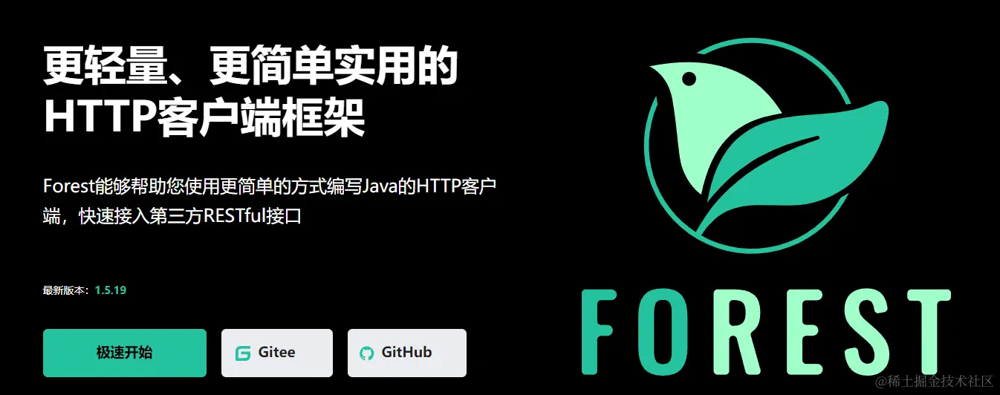

*   [Gitee开源地址](https://link.juejin.cn/?target=https%3A%2F%2Fgitee.com%2Fdromara%2Fforest "https://gitee.com/dromara/forest")
*   [开发文档说明](https://link.juejin.cn/?target=https%3A%2F%2Fforest.dtflyx.com%2Fdocs%2F "https://forest.dtflyx.com/docs/")

### OkHttps

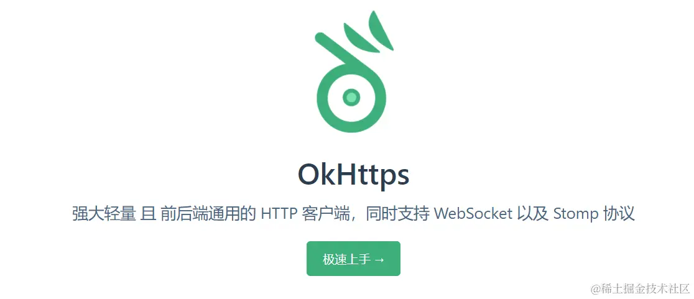

*   [Gitee开源地址](https://link.juejin.cn/?target=https%3A%2F%2Fgitee.com%2Fejlchina-zhxu%2Fokhttps "https://gitee.com/ejlchina-zhxu/okhttps")
*   [开发文档](https://link.juejin.cn/?target=https%3A%2F%2Fokhttps.ejlchina.com%2Fv3%2Fgetstart.htm "https://okhttps.ejlchina.com/v3/getstart.htm")

企业微信
----

*   [纤维](https://link.juejin.cn/?target=https%3A%2F%2Fgitee.com%2FLinkWeChat%2Flink-wechat "https://gitee.com/LinkWeChat/link-wechat")
*   [MoChat](https://link.juejin.cn/?target=https%3A%2F%2Fgitee.com%2Fmochat%2Fmochat "https://gitee.com/mochat/mochat")

### 纤微

*   [开发手册](https://link.juejin.cn/?target=https%3A%2F%2Fwww.yuque.com%2Flinkwechat%2Fhelp%2Fdsatfs "https://www.yuque.com/linkwechat/help/dsatfs")

### MoChat

*   [开发wiki](https://link.juejin.cn/?target=https%3A%2F%2Fmochat.wiki%2F "https://mochat.wiki/")

面试指南+Java知识梳理
-------------

*   [JavaGuide](https://link.juejin.cn/?target=https%3A%2F%2Fgithub.com%2FSnailclimb%2FJavaGuide "https://github.com/Snailclimb/JavaGuide")
*   [JavaFamily](https://link.juejin.cn/?target=https%3A%2F%2Fgithub.com%2FAobingJava%2FJavaFamily "https://github.com/AobingJava/JavaFamily")
*   [悟空聊架构PassJava](https://link.juejin.cn/?target=http%3A%2F%2Fwww.jayh.club%2F%23%2FREADME "http://www.jayh.club/#/README")
*   [互联网 Java 工程师进阶知识完全扫盲](https://link.juejin.cn/?target=https%3A%2F%2Fgithub.com%2Fdoocs%2Fadvanced-java "https://github.com/doocs/advanced-java")
*   [石衫Java-Interview-Adnamced](https://link.juejin.cn/?target=https%3A%2F%2Fgitee.com%2Fshishan100%2FJava-Interview-Advanced "https://gitee.com/shishan100/Java-Interview-Advanced")
*   [CyC2018_CS-Notes](https://link.juejin.cn/?target=https%3A%2F%2Fgitee.com%2Flzqsimonlee%2FCyC2018_CS-Notes "https://gitee.com/lzqsimonlee/CyC2018_CS-Notes")
*   [NewDevBooks](https://link.juejin.cn/?target=https%3A%2F%2Fgitee.com%2Fsouyunku%2FNewDevBooks "https://gitee.com/souyunku/NewDevBooks")

**权限认证及第三方登录**
--------------

*   [JustAuth](https://link.juejin.cn/?target=https%3A%2F%2Fgitee.com%2Fyadong.zhang%2FJustAuth "https://gitee.com/yadong.zhang/JustAuth")
*   [oauth2-shiro](https://link.juejin.cn/?target=https%3A%2F%2Fgitee.com%2Fmkk%2Foauth2-shiro "https://gitee.com/mkk/oauth2-shiro")
*   [sa-token](https://link.juejin.cn/?target=https%3A%2F%2Fgitee.com%2Fdromara%2Fsa-token "https://gitee.com/dromara/sa-token")
*   [权限管理系统snowy](https://link.juejin.cn/?target=https%3A%2F%2Fgitee.com%2Fxiaonuobase%2Fsnowy.git "https://gitee.com/xiaonuobase/snowy.git")

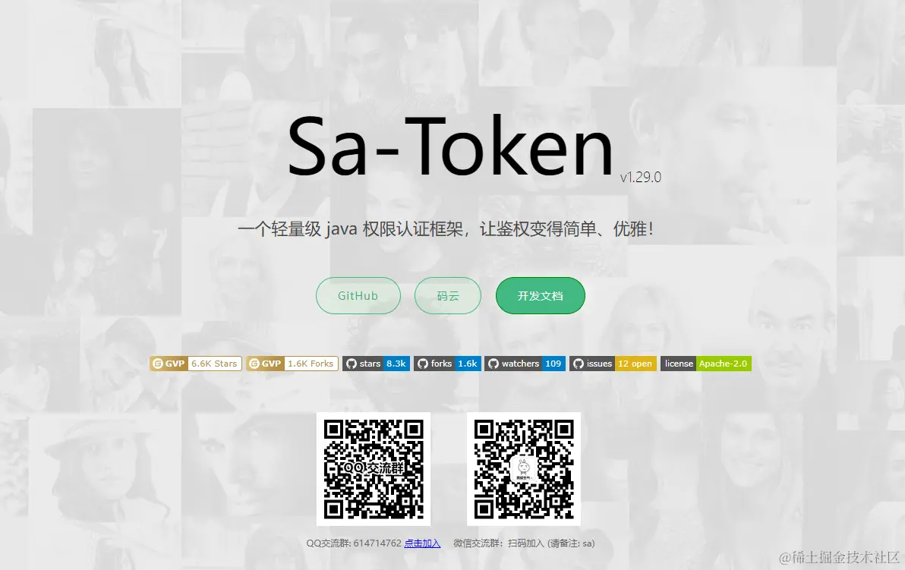
 开发文档：[sa-token.dev33.cn/doc/index.h…](https://link.juejin.cn/?target=https%3A%2F%2Fsa-token.dev33.cn%2Fdoc%2Findex.html%23%2F "https://sa-token.dev33.cn/doc/index.html#/")

CRM客户关系管理系统
-----------

*   [悟空CRM](https://link.juejin.cn/?target=https%3A%2F%2Fwww.5kcrm.com "https://www.5kcrm.com")

### 悟空CRM

*   [悟空开源地址](https://link.juejin.cn/?target=https%3A%2F%2Fgitee.com%2Fwukongcrm%2Fcrm_pro "https://gitee.com/wukongcrm/crm_pro")
*   [开发文档地址](https://link.juejin.cn/?target=https%3A%2F%2Fwww.5kcrm.com%2F "https://www.5kcrm.com/")

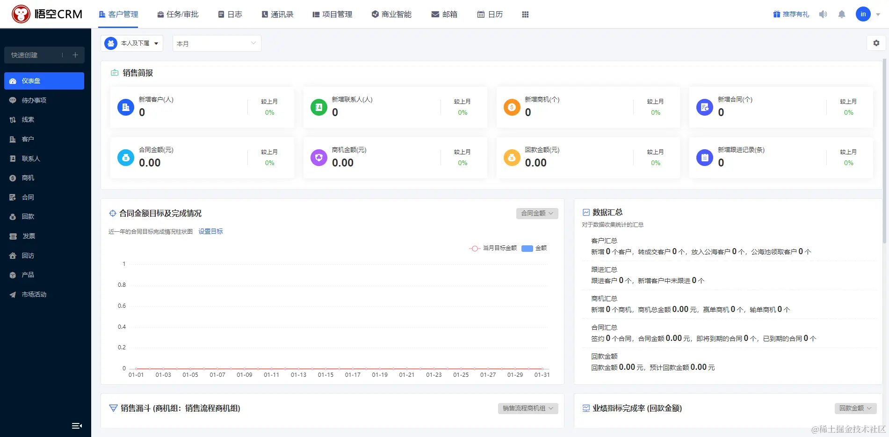

IM即时通讯
------

*   [腾讯云IM](https://link.juejin.cn/?target=https%3A%2F%2Fcloud.tencent.com%2Fdocument%2Fproduct%2F269 "https://cloud.tencent.com/document/product/269")
*   [网易云信即时通讯IM](https://link.juejin.cn/?target=https%3A%2F%2Fyunxin.163.com%2Fim "https://yunxin.163.com/im")
*   [琪琪IM](https://link.juejin.cn/?target=https%3A%2F%2Fgitee.com%2Fqiqiim%2Fqiqiim-server "https://gitee.com/qiqiim/qiqiim-server")
*   [轨迹/J-IM](https://link.juejin.cn/?target=https%3A%2F%2Fgitee.com%2Fxchao%2Fj-im "https://gitee.com/xchao/j-im")
*   [OpenIM](https://link.juejin.cn/?target=https%3A%2F%2Fdoc.rentsoft.cn%2F%23%2F "https://doc.rentsoft.cn/#/")
*   [t-io](https://link.juejin.cn/?target=https%3A%2F%2Fgitee.com%2Ftywo45%2Ft-io "https://gitee.com/tywo45/t-io")
*   [即时通讯CIM](https://link.juejin.cn/?target=https%3A%2F%2Fgitee.com%2Ffarsunset%2Fcim "https://gitee.com/farsunset/cim")
*   [野火IM](https://link.juejin.cn/?target=https%3A%2F%2Fgitee.com%2Fwfchat%2Fim-server "https://gitee.com/wfchat/im-server")
*   [OIM即时通讯/oim-fx](https://link.juejin.cn/?target=https%3A%2F%2Fgitee.com%2Foimchat%2Foim-fx "https://gitee.com/oimchat/oim-fx")

管理系统
----

*   [开箱即用中台前端Ant-design-pro](https://link.juejin.cn/?target=https%3A%2F%2Fpro.ant.design%2Fzh-CN%2Fdocs%2Foverview "https://pro.ant.design/zh-CN/docs/overview")
*   [基于Vue.js和ElementUI的管理系统前端解决方案](https://link.juejin.cn/?target=https%3A%2F%2Fgitee.com%2Fd2-projects%2Fd2-admin%2F "https://gitee.com/d2-projects/d2-admin/")
*   [vue-element-admin](https://link.juejin.cn/?target=https%3A%2F%2Fpanjiachen.github.io%2Fvue-element-admin-site%2Fzh%2Fguide%2F "https://panjiachen.github.io/vue-element-admin-site/zh/guide/")
*   [JEECG-BOOT](https://link.juejin.cn/?target=http%3A%2F%2Fwww.jeecg.com%2F "http://www.jeecg.com/")
*   [vue-admin-beautiful](https://link.juejin.cn/?target=https%3A%2F%2Fpanjiachen.github.io%2Fvue-element-admin-site%2Fzh%2Fguide%2F "https://panjiachen.github.io/vue-element-admin-site/zh/guide/")

### D2admin

开源地址：[github.com/d2-projects…](https://link.juejin.cn/?target=https%3A%2F%2Fgithub.com%2Fd2-projects%2Fd2-admin "https://github.com/d2-projects/d2-admin")  
文档地址：[d2.pub/zh/doc/d2-a…](https://link.juejin.cn/?target=https%3A%2F%2Fd2.pub%2Fzh%2Fdoc%2Fd2-admin "https://d2.pub/zh/doc/d2-admin")

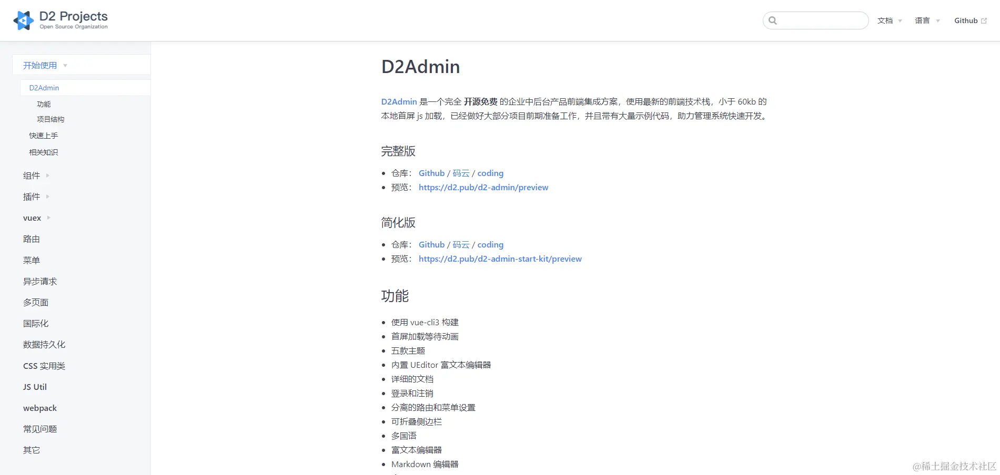

### vue-element-admin

开源地址：[github.com/PanJiaChen/…](https://link.juejin.cn/?target=https%3A%2F%2Fgithub.com%2FPanJiaChen%2Fvue-element-admin "https://github.com/PanJiaChen/vue-element-admin")  
文档地址：[panjiachen.github.io/vue-element…](https://link.juejin.cn/?target=https%3A%2F%2Fpanjiachen.github.io%2Fvue-element-admin-site%2Fzh "https://panjiachen.github.io/vue-element-admin-site/zh")

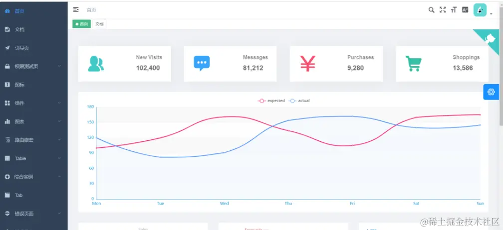

### JEECG-BOOT

开源地址：[github.com/zhangdaisco…](https://link.juejin.cn/?target=https%3A%2F%2Fgithub.com%2Fzhangdaiscott%2Fjeecg-boot "https://github.com/zhangdaiscott/jeecg-boot")  
文档地址：[doc.jeecg.com/2043868](https://link.juejin.cn/?target=http%3A%2F%2Fdoc.jeecg.com%2F2043868 "http://doc.jeecg.com/2043868")

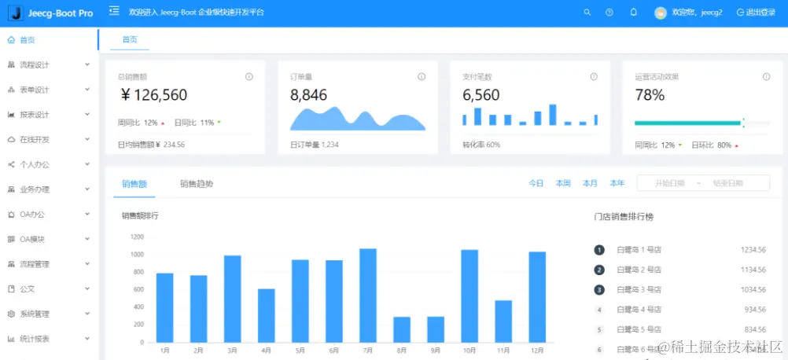

### vue-admin-beautiful

开源地址：[github.com/chuzhixin/v…](https://link.juejin.cn/?target=https%3A%2F%2Fgithub.com%2Fchuzhixin%2Fvue-admin-beautiful "https://github.com/chuzhixin/vue-admin-beautiful")  
文档地址：[www.gin-vue-admin.com](https://link.juejin.cn/?target=https%3A%2F%2Fwww.gin-vue-admin.com "https://www.gin-vue-admin.com")

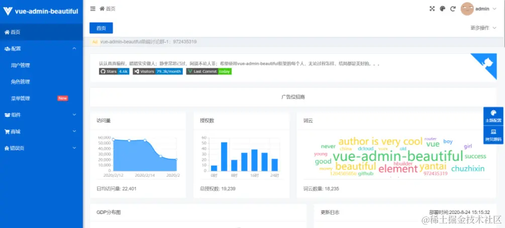

### ant-design-pro

开源地址：[github.com/ant-design/…](https://link.juejin.cn/?target=https%3A%2F%2Fgithub.com%2Fant-design%2Fant-design-pro "https://github.com/ant-design/ant-design-pro")  
文档地址：[pro.ant.design/index-cn/](https://link.juejin.cn/?target=https%3A%2F%2Fpro.ant.design%2Findex-cn%2F "https://pro.ant.design/index-cn/")
