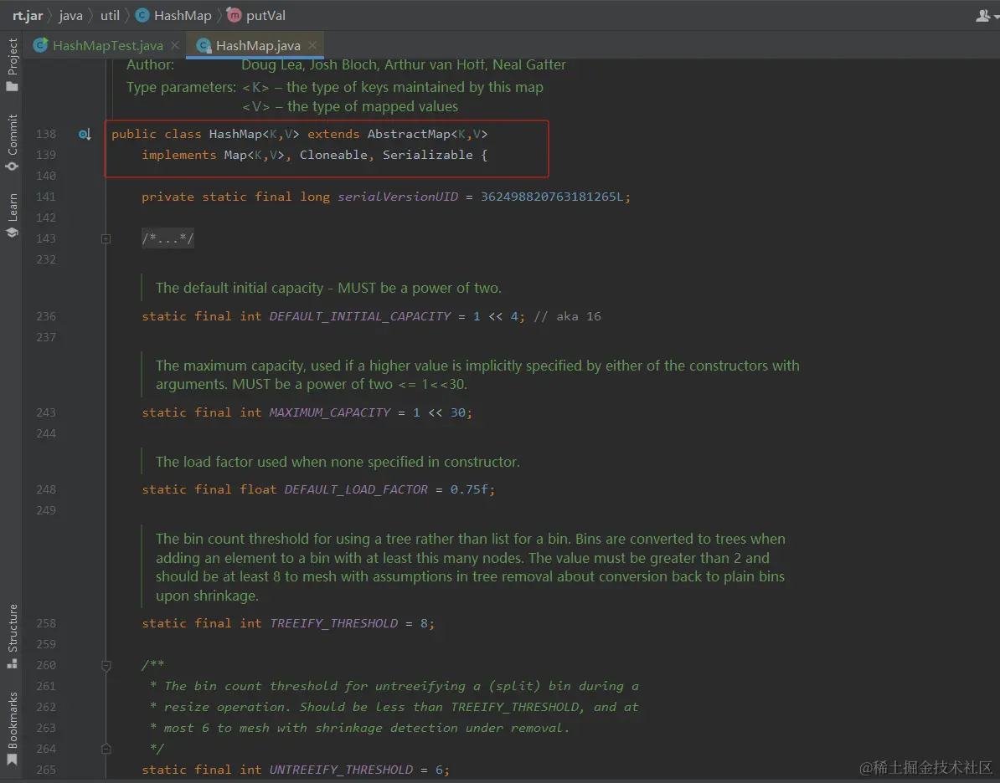
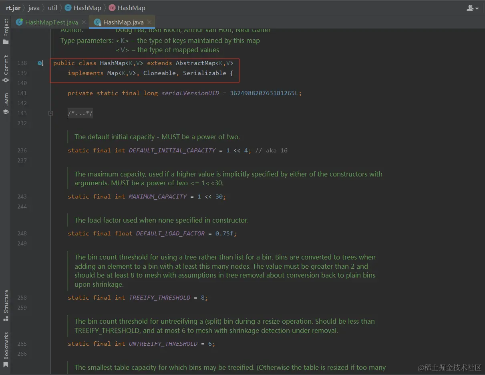

# Java之HashMap详解：深入剖析其底层实现与源码分析


* * *

  在Java开发中经常用到HashMap，它是一种常用的数据结构，用于存储键值对。在实际开发中，我们需要了解HashMap的底层实现原理以及相关的源码分析。本文将深入剖析HashMap的底层实现原理，并且分析源代码中的具体实现细节。

  本文主要介绍HashMap的底层实现原理和源码分析。首先，介绍了HashMap的概念和基本操作，然后，深入讲解了HashMap的底层实现原理，包括哈希表、红黑树等相关知识。接着，介绍了HashMap的源码分析，包括put方法、get方法、resize方法等。最后，通过应用场景案例、优缺点分析、类代码方法介绍、测试用例和全文小结等方面全面解析了HashMap。

概述
--

  HashMap是Java集合框架中的一个重要类，它用于保存键值对。HashMap是基于哈希表实现的，它通过将键映射到存储桶中来实现快速访问。每个存储桶是一个链表，当多个键散列到同一个桶时，它们以链表的形式存储。

HashMap具有以下特点：

*   HashMap的键和值都可以为null；
*   HashMap是无序的；
*   HashMap的性能比较高。

HashMap的基本操作包括put、get、remove等方法：

```java

public V put(K key, V value) {
    ...
}

public V get(Object key) {
    ...
}

public V remove(Object key) {
    ...
}

```

  如下是部分源码截图：



源代码解析
-----

### put方法

  put方法用于向HashMap中添加元素。当调用put方法时，首先会根据key的hashCode方法计算出该元素应该放在哪个桶中。如果该桶中已经有元素，那么会遍历该桶中的链表，找到与新元素的key相等的元素，然后替换该元素的值。否则，会将新元素插入到该桶的末尾。

```java
public V put(K key, V value) {
    
    int hash = hash(key.hashCode());
    
    int i = indexFor(hash, table.length);
    
    for (Entry<K,V> e = table[i]; e != null; e = e.next) {
        Object k;
        
        if (e.hash == hash && ((k = e.key) == key || key.equals(k))) {
            V oldValue = e.value;
            e.value = value;
            e.recordAccess(this);
            return oldValue;
        }
    }
    
    modCount++;
    addEntry(hash, key, value, i);
    return null;
}

```

  如下是部分源码截图：


### get方法

  get方法用于从HashMap中获取元素。当调用get方法时，首先会根据key的hashCode方法计算出该元素应该放在哪个桶中。如果该桶中有元素，那么会遍历该桶中的链表，找到与指定的key相等的元素，然后返回该元素的值。

```java
public V get(Object key) {
    
    int hash = hash(key.hashCode());
    
    int i = indexFor(hash, table.length);
    
    for (Entry<K,V> e = table[i]; e != null; e = e.next) {
        Object k;
        
        if (e.hash == hash && ((k = e.key) == key || key.equals(k)))
            return e.value;
    }
    return null;
}

```

  如下是部分源码截图：


### resize方法

  resize方法用于扩容HashMap。当HashMap中的元素数量达到负载因子时，就会调用resize方法，将HashMap的大小扩大一倍，并重新计算每个元素在新的桶中的位置。

```java
void resize(int newCapacity) {
    
    Entry[] oldTable = table;
    int oldCapacity = oldTable.length;
    if (oldCapacity == MAXIMUM_CAPACITY) {
        threshold = Integer.MAX_VALUE;
        return;
    }

    
    Entry[] newTable = new Entry[newCapacity];
    transfer(newTable, initHashSeedAsNeeded(newCapacity));

    
    table = newTable;
    threshold = (int)Math.min(newCapacity * loadFactor, MAXIMUM_CAPACITY + 1);
}

```

应用场景案例
------

  HashMap常用于需要快速查找、插入和删除的场景中，例如：

*   在Java中，我们经常会用HashMap来存储用户信息，以方便快速查找和操作；
*   在Web应用程序中，我们经常会用HashMap来存储请求参数，以方便快速访问。

优缺点分析
-----

### 优点

*   HashMap的插入、删除和查找操作时间复杂度都为O(1)；
*   HashMap允许null键和null值，并且支持并发操作；
*   HashMap的性能比较高，适用于存储和查找较大数据量的场景。

### 缺点

*   HashMap是无序的，不能保证元素的顺序；
*   HashMap的性能不如TreeMap，适用于存储和查找较小数据量的场景；
*   HashMap的初始容量和负载因子需要合理设置，否则会影响HashMap的性能。

类代码方法介绍
-------

### Entry类

  Entry类是HashMap中存储键值对的基本元素，每个Entry对象包含一个key、一个value和一个指向下一个Entry的指针。

```java
static class Entry<K,V> implements Map.Entry<K,V> {
    final K key;
    V value;
    Entry<K,V> next;
    int hash;
    ...
}

```

### hash方法

  hash方法用于计算key的哈希值。该方法将key的hashCode与它的无符号右移16位后的值做异或运算，得到一个32位的哈希值。

```java
static final int hash(Object key) {
    int h;
    return (key == null) ? 0 : (h = key.hashCode()) ^ (h >>> 16);
}

```

### indexFor方法

  indexFor方法用于根据key的哈希值计算它在桶中的下标。该方法采用了位运算的方式，效率比较高。

```java
static int indexFor(int h, int length) {
    return h & (length-1);
}

```

测试用例
----

```java
package com.demo.javase.day66;

import java.util.HashMap;


 * @Author bug菌
 * @Date 2023-11-06 11:57
 */
public class HashMapTest {

    public static void main(String[] args) {
        HashMap<String, String> hashMap = new HashMap<>();
        hashMap.put("key1", "value1");
        hashMap.put("key2", "value2");
        hashMap.put("key3", "value3");
        System.out.println(hashMap.get("key2")); 
        System.out.println(hashMap.remove("key3")); 
        System.out.println(hashMap.containsKey("key1")); 
        System.out.println(hashMap.containsValue("value1")); 
        System.out.println(hashMap); 
    }
}

```

### 测试结果

  根据如上测试用例，本地测试结果如下，仅供参考，你们也可以自行修改测试用例或者添加更多的测试数据或测试方法，进行熟练学习以此加深理解。



### 测试代码分析

  根据如上测试用例，在此我给大家进行深入详细的解读一下测试代码，以便于更多的同学能够理解并加深印象。

  该代码是一个简单的HashMap的使用示例。首先，创建了一个HashMap实例，其键和值类型均为String。然后，使用put方法向HashMap中添加了三个键值对。接着，使用get方法获取键“key2”对应的值，并输出结果为“value2”；使用remove方法移除键“key3”对应的键值对，并输出结果为“value3”；使用containsKey方法判断是否包含键“key1”，并输出结果为true；使用containsValue方法判断是否包含值“value1”，并输出结果为true。最后，使用println方法输出整个HashMap的内容，结果为“{key1=value1, key2=value2}”。

小结
--

  HashMap是Java中常见的基于哈希表实现的Map集合类，用于存储键值对，支持快速的插入、删除和查找操作。HashMap的底层实现采用数组+链表（或红黑树）的方式实现，在插入、删除、查找元素时，会根据key的哈希值将元素存储在相应的桶中，如果发生哈希冲突，则会使用链表（或红黑树）来解决冲突。HashMap还支持null键和null值，并且支持并发操作。在性能方面，HashMap的性能比较高，适用于存储和查找较大数据量的场景。不过，HashMap是无序的，并且初始容量和负载因子需要合理设置，否则会影响HashMap的性能。

  本文介绍了HashMap的概念、基本操作以及底层实现原理，包括哈希表、红黑树等相关知识。通过分析源码中的put方法、get方法和resize方法，发现HashMap的优点包括插入、删除和查找操作时间复杂度都为O(1)、允许null键和null值，并且支持并发操作、性能比较高等，缺点包括无序、性能不如TreeMap、初始容量和负载因子需要合理设置。同时介绍了Entry类、hash方法和indexFor方法的具体实现，以及应用场景案例、优缺点分析、类代码方法介绍、测试用例和全文小结等方面对HashMap进行了全面解析。
