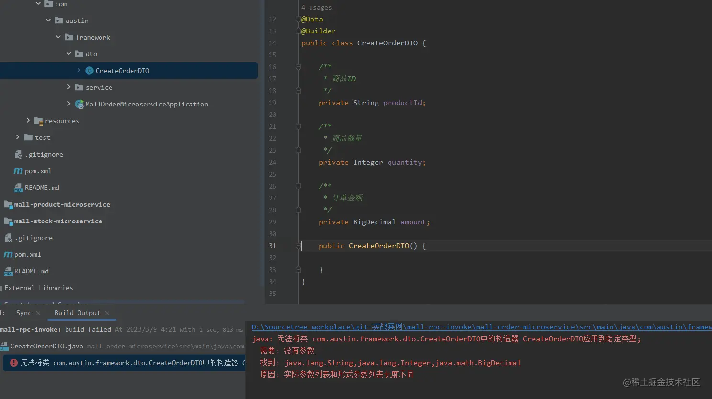
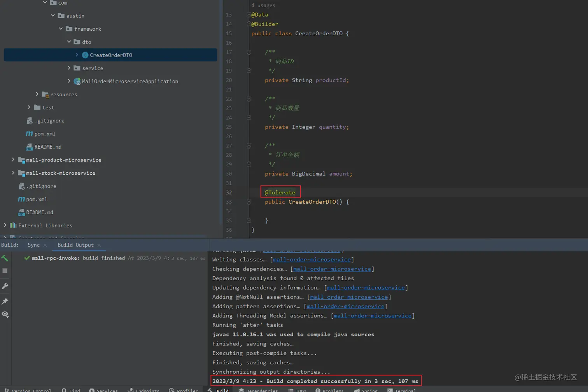

# Lombok正确使用姿势
介绍
--

> `Project Lombok`是一个`java`库，它可以自动插入编辑器和构建工具，通过`Lombok`我们不需要再在类上编写_**setter/getter、equals、try/catch、无参构造器、全参构造器**_ 等方法。

Lombok features（特性）
-------------------

_**Lombok包下注解：** _

| Lombok属性注解 | 特性说明 |
| --- | --- |
| **val** | 用在局部变量前面，相当于将变量声明为 `final` |
| **@NonNull** | 给方法参数增加这个注解会自动在方法内对该参数进行是否为空的校验，如果为空，则抛出`NPE(NullPointerException)` |
| **@Cleanup** | 自动管理资源，用在局部变量之前，在当前变量范围内即将执行完毕退出之前会自动清理资源，自动生成 try-finally 这样的代码来关闭流 |
| **@Getter/@Setter** | 用在属性上，再也不用自己手写`setter`和`getter`方法了，还可以指定访问范围 |
| **@ToString** | 用在类上可以自动覆写`toString`方法，当然还可以加其他参数，例如 `@ToString(exclude=“id”)` 排除id属性，或者 `@ToString(callSuper=true, includeFieldNames=true)` 调用父类的`toString`方法，包含所有属性； |
| **@EqualsAndHashCode** | 用在类上自动生成`equals`方法和`hashCode`方法 |
| **@NoArgsConstructor, @RequiredArgsConstructor and @AllArgsConstructor** | 用在类上，自动生成无参构造和使用所有参数的构造函数以及把所有 @NonNull 属性作为参数的构造函数，如果指定 staticName="of" 参数，同时还会生成一个返回类对象的静态工厂方法，比使用构造函数方便很多 |
| **@Data** | 注解在类上，相当于同时使用了`@ToString、@EqualsAndHashCode、@Getter、@Setter`和 `@RequiredArgsConstrutor`这些注解，对于`POJO`类十分有用 |
| **@Value** | 用在类上，是`@Data`的不可变形式，相当于为属性添加`final`声明，只提供`getter`方法，而不提供`setter`方法 |
| **@Builder** | 用在类、构造器、方法上，为你提供复杂的 builder APIs，让你可以像如下方式一样调用Person.builder().name("xxx").city("xxx").build() |
| **@SneakyThrows** | 自动抛受检异常，而无需显式在方法上使用`throws`语句 |
| **@Synchronized** | 用在方法上，将方法声明为同步的，并自动加锁，而锁对象是一个私有的属性 LOCK，而`Java`中的`synchronized`关键字锁对象是 this，锁在`this`或者自己的类对象上存在副作用，就是你不能阻止非受控代码去锁`this`或者类对象，这可能会导致竞争条件或者其它线程错误 |
| **@Getter(lazy=true)** | 可以替代经典的`Double Check Lock`样板代码 |
| **@Log** | 根据不同的注解生成不同类型的`log`对象，但是实例名称都是`log`，有六种可选实现类 @CommonsLog Creates log = org.apache.commons.logging.LogFactory.getLog(LogExample.class); @Log Creates log = java.util.logging.Logger.getLogger(LogExample.class.getName()); @Log4j Creates log = org.apache.log4j.Logger.getLogger(LogExample.class); @Log4j2 Creates log = org.apache.logging.log4j.LogManager.getLogger(LogExample.class); @Slf4j Creates log = org.slf4j.LoggerFactory.getLogger(LogExample.class); @XSlf4j Creates log = org.slf4j.ext.XLoggerFactory.getXLogger(LogExample.class) |

### @SneakyThrows

一般都是标注在方法上面，通过`@SneakyThrows`我们不需要是手动写`try{}...catch(Throwable e){}`代码，`Lombok`会自动为我们生成，举个🌰：

```less
@Override
@SneakyThrows
public String createOrder(CreateOrderDTO createOrderDTO) {
    boolean res = stockService.checkStock(createOrderDTO);
    if (res) {
        doCreateOrder(createOrderDTO);
    }
    return "create order success!";
}

```

_**最后编译生成的代码是这样的：** _

```typescript
public String createOrder(CreateOrderDTO createOrderDTO) {
    try {
        boolean res = stockService.checkStock(createOrderDTO);
        if (res) {
            this.doCreateOrder(createOrderDTO);
        }
        return "create order success!";
    } catch (Throwable var3) {
        throw var3;
    }
}

```

### @CleanUp

`JAVA`在实现`IO`流读写的场景，每次都要在`finally`里面关闭资源，这样会很让人头疼？那么有没有好的方法去生成这样的重复代码。方法有两种：一种是使用`Lombok`的`@Cleanup`，另一种是使用`jdk1.7+`的`try-with-resources`语法糖。我个人推荐使用`try-with-resources`语法糖，因为它是`jdk`提供的，所以受众更广，别人能更容易读懂你的代码，也不用绑定插件才能使用。在关闭流（资源）的时候，经常使用到以下代码：

```java
public void cleanUpSample() {
    String filePath = "E://test.txt";
    FileReader reader = null;
    try {
        reader = new FileReader(filePath);
    } catch (FileNotFoundException e) {
        throw new RuntimeException(e);
    } finally {
        try {
            
            reader.close();
        } catch (IOException e) {
            throw new RuntimeException(e);
        }
    }
}

```

当在处理`文件对象`，或者`数据库资源`时，我们总是会忘记`close`，可能引发内存溢出或者连接池用尽。如果手动去调用`close`方法，代码又会非常长，现在有了`@Cleanup`，我们不再需要担心这些问题。通过使用`@Cleanup`确保在代码执行路径退出当前作用域之前自动清除给定资源，举个例子：

```java
public void cleanUpSample() {
    String filePath = "E://test.txt";
    try {
        @Cleanup FileReader reader = new FileReader(filePath);
    } catch (FileNotFoundException e) {
        e.printStackTrace();
    } catch (IOException e) {
        e.printStackTrace();
    }
}

```

_**最后编译生成的代码是这样的：** _

```csharp
public void cleanUpSample() {
    String filePath = "E://test.txt";

    try {
        FileReader reader = new FileReader(filePath);
        
        if (Collections.singletonList(reader).get(0) != null) {
            reader.close();
        }
    } catch (FileNotFoundException var3) {
        var3.printStackTrace();
    } catch (IOException var4) {
        var4.printStackTrace();
    }
}

```

_**Lombok.experimental包下注解：** _

| Lombok注解 | 特性说明 |
| --- | --- |
| **@Accessors** | 一般的用法`@Accessors(chain = true)`，当设置`chain`为`true`的时候，`set`方法返回的是当前对象，则在进行属性赋值则可以连续进行，如：`createOrderDTO.setProductId("1").setQuantity(1).setAmount(new BigDecimal("100"));` |
| **@UntilityClass** | 使用`@UtilityClass`修饰类，类会被标记成`final`修饰类，属性会标记成静态属性，会生成一个私有的无参构造方法，并抛出一个`UnsupportedOperationException`异常，方法都会被标记成静态方法。 |
| **@Tolerate** | 使用`@Builder`对一个`DTO`实现一个构造器，但是在做`Json`反序列化的时候发生错误，原因就是缺少无参公共的构造函数，而手动写一个无参构造函数的时候编译错误，就是和`@Builder`冲突，虽然标准的`@Builder`没法是需要私有化构造函数的，但是在某些场景下我们需要对这种标准变形，这个时候`Lombok`提供了`@Tolerate`实现对冲突的兼容。 |

### @UntilityClass

`@UntilityClass`主要是针对工具类的一个注解，它的作用是，被`@UntilityClass`修饰的类它的所有成员变量都是静态的，可以直接通过`ExampleClass.method()`直接调用，省了创建实例对象的过程，举个例子：

```scala
@UtilityClass
public class GlobalWebUtils extends WebUtils {

    
     * 获取 HttpServletRequest
     *
     * @return {HttpServletRequest}
     */
    public Optional<HttpServletRequest> getRequest() {
        return Optional.ofNullable(((ServletRequestAttributes) RequestContextHolder.getRequestAttributes()).getRequest());
    }

    
     * 获取 HttpServletResponse
     *
     * @return {HttpServletResponse}
     */
    public HttpServletResponse getResponse() {
        return ((ServletRequestAttributes) RequestContextHolder.getRequestAttributes()).getResponse();
    }

}

```

_**使用工具类的时候，直接通过类调用：** _

```less
@Override
@SneakyThrows
public void onAuthenticationFailure(HttpServletRequest request, HttpServletResponse response) {
    log.warn("表单登录失败：{}", exception.getMessage());
    String url = "http:
    
    GlobalWebUtils.getResponse().sendRedirect(url);
}

```

Lombok使用注意点
-----------

### 1\. Lombok中@Builder和@Data注解使用注意

*   `@Builder`使用设计模式中的创建者模式又叫建造者模式。简单来说，就是一步步创建一个对象，它对用户屏蔽了里面构建的细节，但却可以精细地控制对象的构造过程；
*   `@Data`注解的主要作用是提高代码的简洁，使用这个注解可以省去代码中大量的`get()`、`set()`、 `toString()`等方法；

在项目中查询数据库后反射到实体类报错，找不到无参构造器。查看对应实体类上只使用`@Builder`、 `@Data`注解。

💥**当@Data和@Builder 共同使用导致无参构造丢失**

*   单独使用`@Data`注解，会生成无参数构造方法；
*   单独使用`@Builder`注解，生成全属性的构造方法，无无参构造方法；
*   `@Data`和`@Builder`一起用：没有了默认的构造方法。手动添加无参数构造方法或者用`@NoArgsConstructor`注解会报错。

如果仅仅是使用`@Data`和`@Builder`两个注解修饰实体类，编译之后生成的`class`文件：

```kotlin
public class CreateOrderDTO {

    private String productId;
    private Integer quantity;
    private BigDecimal amount;

    
    CreateOrderDTO(final String productId, final Integer quantity, final BigDecimal amount) {
        this.productId = productId;
        this.quantity = quantity;
        this.amount = amount;
    }
    
    
    public static CreateOrderDTOBuilder builder() {
        return new CreateOrderDTOBuilder();
    }

    public String getProductId() {
        return this.productId;
    }

    

    public static class CreateOrderDTOBuilder {
        private String productId;
        private Integer quantity;
        private BigDecimal amount;

        CreateOrderDTOBuilder() {
        }

        public String toString() {
            return "CreateOrderDTO.CreateOrderDTOBuilder(productId=" + this.productId + ", quantity=" + this.quantity + ", amount=" + this.amount + ")";
        }
    }
}

```

可以看出如果是同时使用`@Data`和`@Builder`的话，会生成属性的`GET/SET`方法，_**但是无参构方法没有了**_，对象缺少无参构造器是不可接受的，因为很多框架都会调用无参构造函数去创建对象。

如果这时候在实体类上添加无参构造函数，在项目运行会编译报错，此时可以手动添加一个有参函数，也可以在无参函数上添加`@Tolerate`注解实现无参构造器的生成。



无参构造函数加上`@Tolerate`注解才能编译成功！



如果是使用`@Data`和`@Builder`、`@AllArgsConstructor`三个注解修饰实体类，编译之后生成的`class`文件跟上面的一样，会生成`无参构造器、全参构造器、Builder、getter&setter、equals、hashCode等`方法，_**区别是全参构造器为public修饰符修饰**_：

```kotlin
public CreateOrderDTO(final String productId, final Integer quantity, final BigDecimal amount) {
    this.productId = productId;
    this.quantity = quantity;
    this.amount = amount;
}

```

_**正常我们可以这样来定义一个实体类：** _

```less
@Data
@Builder
@NoArgsConstructor
@AllArgsConstructor
public class CreateOrderDTO {

    
     * 商品ID
     */
    private String productId;

    
     * 商品数量
     */
    private Integer quantity;

    
     * 订单金额
     */
    private BigDecimal amount;
}

```

最后编译测`class`文件 (_无参构造器、全参构造器、GET/SET、equals、hashCode、toString、Builder等方法_)：

```kotlin
public class CreateOrderDTO {
    private String productId;
    private Integer quantity;
    private BigDecimal amount;

    public static CreateOrderDTOBuilder builder() {
        return new CreateOrderDTOBuilder();
    }

    public String getProductId() {
        return this.productId;
    }

    public Integer getQuantity() {
        return this.quantity;
    }

    public BigDecimal getAmount() {
        return this.amount;
    }

    public void setProductId(final String productId) {
        this.productId = productId;
    }

    public void setQuantity(final Integer quantity) {
        this.quantity = quantity;
    }

    public void setAmount(final BigDecimal amount) {
        this.amount = amount;
    }

    public boolean equals(final Object o) {
        if (o == this) {
            return true;
        } else if (!(o instanceof CreateOrderDTO)) {
            return false;
        } else {
            CreateOrderDTO other = (CreateOrderDTO)o;
            if (!other.canEqual(this)) {
                return false;
            } else {
                label47: {
                    Object this$quantity = this.getQuantity();
                    Object other$quantity = other.getQuantity();
                    if (this$quantity == null) {
                        if (other$quantity == null) {
                            break label47;
                        }
                    } else if (this$quantity.equals(other$quantity)) {
                        break label47;
                    }

                    return false;
                }

                Object this$productId = this.getProductId();
                Object other$productId = other.getProductId();
                if (this$productId == null) {
                    if (other$productId != null) {
                        return false;
                    }
                } else if (!this$productId.equals(other$productId)) {
                    return false;
                }

                Object this$amount = this.getAmount();
                Object other$amount = other.getAmount();
                if (this$amount == null) {
                    if (other$amount != null) {
                        return false;
                    }
                } else if (!this$amount.equals(other$amount)) {
                    return false;
                }

                return true;
            }
        }
    }

    protected boolean canEqual(final Object other) {
        return other instanceof CreateOrderDTO;
    }

    public int hashCode() {
        int PRIME = true;
        int result = 1;
        Object $quantity = this.getQuantity();
        result = result * 59 + ($quantity == null ? 43 : $quantity.hashCode());
        Object $productId = this.getProductId();
        result = result * 59 + ($productId == null ? 43 : $productId.hashCode());
        Object $amount = this.getAmount();
        result = result * 59 + ($amount == null ? 43 : $amount.hashCode());
        return result;
    }

    public String toString() {
        return "CreateOrderDTO(productId=" + this.getProductId() + ", quantity=" + this.getQuantity() + ", amount=" + this.getAmount() + ")";
    }

    public CreateOrderDTO() {
    }

    public CreateOrderDTO(final String productId, final Integer quantity, final BigDecimal amount) {
        this.productId = productId;
        this.quantity = quantity;
        this.amount = amount;
    }

    public static class CreateOrderDTOBuilder {
        private String productId;
        private Integer quantity;
        private BigDecimal amount;

        CreateOrderDTOBuilder() {
        }

        public CreateOrderDTOBuilder productId(final String productId) {
            this.productId = productId;
            return this;
        }

        public CreateOrderDTOBuilder quantity(final Integer quantity) {
            this.quantity = quantity;
            return this;
        }

        public CreateOrderDTOBuilder amount(final BigDecimal amount) {
            this.amount = amount;
            return this;
        }

        public CreateOrderDTO build() {
            return new CreateOrderDTO(this.productId, this.quantity, this.amount);
        }

        public String toString() {
            return "CreateOrderDTO.CreateOrderDTOBuilder(productId=" + this.productId + ", quantity=" + this.quantity + ", amount=" + this.amount + ")";
        }
    }
}

```

