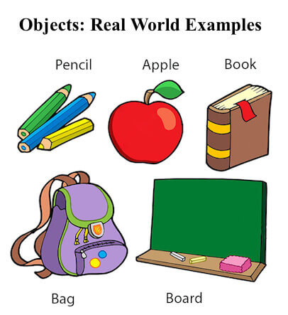
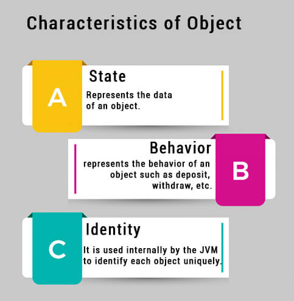
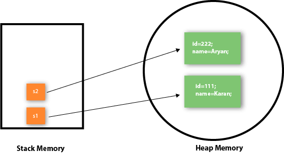
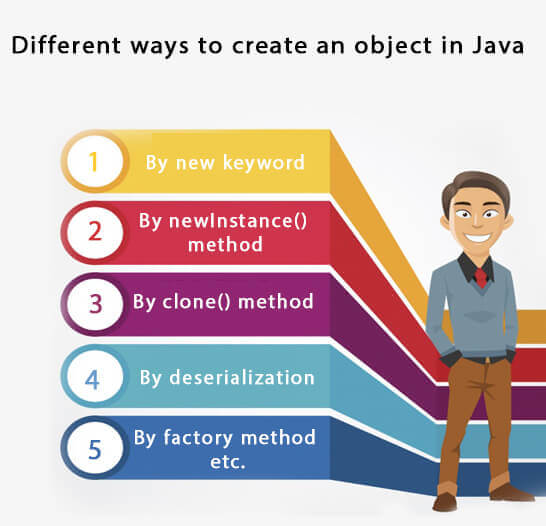

# Object and Class in Java
In this page, we will learn about Java objects and classes. In object-oriented programming technique, we design a program using objects and classes.

An object in Java is the physical as well as a logical entity, whereas, a class in Java is a logical entity only.

### What is an object in Java

An entity that has state and behavior is known as an object e.g., chair, bike, marker, pen, table, car, etc. It can be physical or logical (tangible and intangible). The example of an intangible object is the banking system.

An object has three characteristics:

*   **State:** represents the data (value) of an object.
*   **Behavior:** represents the behavior (functionality) of an object such as deposit, withdraw, etc.
*   **Identity:** An object identity is typically implemented via a unique ID. The value of the ID is not visible to the external user. However, it is used internally by the JVM to identify each object uniquely.

For Example, Pen is an object. Its name is Reynolds; color is white, known as its state. It is used to write, so writing is its behavior.

**An object is an instance of a class.** A class is a template or blueprint from which objects are created. So, an object is the instance(result) of a class.

**Object Definitions:**

*   An object is _a real-world entity_.
*   An object is _a runtime entity_.
*   The object is _an entity which has state and behavior_.
*   The object is _an instance of a class_.

* * *

What is a class in Java
-----------------------

A class is a group of objects which have common properties. It is a template or blueprint from which objects are created. It is a logical entity. It can't be physical.

A class in Java can contain:

*   **Fields**
*   **Methods**
*   **Constructors**
*   **Blocks**
*   **Nested class and interface**

### Syntax to declare a class:

1.  class <class_name>{  
2.      field;  
3.      method;  
4.  }  

* * *

### Instance variable in Java

A variable which is created inside the class but outside the method is known as an instance variable. Instance variable doesn't get memory at compile time. It gets memory at runtime when an object or instance is created. That is why it is known as an instance variable.

* * *

### Method in Java

In Java, a method is like a function which is used to expose the behavior of an object.

#### Advantage of Method

*   Code Reusability
*   Code Optimization

* * *

### new keyword in Java

The new keyword is used to allocate memory at runtime. All objects get memory in Heap memory area.

* * *

### Object and Class Example: main within the class

In this example, we have created a Student class which has two data members id and name. We are creating the object of the Student class by new keyword and printing the object's value.

Here, we are creating a main() method inside the class.

File: Student.java

3.  class Student{  

5.   int id;
6.   String name;  

8.   publicstaticvoid main(String args\[\]){  

10.    Student s1=new Student();

12.    System.out.println(s1.id);
13.    System.out.println(s1.name);  
14.   }  
15.  }  

[Test it Now](https://www.javatpoint.com/opr/test.jsp?filename=Student)

Output:

### Object and Class Example: main outside the class

In real time development, we create classes and use it from another class. It is a better approach than previous one. Let's see a simple example, where we are having main() method in another class.

We can have multiple classes in different Java files or single Java file. If you define multiple classes in a single Java source file, it is a good idea to save the file name with the class name which has main() method.

File: TestStudent1.java

4.  class Student{  
5.   int id;  
6.   String name;  
7.  }  

9.  class TestStudent1{  
10.   publicstaticvoid main(String args\[\]){  
11.    Student s1=new Student();  
12.    System.out.println(s1.id);  
13.    System.out.println(s1.name);  
14.   }  
15.  }  

[Test it Now](https://www.javatpoint.com/opr/test.jsp?filename=TestStudent1)

Output:

3 Ways to initialize object
---------------------------

There are 3 ways to initialize object in Java.

1.  By reference variable
2.  By method
3.  By constructor

### 1) Object and Class Example: Initialization through reference

Initializing an object means storing data into the object. Let's see a simple example where we are going to initialize the object through a reference variable.

File: TestStudent2.java

1.  class Student{  
2.   int id;  
3.   String name;  
4.  }  
5.  class TestStudent2{  
6.   publicstaticvoid main(String args\[\]){  
7.    Student s1=new Student();  
8.    s1.id=101;  
9.    s1.name="Sonoo";  
10.    System.out.println(s1.id+" "+s1.name);
11.   }  
12.  }  

[Test it Now](https://www.javatpoint.com/opr/test.jsp?filename=TestStudent2)

Output:

We can also create multiple objects and store information in it through reference variable.

File: TestStudent3.java

1.  class Student{  
2.   int id;  
3.   String name;  
4.  }  
5.  class TestStudent3{  
6.   publicstaticvoid main(String args\[\]){  

8.    Student s1=new Student();  
9.    Student s2=new Student();  

11.    s1.id=101;  
12.    s1.name="Sonoo";  
13.    s2.id=102;  
14.    s2.name="Amit";  

16.    System.out.println(s1.id+" "+s1.name);  
17.    System.out.println(s2.id+" "+s2.name);  
18.   }  
19.  }  

[Test it Now](https://www.javatpoint.com/opr/test.jsp?filename=TestStudent3)

Output:

### 2) Object and Class Example: Initialization through method

In this example, we are creating the two objects of Student class and initializing the value to these objects by invoking the insertRecord method. Here, we are displaying the state (data) of the objects by invoking the displayInformation() method.

File: TestStudent4.java

1.  class Student{  
2.   int rollno;  
3.   String name;  
4.   void insertRecord(int r, String n){  
5.    rollno=r;  
6.    name=n;  
7.   }  
8.   void displayInformation(){System.out.println(rollno+" "+name);}  
9.  }  
10.  class TestStudent4{  
11.   publicstaticvoid main(String args\[\]){  
12.    Student s1=new Student();  
13.    Student s2=new Student();  
14.    s1.insertRecord(111,"Karan");  
15.    s2.insertRecord(222,"Aryan");  
16.    s1.displayInformation();  
17.    s2.displayInformation();  
18.   }  
19.  }  

[Test it Now](https://www.javatpoint.com/opr/test.jsp?filename=TestStudent4)

Output:

As you can see in the above figure, object gets the memory in heap memory area. The reference variable refers to the object allocated in the heap memory area. Here, s1 and s2 both are reference variables that refer to the objects allocated in memory.

* * *

### 3) Object and Class Example: Initialization through a constructor

We will learn about constructors in Java later.

* * *

### Object and Class Example: Employee

Let's see an example where we are maintaining records of employees.

File: TestEmployee.java

1.  class Employee{  
2.      int id;  
3.      String name;  
4.      float salary;  
5.      void insert(int i, String n, float s) {  
6.          id=i;  
7.          name=n;  
8.          salary=s;  
9.      }  
10.      void display(){System.out.println(id+" "+name+" "+salary);}  
11.  }  
12.  publicclass TestEmployee {  
13.  publicstaticvoid main(String\[\] args) {  
14.      Employee e1=new Employee();  
15.      Employee e2=new Employee();  
16.      Employee e3=new Employee();  
17.      e1.insert(101,"ajeet",45000);  
18.      e2.insert(102,"irfan",25000);  
19.      e3.insert(103,"nakul",55000);  
20.      e1.display();  
21.      e2.display();  
22.      e3.display();  
23.  }  
24.  }  

[Test it Now](https://www.javatpoint.com/opr/test.jsp?filename=TestEmployee)

Output:

101 ajeet 45000.0
102 irfan 25000.0
103 nakul 55000.0

### Object and Class Example: Rectangle

There is given another example that maintains the records of Rectangle class.

File: TestRectangle1.java

1.  class Rectangle{  
2.   int length;  
3.   int width;  
4.   void insert(int l, int w){  
5.    length=l;  
6.    width=w;  
7.   }  
8.   void calculateArea(){System.out.println(length*width);}  
9.  }  
10.  class TestRectangle1{  
11.   publicstaticvoid main(String args\[\]){  
12.    Rectangle r1=new Rectangle();  
13.    Rectangle r2=new Rectangle();  
14.    r1.insert(11,5);  
15.    r2.insert(3,15);  
16.    r1.calculateArea();  
17.    r2.calculateArea();  
18.  }  
19.  }  

[Test it Now](https://www.javatpoint.com/opr/test.jsp?filename=TestRectangle1)

Output:

What are the different ways to create an object in Java?
--------------------------------------------------------

There are many ways to create an object in java. They are:

*   By new keyword
*   By newInstance() method
*   By clone() method
*   By deserialization
*   By factory method etc.

We will learn these ways to create object later.

 

Anonymous object
----------------

Anonymous simply means nameless. An object which has no reference is known as an anonymous object. It can be used at the time of object creation only.

If you have to use an object only once, an anonymous object is a good approach. For example:

Calling method through a reference:

1.  Calculation c=new Calculation();  
2.  c.fact(5);  

Calling method through an anonymous object

1.  new Calculation().fact(5);  

Let's see the full example of an anonymous object in Java.

1.  class Calculation{  
2.   void fact(int  n){  
3.    int fact=1;  
4.    for(int i=1;i<=n;i++){  
5.     fact=fact*i;  
6.    }  
7.   System.out.println("factorial is "+fact);  
8.  }  
9.  publicstaticvoid main(String args\[\]){  
10.   new Calculation().fact(5);
11.  }  
12.  }  

Output:

### Creating multiple objects by one type only

We can create multiple objects by one type only as we do in case of primitives.

Initialization of primitive variables:

Initialization of refernce variables:

1.  Rectangle r1=new Rectangle(), r2=new Rectangle();

Let's see the example:

3.  class Rectangle{  
4.   int length;  
5.   int width;  
6.   void insert(int l,int w){  
7.    length=l;  
8.    width=w;  
9.   }  
10.   void calculateArea(){System.out.println(length*width);}  
11.  }  
12.  class TestRectangle2{  
13.   publicstaticvoid main(String args\[\]){  
14.    Rectangle r1=new Rectangle(),r2=new Rectangle();
15.    r1.insert(11,5);  
16.    r2.insert(3,15);  
17.    r1.calculateArea();  
18.    r2.calculateArea();  
19.  }  
20.  }  

[Test it Now](https://www.javatpoint.com/opr/test.jsp?filename=TestRectangle2)

Output:

### Real World Example: Account

File: TestAccount.java

4.  class Account{  
5.  int acc_no;  
6.  String name;  
7.  float amount;  

9.  void insert(int a,String n,float amt){  
10.  acc_no=a;  
11.  name=n;  
12.  amount=amt;  
13.  }  

15.  void deposit(float amt){  
16.  amount=amount+amt;  
17.  System.out.println(amt+" deposited");  
18.  }  

20.  void withdraw(float amt){  
21.  if(amount<amt){  
22.  System.out.println("Insufficient Balance");  
23.  }else{  
24.  amount=amount-amt;  
25.  System.out.println(amt+" withdrawn");  
26.  }  
27.  }  

29.  void checkBalance(){System.out.println("Balance is: "+amount);}  

31.  void display(){System.out.println(acc_no+" "+name+" "+amount);}  
32.  }  

34.  class TestAccount{  
35.  publicstaticvoid main(String\[\] args){  
36.  Account a1=new Account();  
37.  a1.insert(832345,"Ankit",1000);  
38.  a1.display();  
39.  a1.checkBalance();  
40.  a1.deposit(40000);  
41.  a1.checkBalance();  
42.  a1.withdraw(15000);  
43.  a1.checkBalance();  
44.  }}   

[Test it Now](https://www.javatpoint.com/opr/test.jsp?filename=TestAccount)

Output:

832345 Ankit 1000.0
Balance is: 1000.0
40000.0 deposited
Balance is: 41000.0
15000.0 withdrawn
Balance is: 26000.0