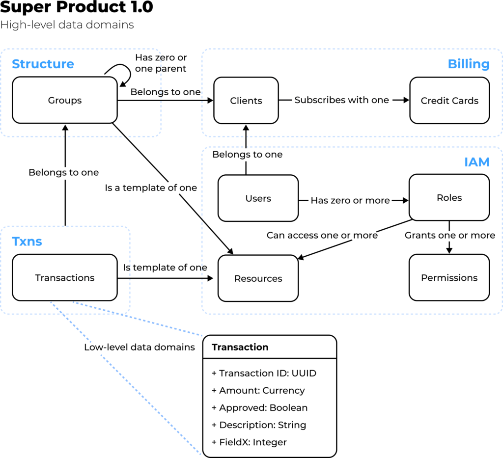
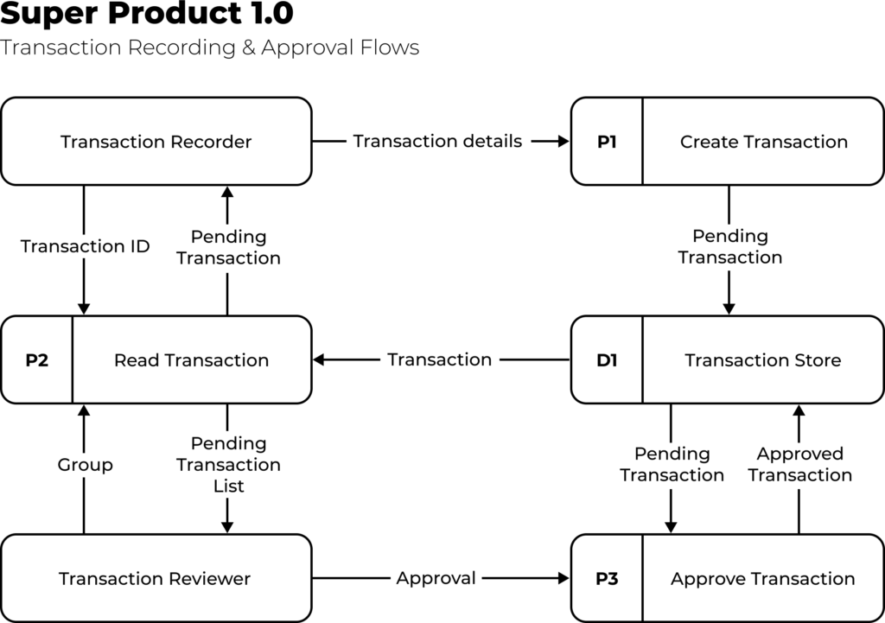

# Software & Data Architecture: Part 1 - SitePen
Introduction
------------

The definitions of ‘information architecture’ and ‘data architecture’ are, unfortunately, pretty broad. They cover many areas of systems engineering and are applicable across several disciplines, including the design of business processes, user experiences, and software implementations. Every concept you can find in any accepted definition for the terms has value. A practitioner looking to apply them can find a way to tailor each point to their perspective, and whatever implementation they reach can be considered ‘valid’ under the broader umbrella of the terms.

I say “unfortunately” as this broad inclusivity means practitioners can easily be turned away by the sheer scale of the definitions. Trying to cover every point and tailor each one for every responsibility would take a lot of time, and the value gained may never be evident, let alone justify the cost. Therefore, many people ignore the complete definitions and focus on specific areas directly applicable to their daily responsibilities, often without even considering that “I am working on the data architecture of my system.”

### We’re already doing the work

For product owners, this “implicit information architecture” could mean deciding what the user needs to do within the product and ensuring they have the information they need to perform their task. UX designers may focus on providing users with the most efficient workflow possible when accessing their data and completing their activities. And a software engineer may focus on how the data is stored and retrieved in a performant and robust way to allow the users to perform their activities. These are typical day-to-day responsibilities for each role type. Many undertake these activities without realizing they are valid concepts within the broad information or data architecture umbrella.

So if we’re already doing the work, what’s the problem? Hiding these activities as simple implementation detail tasks behind other “more important” work (feature development) means their output is rarely captured and published, leading to confusion (friction) and repetition (waste). Elevating the importance of data within a system and treating it as a primary concept when considering a product’s value can help to reduce such friction and waste.

Rather than cover every data architecture concept, this article focuses on a few areas that often get overlooked as to their value. End users benefit from them with a consistent, logical, and performant product. All the teams involved in the system’s design, implementation, and maintenance similarly benefit over time through clarity and consistency, whether they realize it or not. 

What are the important concepts?
--------------------------------

Simply put – understanding and documenting a system’s data. What it is, how it flows, how much of it exists, and who should have access to it. Analyzing in detail what data is stored and processed in a system, with overlaps into security, scalability, and performance. Any integrations with external applications or datasets also need consideration as part of a system’s overall data footprint.

Products are often described and sold by their functionality, but functionality alone is useless without data – indeed, some products are data agreements exclusively with zero functionality. In this sense, data is the most fundamentally important concept within every system but rarely gets the same level of attention as functionality. Data concepts underpinning features are often left as implementation details.

Ideally, delivery teams can elevate data architecture concepts to the same importance as other activities. The concepts can be explored at a specific time, for example, to aid with a once-off planning exercise, but are more valuable when considered over a system’s lifespan. Rigorous data design at the start of a project can help vet feature ideas and streamline their implementation. Over the longer term, the concepts can help feed capacity and budget planning to ensure sufficient resource allocation, both in the team delivering the product and the product’s data storage needs.

To slightly expand on how “understanding a system’s data” translates into areas of concrete analysis:

### Data modeling

Mapping out the data domains involved in an architecture (closely associated with domain-driven design). At a high level, this identifies all major data concepts and their associations. At lower levels, this defines all data entities (tables, documents, etc.) within each data domain down to individual fields and their requirements (format, size, security, and links to other subdomains). This information helps guide which data storage and transport options are best suited for a particular system. It also often defines how a system’s components are laid out and what communication needs to happen between them.

There is an argument that agile delivery means requirements are not fully known upfront, so formal data modeling is futile. Instead, the data domains will emerge organically from whatever services and components the team creates. While this can be true, a system’s requirements and hence data models will change over time, so formal data modeling is never a one-and-done exercise, nor does it need to be 100% accurate from the offset.

Treating data modeling as a best-effort activity alongside regular iteration activities can maintain agility while reaching “eventual consistency.” Meaning the accuracy of the data model and its representation within the product’s source code. Documenting as much as possible within whatever time is available and then establishing a change process will allow the data models to evolve while ensuring all consumers are fully aware of the new changes and can adjust to them within appropriate timeframes.

Modeling can be kept lightweight at the start of a project during high flux and formalized later when there is less change but where the impact of change is more significant – for example when more dependents are relying on the system or pieces of it.

_A sample data model highlighting high-level entities and their relationships within a product,  grouped into one of four major domains. Lower-level diagrams containing more detail for specific areas can be derived from/linked to the root architecture diagram._

### Data flow

Mapping out all the data flows within a system – how subsets of the data flow through one or more components for users to perform their tasks. These flows should include ingress and egress points to show how data is created and retired within the system and any background system processing tasks which users may not directly see.

User interaction in data flows is typically framed as abstract personas that can perform one or more functions within the application. Individual users then assume a persona when performing a particular application function. For example, a Transaction Reviewer persona would perform an Approve Transaction task, with a Pending Transaction data object flowing in as input and an Approved Transaction data object resulting as output.

The complete set of data flows should highlight how every user persona interacts with every high-level data concept within every system component. The absence of such an interaction should mean that the system does not support that functionality.

_A sample high-level data flow diagram highlighting two workflows, the personas who perform them, and the data involved at each stage. Additional lower-level diagrams could detail the system components involved within processes P1, P2, P3._

### Information Security

Data model concepts will typically need classification under the organization’s information security policies. For example, to highlight the public data sets versus others that may be strictly confidential and only accessible by authorized personas, or if particular data sets need to be resident within certain countries given local legal requirements.

A data architect should also reflect data model security classification and user persona access requirements in the data flows. In this context, the lack of a data flow interaction between specific personas, models, or components could mean explicitly disallowing such potential interactions from ever occurring. A flow between certain data concepts, system components, and user personas should inform what security controls need to be in place.

Beyond internal policy compliance, the security classifications of a system’s data are typically used by auditors when assessing if the system correctly implements all required security controls, for example, to accredit a system with a particular information security certification such as ISO/IEC 27001. Security consultants can also use the mappings to validate expected and unexpected behavior within the system when performing penetration tests or other related security scans.

Super Product 1.0

Infosec Mapping

| **Data Domain** | **Data Classification** | **Data Residency** | **Resource URN scheme** |
| Transactions | Strictly Confidential | USA-only | urn:mycorp:txn:<func> |
| IAM | Confidential | Region-specific | urn:mycorp:iam:<func> |
| Billing | Confidential | Region-specific | urn:mycorp:bill:<func> |
| Structure | Public | Global | urn:mycorp:struct:<func> |

_Various security mapping for the example product’s major data domains, including data classification, residency requirements, and uniform resource naming scheme used to denote relevant resources in the system’s authorization layers._

### Rates of change

There are two main facets here. One is understanding the rate of change in storing and processing data within a system (a system’s “data lifecycle”). The other is how the system’s functionality changes over time through maintenance and feature enhancement.

#### Data Lifecycle

The data lifecycle of a system includes the relative scale of its datasets, how that data changes over time, and comparative read and write hotspots. Understanding this information helps in several ways, such as in the data modeling exercise to avoid designing bottlenecks through inefficient data structures. It helps shape the selection and right-sizing of data stores and guides capacity planning to reflect a system’s needs more accurately, thereby minimizing overspending waste. It also helps establish performance baselines for testing and issue resolution.

In a cloud-first world, understanding the data lifecycle and expected rates of change helps implement auto-scaling rules, including alarms to notify of any unexpected scaling deviations. It also helps with the allocation of hot vs. cold storage to better balance system functionality and user expectations with operational costs.

#### Functionality

Understanding where the “functional hotspots” are within a system. This means components that handle large volumes of data or critical application functionality – typically those that are often being modified or extended. The hotspots may change over time as features are stabilized or deprecated, but there will likely be a handful of components that continue to handle core product features and remain high up the functionality priority order.

Being able to rank all the components of a system by their relative importance through an understanding of how functionality changes over time helps team structuring and resource allocation. Management can allocate a larger share of the budget to critical components, including dedicated teams responsible for supporting each component. Peripheral areas that rarely change can become candidates for moving to lower-cost support locations. When looking to increase delivery parallelization, monolithic teams can be broken down into more specialized groups, each handling priority areas.

Visibility of the priority system components and team allocation can also highlight structural gaps. Typically these are components that lack sufficient coverage within the team, given their relative priority. Gaps could also be insufficient knowledge coverage – single points of failure or “low bus factor” areas. A team could also be overstretched and unable to properly maintain all components within their remit. Instances where multiple products or businesses begin sharing high-priority components could also highlight the need for a dedicated shared platform team.

**Super Product 1.0**

Growth Rates

| **Priority** | **Data Domain** | **Avg. Record Size** | **\# of Records** | **Data Growth Rate** | **Feature Rate** |
| 1 | Transactions | 1kb | 500mm | 100x | 4x |
| 2 | IAM | 1kb | 10mm | 5x | 2x |
| 3 | Billing | 10kb | 500k | 2x | 1x |
| 4 | Structure | 100b | 1mm | 1x | 0.1x |

_A priority ranking of the example product’s major data domains used to drive team structure and budget allocation. Priority is derived from relative growth rates around data processed/stored and feature work._

Why does this matter?
---------------------

What benefits can teams gain from analyzing and documenting these concepts? Hopefully, the simple visual nature of such artifacts provides valuable perspectives into your system. Read [Part 2 of this article](https://www.sitepen.com/blog/software-data-architecture-part-2) to find out what else a well-documented data architecture can give your teams and your users!