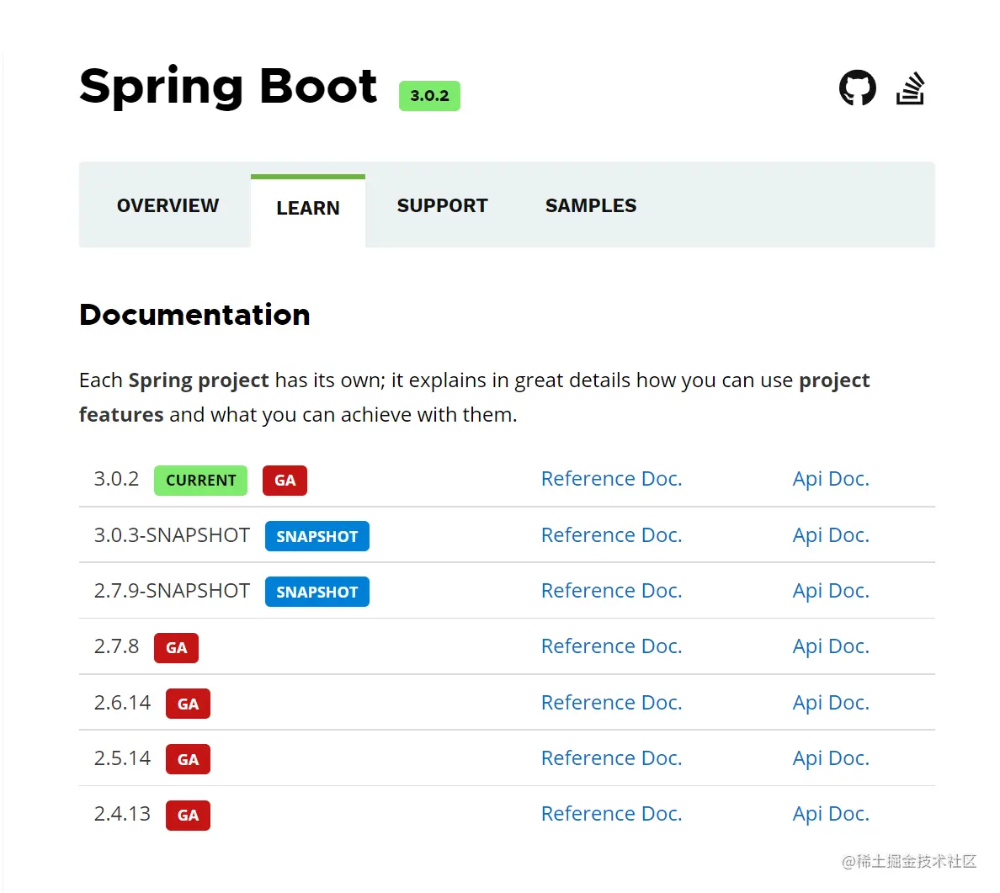
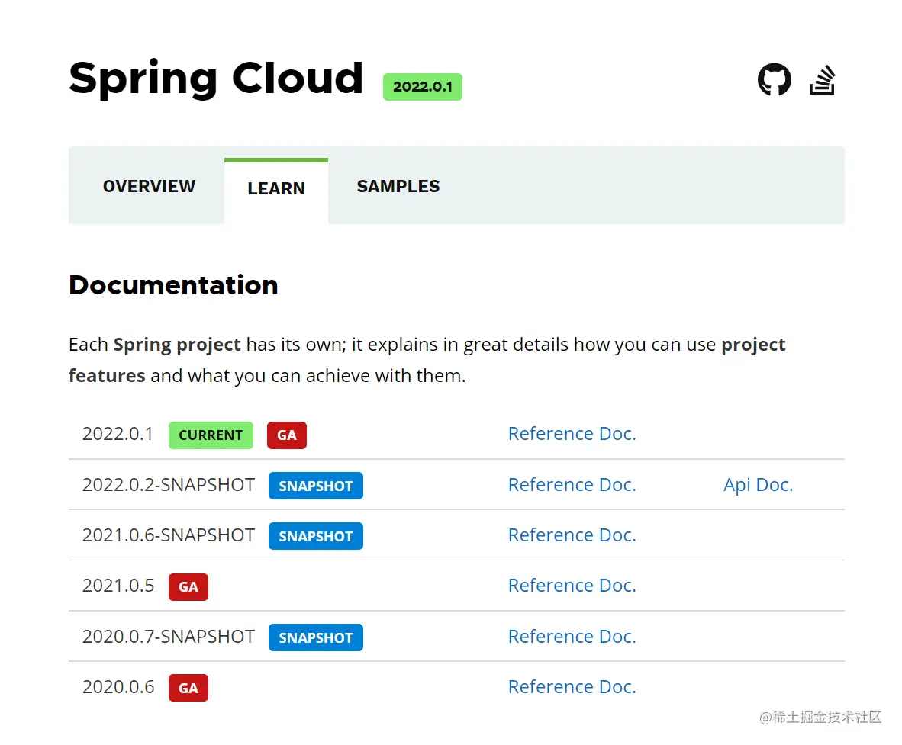
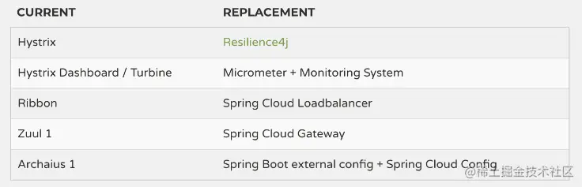

# SpringCloud版本升级个组件替代方案

Spring Boot
-----------

### Spring Boot 版本

截止 2023 年 1 月 20 日，`Spring Boot` 的最新版本为 `3.0.2`，最新的版本信息可以查阅以下网站来获取：

*   **[Maven 中央仓库](https://link.juejin.cn/?target=https%3A%2F%2Fmvnrepository.com%2Fartifact%2Forg.springframework.boot%2Fspring-boot-dependencies "https://mvnrepository.com/artifact/org.springframework.boot/spring-boot-dependencies")**
*   **[Spring Boot 官方文档](https://link.juejin.cn/?target=https%3A%2F%2Fspring.io%2Fprojects%2Fspring-boot%23learn "https://spring.io/projects/spring-boot#learn")**
*   **[Spring Boot 2.0 官方发布日志](https://link.juejin.cn/?target=https%3A%2F%2Fgithub.com%2Fspring-projects%2Fspring-boot%2Fwiki%2FSpring-Boot-2.0-Release-Notes "https://github.com/spring-projects/spring-boot/wiki/Spring-Boot-2.0-Release-Notes")**

Spring Cloud
------------------------------------------------------------------------------------------------------------------------------------------------------------------------------

### Spring Cloud 版本

截止 2023 年 1 月 20 日，`Spring Cloud`的最新版本为 `2022.0.1`，最新的版本信息可以查阅以下网站来获取：

*   **[Maven 中央仓库](https://link.juejin.cn/?target=https%3A%2F%2Fmvnrepository.com%2Fartifact%2Forg.springframework.cloud%2Fspring-cloud-dependencies "https://mvnrepository.com/artifact/org.springframework.cloud/spring-cloud-dependencies")**
*   **[Spring Cloud 官方文档](https://link.juejin.cn/?target=https%3A%2F%2Fspring.io%2Fprojects%2Fspring-cloud%23learn "https://spring.io/projects/spring-cloud#learn")**

### SpringBoot 版本的对应关系

| Spring Cloud Version | Spring Boot Version |
| --- | --- |
| 2022.0.x aka Kilburn | 3.0.x |
| 2021.0.x aka Jubilee | 2.6.x, 2.7.x (Starting with 2021.0.3) |
| 2020.0.x aka Ilford | 2.4.x, 2.5.x (Starting with 2020.0.3) |
| Hoxton | 2.2.x, 2.3.x (Starting with SR5) |
| Greenwich | 2.1.x |
| Finchley | 2.0.x |
| Edgware | 1.5.x |
| Dalston | 1.5.x |

**最新官方给出说明：SpringCloud Dalston，Edgware，Finchely，Greenwich版本已经`End of life`，不再迭代，只修复对应BUG fixes。** 

Spring Cloud Alibaba
--------------------

由于`Spring Boot 2.4+`和以下版本之间的变化较大，目前企业级客户老项目相关`Spring Boot`版本仍停留在 `Spring Boot 2.4`以下，为了同时满足存量用户和新用户不同需求，社区以`Spring Boot 2.4`为分界线，同时维护`Spring Cloud Alibaba 2.2.x`和`2021.x`两个分支的迭代。

> **Spring Cloud** 与 **Spring Cloud Alibaba** 最新的版本对应关系请看 **[GitHub Wiki](https://link.juejin.cn/?target=https%3A%2F%2Fgithub.com%2Falibaba%2Fspring-cloud-alibaba%2Fwiki%2F%25E7%2589%2588%25E6%259C%25AC%25E8%25AF%25B4%25E6%2598%258E "https://github.com/alibaba/spring-cloud-alibaba/wiki/%E7%89%88%E6%9C%AC%E8%AF%B4%E6%98%8E")**。

### 2.2.x 分支

适配 `Spring Boot 2.4、Spring Cloud Hoxton`及以下的版本，`Spring Cloud Alibaba`各版本的对应关系如下表所示（最新版本用 `*` 标记）

| Spring Cloud Alibaba Version | Spring Cloud Version | Spring Boot Version |
| --- | --- | --- |
| 2.2.9.RELEASE * | Hoxton.SR12 | 2.3.12.RELEASE |
| 2.2.8.RELEASE | Hoxton.SR12 | 2.3.12.RELEASE |
| 2.2.7.RELEASE | Hoxton.SR12 | 2.3.12.RELEASE |
| 2.2.6.RELEASE | Hoxton.SR9 | 2.3.2.RELEASE |
| 2.1.4.RELEASE | Greenwich.SR6 | 2.1.13.RELEASE |
| 2.2.1.RELEASE | Hoxton.SR3 | 2.2.5.RELEASE |
| 2.2.0.RELEASE | Hoxton.RELEASE | 2.2.X.RELEASE |
| 2.1.2.RELEASE | Greenwich | 2.1.X.RELEASE |
| 2.0.4.RELEASE (停止维护，建议升级) | Finchley | 2.0.X.RELEASE |
| 1.5.1.RELEASE (停止维护，建议升级) | Edgware | 1.5.X.RELEASE |

### 2021.x 分支

适配 `Spring Boot 2.4、Spring Cloud 2021.x` 及以上的版本，`Spring Cloud Alibaba`各版本的对应关系如下表所示（最新版本用 `*` 标记）。特别注意，该分支的`Spring Cloud Alibaba`版本命名方式进行了调整，未来将对应`Spring Cloud`版本，前三位为`Spring Cloud`版本，最后一位为扩展版本；比如适配`Spring Cloud 2021.0.1`版本对应的`Spring Cloud Alibaba`第一个版本为 `2021.0.1.0`，第个二版本为 `2021.0.1.1`，依此类推。

| Spring Cloud Alibaba Version | Spring Cloud Version | Spring Boot Version |
| --- | --- | --- |
| 2021.0.4.0 * | 2021.0.4 | 2.6.11 |
| 2021.0.1.0 | 2021.0.1 | 2.6.3 |
| 2021.1 | 2020.0.1 | 2.4.2 |

### Alibaba 各组件之间的版本对应关系

每个`Spring Cloud Alibaba`组件的版本，及其自身所适配的各组件的对应版本关系如下表所示：

| Spring Cloud Alibaba Version | Sentinel Version | Nacos Version | RocketMQ Version | Dubbo Version | Seata Version |
| --- | --- | --- | --- | --- | --- |
| 2.2.9.RELEASE | 1.8.5 | 2.1.0 | 4.9.4 | ~ | 1.5.2 |
| 2021.0.4.0 | 1.8.5 | 2.0.4 | 4.9.4 | ~ | 1.5.2 |
| 2.2.8.RELEASE | 1.8.4 | 2.1.0 | 4.9.3 | ~ | 1.5.1 |
| 2021.0.1.0 | 1.8.3 | 1.4.2 | 4.9.2 | ~ | 1.4.2 |
| 2.2.7.RELEASE | 1.8.1 | 2.0.3 | 4.6.1 | 2.7.13 | 1.3.0 |
| 2.2.6.RELEASE | 1.8.1 | 1.4.2 | 4.4.0 | 2.7.8 | 1.3.0 |
| 2021.1 or 2.2.5.RELEASE or 2.1.4.RELEASE or 2.0.4.RELEASE | 1.8.0 | 1.4.1 | 4.4.0 | 2.7.8 | 1.3.0 |
| 2.2.3.RELEASE or 2.1.3.RELEASE or 2.0.3.RELEASE | 1.8.0 | 1.3.3 | 4.4.0 | 2.7.8 | 1.3.0 |
| 2.2.1.RELEASE or 2.1.2.RELEASE or 2.0.2.RELEASE | 1.7.1 | 1.2.1 | 4.4.0 | 2.7.6 | 1.2.0 |
| 2.2.0.RELEASE | 1.7.1 | 1.1.4 | 4.4.0 | 2.7.4.1 | 1.0.0 |
| 2.1.1.RELEASE or 2.0.1.RELEASE or 1.5.1.RELEASE | 1.7.0 | 1.1.4 | 4.4.0 | 2.7.3 | 0.9.0 |
| 2.1.0.RELEASE or 2.0.0.RELEASE or 1.5.0.RELEASE | 1.6.3 | 1.1.1 | 4.4.0 | 2.7.3 | 0.7.1 |

Netflix 各组件替代方案
---------------

Netflix 公司在 2018 年前后宣布其核心组件 Hystrix、Ribbon、Zuul、Archaius 等均进入维护状态。同在 2018 年，Spring Cloud 在其 Roadmap 里就宣布将要终结的一些库 / 版本，其中最重要的就是指 Spring Cloud Netflix 项目进入维护模式，然后计划在 2020 年完全移除。对于 Netflix 的产品，Spring Cloud 只保留了其 Eureka，其他组件全部移除，并给出了相应的替代产品。

### 替代方案概览

### 替代方案介绍

#### Zuul 替代方案

Netflix 虽然已经在 2018 年 5 月开源了 Zuul 2.x，但由于 Zuul 2.x 在 Spring Cloud Gateway 孵化之前一直跳票发布，而且 Spring Cloud Gateway 目前已经孵化成功，相较于 Zuul 1.x 在功能以及性能上都有明显的提升。Spring 官方推荐使用 Spring Cloud Gateway 替代 Zuul 1.x，因此在 Spring Boot 2.0 以上版本中，并没有对 Zuul 2.0 以上最新高性能版本进行集成，仍然使用 Zuul 1.x 非 Reactor 模式（基于 Servlet 2.5 阻塞架构）的旧版本。

#### Ribbon 替代方案

Spring Cloud OpenFeign 在 `Hoxton.M2 RELEASED` 版本之后弃用了 Ribbon，使用`Spring Cloud Loadbalancer`作为客户端的负载均衡组件。从 Spring Cloud 2020 版本开始，Spring Cloud 完全弃用了 Ribbon，使用 Spring Cloud Loadbalancer 作为客户端的负载均衡组件。

[spring.io/guides/gs/s…](https://link.juejin.cn/?target=https%3A%2F%2Fspring.io%2Fguides%2Fgs%2Fspring-cloud-loadbalancer%2F "https://spring.io/guides/gs/spring-cloud-loadbalancer/")

#### Hystrix 替代方案

Netflix Hystrix 是 Spring Cloud 中最早支持的一种容错方案，在 2018 年 11 月 20 日之后官方已经停止维护，最后一个正式版本为 1.5.18。在 Spring Cloud Greenwich 版中，Spring 官方推荐使用 Resilience4j 替代 Hystrix，也可以选择使用 Spring Cloud Alibaba Sentinel。