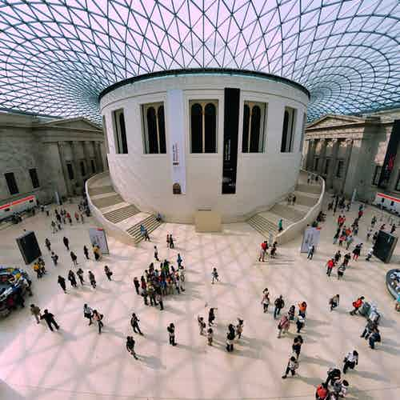

The [British Museum](http://www.britishmuseum.org/) in London is one of England’s largest, oldest and most comprehensive museums, with its permanent collections housing over 8 million works and articles. Through its exhibits and collections, this museum takes you back to the birth of mankind and civilization. The British Museum is dedicated to documenting and showcasing the evolution and culture of humankind, with exhibits from all over the world.

### British Museum History

The British Museum in London is the world’s first national public museum, established in the year 1753. The exhibits and items on display at the museum are largely based on the collections of [Sir Hans Sloane](https://en.wikipedia.org/wiki/Hans_Sloane), an Irish physician and scientist. Although the museum didn’t start out with much (71,000 objects), over the course of the last two and half centuries, it has undergone several changes, including widespread renovations and expansions, in order to accommodate the ever-growing collection.

Today, the British Museum, London is home to one of the most extensive and comprehensive collections of artefacts, sculptures, paintings, statues, manuscripts and other antiquities, all collected from around the globe and all dedicated to showcasing the leaps and bounds of human history.

### British Museum Architecture

The British Museum was designed in the Greek Revival style, emulating the classical Greek architecture, with columns, a decorative pediment at the south entrance and a main quadrangle and 4 wings. The core of the building was designed by [Sir Robert Smirke](https://en.wikipedia.org/wiki/Robert_Smirke_(architect)), at the time an eminent and established neoclassical architect. Smirke began the project with the construction of the east wing meant for the King’s Library, (today, considered one of the greatest examples of neoclassical interiors in London) and consequently moved onto the other wings.

What is most striking about the building is its exterior, built decoratively and beautifully so as to convey to its onlookers about the treasures and wondrous objects stored inside. Considering that the museum went through several expansions and restorations, a number of other architects worked on some of the newer areas and wings, including Sydney Smirke, Sir John Taylor and John Russell Pope, all adding to the allure and beauty of the museum we see today.

Must See British Museum - Top 10 Artefacts & Exhibits

* * *

### 1\. Rosetta Stone

When visiting the British Museum, the [Rosetta Stone](https://en.wikipedia.org/wiki/Rosetta_Stone) should be on the top of your list of ‘must-see items’. It is essentially a stone of black granodiorite (part of a bigger block) with inscriptions in 3 languages, and was found in Rosetta, Egypt. This stone is key in understanding and deciphering ancient Egyptian hieroglyphs and has been used by scholars to understand and study early human language. It is the most popular exhibit at the museum.  
**Location - Ground Floor, Room 4**

### 2\. Egyptian Mummies

The British Museum has a very fine collection of Egyptian mummies and coffins, and in fact, holds the largest collection of Egyptian objects and artefacts outside Egypt. Among the mummies, the most notable sarcophagus is that of [Pharaoh Nubkheperre Intef](https://en.wikipedia.org/wiki/Nubkheperre_Intef), an Egyptian King of the 17th dynasty.  
**Location - Upper Floor, Rooms 62-63**

### 3\. Hoa Hakananai'a (The Easter Island Statue)

[Hoa Hakananai'a](https://en.wikipedia.org/wiki/Hoa_Hakananai%27a) is an original Easter Island statue, made of Basalt. It has often been described as a “masterpiece” and “the finest example of Easter Island sculpture. The statue was taken by the crew of a British ship from Orongo, Rapa Nui and was subsequently presented to Queen Victoria, who then passed it onto the museum.  
**Location - Ground Floor, Room 24**

### 4\. The Sutton Hoo Mask and Ship Burial Collection

Considered one of the most important archaeological discoveries made in Britain, the [Sutton Hoo helmet](https://en.wikipedia.org/wiki/Sutton_Hoo_helmet) is a decorated Anglo-Saxon artefact that was found, along with a whole host of other items, during the excavation of the Sutton Hoo ship burial. This helmet is believed to be that of King Raedwald of East Anglia, given its elaborate and ornate decoration.  
**Location - Ground Floor, Room 2**

### 5\. The Lewis Chessmen

Made out of Walrus ivory and whalebone, these are not your ordinary chess pieces. The [Lewis Chessmen](https://en.wikipedia.org/wiki/Lewis_chessmen) are a group of 12th century chess pieces, probably made in Norway or Iceland, and make up the largest collection of objects for leisure use from that period ever found. Currently, 82 of the 93 pieces found are on display the British Museum, while the remaining 11 are at the National Museum of Scotland in Edinburgh.  
**Location - Upper Floor, Room 40**

### 6\. Parthenon Marbles

Perhaps the most controversial item on display at the British Museum, the Elgin or [Parthenon Marbles](https://en.wikipedia.org/wiki/Elgin_Marbles). These are a collection of beautiful classical Greek marble sculptures that were a part of the Temple of Parthenon on the Acropolis of Athens. They are a subject of controversy as Greece claims that these statues were removed illegally from their country, while the UK maintains that Lord Elgin purchased them legally.  
**Location - Ground Floor, Room 18**

### 7\. Colossal Red Granite Statue of Amenhotep III

This massive statue or bust is the head of [Pharaoh Amenhotep III](https://en.wikipedia.org/wiki/Amenhotep_III), the King of the 18th dynasty in Egypt. It was found at the Temple of Mut, in Karnak in 1817. Made completely of red granite, this bust stands at 2.90 meters, and is one of the most popular exhibits at the museum.  
**Location - Ground Floor, Room 4**

### 8\. Assyrian Lion Hunt Reliefs

In ancient Assyria, lion hunting was done for sport, where captured Asian lions were released from cages for kings to kill using swords, spears or arrows. This activity has been showcased, quite brilliantly, on alabaster panels, and they are widely regarded as “supreme masterpieces of Assyrian art’.  
**Location - Ground Floor, Room 10A**

### 9\. Double-headed Serpent

The double-headed serpent is an Aztec sculpture made out of wood and covered with turquoise mosaics. It came from Aztec Mexico and most scholars believe that it was used as ornamental piece during religious ceremonies. This sculpture is one of nine Mexican turquoise mosaics displayed at the British Museum.  
**Location - Ground Floor, Room 27**

### 10\. The Portland Vase

Part of the Roman Empire exhibit, the [Portland Vase](https://en.wikipedia.org/wiki/Portland_Vase) is a cameo glass vessel, dated somewhere between AD 1 and AD 25. It is assumed to be a wedding gift, because of the depictions and pictures on it of love, sex and marriage, but no one knows for sure. Interestingly enough, the vase was destroyed in the 19th century and it was restored several times based on a copy made of the vase by Wedgwood, which in turn was also a masterpiece!  
**Location - Upper Floor, Room 70**

