# The Ultimate Guide to Windows 11's Keyboard Shortcuts
Windows 11 comes with a ton of changes. A new UI, android app compatibility, improved resources management, and so much more are all packed into Microsoft's brand new operating system. However, it is still the same OS underneath, and that’s a good thing. If you made the jump to Windows 11, you may realize a few things have changed, starting with the placement of the Start button.

In this guide, we have jotted down a few Windows 11 tips and tricks to help you with the transition and learn new features.

1\. Change the Taskbar and Start Menu Alignment
-----------------------------------------------

 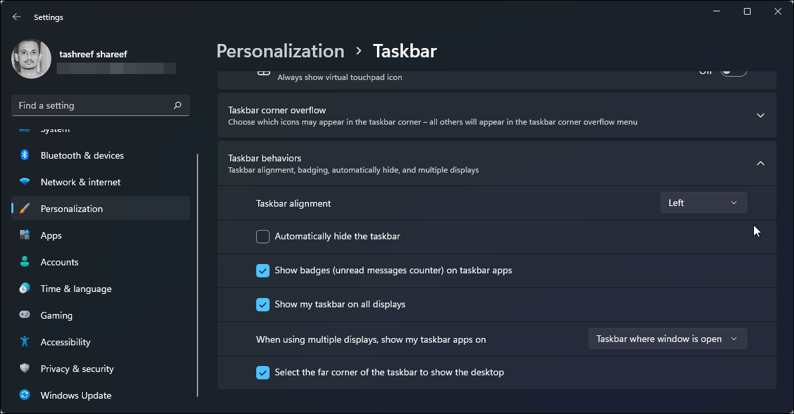 

Among the first change you will notice in Windows 11 is the Taskbar and Start menu location. Microsoft has decided to move it to the center for usability and aesthetic reasons.

While I quite like the new placement, you may prefer it in the original position. Fortunately, you can revert the changes and move the Taskbar back to the left.

To change the Taskbar alignment:

1.  Right-click on the **Taskbar** and select **Taskbar Settings.**
2.  Alternatively, go to **Settings > Personalization > Taskbar** to access the Taskbar settings.
3.  Scroll down and click on **Taskbar behaviors.**
4.  Click the drop-down for Taskbar alignment and select **Left**. Windows 11 Taskbar will now move to the left.

2\. Customize the Recommended Section
-------------------------------------

 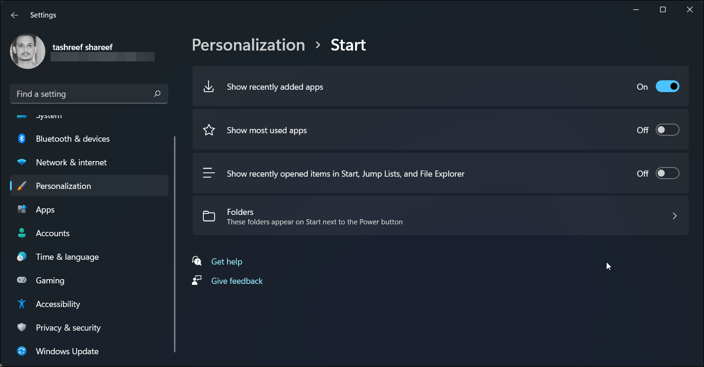 

The Recommended section in the new Start screen is powered by Microsoft 365. It shows your most recently installed apps, opened files, and other recommendations. If you don’t want everyone to know about your recent activities, you can turn it off in the settings.

1.  Press **Win + I** to open **Settings**.
2.  Next, open the **Personalization** tab in the left pane.
3.  Click on **Start**.
4.  Here, toggle the switch for **Show recently opened item in Start**, **Jump List and file Explorer** to **Off**.
5.  Now, if you click **Start**, you will find a vacant space under **Recommended**. To fill the void, you can show recently installed apps.
6.  Go to **Personalization > Start** and toggle the switch for **Show recently added apps** to **On.**

 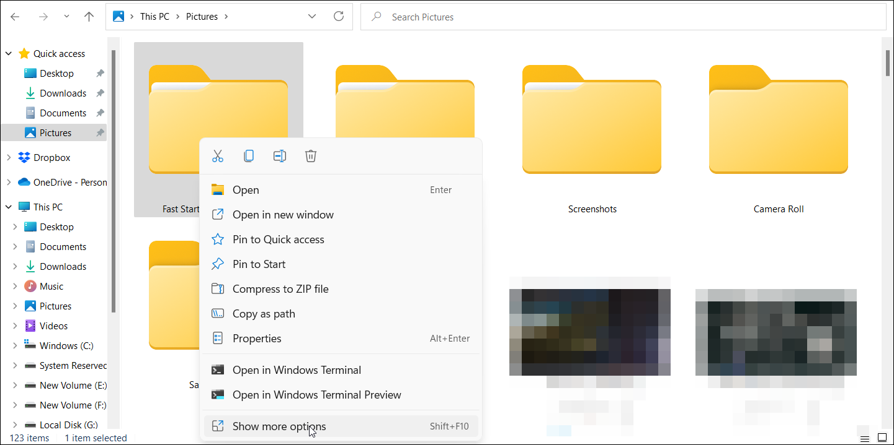 

Windows 11 comes with a new simplified right-click menu. It is less cluttered and shows only the most frequently used options.

However, the classic context menu is still part of Windows 11. To access it, right-click in **File Explorer** and select the **Show more options** to open a spill-over menu. You can also use the **Shift + F10** keyboard shortcut to access this option.

4\. Customize Snap Windows
--------------------------

 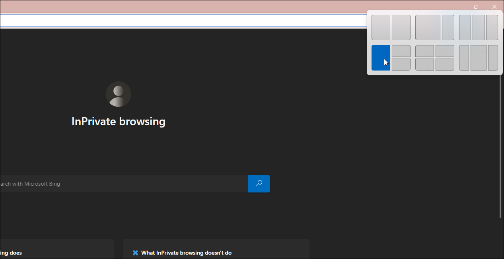 

With the new Snap windows feature, you can automatically resize and arrange windows on your screen. If you are used to the **Win + Arrow** shortcut in Windows 10, the new iteration takes it a step further. Though, the shortcuts are still effective.

To snap windows in Windows 11, hover your mouse over the **Maximize/Resize** button, and you will see a snapping template. Choose your preferred template for the active window and then continue to snap other windows accordingly.

5\. Where’s the Task Manager?
-----------------------------

 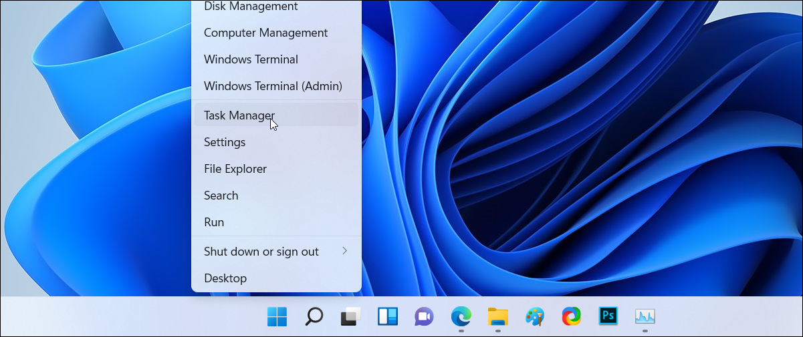 

In Windows 10, you can access the Task Manager directly from the Taskbar. However, that has changed in Windows 11. While there are [various ways to access the Task Manager in Windows 11](https://www.makeuseof.com/how-to-access-task-manager-on-windows-11/), an easy way to do it is from the Start menu.

To open the Task Manager, right-click on **Start** or press **Win + X** and select it from the **WinX** menu that appears.

 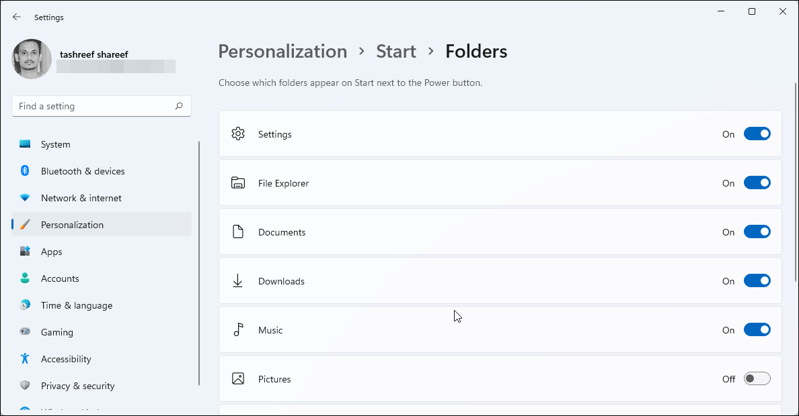 

Windows 11 no longer allows you to pin folders to the Start Menu. Instead, you can add system folders including File Explorer, Settings, Documents, Downloads, Music, Pictures, Videos, and the Personal folder to Start.

To pin folders to your Start menu:

1.  Press **Win + I** to open **Settings**.
2.  Click on the **Personalization** tab in the left pane.
3.  Next, click on **Start** and then on **Folders**.
4.  Here, you can choose which folders appear on **Start** next to the **Power** button. To add, toggle the switch for each folder and set it to **On.**

 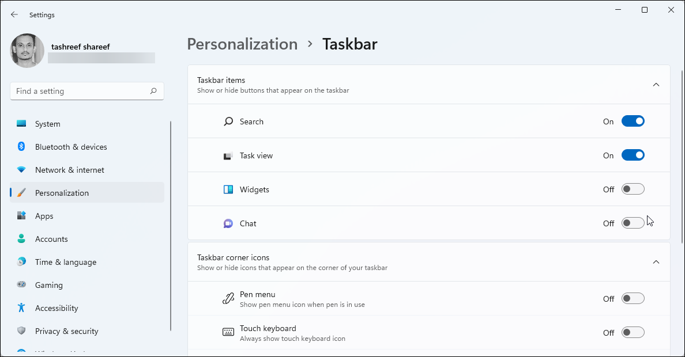 

By default, the new Taskbar features the Widget and Chat (Microsoft Team) app. The widget app allows you to check information related to weather, sports, nearby traffic, Windows apps tips, calendars, and more at a glance. However, if you would rather have more taskbar space, you can turn it off in the settings.

To Hide Widget and Microsoft Team app:

1.  Open the **Settings** panel using the **Win + I.**
2.  Then go to **Personalization** and open **Taskbar**.
3.  Under **Taskbar items**, toggle the switch for **Widgets** and **Chat** and set it to **Off**.

8\. Customize the Quick Settings Panel
--------------------------------------

 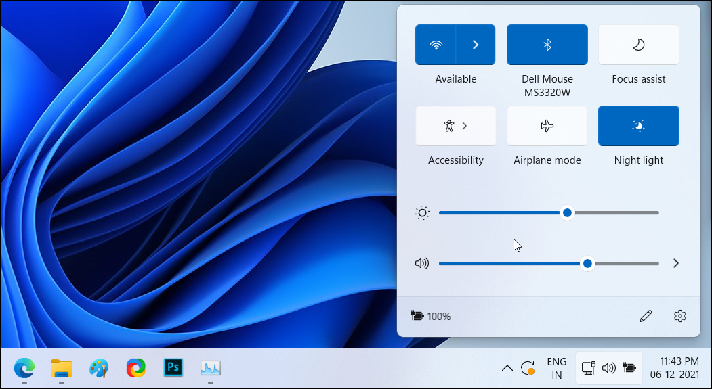 

Microsoft has broken down the classic Action Center into two separate pop-ups in Windows 11. Click on the **Time and Date** area to bring up the Notification panel and the Calendar.

Click on the **Network, Speaker, and Battery** icon to access the Settings panel. It consists of your brightness and volume controls, connectivity options, and other accessibility features.

Click the **Pencil (Edit quick setting)** icon to add more features. Next, click on **Add** and then select the feature to add. Unpin a feature to remove it from the panel.

9\. Manage Open Apps From the Desktop
-------------------------------------

 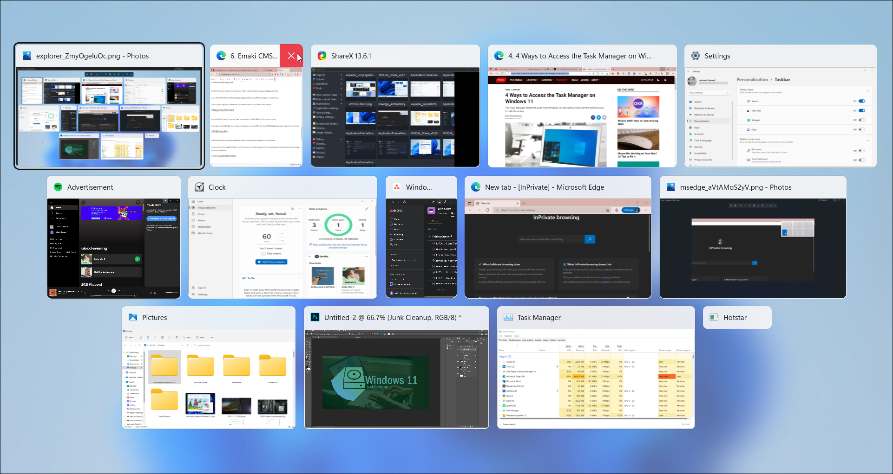 

If you work with multiple apps simultaneously, switching between the apps can be cumbersome. You can use the **Ctrl + Tab** shortcut to switch between apps easily.

To manage apps, press and hold the **Ctrl + Tab** key to view all the open apps. To switch between apps, use the **Arrow** or **Tab** key. You can also use the **Ctrl + Tab** keyboard shortcut to jump between apps in the most recently used order.

10\. Title Bar Windows Shake
----------------------------

 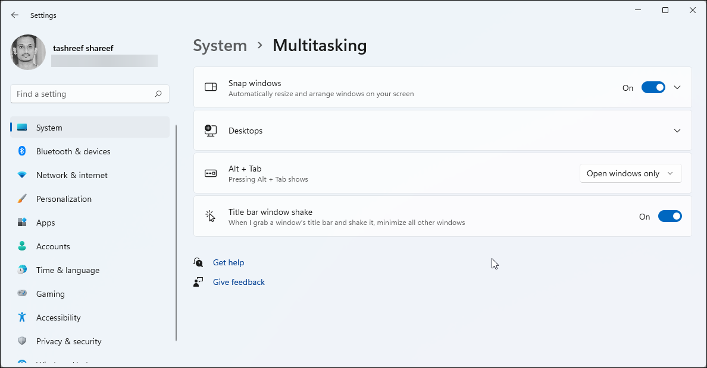 

Windows 11 has another cool trick up its sleeves called "title bar window shake." When enabled, it allows you to minimize all the open windows except for your active window with a shake.

To enable Title bar windows shake:

1.  Go to **Settings > System > Multitasking.**
2.  Next, toggle the switch for **Title bar window shake** and set it to **On**.
3.  To test it, press and hold the title bar for any open window and shake it a little to minimize all but one window. Shake it again a little to restore the minimized windows.

11\. Use Focus Assist to Minimize Distractions
----------------------------------------------

 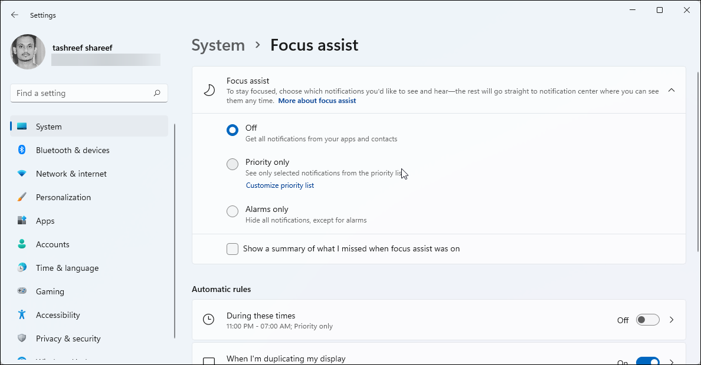 

Windows 11 has borrowed a few useful features from its predecessor and has made it easier to use. Focus Assist, introduced in Windows 10, helps you minimize distraction and increase productivity by muting less important notifications during work hours.

To [enable Focus Assist](https://www.makeuseof.com/windows-11-focus-assist-minimize-distractions/), go to **Settings > System > Focus Assist**. Next, select **Priority only** to see a few select notifications or **Alarms only** to hide all notifications except for alarms.

You can also set automatic rules to start Focus Assist during set hours and while doing specific activities.

12\. Use Focus Session to Increase Productivity
-----------------------------------------------

 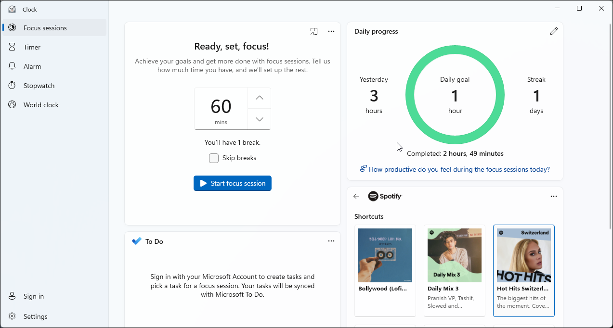 

Windows 11’s new clock app features a Focus Sessions tab. This tool is a handy productivity-focused feature that can help you build healthy digital habits, set daily goals, and challenge yourself. When you open the Focus Session tab, you will see a focus timer, your daily progress report, and the options to sync your Spotify playlist and Microsoft To-Do account.

To start your Focus session:

1.  Press **Win + S** to open the Search bar.
2.  Type **clock** and open the app from the search list.
3.  In the **Clock** app, open the **Focus session** tab.
4.  Next, set your daily goal to study or work in hours. Focus Session will automatically include a few five-minute breaks every 30 minutes.
5.  Click the **Start focus** session button and start working until the reminder pop-up asks you to take a few minutes off.

13\. Enable Dark Mode and Night Light
-------------------------------------

 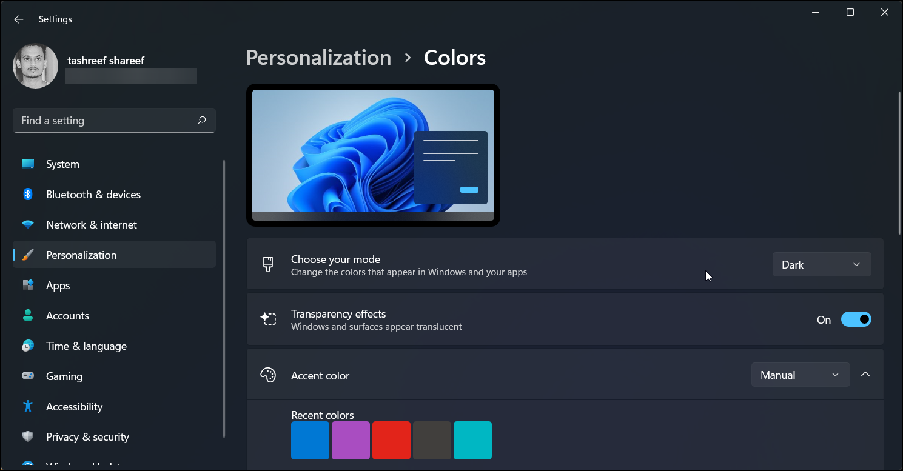 

Another handy feature coming over from Windows 10 is the ability to choose different display modes for the user interface. You can select from Dark, Light, and Custom color mode to change the colors that appear in Windows and your apps.

To enable Dark Mode in Windows 11, go to **Settings > System > Personalization > Colors**. Then, click the drop-down for **Choose your mode** and select **Dark**.

If you often work till late at night, you can use the Night Light feature in Windows 11. When enabled, it acts as a blue light filter by switching to warm colors. You can access **Night Light** under **Settings > System > Display.**

Tweak, Customize and Be Productive with These Windows 11 Tips and Tricks
------------------------------------------------------------------------

Whether you are a power user or trying to get familiar with Windows 11, these tips and tricks will help you adjust to the changes in the new OS.

While some tricks are just a carry-over from Windows 10, the new version comes with its own set of nifty features to further enhance the experience.