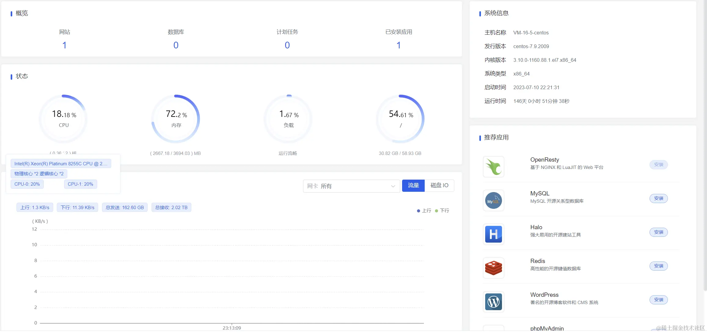

# Tomcat 配合虚拟线程
Java 21 在今年早些时候的 9 月 19 日就正式发布，并开始正式引入虚拟线程，但是作为 Java 开发生态中老大哥 Spring 并没有立即跟进，而是在等待了两个月后的 11 月 29 日，伴随着 Spring Boot 3.2 版本的发布，在这个版本中也终于是引入了对虚拟线程的支持。

虚拟线程的引入标志着 Java 在现代编程世界中对编写高吞吐量、高并发应用程序提供了更加完美的支持。

本文我就带着大家一起深入了解一波 Tomcat 配合虚拟线程会带来怎样的效果以及虚拟线程对以后使用 Java 开发高吞吐量、高并发应用程序时所带来的改变。

本文大纲如下，

Tomcat 使用虚拟线程
-------------

### 启用虚拟线程

在 Spring Boot 3.2 中，使用 Tomcat 作为 web 容器时，启用虚拟线程只需要将 `spring.threads.virtual.enabled` 属性设置为 true。

这样 Spinrg Boot 在启动 Tomcat 容器时会使用一个虚拟线程执行器来代表原有的平台线程池。

> 注意这里是虚拟线程执行器，不是虚拟线程池哦。

### 源码解析

在 Spring Boot 3.2 版本以前，Tomcat 默认的线程池使用的就是 Java 提供的 ThreadPoolExecutor 线程池，在 3.2 版本以后，Spring Boot 修改了创建线程池的方法如下所以，

可以看到 Tomcat 会先判断是否启用了虚拟线程，启用了的话就直接创建一个虚拟线程执行器 `VirtualThreadExecutor`。

`VirtualThreadExecutor` 类是 Tomcat 为了使用虚拟线程作为执行器而新增的。他的内部代码中针对每个请求任务都是依赖 `Jre21Compat` 类处理的。

`Jre21Compat` 类则是 Tomcat 为了兼容 Java21 版本虚拟线程新增的一个兼容类。这个类利用反射方法来调用 `Thread.ofVirtual().start(() -> {})` 方法，以便进行任务处理，代码截图如下，

虽然以上代码可以启用 Tomcat 的虚拟线程支持。但是在 Spring Boot 中其实不是这样设置的。还记得上文提到的在 Spring Boot 3.2 中，使用 Tomcat 作为 web 容器时，启用虚拟线程只需要将 `spring.threads.virtual.enabled` 属性设置为 true 吗？

Spring Boot 3.2 中是通过 `tomcatVirtualThreadsProtocolHandlerCustomizer` 方法来兼容虚拟线程启用逻辑的，`@ConditionalOnThreading(Threading.VIRTUAL)` 条件用判断 `spring.threads.virtual.enabled` 属性是否启用。代码如下，

到这里其实本文所需要讲的涉及源码的部分就全部讲完了。可以看到 Tomcat 引入虚拟线程并不复杂，引入后不在需要维护线程池，减轻了执行器的复杂度。

### 虚拟线程带来的改变

不知道大家注意到源码中一个改变没有，就是在 Spring Boot 3.2 中，启用了虚拟线程后，Tomcat 默认使用的虚拟线程执行器不在需要池化。

也就是说，在 Spring Boot 3.2 以后的版本里，我们不在需要设置 `server.tomcat.threads.max` 以及 `server.tomcat.threads.min-spare` 两个属性以控制 Tomcat 线程池的大小了，因为它压根没有使用平台线程池。

对于 Tomcat 来说，引入虚拟线程，不必在为线程池的维护而费心，还能减轻编程的复杂度。

虚拟线程由 JVM 平台负责进行调度，它是廉价且轻量级的，Tomcat 可以使用 “每个请求一个线程” 模型，而不必担心实际需要多少个线程。

就算请求任务在虚拟线程中调用阻塞 I/O 操作，导致运行时虚拟线程被挂起阻塞，但是只要挂起结束后该虚拟线程就可以恢复。

使用了虚拟线程后，程序员使用普通的阻塞 API，也可以让程序对硬件的利用达到近乎完美水平，以此提供高水平的并发性，从而实现高吞吐量。

可以说，虚拟线程的引入，以后程序员就算是使用 Java 中阻塞 API 也可以开发出高性能、高吞吐量的应用程序。

jmter 实测
--------

在本文中，我还将给各位展示一波 newbeepro 项目升级到 Spring Boot 3.2 后启用虚拟线程所带来的性能提升。

### 测试服务器

*   主机名称 VM-16-5-centos
*   发行版本 centos-7.9.2009
*   内核版本 3.10.0-1160.88.1.el7.x86_64
*   系统类型 x86_64
*   系统配置：2 核 4 G 5M 带宽

### 测试项目

newbee-mall-pro 是 newbee-mall 商城的 pro 版本实现了推荐算法、商品秒杀、优惠卷使用，滑块验证码，支付宝支付，中文分词检索等高级功能。

> 项目地址：[github.com/wayn111/new…](https://link.juejin.cn/?target=https%3A%2F%2Fgithub.com%2Fwayn111%2Fnewbee-mall-pro "https://github.com/wayn111/newbee-mall-pro")

### 测试方法

使用 newbee-mall-pro 作为测试项目将启用虚拟线程以及未启用虚拟线程的两次设置部署到测试服务器上。

启动容器：amazoncorretto:21.0.1

启动参数：`java -jar -Xms1024m -Xmx1024m /opt/newbeemall/newbee-mall.jar`

部署后测试地址：[http://62.234.206.94/newbeemall/index](https://link.juejin.cn/?target=http%3A%2F%2F62.234.206.94%2Fnewbeemall%2Findex "http://62.234.206.94/newbeemall/index")

测试接口为秒杀接口：/newbeemall/seckill/2/c81e728d9d4c2f636f067f89cc14862c/executionFour

压测设置：启用 2000 个线程，每个线程循环执行 30 秒左右。一共测试五轮，先预热 JVM 后，取吞吐量最大值。

### 测试数据

#### 启用虚拟线程

压测结果如下，

可以看到 CPU 占用达到百分之 142，内存占用达到百分之 35 的情况下，压测吞吐量最大可以达到 1731。

#### 不启用虚拟线程

考虑到有 2000 个线程进行压测，所以将 Tomcat 线程池的最大线程数也设置到 2000，如下图，

压测结果如下，

可以看到 CPU 占用达到百分之 170，内存占用达到百分之 35 的情况下，压测吞吐量可以达到 1492。

* * *

OK，到这里我们可以看到在 Spring Boot 3.2 版本中，使用了虚拟线程的 Tomcat 对比不用虚拟线程时，吞吐量提升差不多有 20%。

在更高并发的测试中，这个差距会越来越明显。因为 Tomcat 使用的平台线程过多时，上下文切换开销会越来越大，而且虚拟线程比平台线程占用更少的内存，一个虚拟线程只占用几 kb 到几十 kb 内存。可以轻松创建上万虚拟线程，降低资源占用同时提高并发。

最后聊两句
-----

虚拟线程带给了现代程序员新的编程体验，使用阻塞编程也能开发出高性能应用程序，而避免了异步模型的编程复杂度，随着更多的框架接入虚拟线程，相信虚拟线程会在未来大放异彩。
