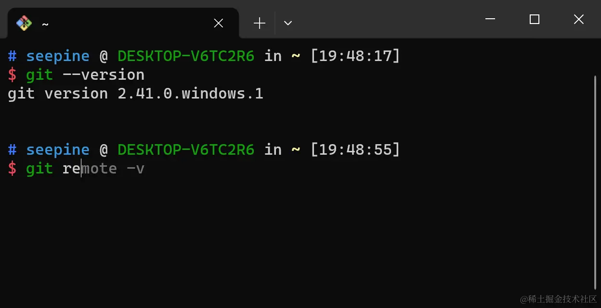
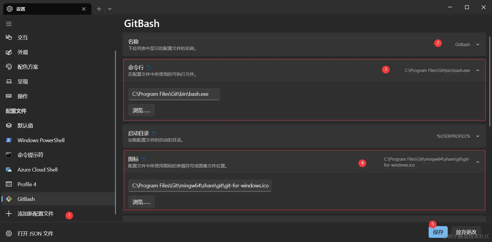

# Windows 通过 Git Bash 配置 Oh My Zsh
> 在 Unix 环境中，Oh-My-Zsh 能极大提高终端易用性，并提供高度之定义功能，本文讲解 Windows 下通过 Git Bash 配置 OhMyZsh，实现让终端如在 Unix 环境下般便捷易用。



一、安装 Git Bash
-------------

在 Git 官网下载安装包默认下一步即可，建议全默认安装即可，不需要做任何修改包括安装路径。 [git-scm.com/downloads](https://link.juejin.cn/?target=https%3A%2F%2Fgit-scm.com%2Fdownloads "https://git-scm.com/downloads")

二、安装 zsh
--------

### 1\. 下载 zsh

*   方式一，下载 zsh-5.9-2-x86_64zip
    
    > 此 zip 是我基于 zsh-5.9-2-x86_64 解压 zst 后再压缩为 zip，方便大家在 windows 环境下直接使用
    
    [zsh-5.9-2-x86_64.pkg.zip](https://link.juejin.cn/?target=https%3A%2F%2Fseepine.com%2Fgit%2Foh-my-zsh%2Fzsh-5.9-2-x86_64.pkg.zip "https://seepine.com/git/oh-my-zsh/zsh-5.9-2-x86_64.pkg.zip")
    
*   方式二，官网下载最新版
    
    > 此方式下载的文件为 zst 类型，还需要安装对应解压软件
    
    zsh 最新版下载地址：
    
    [packages.msys2.org/package/zsh…](https://link.juejin.cn/?target=https%3A%2F%2Fpackages.msys2.org%2Fpackage%2Fzsh%3Frepo%3Dmsys%26variant%3Dx86_64 "https://packages.msys2.org/package/zsh?repo=msys&variant=x86_64")
    
    zst 解压软件下载地址： [peazip.github.io/](https://link.juejin.cn/?target=https%3A%2F%2Fpeazip.github.io%2F "https://peazip.github.io/")
    

### 2.安装 zsh

解压 zsh 包后有两个目录

*   zsh-5.x-x-x86_64.pkg
    *   etc
    *   usr

将 `etc` 和 `usr` 复制到 Git 安装目录，即 `C:\Program Files\Git` ，此目录原本也有 `etc` 和 `usr`，复制时若提示文件冲突，选择覆盖即可。

### 3.设置 zsh 为默认终端

打开 Git Bash 终端，添加以下配置 `vi ~/.bashrc`

```shell
if [ -t 1 ]; then
  exec zsh
fi

```

三、安装 Oh-My-Zsh
--------------

> 若网络环境良好，可直接一键安装 `sh -c "$(curl -fsSL https://raw.githubusercontent.com/ohmyzsh/ohmyzsh/master/tools/install.sh)"`

### 1.下载 install.sh

```sh
curl -

```

### 2.修改安装源

编辑安装脚本 `vi install.sh` 将以下配置

```sh
REPO=${REPO:-ohmyzsh/ohmyzsh}
REMOTE=${REMOTE:-https://github.com/${REPO}.git}
BRANCH=${BRANCH:-master}

```

更改为国内加速源，即仓库地址前添加 `https://ghproxy.com/`

```sh
REPO=${REPO:-ohmyzsh/ohmyzsh}
REMOTE=${REMOTE:-https://ghproxy.com/https://github.com/${REPO}.git}
BRANCH=${BRANCH:-master}

```

### 3.执行安装脚本

```null
sh install.sh

```

四、配置 Oh-My-Zsh
--------------

> 所有配置即编辑 `~/.zshrc` 文件即可

### 1.配置主题

更改为ys，其他主题及效果可查看官网 [OhMyZsh Themes](https://link.juejin.cn/?target=https%3A%2F%2Fgithub.com%2Fohmyzsh%2Fohmyzsh%2Fwiki%2FThemes "https://github.com/ohmyzsh/ohmyzsh/wiki/Themes")

```ini
ZSH_THEME="ys"

```

### 2.下载常用插件

> 若网络不稳定，可在所有 Git 仓库前添加 `https://ghproxy.com/`

*   zsh-syntax-highlighting 语法高亮
    
    ```sh
    git clone https://github.com/zsh-users/zsh-syntax-highlighting.git ${ZSH_CUSTOM:-~/.oh-my-zsh/custom}/plugins/zsh-syntax-highlighting
    
    ```
    
*   zsh-autosuggestions 自动补全
    
    ```sh
    git clone https://github.com/zsh-users/zsh-autosuggestions ${ZSH_CUSTOM:-~/.oh-my-zsh/custom}/plugins/zsh-autosuggestions
    
    ```
    

### 3.配置插件

```ini

plugins=(git zsh-syntax-highlighting zsh-autosuggestions)

```

### 4.使配置生效

```sh
source ~/.zshrc

```

五、配置 Windows Terminal
---------------------

> Windows Terminal 是一个新式主机应用程序，相较于 Cmd 或 Windows Power，可自定义程度更大，支持多页签等，更加便捷易用。

> 因此可配置 Windows Terminal 默认打开即为 Git Bash

### 1.安装

自行下载即可，可以商店直接安装，也可以看微软官网安装文档，甚至 Windows11 貌似已经自带

[learn.microsoft.com/zh-cn/windo…](https://link.juejin.cn/?target=https%3A%2F%2Flearn.microsoft.com%2Fzh-cn%2Fwindows%2Fterminal%2Finstall "https://learn.microsoft.com/zh-cn/windows/terminal/install")

### 2.配置



六、配置IDEA、VsCode或其他IDE软件
-----------------------

自行在对应软件设置中配置默认终端为 Git Bash 即可
