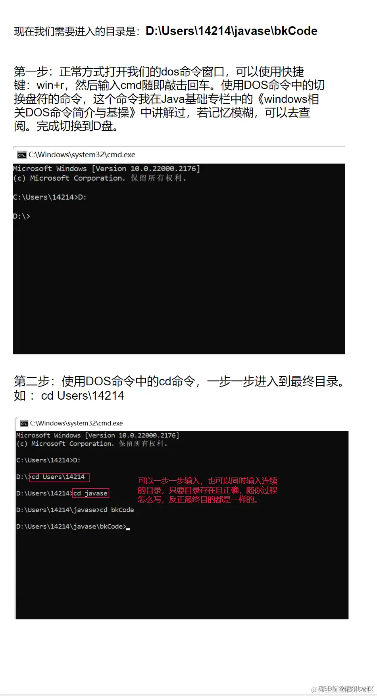

# javac 命令-详解 
javac命令—详解
---------------------------------------------

* * *

> 同学们好呀！今天继续和德尔继续接下来的《Java基础》的学习吧！通过《Java基础》的专栏中上一篇《第一个Java程序helloworld代码的编写》文章，我们已经轻松实现写出一个Java程序，那我们现在需要讨论的东西是什么？
> 
> 正所谓：“**知其然，也要知其所以然**”。我们知道如何编写第一个Java程序的代码，我们也要知道编写之后，当我我们编译这个Java程序的时候会发生什么！接下来就是讨论"javac命令"知识点。

* * *

#### 文章目录

*   [javac命令—详解](#javac_0 "#javac_0")
*   *   [一、为什么要学javac命令](#javac_8 "#javac_8")
    *   [二、javac命令怎么用？](#javac_26 "#javac_26")
    *   *   [1.1、Java源文件](#11Java_34 "#11Java_34")
        *   [1.2、Java源文件的路径](#12Java_38 "#12Java_38")
        *   *   [1.2.1、绝对路径](#121_43 "#121_43")
            *   *   [定义](#_45 "#_45")
                *   [实操](#_49 "#_49")
                *   *   [方式一：](#_53 "#_53")
                    *   [方式二:](#_57 "#_57")
                    *   [方式三：](#_61 "#_61")
                    *   [方式四：](#_65 "#_65")
                *   [示意图](#_71 "#_71")
            *   [1.2.2、相对路径](#122_79 "#122_79")
            *   *   [定义](#_81 "#_81")
                *   [实操](#_85 "#_85")
                *   [示意图](#_89 "#_89")
        *   [1.3、编译Java源文件](#13Java_96 "#13Java_96")
        *   *   [使用工具：](#_103 "#_103")
            *   [使用地点：](#_107 "#_107")
            *   [实操步骤：](#_119 "#_119")
            *   [示意图：](#_126 "#_126")
            *   [概述：](#_132 "#_132")
    *   [三、总结](#_140 "#_140")

### [](https://link.juejin.cn/?target=)一、为什么要学javac命令

javac是Java编译器的命令行工具，它用于将Java源代码文件（.java）编译成Java字节码文件（.class）。在Java中，代码需要先编译成字节码，然后由Java虚拟机（JVM）解释执行。

原因：

1.  **编译源代码**：javac命令可以将编写的Java源代码转换成可执行的字节码文件。这是Java程序运行的第一步。
2.  **发现代码错误**：编译器可以帮助我们检查代码中的语法错误、类型错误和逻辑错误等，使我们能够及早发现和修复问题。
3.  **构建项目**：在大型Java项目中，通常有多个源代码文件需要编译，javac命令可以帮助我们一次性编译整个项目。
4.  **跨平台兼容性**：通过编译成字节码，Java程序可以在不同平台上运行，因为字节码是与操作系统无关的。
5.  **性能优化**：编译过程中，javac命令可以对代码进行优化，生成更高效的字节码，提高程序的性能。

* * *

### [](https://link.juejin.cn/?target=)二、javac命令怎么用？

**背会语法：** 

```null
Javac  Java源文件的路径

```

#### [](https://link.juejin.cn/?target=)1.1、Java源文件

Java源文件是以".java"结尾，其中写了Java源代码的文件。

#### [](https://link.juejin.cn/?target=)1.2、Java源文件的路径

路径永远是包括“绝对路径”和“相对路径”的。我们要编译一个Java源文件的话，首先就是要先进入我们要编译的Java源文件所在的目录下，而进入Java源文件的目录下就有两种方式，可以直接通过Java源文件的绝对路径直接进入，也可以通过相对路径一步一步进入。以下都是针对“**A.java**”这个Java源文件来演示所有的具体的操作。

* * *

##### [](https://link.juejin.cn/?target=)1.2.1、绝对路径

###### [](https://link.juejin.cn/?target=)定义

绝对路径是从文件系统的根目录开始完整描述文件或目录的路径，包含了完整的路径信息，可以唯一确定一个文件或目录的位置。例如：`D:\Users\14214\javase\bkCode\A.java`。

###### [](https://link.juejin.cn/?target=)实操

我们打开notepad++编辑器之后，写好我们的A.java源文件之后，记得保存（可以使用快捷键ctrl+s快速保存）。

###### [](https://link.juejin.cn/?target=)方式一：

保存之后，接着去文件中找到我们编写的A.java 文件在哪个目录下，然后我们鼠标停留在A.java 文件并点击鼠标右键复制文件地址（这里有个快捷进入A.java 文件目录下的快捷方式就是直接在notepad++编辑器界面点击左上角的“文件”——>“打开所在文件夹”——>“文件管理器”，然后就可以复制A.java 文件的地址（这里复制的就是绝对路径）

###### [](https://link.juejin.cn/?target=)方式二:

直接在notepad++编辑器界面坐上角点击“文件”——>“文件所在文件夹”——>“命令行”。这样就可以直接通过Java源文件的绝对路径进入了DOS命令窗口。

###### [](https://link.juejin.cn/?target=)方式三：

保存之后，接着去文件中找到我们编写的A.java 文件在哪个目录下，然后我们找到页面上方的地址栏，然后点击输入“cmd”后敲回车，这样就可以直接通过Java源文件的绝对路径进入了DOS命令窗口。

###### [](https://link.juejin.cn/?target=)方式四：

保存Java源文件之后，我们找到我们编写的A.java文件的目录下，打开DOS命令窗口，输入javac，打一个空格，然后直接把A.java 文件拖到DOS命令窗口，然后敲击回车，则完成了编译的工作。（这个方式可能需要看了下面内容之后再使用）

* * *

###### [](https://link.juejin.cn/?target=)示意图

*   前三种进入通过绝对路径进入Java源文件方式示意图


* * *

##### [](https://link.juejin.cn/?target=)1.2.2、相对路径

###### [](https://link.juejin.cn/?target=)定义

相对路径是相对于当前工作目录或另一个参考路径的路径，不包含完整的路径信息，而是描述文件或目录与参考路径之间的相对位置关系。相对路径更简洁，适用于描述当前工作目录下的文件或目录位置。例如：`javase\bkCode\A.java`。

###### [](https://link.juejin.cn/?target=)实操

既然相对路径是一步一步进入，那么我们现在通过相对路径的方式同样实现进入到A.java源文件存在的目录当中。这时我们就需要使用到DOS命令当中的“cd命令”即（change directory改变目录）。使用cd命令一步一步进入到最终目录。

###### [](https://link.juejin.cn/?target=)示意图



* * *

#### [](https://link.juejin.cn/?target=)1.3、编译Java源文件

*   通过上述方式之后，我们就可以进行编译Java源文件了，程序员需要再硬盘的某个位置准备一个.java 扩展名的文件，这个文件就被称为Java源文件，Java源文件当中编写的是Java源代码，而这个源程序是不能随意编写的，必须符合Java语法。
*   Java程序员需要使用JDK中自带的javac.exe命令进行Java程序的编写

* * *

##### [](https://link.juejin.cn/?target=)使用工具：

javac.exe（JDK中自带，在bin目录下）

##### [](https://link.juejin.cn/?target=)使用地点：

Javac（Java编译器工具）子啊哪里使用？在DOS命令窗口中使用，刚刚我们以及完成了DOS命令窗口的一系列准备了。

使用规则：

```null
java  源文件路径（绝对路径/相对路径）

```

* * *

##### [](https://link.juejin.cn/?target=)实操步骤：

1.  打开DOS命令窗口
2.  进入Java文件所在目录（上述的任何方式都可以）
3.  输入 java A.java
4.  同目录下生成A.class 字节码文件，则表示编译成功

##### [](https://link.juejin.cn/?target=)示意图：


* * *

##### [](https://link.juejin.cn/?target=)概述：

*   一个Java源程序可以通过javac命令之后，生成多个字节码文件，且删除Java源文件不影响生成的class文件。但是尽量不要去删除，因为我们后面可能会对Java源文件进行修改等操作然后编译生成新的class字节码文件。
*   编译结束之后，我们还可以在其他操作平台解释并运行我们的class字节码文件，这也是Java程序设计语言跨平台性的体现。
*   编译结束之后会在我们同目录下生成一个A.class 字节码文件。

* * *

### [](https://link.juejin.cn/?target=)三、总结

> 当我们编写Java程序时，我们实际上是在创建Java源代码文件（.java文件），其中包含了Java程序的源代码。然而，这些源代码并不能直接运行，而是需要经过编译的过程，将它们转换成可以被Java虚拟机（JVM）理解和执行的字节码文件（.class文件）。
> 
> 这个编译过程是由Java编译器命令`javac`来完成的。`javac`是Java编译器的命令行工具，它属于JDK（Java Development Kit）中的一部分。通过`javac`命令，我们可以将Java源代码文件编译成对应的字节码文件。

下面是使用`javac`命令的步骤：

1.  **打开命令提示符或终端窗口。** 
2.  **进入存放Java源代码文件的目录。这可以通过使用`cd`命令（在Windows上）或`cd`命令（在Unix/Linux上）来实现。这一步很重要，因为`javac`命令需要知道Java源文件的路径才能编译它。** 
3.  **输入`javac 文件名.java`命令，其中“文件名”是你的Java源代码文件的名称，不包含文件扩展名。执行这个命令后，Java编译器将会对该Java源文件进行编译，并生成对应的字节码文件。如果编译成功，就会在同一目录下生成一个与Java源文件同名的`.class`文件。** 

*   通过`javac`命令编译Java源代码文件后，我们就可以运行生成的字节码文件了。使用`java`命令可以运行这些字节码文件，并在Java虚拟机上执行Java程序。
*   掌握`javac`命令对于Java开发者来说非常重要，因为它是将Java源代码转换成可执行字节码文件的关键步骤。同时，`javac`还会帮助我们检查代码中的错误，使我们能够及早发现和修复问题。

成的字节码文件了。使用`java`命令可以运行这些字节码文件，并在Java虚拟机上执行Java程序。

*   掌握`javac`命令对于Java开发者来说非常重要，因为它是将Java源代码转换成可执行字节码文件的关键步骤。同时，`javac`还会帮助我们检查代码中的错误，使我们能够及早发现和修复问题。

* * *

欢迎大家在评论积极发言！！！