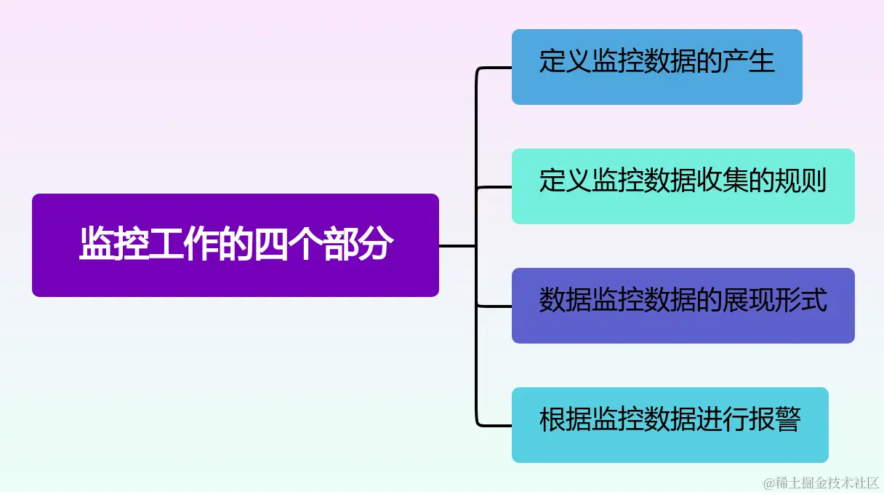
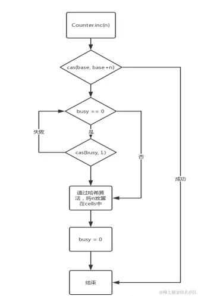

# 【深度挖掘Java性能调优】「底层技术原理体系」深入探索Java服务器性能监控Metrics框架的实现原理分析（Counter篇) 
对于后台服务而言，除了保证每个功能的正常工作，我们还需要了解服务的运行情况，包括机器的物理性能（例如线程数、文件句柄数、内存占用大小、GC时间等）以及业务性能（例如关键流程通过率、QPS以及响应时间等）。目前，常用的做法是通过定义、收集和展示一系列指标（metrics）来完成对后台服务的监控。

监控工作可以分为四个部分
------------

根据以下这四个部分，我们能够完成对后台服务的监控工作，从而能够及时了解和处理服务的运行情况，优化性能，提供更好的用户体验，并确保服务的可靠性和稳定性。 

*   **定义监控数据的产生**：我们需要明确定义要监控的数据，包括哪些指标和数据需要收集和监控，以满足监控需求。这可以包括硬件资源利用率、服务的核心性能指标、业务处理的成功率等。
    
*   **定义监控数据收集的规则**：我们需要定义如何收集和存储监控数据。这可能涉及到在代码中嵌入采集指标的逻辑，使用监控代理或导入外部监控系统等方式。关键是确定监控数据的数据源，以及数据如何采集、存储和处理。
    
*   **数据监控数据的展现形式**：需要将收集到的监控数据进行可视化展示，以便更好地理解和分析。这可以包括创建仪表盘、图表、报表或使用专业的监控系统来呈现监控数据，让监控数据更易于理解和分析。
    
*   **根据监控数据进行报警**：根据监控数据设置报警规则，以便在出现异常情况时及时提醒相关人员。这可以通过阈值设置、异常模式识别或使用专业的报警系统来实现。及时的报警能够帮助快速响应和解决问题，确保服务的稳定性和可靠性。
    

接下来将逐步介绍如何在Java服务中接入监控服务，我们将从监控数据的产生开始。在本文中，我们将主要基于当前流行的度量框架 `codahale.metrics` 来进行介绍。

通过引入此依赖项，您可以使用 `codahale.metrics` 框架中提供的各种功能和特性进行应用程序的度量和监控。

```xml
<dependencies>
    <dependency>
        <groupId>com.codahale.metrics</groupId>
        <artifactId>metrics-core</artifactId>
        <version>x.y.z</version>
    </dependency>
</dependencies>

```

在接下来我们将指导您如何使用 `codahale.metrics` 库来定义和收集监控数据，展示和分析指标，并根据数据设置报警规则等。`codahale.metrics` 提供了丰富的功能和灵活的API，可以轻松地与您的Java服务集成，帮助您监控和优化服务的性能、可靠性和稳定性。

Metrics中的基础数据类型
---------------

在谈论监控数据的产生时，我们首先需要了解监控库中最常用的三种数据类型，它们分别是：计数器（Counter）、量规（Gauge）和直方图（Histogram）。几乎所有的 Java 监控库都包含了这三种数据类型的实现。

### 计数器（Counter）

计数器用于记录一个累加值，它表示一个增加或减少的计数。可以通过 `inc()` 方法增加计数器的值，也可以通过 `dec()` 方法减少计数器的值。计数器可以用于统计请求次数、错误次数等离散的事件计数。

列举的三种需求场景，可以使用 `com.codahale.metrics`（或其他类似的监控库）中的不同数据类型来实现。

#### 统计 API 访问中异常（1000/1500）的次数

使用计数器（Counter）来实现。在每次 API 请求中，当发生异常（如 400 或 500 错误）时，通过 `inc()` 方法将计数器值增加1。

```java
Counter apiErrorCounter = metricRegistry.counter("api.error.counter");

apiErrorCounter.inc();

```

#### 统计 API 的调用量

使用计数器（Counter）来实现。在每次 API 请求时，通过 `inc()` 方法增加计数器的值。

```java
Counter apiCallCounter = metricRegistry.counter("api.call.counter");

apiCallCounter.inc();

```

#### 统计特定事件发生的次数

使用计数器（Counter）来记录特定事件发生的次数。在事件发生时，通过 `inc()` 方法将计数器值增加1。

```java
Counter eventCounter = metricRegistry.counter("event.counter");

eventCounter.inc();

```

以上示例展示了如何使用计数器来统计异常次数、API 调用量和特定事件发生的次数。可以根据具体需求给计数器命名并使用相应的记录代码。通过监控库提供的方法，可以简单快速地进行数据统计和监控，从而更好地了解和管理应用程序的行为。

#### Counter的底层原理

> Counter 的底层实现主要通过（基础 (`Base`) 计数器）和（单元 (`Cell`) 数组）来保证自增的原子性和性能。

在 `com.codahale.metrics.Counter` 的源码中，每个 Counter 对象由两部分组成，这是一种称为 "Striped64" 的机制，它是针对高并发情况下的性能优化。

##### 基础 (`Base`) 计数器

`Base` 计数器是一个 `volatile long` 类型的字段，用于存储计数器的初始值及其当前值。它用于低并发情况下对计数进行快速的自增和获取操作。

##### 单元 (`Cell`) 数组

`Cell` 是 `volatile long` 类型的数组，每个单元内部维护一个计数器的增量值。为了处理高并发情况下的并发访问，`Cell` 数组采用了分段锁（`CAS` 操作）的方式，将计数器的自增操作分散到多个单元上。每个线程独占一个单元，当多个线程访问不同的单元时，它们之间不会发生竞争，可以保证并发访问时的性能。

###### 简单的源码案例

通过这些策略和机制的组合，Counter 在具有竞争的情况下保持了较高的性能，同时也考虑了内存消耗的控制，使得其在高并发场景下能够有效地进行计数操作。

```java
public class Counter {
	transient volatile int busy;
	transient volatile long base;
	transient volatile Cell[] cells;
	public void inc(long n) {
		long b;
		if(cells == null || !casBase(b=base, b+n)) {
			
		}
	}
	public long sum() {
		long sum = base;
		Cell[] as = cells;
		if (as != null) {
			int n = as.length;
		for (int i = 0; i < n; ++i) {
			Cell a = as[i];
			if (a != null)
				sum += a.value;
		}
	}	
		return sum;
	}
}

```

基本的执行流程图： 

##### Counter分析总结

Counter 的底层实现使用了基础（Base）和单元（Cell）来存储计数值。在高并发情况下，线程会针对不同的 `Cell` 进行自增操作，从而避免了竞争，减少了资源争用。而在低并发情况下，通过直接对 `Base` 进行自增操作，避免了锁的开销，提高了性能，也保证了 Counter 的高性能和并发性能。 
 这种基于 `Base` 和 `Cell` 的实现方式能够平衡高并发和低并发情况下的性能需求，确保了 `Counter` 的自增操作的原子性和并发性能。

###### 从CPU和内存角度去分析资源开销

对于有竞争的情况，Counter 使用自旋锁来进行同步，这意味着线程会在一个忙等待的循环中等待竞争解决。这种自旋锁的方式避免了线程上下文切换的开销，并且消耗的 CPU 时间较少，从而提高了性能。

为了避免过多使用内存，当单元数组的数量超过 CPU 核心数时，Counter 将不再扩展单元数组的大小，而是保持不变。这样可以避免过多的内存消耗，并具有更好的性能。