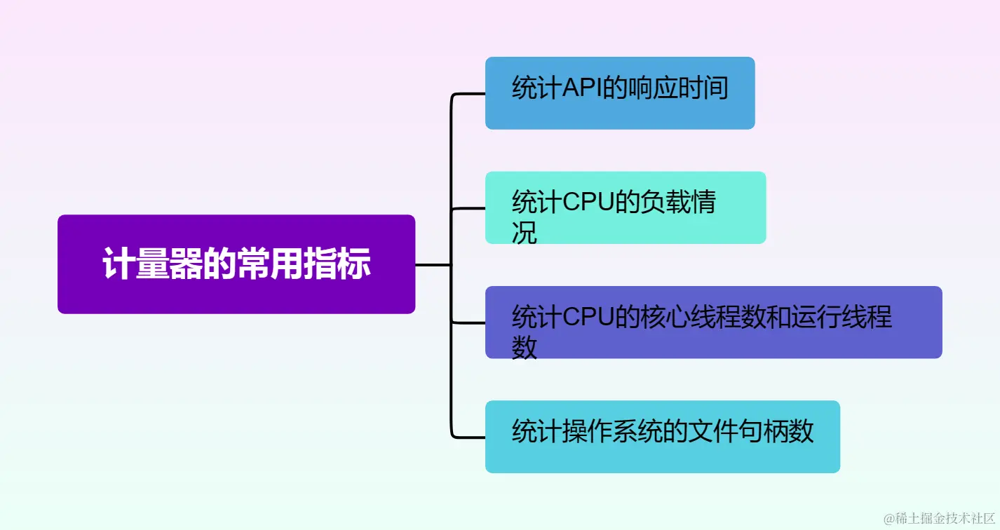
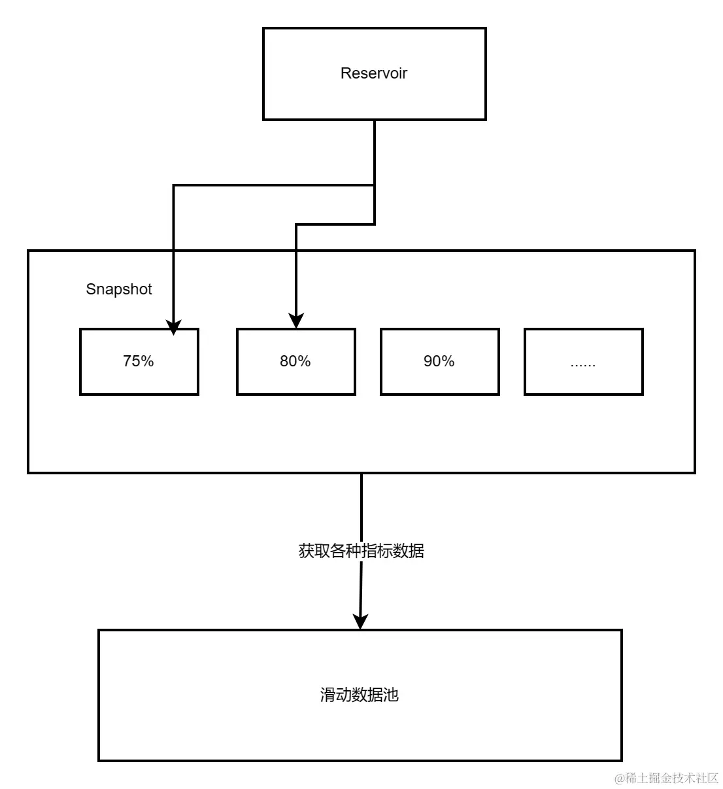
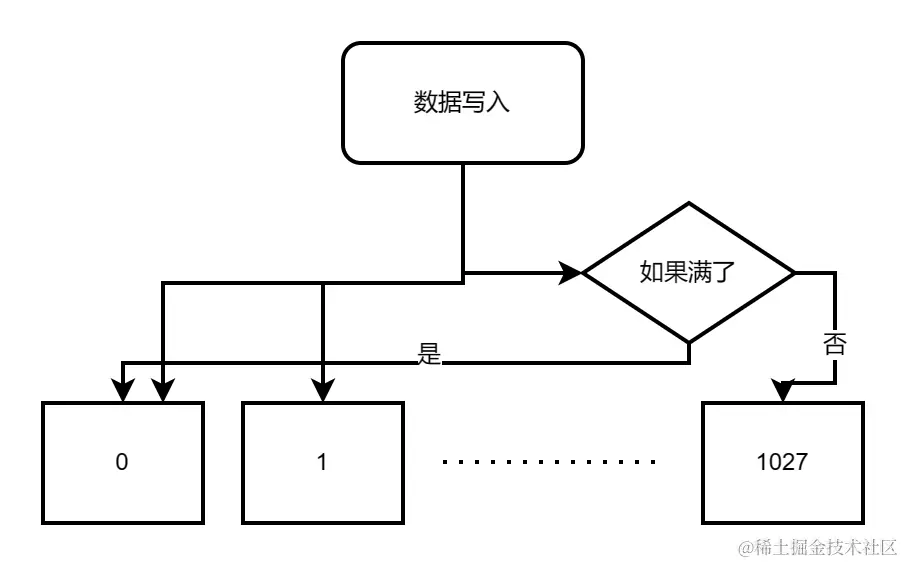

# 【深度挖掘Java性能调优】「底层技术原理体系」深入探索Java服务器性能监控Metrics框架的实现原理分析（Gauge和Histogram篇)
承接上文
----

承接上文中的【深度挖掘Java性能调优】「底层技术原理体系」深入探索Java服务器性能监控Metrics框架的实现原理分析（Counter篇)，我们知道和了解了对应的Counter计数器的作用和实现原理，接下来我们需要进行分析和了解计量器（Gauge）和直方图（Histogram）

计量器（Gauge）
----------

计量器（Gauge）是度量和收集指标数据的重要工具之一，是一种用于表示任意可变值的指标。它可以是数字、字符串或其他类型的数据。通过调用已注册的回调方法或读取已注册的变量，计量器能够获取当前值。计量器适用于需要动态监测具体数值或状态的指标，例如，内存使用情况、CPU使用情况等。

> 使用计量器可以帮助开发人员监测和优化应用程序的性能和资源消耗。通过监测指标的变化，可以及时做出调整和改进，提高应用程序的效率和稳定性。

与Counter一样，计量器也是一个数字类型的指标，但和计数器不同的是，它主要用于收集指标的瞬时值，因此它是可变的。它的常用用法如下所示：



*   使用Gauge进行记录以统计API的响应时间，因为响应时间是可变的，可能会有高低波动。
*   统计CPU的负载，可以了解系统的负荷情况。
*   统计CPU的核心线程数和运行线程数，以了解系统中正在运行的线程数量。
*   统计操作系统的文件句柄数，以监控文件资源的使用情况。

### 与Counter的对比分析

相对于Counter来说，因为Gauge记录的只是一个瞬时值，因此也不用考虑多线程下的竞争与冲突问题。下面是一个简单的案例代码：

```java
private final static class SimpleGauge {
        private volatile double value;
        private SimpleGauge(double value) {
            this.value = value;
        }
        public Double getValue() {
            return this.value;
        }
        public void setValue(double value) {
            this.value = value;
        }
}

```

直方图（Histogram）
--------------

当我们不仅仅关注计数（Counter），或者是瞬时变量（Gauge），而是需要知道最大值，最小值，中位数，平均值以及第99%的值时，我们就需要用到直方图（Histogram）这个统计类型了。

### 主要作用

Histogram主要的用途是表示分布情况，直方图用于测量和统计数据分布的情况。它会记录值的分布和频率，并提供一些统计计算，如最大值、最小值、平均值、标准差等。直方图适合用于衡量数据集的中心趋势和离散程度，比如响应时间的分布。

#### 数据统计难点分析

为了准确统计一个API的99%响应时间，我们不能简单地记录所有响应时间并进行排序。由于API在不断被调用，新的响应时间会不断产生，因此这个方法无法得到准确的99%响应时间。

#### 源码原理分析

为了解决这个问题，可以使用`Reservoir`类来收集响应时间等数据。`Reservoir`实质上是一个数据池，用于保存数据，在进行统计时，可以获取快照 (`Snapshot`) 来获取统计数据。

##### Reservoir类

`Reservoir`类是在`codehale`库中被使用的，这个类基于蓄水池抽样算法，它可以在固定的容量下持续保留最近的数据样本。每当有新的响应时间数据到来时，`Reservoir`会根据一定的概率选择保留该数据样本，以保持总体的分布情况。在需要进行统计时，可以基于`Reservoir`的快照来获取相应的统计数据，例如获取平均响应时间、99%响应时间等。

使用`Reservoir`类能够实现高效地统计数据，而不需要记录和排序所有数据，同时能够保持近似的分布情况，为后续的数据分析提供准确可靠的结果。



了解了基本原理之后，我们来看一下histogram的源码。

```java
public class Histogram implements Metric, Sampling, Counting {
    private final Reservoir reservoir;
    private final LongAdder count;
    public Histogram(Reservoir reservoir) {
        this.reservoir = reservoir;
        this.count = new LongAdder();
    }
    
    public void update(int value) {
        update((long) value);
    }
    public void update(long value) {
        count.increment();
        reservoir.update(value);
    }
    @Override
    public long getCount() {
        return count.sum();
    }

    
    @Override
    public Snapshot getSnapshot() {
        return reservoir.getSnapshot();
    }
}

```

再来看看Snapshot的代码。

```java
public class Snapshot {
    
    public double getValue(double quantile);
    private final long[] values;
    public double getMedian() {
        return getValue(0.5);
    }
    public double get75thPercentile() {
        return getValue(0.75);
    }
    
        省略部分getNthPercentile函数
    */
    public long getMax();
    public double getMean();
    public long getMin();
    
    ...
    */ 
}

```

从Snapshot中，我们就基本能够得到我们想要的统计数据了。

来简单地了解一下数据池。定义了数据池以后，我们就需要考虑更多的问题了，比如说，如何保证可以高性能地将数据写入数据池中，以及如何保证数据池中数据量不会过大而占用过多的内存，以及如何快速地取出快照。在Codahale metrics里面，主要定义了三种数据池。

UniformReservoir 默认保存1028条记录，每次进行update操作的时候，首先会依次地将值填入1028条记录中，当记录满了之后，就会使用随机替换0 - 1027中的一条。因为是随机替换，所以也不需要进行加锁和解锁。



```markdown
- SlidingWindowReservoir **固定大小的数据池**，从0到n-1填入数据，不断循环。也不会进行加锁和解锁。
- SlidingTimeWindowReservoir **非固定大小的数据池**，但是只会存储过去N秒的数据。使用ConcurrentSkipListMap进行存储。
- ExponentiallyDecayingReservoir **固定大小的数据池**。首先会逐个数据填满数据池，随后会将老的数据替换为新的数据，使用ConcurrentSkipListMap进行存储。可以说是SlidingWindowReservoir与SlidingTimeWindowReservoir的结合。

```

> 当然还有其他的有效的方法是使用基于概率算法的数据结构，例如，特定数据结构，如TDigest算法，来实时估计99%的响应时间。这些方法基于近似统计的原理，通过维护一个固定容量的滑动窗口或一个特定的数据结构来跟踪最近一段时间的响应时间分布。

* * *

以上介绍的计数器、量规和直方图是监控数据中常用且基础的数据类型。它们提供了一些基本的功能和计算，让我们能够更好地理解和监控应用程序的关键指标和数据。

在使用 Java 监控库时，我们可以依据具体需求使用这些数据类型，并利用其提供的方法和功能来收集、记录和分析监控数据。这些数据类型的使用有助于帮助我们了解应用程序的状态、性能和行为，进而进行优化和改进。

服务器性能监控的要点和讨论
-------------

1.  我们需要收集的是瞬时值、计数还是统计分布值？
2.  在进行数据记录时，如何保证高性能的写入/更新？（尽可能减少锁的使用）同时如何确保数据的更新是合理的？
3.  如何将指标数据汇总到一个地方以便于后续处理？