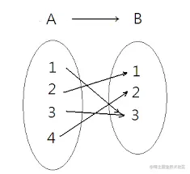
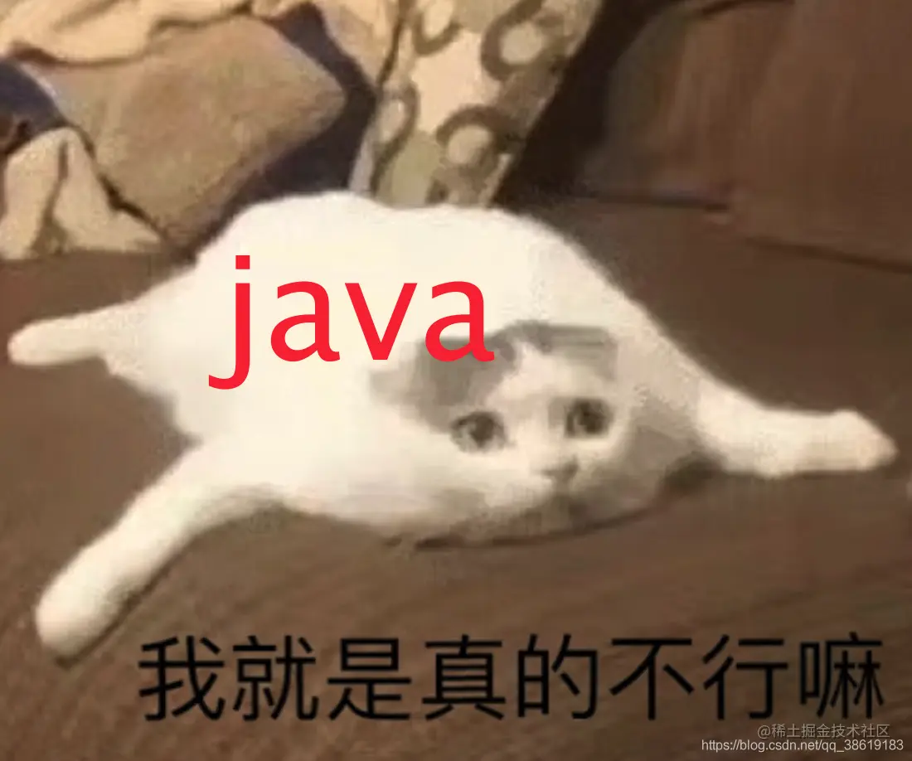

# 一文带你深入了解java和函数式编程
函数不同于OOP中的方法，可以理解成数学中的`函数`，是一种将输入集与输出集关联的表达式。和命令式编程不同，函数式编程只取决于它的输入，不依赖于函数外状态。 

> [编程范式的分类](https://link.juejin.cn/?target=https%3A%2F%2Fwww.baeldung.com%2Fjava-functional-programming "https://www.baeldung.com/java-functional-programming"): 编程范式可以分为命令式和声明式。
> 
> 1.  命令式将程序定义为一系列语句。通过语句改变程序的状态，最终达到最终的状态，面向状态编程。OOP是命令式范式的扩展。
> 2.  声明式范式专注于“程序要实现什么”，而不是“程序如何实现”，面向行为编程。函数式编程是声明式编程的子集。

Haskell是纯函数式语言，入门曲线高，使用范围小。当今大多数流行语言都是支持多种编程方式的，例如java、Scala、Kotlin。以下结合java举例。

函数是一等值
------

如果一种编程语言将函数视为一等公民，那么它就被称为具有一等函数。这意味着函数支持其他一等值都具有的操作: 赋值给变量、作为参数传递、动态生成、作为其他函数返回值返回等。

```java
static <T> Function<T, T> compose(Supplier<T> supplier, Function<T, T> map) { 
     return data -> map.apply(supplier.get()); 
 }

```

高阶函数
----

将函数看做一等值，等价于语言中`值`的存在，就很自然的想能不能写一个函数，实现一些传入函数，返回一个函数? 这就是高阶函数。上文的示例其实就是一个高阶函数。

高阶函数也叫复合函数。在java中通常通过函数式接口的`default`方法来实现的。例如`Function`的`java.util.function.Function#compose`和`java.util.function.Function#andThen`。当然也可以自己实现函数的复合。

```java
default <V> Function<V, R> compose(Function<? super V, ? extends T> before) {
    return (V v) -> apply(before.apply(v));
}

```

在java中，Stream的使用(Optional不是)近似于高阶函数，如下代码所示。

```java
@Test
public void test_Stream() {
    Stream<Integer> stream = Stream.of(1).map(i -> {
        System.out.println(i);
        return 1;
    });
    
}

```

纯函数
---

纯函数是没有状态的、无副作用的。可以简单的认为: `你搞几次都是没有关系的~`


这和OOP冲突。面向对象鼓励我们将对象的状态隐藏，只公开访问和修改对象的必要方法。甚至，将数据存储到数据库中，对于纯函数而言也是“有副作用”的。更有甚者，连打日志都认为是一种副作用。

在实际生产中，我们要有自己的界限与衡量标准，==不是“纯”的就一定是好的、是先进的==。

此外，纯函数通常认为是不应该抛出任何异常的。

不可变性
----

不变性是函数式编程的核心原则之一。例如Clojure，默认上变量是不可变的，如果你要改变变量，你需要把变量copy出去修改。这对于并行程序来说，bug会大大减少。java中可以通过final来实现。

不可变的数据结构所有字段都是不可变的，其嵌套数据结构也要满足不可变性。除构造函数外应该没有其他的`set`方法。

Referential Transparency 透明引用
-----------------------------

> 函数的返回值只依赖于其输入值，这种特性就称为引用透明性（referential transparency）

如果将表达式替换为其相应的值对程序的行为没有影响，那么我们称之为引用透明。这需要函数是`纯粹的`、`不可变的`。它产生了一个与上下文无关的代码块，可以在任意地方、以任意顺序执行。这提供了许多优化的可能性。

尾递归优化
-----

迭代调用发生在函数的最后。因此不需要没深入调用一层就新建一个栈。

需要编译器支持，目前java还不支持，Scala和Groovy都已经支持了。本质上就是通过重用栈的方式来优化递归的性能损耗。 

Monads
------

> 一个自函子范畴上的幺半群。

这个解释太费脑了，摘自阮一峰的[解释](https://link.juejin.cn/?target=http%3A%2F%2Fwww.ruanyifeng.com%2Fblog%2F2015%2F07%2Fmonad.html "http://www.ruanyifeng.com/blog/2015/07/monad.html")更容易理解些: Monad就是一种设计模式，表示将一个运算过程，通过函数拆解成互相连接的多个步骤。 再简单点理解: 利用map、reduce、predict等方式的流式编程。

在java中，Monads可以具象成Optional、Stream、CompletableFuture等。比如Optional 可以包装一个值并应用一系列转换，例如使用 `flatMap`添加另一个包装值的转换。

Currying 科里
-----------

> 在传递函数时，该函数是携带参数进行传递的。

局部套用是一种数学技巧，它将一个接受多个参数的函数转换成一个接受单个参数的函数序列。在这种技术中，可以不需要调用一个函数的所有参数。

以下举一个例子说明:

```java

Function<Double, Function<Double, Double>> weight = mass -> (gravity -> mass * gravity);

Double, Double> weightOnEarth = weight.apply(9.81);
logger.log(Level.INFO, "在地球上我的体重为" + weightOnEarth.apply(60.0));

Function<Double, Double> weightOnMars = weight.apply(3.75);
logger.log(Level.INFO, "在火星上我的体重为: " + weightOnMars.apply(60.0));

```

如果不用`Currying`，可能在计算重力时还要再传入一个`mass`参数。

Currying 依赖于语言来提供两个基本特性: lambda 表达式和闭包。

和其他语言不同，java8中的闭包要求lambda表达式中的变量必须是final修饰的或实际上是final的，这是出于线程安全的考虑。

更高效的支持并发
--------

函数式编程要求，只使用表达式，不使用语句。也就是说，每一步都是单纯的运算，而且都有返回值。根据前文中的“纯函数”定义和“透明引用”的定义，可以知道任意执行顺序时是不会影响最终的结果。

因此，在并发环境下，函数式编程编写安全、高性能的代码更为容易。

代码简洁、复用度高
---------

函数式编程大量使用函数，减少了代码的重复，因此程序比较短，开发速度较快。

设计良好的函数式编程不会

代码易于测试、易于管理
-----------

设计良好的函数式编程不依赖于外界状态、输入输出保持一致，这很利于“单元测试”的进行。

java8提供了lambda表达式、方法引用、预定义函数接口来适配函数式编程。

java将lambda表达式看做函数式接口的对象实例，但这在设计层面上就已经满足`一等值`的概念了。

函数式接口
-----

jdk已经提供了一系列的函数式接口([Package java.util.function](https://link.juejin.cn/?target=https%3A%2F%2Fdocs.oracle.com%2Fjavase%2F8%2Fdocs%2Fapi%2Fjava%2Futil%2Ffunction%2Fpackage-summary.html "https://docs.oracle.com/javase/8/docs/api/java/util/function/package-summary.html"))了，例如Consumer、Supplier、Function、Predicate以及其他的出于拆箱装箱性能损耗的DoubleConsumer、IntPredicate，和基于多参数的BiConsumer等。

如果`function`包下的接口还不能满足你的需求，可以配合桑除虫`@FunctionalInterface`声明自己的函数式接口。对于函数式接口而言，`@FunctionalInterface`其实是可加可不加的，它的作用是在编译时看看你的`函数式接口`是否只有一个实例方法。

因为在java中，是通过实例化函数式接口的方式(常基于lambda表达式)来进行函数式支持的。

```java

@FunctionalInterface
interface consumeInt {
    void consume(int i);
}

consumeInt consumeInt = i -> System.out.println(i);

```

lambda表达式
---------

[lambda](https://link.juejin.cn/?target=https%3A%2F%2Fwww.runoob.com%2Fjava%2Fjava8-lambda-expressions.html "https://www.runoob.com/java/java8-lambda-expressions.html")表达式的语法很简单:

```java
(parameters) -> expression 
或
(parameters) ->{ statements; } 

```

lambda表达式会自动推断参数的类型。一般来说是依赖于函数式接口指定的参数类型，但配合java范型的使用使lambda表达式拥有更为丰富的表达能力:

```java
Function<String, String> function = str -> 
    new StringBuilder(str).append("-").append(str.length()).toString();

Function<String, String> function = (String str)->...

```

方法引用
----

[参考文章](https://link.juejin.cn/?target=https%3A%2F%2Fblog.csdn.net%2Fqq_38619183%2Farticle%2Fdetails%2F111994154 "https://blog.csdn.net/qq_38619183/article/details/111994154")

方法引用可以分为四类: 指向静态方法的、指向lambda表达式中变量的实例方法的、指向外部对象的实例方法的、构造函数的。

在java中方法的声明包括6个方面:修饰符、返回值、方法名、方法参数、异常列表、方法体。使用方法引用时:

1.  修饰符要复合条件(访问不到的方法自然方法引用也不可用)
2.  确保方法签名的匹配( 方法签名包含返回值和方法参数)
3.  确保异常列表的兼容。(要求被引用的方法比需要的方法异常列表更小)

```java
public class FunctionRefSt {
  	
    public static int length(String str) {
        return str.length();
    }
		
    public int lengthIns(String str) {
        return str.length();
    }
		
    @Test
    public void funcRef() {
        Optional<String> opt = Optional.of("hello world");
        
        
        opt.map(FunctionRefSt::length).ifPresent(System.out::println);
        
        opt.map(String::length).ifPresent(System.out::println);
        
        FunctionRefSt functionRefSt = new FunctionRefSt();
        opt.map(functionRefSt::lengthIns).ifPresent(System.out::println);

        
        
				System.out.println(Optional.<List>ofNullable(null).orElseGet(ArrayList::new).size());
	      
    }
}

```

模式匹配
----

`模式匹配`可以简单的理解成`增强switch`表达式。java8目前还不支持模式匹配，其switch能支持的匹配类型还是比较少的: `枚举、String、byte、short、int、char以及一些基本类型的包装类`。在java12之后，switch表达式进行了一番的优化，[jdk13switch特性](https://link.juejin.cn/?target=https%3A%2F%2Fwww.cjavapy.com%2Farticle%2F465%2F "https://www.cjavapy.com/article/465/"):

```java

switch (type) {
    case "all" -> System.out.println("列出所有帖子");
    case "auditing" -> System.out.println("列出审核中的帖子");
    case "accepted" -> System.out.println("列出审核通过的帖子");
    case "rejected" -> System.out.println("列出审核不通过的帖子");
    default -> System.out.println("参数'type'错误，请检查");
}

String value = switch (i) {
    case  0 -> "zero"
    case  1 -> "one"
    case  2 -> "two"
    default -> "many"
};
System.out.println(value);

```

在java中函数式编程有两大核心利器: `Optional`和`Stream`。

关于Optional的更多学习链接可以看看这个文章哦: [你真的知道Optional怎么使用吗?](https://link.juejin.cn/?target=https%3A%2F%2Fblog.csdn.net%2Fqq_38619183%2Farticle%2Fdetails%2F112334433 "https://blog.csdn.net/qq_38619183/article/details/112334433")

**异常**:一般来说，函数是处理不了异常的。而且设计良好的函数是可以预计到所有的异常，并有一个合适的输出。所以对于异常情况可以定义一些特殊值来处理: 比如`Optional.empty()`。

**副作用**可以是日志、存储到DB、更新缓存、RPC调用等等，编码是绝对离不开副作用的，name怎么处理副作用呢?

一般来说，处理副作用有两种方法，但是核心都是抽取有副作用的代码和没有副作用的代码，将他们隔离开来。

他们有两个专业术语: 1\. Functor函子(在java中使用Stream、Optional来实现) 2. 将可变部分抽取出来。

最后，java8只是提供了函数式编程的一些语法糖，至于是否能用到函数式编程提供的优点，还需要满足一系列的“函数式编程要求”哦。
