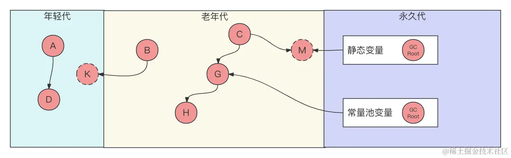

# 什么情况会发生Full GC？如何避免频繁Full GC?
Minor GC、Major GC 和 Full GC区别？
------------------------------



Minor GC、Major GC和Full GC是垃圾回收中的三个重要概念，它们描述了垃圾回收的不同阶段和范围：

1.  **Minor GC（新生代GC）：** 
    *   Minor GC主要关注清理年轻代（Young Generation）的内存区域。
    *   年轻代通常分为三个部分：Eden区和两个Survivor区（通常是S0和S1）。
    *   在Minor GC过程中，首先会进行Eden区的垃圾回收，存活的对象将会被移动到其中一个Survivor区。之后，再清理Eden区和另一个Survivor区。这个过程会使得年轻代中的对象晋升到老年代（Old Generation）。
    *   Minor GC通常发生频繁，但它的停顿时间相对较短。
2.  **Major GC（老年代GC）：** 
    *   Major GC主要关注清理老年代的内存区域。
    *   触发Major GC的条件包括老年代空间不足，永久代（在Java 8及之前的版本）或Metaspace空间不足等。
    *   Major GC的执行可能伴随较长的停顿时间，因为它需要整理老年代的内存，移动对象以减少碎片化。
3.  **Full GC（完全GC）：** 
    *   Full GC是对整个堆内存（包括年轻代、老年代、永久代或Metaspace等）进行清理的一种垃圾回收操作，它是Major GC的一种特殊情况。
    *   触发Full GC的条件可能包括老年代空间不足、永久代/Metaspace空间不足、显式调用`System.gc()`等。
    *   Full GC的执行会导致相对较长的停顿时间，因为它需要对整个堆内存进行回收。

总的来说，Minor GC主要处理年轻代的垃圾回收，Major GC关注老年代的垃圾回收，而Full GC是对整个堆内存的完全清理。像我们常说的Serial Old、PS Old、CMS等老年代的垃圾回收器，都是只回收的老年代区域即Major GC，而当一些特殊情况发生的时候。如：CMS并发清理的时候出现“并发分配错误”，会触发对所有堆空间进行回收的Full GC，而采用的算法则是Serial Young+Serial Old。所以说，Full GC和Major GC是两种不同的概念，如何区分还需要观察运行时堆空间回收的区域是怎么样的。

什么是Full GC？
-----------

Full GC（Full Garbage Collection）是Java虚拟机中进行垃圾回收的一种操作，它的目标是清理整个Java堆内存，包括年轻代（Young Generation）、年老代（Old Generation或Tenured Generation）、以及永久代（在Java 8及之前的版本中，而在Java 8及之后的版本中由Metaspace取代，所以这里可以理解为元空间Metaspace）。

与部分垃圾回收（Partial Garbage Collection）不同，Full GC的特点是它会停止应用程序的所有线程，包括用户线程和垃圾回收线程，以确保整个堆内存的清理工作得以完成。这种停顿时间相对较长，可能对应用程序的性能产生一些影响。

Full GC是一种较为重量级的垃圾回收操作，因为它需要停止应用程序的所有线程，对整个堆内存进行清理。在实际的应用程序中，需要谨慎处理Full GC的情况，尽量避免频繁发生，以维持较好的应用性能。常见的Full GC的算法是Serial Young+Serial Old，当算法运行的时候会暂停所有工作线程。

什么情况下会发生Minor GC？
-----------------

Minor GC（或称为Young GC）通常在年轻代（Young Generation）垃圾回收时发生。年轻代是堆内存的一部分，用于存放新创建的对象。Minor GC发生的情况包括：

1.  **Eden区满：**  Eden区是年轻代中的一个区域，用于存放新创建的对象。当Eden区满时，触发Minor GC。在Minor GC中，Eden区中的存活对象将被移动到Survivor区，而不再需要的对象将被清理。
2.  **Survivor区空间不足：**  在两个Survivor区（通常称为S0和S1）之间进行对象的复制。当一个Survivor区满时，或者在对象晋升到老年代之前，可能触发Minor GC。在Minor GC中，存活的对象将被移动到另一个Survivor区，或者直接晋升到老年代。

Minor GC是一种相对轻量级的垃圾回收操作，通常会比较频繁地发生。其主要目标是清理年轻代中的垃圾，而不涉及老年代的清理。由于年轻代中的对象生命周期较短，Minor GC的停顿时间通常较短，对应用程序的影响比较小。

什么情况下会触发Major GC？
-----------------

Major GC主要负责清理老年代（Tenured区）的内存空间，用于回收老年代中的对象。通常，触发Major GC的条件是老年代空间不足，这可能由存活对象晋升、一次Minor GC的结果或其他原因引起。但是，除了CMS收集器之外的其他收集器通常不会单独执行针对老年代的垃圾回收行为。

触发Major GC通常涉及至少一次Minor GC。Minor GC主要负责清理年轻代的内存空间，通常会在Eden区满或对象晋升到老年代时触发。在Minor GC执行后，如果老年代仍然没有足够的空间容纳存活的对象，就可能触发Major GC。

综上所述，Major GC是在老年代满时触发的，通常需要至少经历一次Minor GC。除了CMS收集器之外，其他收集器通常不会单独执行对老年代的垃圾回收。

什么情况下会发生Full GC？
----------------

Full GC（Garbage Collection）是Java虚拟机中进行垃圾回收的一种类型，它会清理整个堆内存，包括新生代和老年代。Full GC通常发生在以下情况下：

1.  **老年代空间不足：**  当老年代无法容纳新生代晋升过来的对象时，可能触发Major GC。这通常发生在年轻代的Minor GC后，存活的对象被移动到老年代，导致老年代的空间不足。
2.  **永久代空间不足：**  在Java 7及之前的版本中，常量池等信息存放在永久代中。如果常量池或类的元数据占用的空间过大，可能导致永久代空间不足，触发Full GC。在Java 8及之后的版本中，永久代被元空间（Metaspace）取代。
3.  **使用CMS（Concurrent Mark-Sweep）垃圾回收器时的并发失败：**  CMS是一种以减少应用程序停顿时间为目标的垃圾回收器，但它可能会因为一些原因（比如老年代空间不足）而导致并发失败，从而触发Full GC。
4.  **System.gc()的显式调用：**  调用`System.gc()`或`Runtime.getRuntime().gc()`并不能确保会立即进行垃圾回收，但它可能会触发Full GC。
5.  **永久代/Metaspace溢出：**  如果Metaspace（Java 8及以后的版本）或永久代（Java 7及之前的版本）中的元数据信息溢出，可能触发Full GC。
6.  **分配担保失败：**  在进行Minor GC时，虚拟机会检查老年代的剩余空间是否大于新生代的对象总大小。如果不大于，会尝试进行一次Full GC。这是为了确保在新生代GC后，存活的对象能够顺利晋升到老年代。
7.  **G1垃圾回收器的一些特殊情况：**  G1垃圾回收器在一些特殊情况下可能触发Full GC，例如在进行Mixed GC（混合收集）时，或者由于空间不足而放弃Mixed GC，转而执行Full GC。

Full GC是一种比较重量级的垃圾回收操作，会导致较长的停顿时间，因此在实际应用中，需要谨慎处理Full GC的情况，尽量避免频繁发生。

如何避免频繁Full GC？
--------------

频繁的Full GC对应用程序的性能和响应时间都可能产生负面影响，因此优化垃圾回收以避免频繁的Full GC是很重要的。以下是一些可能有助于减少Full GC 频率的建议：

1.  **调整堆内存大小：**  如果堆内存设置得太小，容易导致频繁的垃圾回收，特别是Full GC。增大堆内存可以减少垃圾回收的频率。可以通过 `-Xms` 和 `-Xmx` 参数分别设置初始堆大小和最大堆大小。

```bash
java -Xms512m -Xmx1024m -jar YourApplication.jar

```

2.  **合理设置新生代和老年代的比例：**  年轻代存活对象晋升到老年代时会触发Full GC，合理设置新生代和老年代的比例可以影响对象晋升的速度。可以通过 `-XX:NewRatio` 参数来调整新生代和老年代的比例。

```bash
java -XX:NewRatio=2 -jar YourApplication.jar

```

3.  **选择合适的垃圾回收器：**  根据应用程序的特性选择合适的垃圾回收器。不同的垃圾回收器有不同的特点，比如CMS（Concurrent Mark-Sweep）和G1（Garbage-First）是以减小停顿时间为目标的回收器，适用于对响应时间敏感的应用。

```bash
java -XX:+UseConcMarkSweepGC -jar YourApplication.jar

```

4.  **调整新生代的大小：**  通过调整新生代的大小，可以影响对象在年轻代的存活时间，从而影响晋升到老年代的速度。可以使用参数 `-Xmn` 来设置新生代的大小。

```bash
java -Xmn256m -jar YourApplication.jar

```

5.  **避免过度使用Finalizer：**  使用 `finalize` 方法可能导致对象在垃圾回收时的额外开销。尽量避免过度依赖 `finalize` 方法。
    
6.  **检查内存泄漏：**  内存泄漏可能导致堆内存的不断增加，最终导致Full GC。使用内存分析工具（如VisualVM、MAT等）来检查和解决潜在的内存泄漏问题。
    
7.  **监控和调优：**  定期监控应用程序的垃圾回收情况，通过日志或监控工具（如VisualVM、JConsole等）来分析GC日志，找到GC发生的原因，并根据实际情况进行调优。
    

通过综合考虑这些因素，可以有效减少Full GC的频率，提高应用程序的性能和稳定性。在优化时建议谨慎调整参数，充分测试以确保调整的效果符合预期。

总结
--

在Java垃圾回收中，Minor GC、Major GC和Full GC代表着不同阶段和范围的内存清理。Minor GC主要清理年轻代，发生频率较高，停顿时间较短；Major GC关注老年代，通常由Minor GC触发，停顿时间较长；而Full GC是一种对整个堆内存的完全清理，包括新生代、老年代以及永久代或Metaspace。Full GC的触发条件多种多样，包括老年代空间不足、永久代/Metaspace空间不足、显式调用System.gc()等。

为避免频繁的Full GC，可采取合理设置堆内存大小、新生代和老年代的比例、选择适当的垃圾回收器等策略。监控和调优也是关键，通过分析GC日志、检查内存泄漏等手段，及时发现和解决潜在问题。综合考虑这些因素，可以有效提高应用程序的性能和稳定性。在调整参数时需谨慎，充分测试以确保优化效果符合预期。