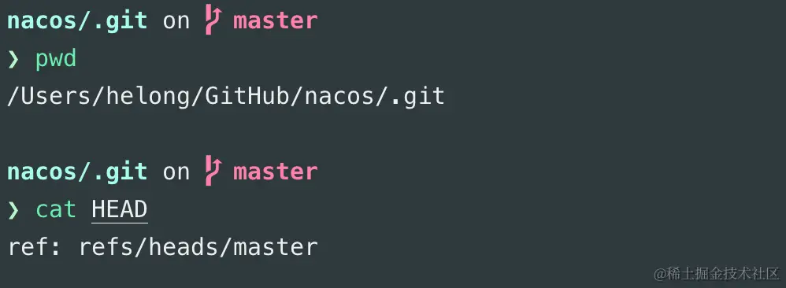

# 令人困惑的 git 术语
### HEAD and “heads”

一些人表示他们对术语 `HEAD` 和 `refs/heads/main` 感到困惑

其实 “头”就是“枝”。在 git 内部，分支存储在名为 `.git/refs/heads` 的目录中


而 `HEAD` 是当前分支。它存储在 `.git/HEAD` 中。 

**“a head 是一个分支， HEAD 是当前分支” 这绝对是 git 中最奇怪的术语之一。** 

### Your branch is up to date with ‘origin/main’

你的分支已更新为‘origin/main’ ?

此消息看起来很简单 \- 它表示你的 main 分支已与源保持同步！

但这实际上有点误导。你可能认为这意味着你的 main 分支是最新的。事实并非如此。

它实际上意味着 – 如果你上次运行 git fetch 或 git pull 是在 5 天前，那么 5 天前你的 main 分支是最新的（包含 5 天前的所有更改）

**说白了，只是上次同步过，但上一次是什么时候可不好说了，如果你没有意识到这一点，它可能会给您一种错误的安全感。** 

我认为 git 理论上可以给你一条更有用的消息，比如“截至 5 天前最后一次获取，源的 main 是最新的”

### HEAD^, HEAD~ HEAD^^, HEAD~~, HEAD^2, HEAD~2

我知道 `HEAD^` 指的是之前的提交，但我对 `HEAD~` 和 `HEAD^` 的区别困惑了很久。

我查了一下，以下是它们之间的关系：

*   `HEAD^` 和 `HEAD~` 是一样的（1 次提交前）
*   `HEAD^^^` 和 `HEAD~~~` 和 `HEAD~3` 是一样的（3 次提交前）
*   `HEAD^3` 指提交的第三个父级，与 `HEAD~3` 不同

这看起来很奇怪——为什么 `HEAD~` 和 `HEAD^` 是一样的？

“第三父级” 又是什么呢？

`^` 和 `~` 在 Git 中用于导航提交树。

*   `^` 用于访问合并提交的不同父提交
*   `~` 用于访问当前提交的祖先提交

大多数提交只有一个父提交。在 Git 中 `HEAD^` 表示“HEAD 提交的父级”。

但是如果 HEAD 是合并提交， `HEAD^` 指的是合并的第一个父级， `HEAD^2` 是第二个父级， `HEAD^3` 是第三个父级，依此类推。

> 通常，这种语法在合并提交（merge commit）时使用，其中有多个父提交。例如，一个合并提交可能有两个父提交，通过 HEAD^1 和 HEAD^2 可以访问这两个父提交。HEAD^3 就表示第三个父提交。

`HEAD~3`： 表示从 HEAD 开始往上数的第三个祖先提交。它指的是当前分支的前第三个提交，不考虑合并提交。这在查看历史记录时很有用。

### “reset”, “revert”, “restore”

很多人提到 “reset”、“revert” 和 “restore” 是非常相似的词，很难区分它们。

手册也没有提供非常有用的信息：

*   `git reset` : “重置当前 HEAD 到指定状态”
*   `git revert` ：“恢复一些现有的提交”
*   `git restore` ：“恢复工作树文件”

以下是它们各自的作用的一些简短描述：

*   `git revert COMMIT` ：在当前分支上创建一个与 COMMIT “相反”的新提交（如果 COMMIT 添加了 3 行，则新提交将删除这 3 行）
    
*   `git reset --hard COMMIT` ：强制当前分支返回到 COMMIT 时的状态，删除自 COMMIT 以来的所有新更改。非常危险的操作。
    
*   `git restore --source=COMMIT PATH` ：将 PATH 中的所有文件恢复到 COMMIT 时的状态，而不更改任何其他文件或提交历史记录。
    

### main 和 origin/main

在 Git 中，`main` 和 `origin/main` 分别表示不同的引用。

`main`： 这是本地分支的名称，通常表示你当前所在的本地分支，例如，如果你切换到主分支，那么 `main` 就代表本地主分支。

```css
git checkout main

```

这表示你正在引用本地仓库中的 `main` 分支。

`origin/main`： 这是远程仓库的引用，通常表示远程主分支。`origin` 是默认的远程仓库名称，而 `main` 则表示在该远程仓库上的主分支。

```bash
git fetch origin
git checkout origin/main

```

这表示你正在引用远程仓库 `origin` 上的 `main` 分支。请注意，你不能在 `origin/main` 上直接进行修改，因为它是只读的，你需要在本地分支上进行工作。

在典型的 Git 工作流中，你通常会从远程仓库克隆（clone）代码，本地会自动创建一个名为 `main` 的主分支，并在远程仓库上创建一个名为 `origin/main` 的引用。在进行协作开发时，你可能会通过 `git pull` 或 `git fetch` 来同步远程仓库的最新更改，这时就会涉及到本地的 main 分支和远程的 `origin/main` 引用。

### checkout

*   `git checkout BRANCH` 切换分支
*   `git checkout file.txt` 放弃对 file.txt 的更改，恢复为上一次提交（最新提交）的版本。

checkout 后面跟分支名和文件名作用是不一样的，呵呵。

`git checkout file.txt` 这条命令的效果相当于取消对 file.txt 的本地修改，将其还原为最新提交的状态。不过，git checkout 在 Git 2.23 版本之后的版本中被 git restore 和 git switch 命令替代，因此你也可以使用以下等效的命令：

```csharp
# 使用 git restore
git restore file.txt

# 或者使用 git switch
git switch --discard-changes file.txt

```