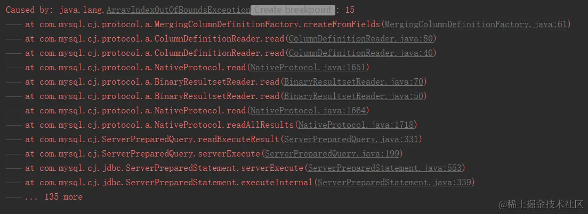

# 几条java规范

这基本也是java业界都认可的开发规范，我们团队也是以此规范为基础，在结合实际情况，补充完善。最近在团队遇到的几个问题，加深了我对这份开发规范中几个点的理解，下面就一一道来。


这条规范说明了，在异常发送记录日志时，要记录案发现场信息和异常堆栈信息，不处理要往上throws，切勿吃掉异常。  
堆栈信息比较好理解，就是把整个方法调用链打印出来，方便定位具体是哪个方法出错。而案发现场信息我认为至少要能说明：“谁发生了什么错误”。  
例如，哪个uid下单报错了，哪个订单支付失败了，原因是什么。否则满屏打印：“user error”，看到你都无从下手。

在我们这次出现的问题就是有一个feign，调用外部接口报错了，降级打印了不规范日志，导致排查问题花了很多时间。伪代码如下：

```less
	@Slf4j
	@Component
	class MyClientFallbackFactory implements FallbackFactory<MyClient> {		

		@Override
		public MyClient create(Throwable cause) {
			return new MyClient() {
				@Override
				public Result<DataInfoVo> findDataInfo(Long id) {
					log.error("findDataInfo error");
					return Result.error(SYS_ERROR);
				}
			};
		}
	}

```

发版后错误日志开始告警，打开kibana看到了满屏了：“findDataInfo error”，然后开始一顿盲查。  
因为这个接口本次并没有修改，所以猜测是目标服务出问题，上服务器curl接口，发现调用是正常的。  
接着猜测是不是熔断器有问题，熔断后没有恢复，但重启服务后，还是继续报错。开始各种排查，arthas跟踪，最后实在没办法了，还是老老实实把异常打印出来，走发版流程。

```lua
log.error("{} findDataInfo error", id, cause);

```

有了异常堆栈信息就很清晰了，原来是返回参数反序列失败了，接口提供方新增一个不兼容的参数导致反序列失败。(这点在下一个规范还会提到)  
可见日志打印不清晰给排查问题带来多大的麻烦，记住：**日志一定要打印关键信息，异常要打印堆栈。** 


上面提到的返回参数反序列化失败就是枚举造成的，原因是这个接口返回新增一个枚举值，这个枚举值原本返回给前端使用的，没想到还有其它服务也调用了它，最终在反序列化时就报错了，找不到“xxx”枚举值。  
比如如下接口，你提交一个不认得的黑色BLACK，就会报反序列错误：

```kotlin
	enum Color {
		GREEN, RED
	}

	@Data
	class Test {
		private Color color;
	}

	@PostMapping(value = "/post/info")
	public void info(@NotNull Test test) {

	}

	curl --location 'localhost/post/info' \
	--header 'Content-Type: application/json' \
	--data '{
    	"testEnum": "BLACK"
	}'

```

关于这一点我们看下作者孤尽对它的阐述：  


这就是我们出问题的场景，提供方新增了一个枚举值，而使用方没有升级，导致错误。可能有的同学说那通知使用方升级不就可以了？是的，但这出现了依赖问题，如果使用方有成百上千个，你会非常头痛。

那又为什么说不要使用枚举作为返回值，而可以作为输入参数呢？  
我的理解是：作为枚举的提供者，不得随意新增/修改内容，或者说修改前要同步到所有枚举使用者，让大家知道，否则使用者就可能因为不认识这个枚举而报错，这是不可接受的。  
但反过来，枚举提供者是可以将它作为输入参数的，如果调用者传了一个不存在的值就会报错，这是合理的，因为提供者并没有说支持这个值，调用者正常就不应该传递这个值，所以这种报错是合理的。


以下是规范里的说明：  
1）增加查询分析器解析成本。  
2）增减字段容易与 resultMap 配置不一致。  
3）无用字段增加网络消耗，尤其是 text 类型的字段。

这都很好理解，就不过多说明。  
在我们开发中，有的同学为了方便，还是使用了select *，一直以来也风平浪静，运行得好好的，直到有一天对该表加了个字段，代码没更新，报错了~，你没看错，代码没动，加个字段程序就报错了。  
报错信息如下：


数组越界！问题可以在本地稳定复现，先把程序跑起来，执行 select * 的sql，再add column给表新增一个字段，再次执行相同的sql，报错。



具体原因是我们程序使用了sharding-jdbc做分表(5.1.2版本)，它会在服务启动时，加载字段信息缓存，在查询后做字段匹配，出错就在匹配时。  
具体代码位置在：com.mysql.cj.protocol.a.MergingColumnDefinitionFactory#createFromFields


这个缓存是跟数据库链接相关的，只有链接失效时，才会重新加载。主要有两个参数和它相关：  
spring.shardingsphere.datasource.master.idle-timeout 默认10min  
spring.shardingsphere.datasource.master.max-lifetime 默认30min

默认缓存时间都比较长，你只能赶紧重启服务解决，而如果服务数量非常多，又是一个生产事故。  
我在sharding sphere github搜了一圈，没有好的处理方案，相关链接如：  
[github.com/apache/shar…](https://link.juejin.cn/?target=https%3A%2F%2Fgithub.com%2Fapache%2Fshardingsphere%2Fissues%2F21728 "https://github.com/apache/shardingsphere/issues/21728")  
[github.com/apache/shar…](https://link.juejin.cn/?target=https%3A%2F%2Fgithub.com%2Fapache%2Fshardingsphere%2Fissues%2F22824 "https://github.com/apache/shardingsphere/issues/22824")

大体意思是如果真想这么做，数据库ddl需要通过sharding proxy，它会负责刷新客户端的缓存，但我们使用的是sharding jdbc模式，那只能老老实实遵循规范，不要select * 了。如果select具体字段，那新增的字段也不会被select出来，和缓存的就能对应上。  
