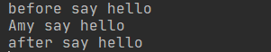
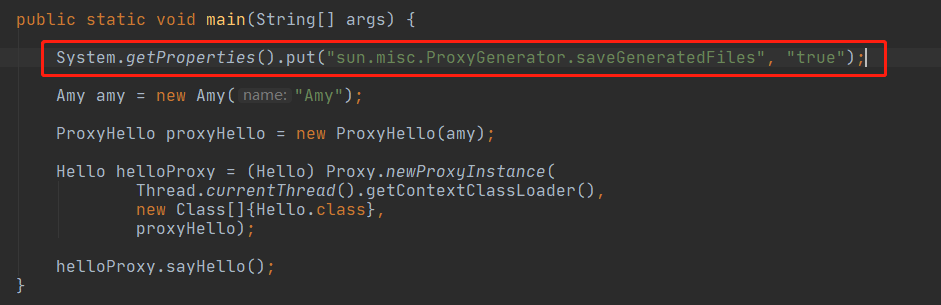

# 分析JDK动态代理的实现
在java中，动态代理分为两类：

*   基于接口的JDK动态代理
*   基于类的CGlib动态代理

而今天我要讲的是前者，基于接口的动态代理。动态代理在框架中的应用非常广泛，理解了动态代理，对spring，mybatis等常用框架的源码阅读也非常有帮助。这篇文章的由来也是因为肺炎（**各位一定不用乱跑阿，出门也要记得带口罩，这个真的很重要！！！**），只能在家看mybatis源码，看到`sqlSession.getMapper(Class class)`方法时，因为源码中用到了JDK动态代理，所以决定深挖一下JDK动态代理的实现。

看完这篇文章，你能收获的知识：

*   为什么JDK动态代理只能基于接口？
*   代理类是如何生成并且创建的？
*   如何反编译代理类？
*   为什么会自动执行代理对象的`invoke()`方法？
*   代理对象的`invoke(Object proxy, Method method, Object[] args)`中的method参数是如何知道我们执行的是哪个方法。

后面的所有解析都会基于这个例子进行讲解

因为JDK动态代理是基于接口的，所有我们首先要创建一个接口

```java
public interface Hello {
    void sayHello();
}

```

然后我们给这个接口一个实现类，这个实现类并不是必须的，mybatis中就是直接利用接口，而没有这个实现类，这里是为了更加易于理解。

```java
public class Amy implements Hello{

    private String name;

    public Amy(String name) {
        this.name = name;
    }

    public void sayHello() {
        System.out.println(name + " say hello");
    }
}

```

接着我们创建一个代理类（这个代理类跟下文源码分析中JDK生成的代理类并不是同一回事，请务必分清楚，以免理解出错），JDK动态代理规定代理类必须实现InvocationHandler接口

```java
public class ProxyHello implements InvocationHandler {

    private Hello hello;

    public ProxyHello(Hello hello) {
        this.hello = hello;
    }

    public Object invoke(Object proxy, Method method, Object[] args) throws Throwable {
        System.out.println("before say hello");
        method.invoke(hello, args);
        System.out.println("after say hello");
        return null;
    }
}

```

最后我们写一个测试类，创建一个代理对象，执行`sayHello()`方法，看看输出的结果

```java
public class Test {
    public static void main(String[] args) {

        Amy amy = new Amy("Amy");

        ProxyHello proxyHello = new ProxyHello(amy);

        Hello helloProxy = (Hello) Proxy.newProxyInstance(
                Thread.currentThread().getContextClassLoader(),
                new Class[]{Hello.class},
                proxyHello);

        helloProxy.sayHello();
    }
}

```

最后输出的结果



通过输出结果可以知道，实际上执行的是代理对象里面的invoke()方法。

通过上面的例子可以知道，创建代理对象是通过`Proxy.newProxyInstance(ClassLoader loader, Class<?>[] interfaces, InvocationHandler h)`进行创建的，接收三个参数

*   类加载器，我们直接使用当前线程的类加载器，一般是`AppClassLoader`
*   要代理的接口，例子中就是`Hello.class`，也就是我们创建的接口
*   代理对象，例子中是ProxyHello类的对象

`newProxyInstance()`
--------------------

没有写注释的语句说明不影响理解源码，都是一些是否有操作权限的校验，所以可以暂时忽略。

```java
public static Object newProxyInstance(ClassLoader loader,
                                      Class<?>[] interfaces,
                                      InvocationHandler h)
        throws IllegalArgumentException
    {
        Objects.requireNonNull(h);

        final Class<?>[] intfs = interfaces.clone();
        final SecurityManager sm = System.getSecurityManager();
        if (sm != null) {
            checkProxyAccess(Reflection.getCallerClass(), loader, intfs);
        }

        
         * 这句是重点，也是创建代理类的方法，注意这里只是创建了类，
         * 也就是我们平时写代码创建的.class文件，并不是代理对象
         * 主要也是分析这个方法！！！
         */
        Class<?> cl = getProxyClass0(loader, intfs);

        try {
            if (sm != null) {
                checkNewProxyPermission(Reflection.getCallerClass(), cl);
            }
            
            final Constructor<?> cons = cl.getConstructor(constructorParams);
            
            final InvocationHandler ih = h;
            if (!Modifier.isPublic(cl.getModifiers())) {
                AccessController.doPrivileged(new PrivilegedAction<Void>() {
                    public Void run() {
                        cons.setAccessible(true);
                        return null;
                    }
                });
            }
            
            return cons.newInstance(new Object[]{h});
        } catch (IllegalAccessException|InstantiationException e) {
            throw new InternalError(e.toString(), e);
        } catch (InvocationTargetException e) {
            Throwable t = e.getCause();
            if (t instanceof RuntimeException) {
                throw (RuntimeException) t;
            } else {
                throw new InternalError(t.toString(), t);
            }
        } catch (NoSuchMethodException e) {
            throw new InternalError(e.toString(), e);
        }
    }

```

`getProxyClass0()`
------------------

```java
private static Class<?> getProxyClass0(ClassLoader loader,
                                       Class<?>... interfaces) {
    
    if (interfaces.length > 65535) {
        throw new IllegalArgumentException("interface limit exceeded");
    }
    
    
    return proxyClassCache.get(loader, interfaces);
}

```

`proxyClassCache.get()`
-----------------------

```java
public V get(K key, P parameter) {
    Objects.requireNonNull(parameter);

    expungeStaleEntries();
    
    Object cacheKey = CacheKey.valueOf(key, refQueue);

    
    
    
    
    
    ConcurrentMap<Object, Supplier<V>> valuesMap = map.get(cacheKey);
    if (valuesMap == null) {
        ConcurrentMap<Object, Supplier<V>> oldValuesMap
            = map.putIfAbsent(cacheKey,
                              valuesMap = new ConcurrentHashMap<>());
        if (oldValuesMap != null) {
            valuesMap = oldValuesMap;
        }
    }

    
    Object subKey = Objects.requireNonNull(subKeyFactory.apply(key, parameter));
    
    Supplier<V> supplier = valuesMap.get(subKey);
    
    
    Factory factory = null;

    while (true) {
        if (supplier != null) {
            
            V value = supplier.get();
            if (value != null) {
                
                return value;
            }
        }
        
        
        if (factory == null) {
            factory = new Factory(key, parameter, subKey, valuesMap);
        }
        
        
        
        if (supplier == null) {
            supplier = valuesMap.putIfAbsent(subKey, factory);
            if (supplier == null) {
                supplier = factory;
            }
        } else {
            
            
            if (valuesMap.replace(subKey, supplier, factory)) {
                
                supplier = factory;
            } else {
                
                supplier = valuesMap.get(subKey);
            }
        }
    }
}

```

我们真正创建和获取代理类的方法就是`supplier.get()`。

通常情况下，第一次循环都是获取不到代理类的，第一次循环都是创建一个供应商，然后存入到缓存中，第二次循环从缓存中获取到供应商，然后从供应商处获取代理类。

`supplier.get()`
----------------

因为supplier变量是引用了Factory类的对象，所以我们实际要看的是Factory类的`get()`方法

Factory类是WeakCache的私有内部类

```java
private final class Factory implements Supplier<V> {
    private final K key;
    private final P parameter;
    private final Object subKey;
    private final ConcurrentMap<Object, Supplier<V>> valuesMap;

    Factory(K key, P parameter, Object subKey,
            ConcurrentMap<Object, Supplier<V>> valuesMap) {
        this.key = key;
        this.parameter = parameter;
        this.subKey = subKey;
        this.valuesMap = valuesMap;
    }

    @Override
    public synchronized V get() { 
        
        Supplier<V> supplier = valuesMap.get(subKey);
        if (supplier != this) {
            return null;
        }
        

        
        V value = null;
        try {
            
            
            
            value = Objects.requireNonNull(valueFactory.apply(key, parameter));
        } finally {
            if (value == null) {
                valuesMap.remove(subKey, this);
            }
        }
        assert value != null;

        
        CacheValue<V> cacheValue = new CacheValue<>(value);

        reverseMap.put(cacheValue, Boolean.TRUE);

        
        
        
        if (!valuesMap.replace(subKey, this, cacheValue)) {
            throw new AssertionError("Should not reach here");
        }
        
        return value;
    }
}

```

`valueFactory.apply()`
----------------------

创建代理类的方法

```java
private static final class ProxyClassFactory
        implements BiFunction<ClassLoader, Class<?>[], Class<?>>
{
    // prefix for all proxy class names
    private static final String proxyClassNamePrefix = "$Proxy";

    // next number to use for generation of unique proxy class names
    private static final AtomicLong nextUniqueNumber = new AtomicLong();

    @Override
    public Class<?> apply(ClassLoader loader, Class<?>[] interfaces) {

        Map<Class<?>, Boolean> interfaceSet = new IdentityHashMap<>(interfaces.length);
        for (Class<?> intf : interfaces) {
            /*
             * 验证类加载器是否将此接口的名称解析为同一个Class对象
             */
            Class<?> interfaceClass = null;
            try {
                interfaceClass = Class.forName(intf.getName(), false, loader);
            } catch (ClassNotFoundException e) {
            }
            if (interfaceClass != intf) {
                throw new IllegalArgumentException(
                    intf + " is not visible from class loader");
            }
            
            // 验证Class对象是否是接口
            if (!interfaceClass.isInterface()) {
                throw new IllegalArgumentException(
                    interfaceClass.getName() + " is not an interface");
            }
            /*
             *验证接口没有重复
             */
            if (interfaceSet.put(interfaceClass, Boolean.TRUE) != null) {
                throw new IllegalArgumentException(
                    "repeated interface: " + interfaceClass.getName());
            }
        }

        // 代理类的包名
        String proxyPkg = null;
        int accessFlags = Modifier.PUBLIC | Modifier.FINAL;

        /*
         * Record the package of a non-public proxy interface so that the
         * proxy class will be defined in the same package.  Verify that
         * all non-public proxy interfaces are in the same package.
         */
        for (Class<?> intf : interfaces) {
            int flags = intf.getModifiers();
            if (!Modifier.isPublic(flags)) {
                accessFlags = Modifier.FINAL;
                String name = intf.getName();
                int n = name.lastIndexOf('.');
                String pkg = ((n == -1) ? "" : name.substring(0, n + 1));
                if (proxyPkg == null) {
                    proxyPkg = pkg;
                } else if (!pkg.equals(proxyPkg)) {
                    throw new IllegalArgumentException(
                        "non-public interfaces from different packages");
                }
            }
        }

        if (proxyPkg == null) {
            // if no non-public proxy interfaces, use com.sun.proxy package
            proxyPkg = ReflectUtil.PROXY_PACKAGE + ".";
        }

        /*
         *选择一个代理类的名称，实际就是一个递增的数字
         */
        long num = nextUniqueNumber.getAndIncrement();
        
        //代理类的全限定类名：com.sun.proxy.$Proxy0 , com.sun.proxy.$Proxy1
        String proxyName = proxyPkg + proxyClassNamePrefix + num;

        /*
         * 生成一个代理类的class文件，也就是我们通常创建的class类
         * 该方法并不是开源的。
         * 我们进去该方法可以看到一个属性saveGeneratedFiles
         * 这个属性用于判断是否将创建的class文件输出到本地，
         * 我们可以在运行时设置该属性，
         * 让它将生成的class文件输出，然后我们反编译这个代理类文件
         */
        byte[] proxyClassFile = ProxyGenerator.generateProxyClass(
            proxyName, interfaces, accessFlags);
        try {
            // 通过类文件创建Class对象，这是一个本地方法（C/C++实现），无法查看
            return defineClass0(loader, proxyName,
                                proxyClassFile, 0, proxyClassFile.length);
        } catch (ClassFormatError e) {
            /*
             * A ClassFormatError here means that (barring bugs in the
             * proxy class generation code) there was some other
             * invalid aspect of the arguments supplied to the proxy
             * class creation (such as virtual machine limitations
             * exceeded).
             */
            throw new IllegalArgumentException(e.toString());
        }
    }
}

```

输出代理类文件
-------

要输出该代理类文件，我们有两种方法：

1，我们在运行`Test`类之前，首先进行一个配置，在红色框框的部分添加这个属性`-Dsun.misc.ProxyGenerator.saveGeneratedFiles=true`


2，在运行代码之前，设置系统全局属性，添加红色方框部分的代码



运行代码，代码执行完成之后就会在`main()`所在类的同级目录下看到创建了一个com.sun.proxy包，该包下面有一个`$Proxy0.class`类似的class文件，这就是生成的代理类。

反编译代理类
------

~我没有在IDEA上找到合适的插件，网上看到的几个，不知道为什么用不了，唯一一个能用的效果也不好，所有就在网上找了另外一个JD-GUI，无需安装，很好用。~

~附上下载链接（需要梯子）：[JD-GUI](https://link.juejin.cn/?target=https%3A%2F%2Fwww.filecroco.com%2Fdownload-jd-gui%2Fdownload%2F "https://www.filecroco.com/download-jd-gui/download/")~

因为自己在反编译cglib生成的代理类时发现JD-GUI在反编译一些class文件的某些方法（本人是void方法）出现了反编译不完整的问题（难怪一直看不懂！！！），所以**不推荐使用**，我现在使用IDEA默认的反编译器（直接在IDEA打开需要反编译的class文件即可），虽然变量名难看了点，但是至少是无误的。

这个网站也可以反编译class文件，效果与IDEA类似，目前在我使用过程中没有发现问题：[javare.cn/](https://link.juejin.cn/?target=http%3A%2F%2Fjavare.cn%2F "http://javare.cn/")

我们直接使用软件打开我们生成的代理类 **(此代码依然是JD_GUI反编译，因为这个没有错误，所以没有更换，不影响阅读)**，如下：

```java
package com.sun.proxy;

import com.lhd.proxy.Hello;
import java.lang.reflect.InvocationHandler;
import java.lang.reflect.Method;
import java.lang.reflect.Proxy;
import java.lang.reflect.UndeclaredThrowableException;

public final class $Proxy0 extends Proxy implements Hello {
  private static Method m1;
  
  private static Method m3;
  
  private static Method m2;
  
  private static Method m0;
  
  public $Proxy0(InvocationHandler paramInvocationHandler) {
    super(paramInvocationHandler);
  }
  
  public final boolean equals(Object paramObject) {
    try {
      return ((Boolean)this.h.invoke(this, m1, new Object[] { paramObject })).booleanValue();
    } catch (Error|RuntimeException error) {
      throw null;
    } catch (Throwable throwable) {
      throw new UndeclaredThrowableException(throwable);
    } 
  }
  
  public final void sayHello() {
    try {
      this.h.invoke(this, m3, null);
      return;
    } catch (Error|RuntimeException error) {
      throw null;
    } catch (Throwable throwable) {
      throw new UndeclaredThrowableException(throwable);
    } 
  }
  
  public final String toString() {
    try {
      return (String)this.h.invoke(this, m2, null);
    } catch (Error|RuntimeException error) {
      throw null;
    } catch (Throwable throwable) {
      throw new UndeclaredThrowableException(throwable);
    } 
  }
  
  public final int hashCode() {
    try {
      return ((Integer)this.h.invoke(this, m0, null)).intValue();
    } catch (Error|RuntimeException error) {
      throw null;
    } catch (Throwable throwable) {
      throw new UndeclaredThrowableException(throwable);
    } 
  }
  
  static {
    try {
      m1 = Class.forName("java.lang.Object").getMethod("equals", new Class[] { Class.forName("java.lang.Object") });
      m3 = Class.forName("com.lhd.proxy.Hello").getMethod("sayHello", new Class[0]);
      m2 = Class.forName("java.lang.Object").getMethod("toString", new Class[0]);
      m0 = Class.forName("java.lang.Object").getMethod("hashCode", new Class[0]);
      return;
    } catch (NoSuchMethodException noSuchMethodException) {
      throw new NoSuchMethodError(noSuchMethodException.getMessage());
    } catch (ClassNotFoundException classNotFoundException) {
      throw new NoClassDefFoundError(classNotFoundException.getMessage());
    } 
  }
}


```

通过这个代理类我们可以知道JDK动态代理为什么只能基于接口的代理，因为该代理类继承了Proxy类，而java是不支持多继承的，所有只能通过实现接口来实现代理。

我们可以看到这个代理类实现了我们传递进去的接口`Hello`，所以代理类里面要实现该接口的方法，也就是`sayHello()`方法，而这个方法的实现非常简单，其实代理类里面所有的方法都非常简单，就是执行了this.h.invoke()这个方法。

我们分析一下这条语句：

*   this ：就是指代理类对象
*   h：h是继承于Proxy类的，是InvocationHandler类型，也就是我们调用`newProxyInstance()`传递进去的ProxyHello，代理的一个构造函数也是接受这个类型的参数，我们在`newProxyInstance`方法中获取代理类的构造函数时也是获取带这个类型参数的构造函数，然后通过这个构造函数来创建代理类对象
*   invoke：就是ProxyHello的`invoke()`方法

当代理类对象执行sayHello()方法时，实际就是执行`this.h.invoke(this, m3, null)`这个方法，也就是执行了ProxyHello类的对象的`invoke()`方法，而这个方法的method参数是在最下面获取的：

`m3 = Class.forName("com.lhd.proxy.Hello").getMethod("sayHello", new Class[0]);`

当我们在调用`method.invoke(hello, args)`时就是调用的m3这个方法，然后指定一个执行的对象和参数，就可以执行我们需要执行的方法了。

到目前为止，上面的五个问题就都有答案了。但是具体这个代理类的class文件是如何写入的暂时没有深究，因为没有开源，比较晦涩难懂，而且代码量庞大，就不再深入了。 如果有问题，可以评论区讨论。如果有错误的地方，也请多多包涵并且指正。