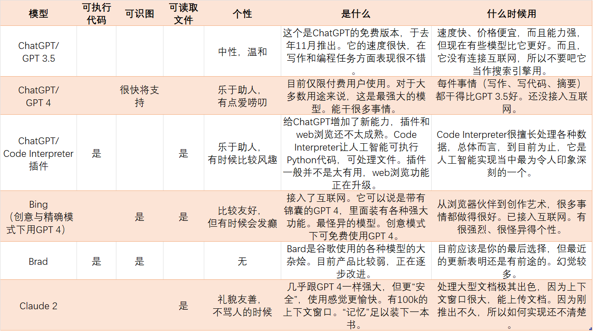
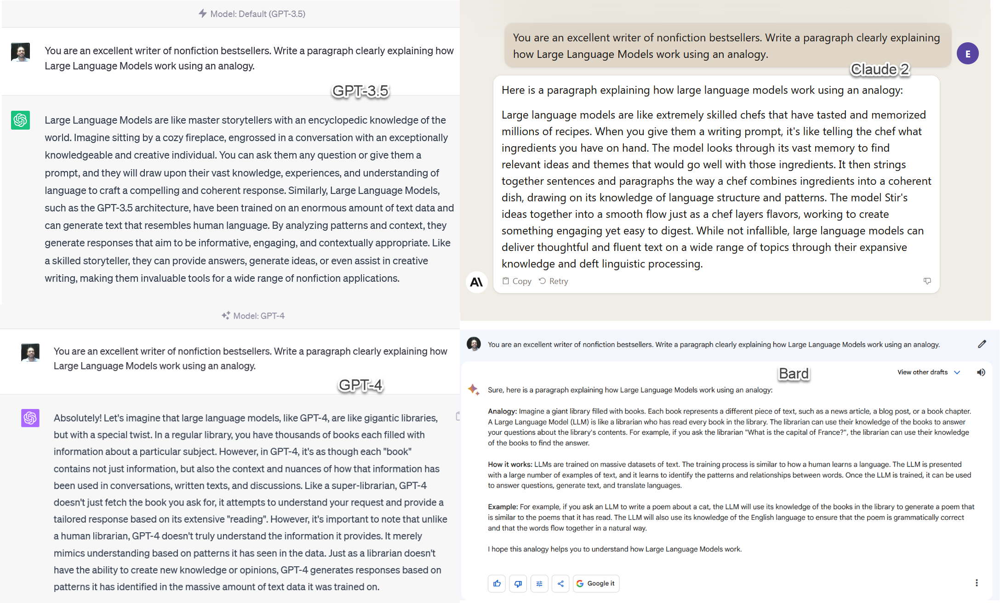
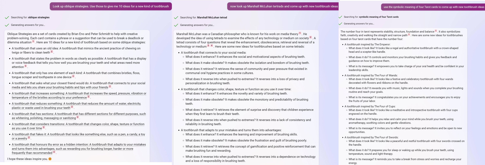
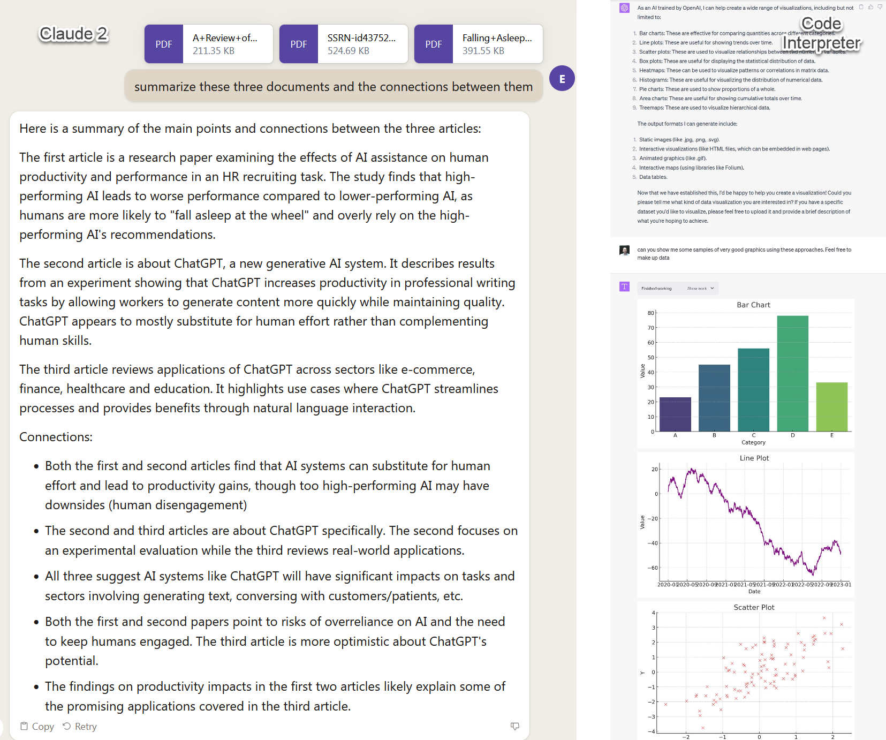

# 如何利用人工智能帮你做事：工具选择指南
> 神译局是36氪旗下编译团队，关注科技、商业、职场、生活等领域，重点介绍国外的新技术、新观点、新风向。

编者按：生成式人工智能的发展可以用日新月异来形容，层出不穷的工具令人眼花缭乱，出现选择困难症。ChatGPT 尽管名声最响，但什么事情都用它来做未必是最合适选项。这里对人工智能可以做的事情进行了分类，并给出了免费和付费的最佳工具选项，希望能帮到你。文章来自编译。

越来越强大的人工智能系统层出不穷，发布的速度越来越快。最近，Claude 2 首次亮相，这也许是公众可用的第二强大人工智能系统。一周之前，Open AI 发布了 Code Interpreter，这是迄今为止最娴熟的人工智能模式。在这的一周前，部分人工智能还获得了看懂图像的能力。

可是，似乎没有一家人工智能实验室提供任何的用户文档。相反，唯一的用户指南似乎是 Twitter 上面那帮网红大V的推文串（treads）。对于声称关心自身技术是否得到正确使用的组织来说，靠小道消息传播的文档是个奇怪选择，但现实情况就是这样。

我不敢说这份用户指南已经很全，但为了解人工智能的当前状态提供一些指导还是可以的。我每隔几个月就会为我的学生（以及感兴趣的读者）编写一份人工智能入门指南，而且每次都需要做出重大修改。但过去几个月尤其疯狂。

这份指南是基于我的经验，纯属个人之见，重点是如何选择正确的工具来完成任务。

### 主要的大语言模型

现在，当我们说起人工智能时，我们通常指的是大型语言模型（LLM）。大多数人工智能应用都是由 LLM 提供支持，而 LLM 当中其实基础模型就那么几个，是由少数几家组织建立的。每家公司都可以通过聊天机器人（Chatbot）直接访问他们的模型：OpenAI 做出了 GPT-3.5 与 GPT-4， ChatGPT 以及微软的 Bing（通过 Edge 浏览器访问）背后用的就是这些模型。 谷歌的 Bard 品牌旗下也有多款模型。[Anthropic](https://pitchhub.36kr.com/project/2230171079444228) 则建立了Claude 与 Claude 2 模型。

还有其他一些 LLM，但本文不会详细讨论。第一个是 Pi，这是由 Inflection 构建的聊天机器人。Pi 针对对话进行了优化，并且确实非常想成为你的朋友（说真的，不妨尝试一下，试过你才知道我是什么意思）。除了聊天之外，它不喜欢做太多事情，想让它替你工作会是一次令人沮丧的练习。我们也不会介绍任何人都可以使用和修改的各种开源模型。这些通常无法访问，或者对于今天那些只是想随便用用的用户来说没有什么用，但其实那些模型确实很有前景。未来的指南可能把它们纳入进去。

下面是一份快速参考图表，总结了 LLM 的现状：

前四个（包括 Bing 在内）都是 OpenAI 的系统。目前 OpenAI 的人工智能主要就这两种：3.5 和 4。GPT 3.5 在去年 11 月掀起了一股人工智能热潮，GPT 4在今年春季首次亮相，功能更加强大。新的派生版利用通过插件介入互联网及其他应用。插件有很多，但大多数不是很有用，不过应该根据需要自己去探索一下。 Code Interpreter 是 ChatGPT 的一个极其强大的版本，可以运行 Python 程序。如果你从未给 OpenAI 付过费，那么你就只用过 3.5。除了插件版以及暂时停止浏览的 GPT-4 版以外，这些模型都没有连接到互联网。微软的 Bing 混合使用了 4 和 3.5，并且通常是 GPT-4 家族当中第一个推出新功能的模型。比方说，Bing 既可以创建和识别图像，也可以在web浏览器中读取文档。它已经接入了互联网。Bing 用起来有点奇怪，但功能强大。

谷歌一直在测试自己的供消费者使用的人工智能，也就是所谓的 Bard，但其实 Brad 背后由各种基础模型提供支持，其中最近的一个叫做 PaLM 2。LLM 技术就是由谷歌开发出来的，但他们的产品非常令人失望，不过昨天公布的改进表明他们仍在致力于研究底层技术，所以我对他们仍保有希望。Brad 已经获得了跑有限代码与解释图像的能力，但我现在一般会避免使用 Bard。

最后一家公司是 Anthropic ，他们发布了 Claude 2。Claude 最值得注意的是它的上下文窗口非常大- 即便上算是 LLM 的内存了。Claude 的内存几乎可以容纳整本书或许多个 PDF。与其他大型语言模型相比，其恶意行为的可能性更小，这意味着，它可能只会训斥你一下。

接下来，我们讲讲怎么用：

### 写东西

**最佳免费选项：** Bing 与 Claude 2

**付费选项：** ChatGPT 4.0/带插件的 ChatGPT

目前，GPT-4 仍然是最强大的人工智能写作工具，你可以通过 Bing 免费访问（选择“创意模式”），也可以通过每月花 20 美元订阅 ChatGPT 来访问。不过，第二名的Claude差距并不大，而且有免费选项，尽管存在限制。

这些工具也已被直接集成到常见的办公应用之中。 Microsoft Office 将纳入由 GPT 提供支持的copilot，Google Docs 将集成 Bard 的建议。这些创新对写作的影响会相当深远。

以下是利用人工智能帮助你写作的部分方法。

*   写草稿，任何东西的草稿。博客文章、论文、宣传材料、演讲、讲座、选择你自己的冒险、脚本、短篇故事——只要你能想得到，人工智能都能做到，而且做得很好。你所要做的就是给它提示。提示制作并不神奇，但基本的提示会导致写出来的东西很无聊，不过提高提示的水平并不难，只需与系统交互即可。只要稍加练习，你就会发现人工智能系统当作家的能力要强得多。
    
*   让你写得更好。把你的文本粘贴给人工智能。让人工智能改进内容，或者让人工智能给出建议，看看怎么更好地适合特定受众。让它写出 10 份风格截然不同的草稿。要求人工智能把文字变得更生动，或者添加例子。用它来激发灵感，让你写更好。
    
*   帮助你完成任务。人工智能可以做你没有时间做的事情。像实习生一样使用人工智能，让它撰写电子邮件、创建销售模板、为你提供商业计划的后续步骤等等。比方说我曾在人工智能的帮助下在 30 分钟内完成了产品发布的各种支持工作。
    
*   解锁你自己。面对挑战艰巨的任务很容易让人分心。人工智能是为你提供动力的手段之一。
    

不同模型生成效果对比

**需要担心的一些事情：** 为了响应你的请求，人工智能很容易会产生“幻觉”并生成看似合理的事实。它可以生成完全虚假且看似完全令人信服的内容。我要强调的是：人工智能经常撒谎。它告诉你的每一个事实或信息都有可能是不对的。你需要检查一切。让人工智能（指未连接到互联网的模型）提供参考文献、引言、引用以及互联网信息尤其危险。与其他模型相比，Bing 产生幻觉的情况往往要少一些，因为 GPT-4 生成的东西通常有事实依据，而Bing 接入互联网意味着实际上它可以获取事实。但幻觉不可能完全消除。

另外要注意的是，人工智能没法解释自己，它只会让你认为它可以做出解释。如果你要求它解释为什么写出了这样的东西，它会给你一个看似合理但却是完全虚构的答案。当你询问它的思维过程时，它并不是去询问自己的行为，那只是在生成看上去像是它正在这样做的文本。这使得理解系统存在的偏见变得非常具有挑战性，尽管这些偏见几乎肯定是存在的。

它还可能被人不道德地用于操纵或欺骗。你要对这些工具的输出负责。

### 图像制作

**最透明的选项：** Adobe Firefly

**开源选项**：Stable Diffusion

**最佳免费选项：** Bing 或 Bing Image Creator（使用 DALL-E）、 Playgound （可使用多个模型）

**图像质量最佳的选项**：Midjourney

可供大多数人使用的大型图像生成器有四种：

1.  Stable Diffusion，这个工具是开源的，任何一款高端的计算机都能跑。开始要付出一些努力，因为你得学会正确地写出提示，但一旦你能写出好的提示，就会生成很好的结果。这个特别适合将人工智能与其他来源的图像相结合。如果你选择Stable Diffusion，这里有一份很好的指南（请务必阅读第 1 部分和第 2 部分：https://www.jonstokes.com/p/stable-diffusion-20-and-21-an-overview）。
    
2.  DALL-E，来自 OpenAI，Bing（必须是在创意模式下）以及 Bing Image Creator已经植入了DALL-E。这个系统很可靠，但比Midjourney要差一些。
    
3.  截止2023年中，Midjourney是表现最好的系统。它的学习曲线在所有系统当中是最低的：只需输入“thing-you-want-to-see --v 5.2”（最后的 --v 5.2 很重要，这会提示人工智能采用最新的模型），你就会得到一个很好的结果。Midjourney需要通过Discord 使用。这里是 [Discord 的使用指南](https://www.pcworld.com/article/540080/how-to-use-discord-a-beginners-guide.html)。
    
4.  Adobe Firefly，已内置到多款 Adobe 产品之中，但在质量方面落后于 DALL-E 和Midjourney 。不过，其他那两个模型并未交代清楚用于训练人工智能的图像来源，但 Adobe 已声明自己仅使用其有权使用的图像。
    

以下是这几款工具的对比（每个图像都标记了用什么模型）：

提示：“Fashion photoshoot of sneakers inspired by Van Gogh”——每个模型创作的第一张照片

**需要担心的一些事情：** 这些系统是围绕着模型构建出来的，但这些模型会存在偏见，因为用来训练模型的互联网数据存在偏见（比方说，如果你让它创建企业家的图片，你可能会看到更多以男性而不是女性为主角的图片，除非你指定要创建“女性企业家”），用这个浏览器（https://huggingface.co/spaces/society-ethics/DiffusionBiasExplorer）可以看看实际存在哪些偏见。

这些系统还使用了互联网上的艺术来进行训练，但却是以不透明且可能在法律和道德上存在问题的方式进行训练的。尽管从技术上而言，你拥有所创建图像的版权，但法律规定仍然模糊。

另外，目前这些模型是不创建文本的，只是创建了一堆看起来像文本的东西。但Midjourney已经成功了。

### 提出想法

**最佳免费选择**：Bing

**付费选项：** ChatGPT 4.0，但由于有互联网连接，Bing 可能更好

尽管（或者事实上，由于）人工智能存在诸多限制和怪异之处，但仍然非常适合生成点子。你经常需要有很多想法才能想出好想法，而人工智能擅长以量取胜。通过提供正确的提示，你还可以迫使它变得非常有创意。在创意模式下要求 Bing 找出你最喜欢的，不同寻常的创意生成技术，比方说 Brian Eno 的间接策略（oblique strategies）或马歇尔·麦克卢汉（Mashall McLuhan） 的四分法，并应用它们。或者要求提供一点很奇怪的东西，比如随便拿个专利来获得灵感，或者你最喜欢的超级英雄......

### 制作视频

**最佳动画工具：** D- iD ，用于为视频里面的脸部制作动画。 Runway v2 可用于文本生成视频

**最佳声音克隆：**  ElevenLabs

现在，生成这样一段视频已经是小事一桩：包含完全由人工智能生成的角色、去读完全由人工智能编写的脚本、用人工智能制作的声音说话、由人工智能制作动画，这些通通没问题。它还可以对人进行深度伪造。

第一个商用的文本生成视频工具最近也发布了，也就是Runway v2。它可以创建 4 秒的短片，所以这更多的是对未来的可能性的一种演示，但如果你想了解这个领域将来会如何发展的话，值得一看。

需要担心的一些事情：深度伪造是一个大问题，这些系统需要以合乎道德的方式去使用。

### 处理文档和数据

**对于数据（以及对代码有任何奇怪想法）：** Code Interpreter

**文档处理：**  大型文档或同时处理多个文档可用Claude 2，Bing 侧边栏可用于小一点的文档和网页（侧边栏属于Edge 浏览器的一部分，可以“查看”浏览器里面的内容，让 Bing 处理相关信息，不过其上下文窗口的大小有限）

我上周写了一篇关于Code Interpreter的文章。它是 GPT-4 的其中一种模式，在这种模式下，你可以上传文件给该人工智能，去编写和运行代码，还可以下载该人工智能提供的结果。它可以用来执行程序、进行数据分析（尽管你需要对统计数据和数据有足够了解才能检查它做得好不好）以及创建各种文件、网页甚至游戏。尽管自发布以来，关于未经训练的人用它进行分析的相关风险存在很多争论，但许多测试过 Code Interpreter 的专家都对它的能力印象深刻，以至于一篇论文声称这个东西会要求我们改变培训数据科学家的方式。我还编写了初始提示来设置Code Interpreter，好做出有用的数据可视化。初始提示给出了良好图表设计的一些基本原则，并提醒它可以输出多种文件。链接参见此处https://t.co/m4yAdKROiJ。

至于文本处理，尤其是 PDF的处理，Claude 2 到目前为止表现非常出色。我试过将整本书粘贴到以前版本的 Claude 里，效果令人印象深刻，而且新模型更加强大。我还喂给它大量复杂的学术文章并要求它给出结果摘要，它做得很好！甚至更好的是，你还可以提出后续问题，比方说：这个方法的证据是什么？作者得出了什么结论？等等…

**需要担心的一些事情**：这些系统仍然会产生幻觉，尽管是以更为受限的方式出现。如果你想确保准确性，就得检查生成的结果。

### 获取信息及学习东西

**最佳免费选择：** Bing

**付费选项：** 通常 Bing 是最好的。如果是儿童的话，可汗学院的Khanmigo提供了由 GPT-4 支持的人工智能学习辅导，效果不错。

如果你打算把人工智能当作搜索引擎的话，我的建议是也许不要这样做。产生幻觉的风险很高，而且大多数人工智能都没有连接到互联网（这就是为什么我建议你用 Bing。谷歌的人工智能 Bard 产生的幻觉更多）。不过，根据最近的一项试点研究，有部分证据表明，如果谨慎使用的话，相对于搜索，人工智能往往能提供更有用的答案。特别是在搜索引擎表现不太好的情况下，比方说技术支持、决定去哪里吃饭或获取建议，以 Bing 作为起点往往要比用谷歌好。这是一个正在迅速发展的领域，但你现在应该小心使用。毕竟你不想惹上麻烦吧。

但更令人兴奋的是利用人工智能来辅助教育的可能性，包括帮助我们自己学习。我已经写过关于如何将人工智能用于教学并让教师的生活变得更轻松、课程变得更有效的文章，但人工智能也可以用于自主学习。你可以让人工智能解释概念，一般可以获得非常好的结果。鉴于我们知道人工智能可能会产生幻觉，所以明智的做法是（小心！）对照其他来源，仔细检查任何的关键数据。

### 还有吗？

正如过去几个月的发展所表明的那样，由于技术的快速发展，现在介绍的这些将来可能会变成你用过的最糟糕的人工智能工具。我毫不怀疑自己很快就需要制作一本新的指南。但关于人工智能，请记住这两个关键点仍然是正确的：

*   人工智能是一种工具。但未必总是合适的工具。鉴于人工智能存在弱点，请仔细考虑它是否适合你计划应用它的目的。
    
*   有很多道德问题需要注意。人工智能可能会被用来侵犯版权、作弊、窃取他人的作品或进行操纵。特定人工智能模型的开发方式以及谁从对它的使用中受益往往是个很复杂的问题，现阶段还不是特别清楚。最终，你有责任以合乎道德的方式去使用这些工具。
    

我们正处于一场快速推进的革命的早期阶段。你还有其他用途想分享吗？请在评论中告诉我。

译者：boxi。