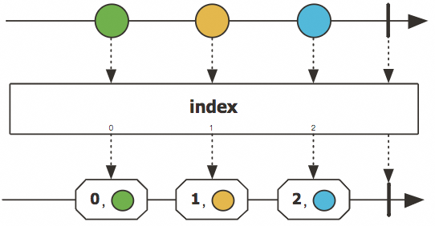
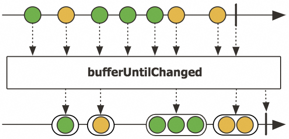
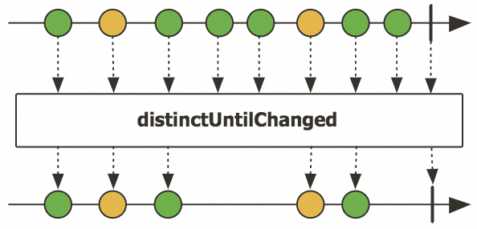
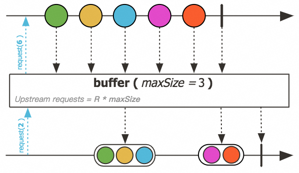

# 如何避免写重复代码：善用抽象和组合


> 通过抽象和组合，我们可以编写出更加简洁、易于理解和稳定的代码。类似于金字塔的建筑过程，我们总是可以在一层抽象之上再叠加一层，从而达到自己的目的。但是在日常的开发工作中，我们如何进行实践呢？本文将以笔者在 Akka 项目中的一段社区贡献作为引子分享笔者的一点心得。

通常，为了简化我们对数据流的处理，我们可能会使用 Java8 中首次引入的 Stream、或者是 Kotlin、Scala 等编程语言中提供的更加丰富的集合库，亦或者使用反应式流的相关三方库来简化工作。虽然这些类库已经提供了丰富的操作符，但是我们依然会在工作中遇到一些未提供合适操作符的场景。比如：

*   在直播场景下，需要对某些类型的消息进行缓冲和聚合，一段时间内的多个点赞合并为 1 个点赞，并且在处理了 N 个消息的时候进行整体发送，保障整体的扩散量级维持在一个平稳的水平。
    
*   在 IOT 场景中，接收来自终端设备上报的数据，并返回当前的数据和前值，或者最近 3 个值，从而计算其中的变化趋势。此时我们可能会使用反应式流库中提供的：`zipWithNext`、`zipWithPrevious`、`zipWithPreviousAndNext`，或者是`sliding`。
    
*   在建立一个聊天室的时候，如果用户输入`bye`，则让用户断开连接，离开聊天室，那么这个时候我们可能会使用`takeWhile`。
    
*   假设我们有一组 SQL，我们需要按照顺序执行，并合并他们的结果，并在处理完成后关闭对应的数据库连接，这时我们可能会用`mapWithResource`，`using`（资源安全）。
    
*   当处理文件、写入数据库等使用资源的时候，我们需要打开一个文件或获取一个数据库连接，将数据写入，然后在处理完成后关闭对应的资源，这时我们可能会使用`foldResource`（资源安全）。
    
*   假设需要对数据进行分批，每 3 个元素一批，进行打包，这个时候我们可能会使用 `batch`(3)。
    
*   假设我们需要将元素和每个元素的下标结合在一起，这个时候我们可能需要使用 `zipWithIndex`。
    
*   假设我们需要缓存元素，并在指定条件满足前一直缓存，我们可能需要 `bufferUntil(predicate)`、`bufferWhile(predicate)`。
    
*   假设我们需要缓存元素，直到数据变更，把相同项合并在一起，我们可能需要 `bufferUtilChanged`。
    
*   假设我们需要对所有的元素进行去重，或者去掉连续的重复元素，我们可能会需要用到`distinct`、`distinctUntilChanged`。
    
*   假设我们只需要返回前 N 个元素，我们可能需要使用`limit(N)`、`take(N)`，或者按照条件`takeWhile`、`takeUntil`。
    
*   假设我们需要跳过前 N 个元素，我们可能需要使用`skip(N)`、`drop(N)`，或者按照条件`dropWhile`、`dropUntil`。
    
*   ……
    

我们可以看到，上面这些操作符，每个都拥有具体的语义，虽然看起来只是一个简单的方法，但是如果需要我们完全自主实现，也有不小的难度，比如`zipWithNext`、`zipWithPrevious`、`zipWithPreviousAndNext`在 Reactor-core 目前的发行版本中就没有直接提供，而和资源相关的，Reactor-core 中则只有一个`using`。

下面我们思考一下如何实现这些操作符。

作为程序员，第一件事情，肯定就是 Ctrl+C ，第二件事就是 Ctrl+V，第三件事就是 Commit&Push。然而，事情并没有这么简单。

难点有：

*   反应式流操作符需要完整实现反应式流的规范、并通过默认的测试套件的验证。
    
*   操作符需要尽可能的抽象和可组合。
    
*   无论是单线程还是并发场景下都拥有正确的行为和语义、并有完整单元测试覆盖。
    
*   操作符的实现需要尽可能的具备最高效的性能。
    

比如，以`zipWithIndex`举例，在 Reactor-core 中有`FluxIndexFuseable`（370 行代码）和 `FluxIndex`（296 行代码）两个实现。而且清晰的处理了各种情况。而其他操作符也有类似：release 3.4.23

*   `FluxBuffer` —— 575 行代码
    
*   `FluxBufferPredicate` —— 464 行代码
    
*   `FluxDistinct` —— 609 行代码
    
*   `FluxDistinctFuseable` —— 70 行代码
    
*   `FluxDistinctUntilChanged` —— 337 行代码
    
*   `FluxUsing` —— 583 行代码
    

如果要实现一个`zipWithNext`自定义操作符 ，应该也有接近的工作量。这样的工作强度，个人认为无论是在代码审查还是后期的维护都是一个大问题。

为此，我认为需要一个新的抽象，来对上面的这些操作进行进一步的抽象。然后再这个之上，通过使用和组合其他的操作，从而更简单的实现自定义操作符。

所有上面的这些都可以抽象为：

*   带有状态，且线程安全；
    
*   状态可变，且根据状态的不同，对输入应用不同的操作，产生不同的值；
    
*   可以提前结束、或者对不满足条件的值进行选择性丢弃；
    
*   有完整的生命周期；
    
*   在结束时可以根据内部状态而产生可选的值，而不会丢失内部状态。
    

经过分析，这里可以表达为 : `状态 + 输入 -(应用行为)-> 新的状态 + 输出`，这样再加上`onCraete`、`onComplete`生命周期函数，就可以完整表达。而提前结束等行为，则可以通过组合`takeWhile`实现。我们将方法命名为：`statefulMap`，声明如下：

```
public <S, In, Out> statefulMap(
    java.util.function.Supplier<S> create,
    java.util.function.BiFunction<S, In, Pair<S, Out>> f,
    java.util.function.Function<S, Optional<Out>> onComplete){...}
```

让我们看一下如何通过这个方法来实现`zipWithIndex`。

3.1 实现 zipWithIndex (indexed)
-----------------------------



```
Source.from(Arrays.asList("A", "B", "C", "D"))
​
    .statefulMap(
        () -> 0L,
        (index, element) -> Pair.create(index + 1, Pair.create(element, index)),
        indexOnComplete -> Optional.empty())
​
​
    .runForeach(System.out::println, system);
```

也可以实现`zipWithNext`、`zipWithPreviousAndNext`。然后下面我们再看看如何实现较为复杂的`bufferUntilChanged`。

3.2 实现 bufferUntilChanged
-------------------------



```
Source.from(Arrays.asList("A", "B", "B", "C", "C", "C", "D"))
​
​
    .statefulMap(
        () -> (List<String>) new LinkedList<String>(),
        (buffer, element) -> {
          if (buffer.size() > 0 && (!buffer.get(0).equals(element))) {
            return Pair.create(
                new LinkedList<>(Collections.singletonList(element)),
                Collections.unmodifiableList(buffer));
          } else {
            buffer.add(element);
            return Pair.create(buffer, Collections.<String>emptyList());
          }
        },
        Optional::ofNullable)
    .filterNot(List::isEmpty)
​
    .runForeach(System.out::println, system);
```

3.3 实现 distinctUntilChanged
---------------------------



```
Source.from(Arrays.asList("A", "B", "B", "C", "C", "C", "D"))
​
​
    .statefulMap(
        Optional::<String>empty,
        (lastElement, element) -> {
          if (lastElement.isPresent() && lastElement.get().equals(element)) {
            return Pair.create(lastElement, Optional.<String>empty());
          } else {
            return Pair.create(Optional.of(element), Optional.of(element));
          }
        },
        listOnComplete -> Optional.empty())
    .via(Flow.flattenOptional())
​
​
    .runForeach(System.out::println, system);
```

3.4 实现 buffer
-------------



```
Source.fromJavaStream(() -> IntStream.rangeClosed(1, 10))
​
​
    .statefulMap(
        () -> new ArrayList<Integer>(3),
        (list, element) -> {
          list.add(element);
          if (list.size() == 3) {
            return Pair.create(new ArrayList<Integer>(3), Collections.unmodifiableList(list));
          } else {
            return Pair.create(list, Collections.<Integer>emptyList());
          }
        },
        listOnComplete -> Optional.ofNullable(listOnComplete))
    .filterNot(List::isEmpty)
​
​
    .runForeach(System.out::println, system);

List(1, 2, 3)
List(4, 5, 6)
List(7, 8, 9)
List(10)
```

在前面看了如何实现`zipWithIndex` 、`bufferUntilChanged`之后，让我们进一步看看如何优雅和安全地处理资源。在任何的编程语言和框架中，资源的处理都是非常基础但是又很棘手的事项。在 Java 7 中首次引入了`try-with-resources`语法，对资源处理进行了一定程度的简化，而在反应式流中，我们又应该如何的操作呢？这里我们可以分为两种情况：

1）针对流中的每个元素都创建一个新的资源，使用这个资源，关闭这个资源。

2）针对整个流创建一个资源，并在处理流中的每个元素时使用这个资源，并在流的生命周期结束后，关闭这个资源。

因为资源通常开销较大且需要妥善管理，所以在开发过程中，我们更容易遇到的是第二种情况，即资源的创建和销毁和流的生命周期进行了绑定。反应式流中的资源管理，还有更多的细节需要考虑：

*   资源的初始化和关闭需要支持并发安全；反应式流可以被多次物化，被多个下游订阅者订阅和处理，并且以任意的顺序进行取消订阅，需要在各种情况下（上游完成、下游取消、处理异常等）等情况下妥善的创建和销毁资源。
    
*   在流生命周期的各个阶段安全地创建和销毁资源，比如：即使在创建资源或者销毁资源的时触发了异常，也不会对同一个资源关闭多次。
    
*   支持异步从而提高资源使用的效率。
    
*   感知流的生命周期，支持在关闭资源时提供可选的值给到下游以标识流的结束，比如处理文件时，使用一个特殊的标识符标识文件的结尾。
    

综合上面的这些诉求，对应的代码就会变得很复杂，大家可以用一点时间思考：如果是自己独立实现类似的操作需要做出那些努力呢？在现实的开发过程中，我们遇到的诉求很多时候并非一起提出，而时随着迭代接踵而至，那么如果当初的代码编写的不是很易于扩展，拥有良好的测试，则可能按下葫芦浮起瓢。

比如在 reactor-core 中就有如下的`using`操作符：

```
public static <T, D> Mono<T> using(
    Callable<? extends D> resourceSupplier,
    Function<? super D, ? extends Mono<? extends T>> sourceSupplier,
    Consumer<? super D> resourceCleanup) {...}
```

*   resourceSupplier 针对每个订阅者，创建一个资源。
    
*   sourceSupplier 结合创建的资源，产生对应的元素。
    
*   resourceCleanup 取消订阅或者流完成时，清理对应的资源。
    

在 reactor-core 中，对应的底层实现为`MonoUsing`共 360 行代码，而要实现我们想要的逻辑，我们还需要和另一个流进行合并，即这里的`using`类似于`unfoldResource`。那么有没有可能使用更加简单的方案来进行实现呢？答案是肯定的，和前面的几个操作符一样，我们可以使用`statefulMap`来实现`mapWithResource`，思维过程如下：

*   `using`/`mapWithResource`的生命周期管理和`statefulMap`的`create`和 `onComplete`方法对应，针对资源，`onComplete`方法可以被命名为更加贴切的`release`/`close`/`cleanUp`。
    
*   在流中使用的资源，我们可以认为是一个状态，只不过这个状态在流的整个生命周期中不再变化，一直是`create`方法中返回的`Resource`。
    
*   在关闭资源时，我们可以通过返回一个`Optional<Out>`来返回一个可选的值。
    
*   对并发资源的异步处理，则可以通过返回一个`CompletionStage<Out>`而非`Out`来实现，在`using`方法中，我们返回的是一个`Mono<T>`。
    

经过上面的思维过程，我们不难得出这个流上的方法的声明可以为：

```
public <R, In, Out> mapWithResource(
  Supplier<? extends R> create,
  BiFunction<? super R, ? super In, ? extends Out> function,
  Function<? super R, ? extends Optional<? extends Out> close) {...}
```

*   `resourceSupplier`针对每个订阅者/每次物化，创建一个资源。
    
*   `function`使用 create 中创建的资源处理流中的每个元素。
    
*   `close`在流关闭的同时关闭资源，并再向下游提供一个可选的值。
    

具体的的实现这里留空，感兴趣的小伙伴可以结合前面的例子进行实现。下面我们看一下如何使用这个`mapWithResource`方法，从而加深大家的理解。

4.1 使用 mapWithResource
----------------------

假设我们有一组 SQL 需要进行处理，我们需要从数据库中的多个表中查询对应的结果，并将最终结果进行合并和输出到控制台。在`mapWithResource`的帮助下，我们可以极大的简化我们的代码：

```
Source.from(
            Arrays.asList(
                "SELECT * FROM shop ORDER BY article-0000 order by gmtModified desc limit 100;",
                "SELECT * FROM shop ORDER BY article-0001 order by gmtModified desc limit 100;"))
        .mapWithResource(
            () -> dbDriver.create(url, userName, password),
            (connection, query) -> db.doQuery(connection, query).toList(),
            connection -> {
              connection.close();
              return Optional.empty();
            })
        .mapConcat(elems -> elems)
        .runForeach(System.out::println, system);
```

在上面的例子中：我们有一组预先定义好的 SQL，分别从多个表中读取最新的 100 条数据，通过使用`mapWithResource`，我们优雅地为每个流创建了 db 相关的连接，并进行对应的查询操作，并合并查询结果，在流处理完成后，关闭对应的资源。上面的代码通过复用我们前面编写的`mapWithResource`将复杂资源和生命周期管理进行了简化，作为对比，大家可以思考一下如果我们不使用已有抽象所需要付出的努力。

在上面的例子中，我们通过`statefulMap`以及和其他的操作符相互组合，实现了很多和状态、生命周期相关的操作符，而代码量则大大减少。基于一个经过考验的操作符来编写自定义操作符，也能进一步降低出错的概率，以及代码审查的难度，而相关的操作符都是通过一个底层的`statefulMap`来实现。

映射到我们的工作中则是尽可能地抽象、提炼，对系统的核心模型、核心功能进行打磨，从而每个应用都有一个精巧的内核，并和其他的应用构成丰富的生态，而非上来就复制粘贴重复造轮子。

虽然有时我们可能没有足够的时间来进一步抽象，而是业务先行。但是我依然建议，在后续的实践中，进行不断回顾和提炼，在保障系统稳定可靠、在有测试手段保障的情况下，进行逐步的重构，使得系统更加容易理解、维护和稳固。

