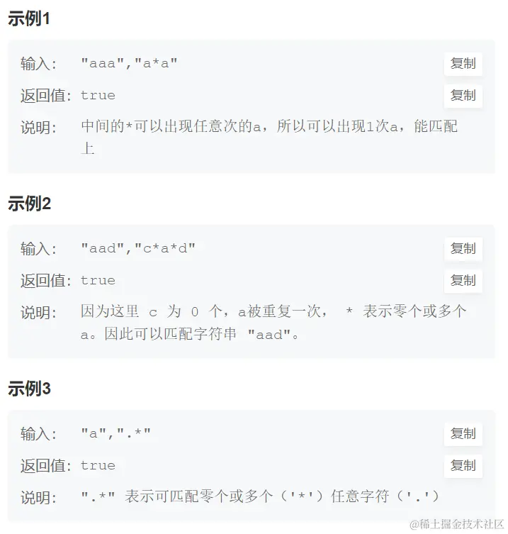
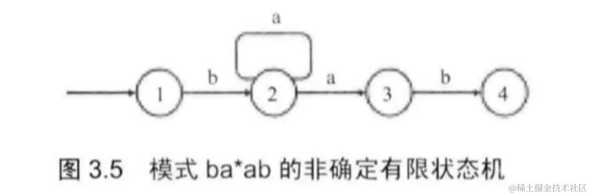
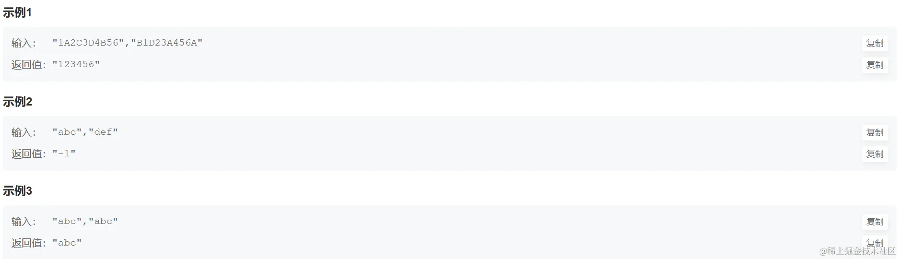
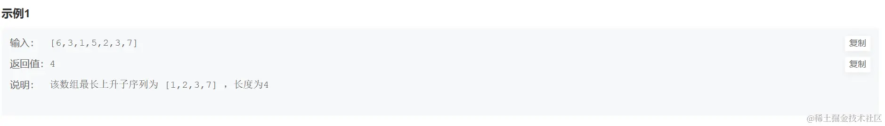

# 字符串篇之正则表达式匹配

描述
--

请实现一个函数用来匹配包括'.'和'*'的正则表达式。

1.模式中的字符'.'表示任意一个字符

2.模式中的字符'*'表示它前面的字符可以出现任意次（包含0次）。

在本题中，匹配是指字符串的所有字符匹配整个模式。例如，字符串"aaa"与模式"a.a"和"ab_ac_a"匹配，但是与"aa.a"和"ab*a"均不匹配

数据范围
----

1.str 只包含从 a-z 的小写字母。

2.pattern 只包含从 a-z 的小写字母以及字符 . 和 _，无连续的 '_'。

3. 0≤str.length≤26 

4. 0≤pattern.length≤26

举例
--



解题思路
----

本题不难理解，但是匹配过程中需要考虑的情况比较多，需要谨慎地考虑到每一种情况。

首先，我们分析如何匹配一个字符，当用一个字符去和模式串中的字符匹配时，如果模式中的字符是.，那么任何字符都可以匹配:或者，如果两个字符相同，那么可以匹配，接着再去匹配下一个字符。

相对来说，当模式串的第二个字符不是 \* 时，问题比较简单:若字符串的第一个字符和模式串的第一个字符匹配时，字符害和模式串指针都向后移动一个字符，然后匹配剩余的字符串和模式。如果第一个字符不匹配，那么就可以直接返回false。

当模式串的第二个字符是 \* 时，情况就比较复杂，因为可能有多种不同的匹配方式:

*   无论第一个字符是否相等，模式串向后移动两个字符，相当于 \* 和它前面的字符被忽略，因为 \* 可以代表前面的字符出现0次。
*   如果模式串第一个字符和字符串第一个字符匹配，则字符串向后移动一个字符，比较下一位，而模式串此时有两种情况:模式串向后移动两个字符，也可以保持模式不变 (因为 \* 可以代表前面的字符出现多次)。

如下图所示，当匹配进入状态2并目字符串的字符是a时，有两种选择: 进入状态3或者保持状态2。



实现代码（java）
----------

```java
public class Solution {
    public boolean match(char[] str, char[] pattern){
        
        思路：比较前两个字符，递归比较
        */
        if(str==null || pattern==null)
            return false;
        return match(str,0,pattern,0);
    }
    public boolean match(char[] str,int i,char[] pattern,int j){
        if(i==str.length && j==pattern.length)
            return true;
        if(i<str.length && j==pattern.length)
            return false;
        
        if(j+1<pattern.length && pattern[j+1]=='*'){ 
            if((i<str.length && str[i]==pattern[j]) ||(i<str.length && pattern[j]=='.') ) 
                return match(str,i,pattern,j+2) || match(str,i+1,pattern,j+2) || match(str,i+1,pattern,j);
                
            else 
                return match(str,i,pattern,j+2);
        }else{     
            if((i<str.length && str[i]==pattern[j]) || ( pattern[j]=='.'&& i< str.length))
                return match(str,i+1,pattern,j+1);
            else
                return false;
        }
        
    }
}

```

学习完本题的思路你可以解决如下题目：

[BM65 最长公共子序列(二)](https://link.juejin.cn/?target=https%3A%2F%2Fwww.nowcoder.com%2Fpractice%2F6d29638c85bb4ffd80c020fe244baf11%3FtpId%3D295%26tqId%3D991075 "https://www.nowcoder.com/practice/6d29638c85bb4ffd80c020fe244baf11?tpId=295&tqId=991075")

难度：中等

描述
--

给定两个字符串str1和str2，输出两个字符串的最长公共子序列。如果最长公共子序列为空，则返回"-1"。目前给出的数据，仅仅会存在一个最长的公共子序列

举例
--



解题思路
----

动态规划+递归获取；题目要求获取最长公共子序列，我们肯定要先知道最长到底是多长，因此肯定要先求最长公共子序列的长度，然后根据这个长度获取这个子序列。（注意：子序列不是子串，子串要求所有字符必须连续，子序列不要求连续，只要求相对位置不变）

*   首先对于动态规划，需要明确状态: 当前处理到的 s1 和 s2 分别的第 i 和第 j 个字符
    
*   定义状态数组：`dp[i][j]`表示从左到右，当处理到s1的第i个元素和s2的第j个元素时的公共子序列
    
*   状态初始化，即当i==0或j==0的情况，`dp[i][j]`为""，因为空字符串没有公共子序列
    
*   状态转移
    
    *   当前字符相等，则添加结果，i 和 j 指针右移,状态转移方程为：`dp[i][j] = dp[i-1][j-1] + s1.charAt(i-1);`
    *   当前字符不相等，则还需要分两种情况，取长度较长的情况，状态转移方程为： `dp[i][j] = dp[i-1][j].length() > dp[i][j-1].length() ? dp[i-1][j] : dp[i][j-1]`

实现代码（java）
----------

```java
import java.util.*;

public class Solution {
    
     * longest common subsequence
     * @param s1 string字符串 the string
     * @param s2 string字符串 the string
     * @return string字符串
     */
    public String LCS (String s1, String s2) {
        int len1 = s1.length(), len2 = s2.length();
        
        
        String[][] dp = new String[len1 + 1][len2 + 1];
        
        for(int i = 0; i <= len1; i++) {
            
            dp[i][0] = "";
        }
        for(int j = 0; j <= len2; j++) {
            
            dp[0][j] = "";
        }
        
        for(int i = 1; i <= len1; i++) {
            for(int j = 1; j <= len2; j++) {
                
                if(s1.charAt(i - 1) == s2.charAt(j - 1)) {
                    dp[i][j] = dp[i-1][j-1] + s1.charAt(i-1);
                } else {
                    
                    dp[i][j] = dp[i-1][j].length() > dp[i][j-1].length() ? dp[i-1][j] : dp[i][j-1];
                }
            }
        }
        return dp[len1][len2] == "" ? "-1" : dp[len1][len2];
    }
}

```

学习完本题的思路你可以解决如下题目： [BM71.最长上升子序列(一)](https://link.juejin.cn/?target=https%3A%2F%2Fwww.nowcoder.com%2Fpractice%2F5164f38b67f846fb8699e9352695cd2f%3FtpId%3D295%26tqId%3D2281434 "https://www.nowcoder.com/practice/5164f38b67f846fb8699e9352695cd2f?tpId=295&tqId=2281434")

难度：中等

描述
--

给定一个长度为 n 的数组 arr，求它的最长严格上升子序列的长度。

所谓子序列，指一个数组删掉一些数（也可以不删）之后，形成的新数组。例如 \[1,5,3,7,3\] 数组，其子序列有：\[1,3,3\]、\[7\] 等。但 \[1,6\]、\[1,3,5\] 则不是它的子序列。

我们定义一个序列是 **严格上升** 的，当且仅当该序列**不存在**两个下标 ii 和 jj 满足 i<ji<j 且 arri≥arrjarri​≥arrj​。

举例
--



解题思路
----

动态规划；

*   状态定义：dp\[i\]dp\[i\]dp\[i\]表示以下标i结尾的最长上升子序列的长度。
*   状态初始化：以任意下标结尾的上升子序列长度不小于1，故初始化为1。
*   状态转移：遍历数组中所有的数，再遍历当前数之前的所有数，只要前面某个数小于当前数，则要么长度在之前基础上加1，要么保持不变，取两者中的较大者。即dp\[i\]=Math.max(dp\[i\],dp\[j\]+1)dp\[i\]=Math.max(dp\[i\],dp\[j\]+1)dp\[i\]=Math.max(dp\[i\],dp\[j\]+1)。

实现代码（java）
----------

```java
import java.util.*;

public class Solution {
    
     * 代码中的类名、方法名、参数名已经指定，请勿修改，直接返回方法规定的值即可
     *
     * 给定数组的最长严格上升子序列的长度。
     * @param arr int整型一维数组 给定的数组
     * @return int整型
     */
    public int LIS (int[] arr) {
        int n=arr.length;
        
        if(n==0) return 0;
        
        int[] dp=new int[n];
        for(int i=0;i<n;i++){
            
            dp[i]=1;
            for(int j=0;j<i;j++){
                if(arr[i]>arr[j]){
                    
                    dp[i]=Math.max(dp[i],dp[j]+1);
                }
            }
        }
        
        return Arrays.stream(dp).max().getAsInt();
    }
}

```