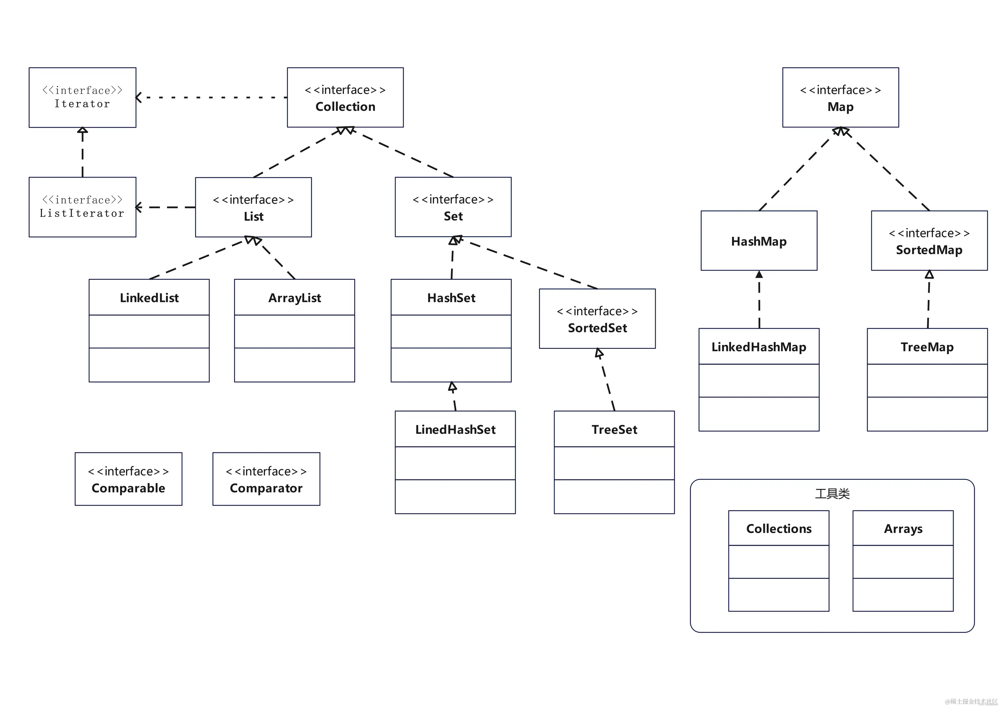
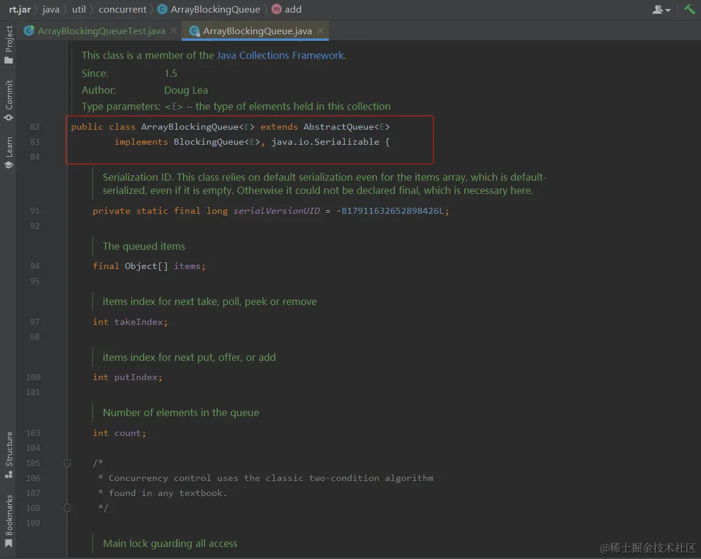
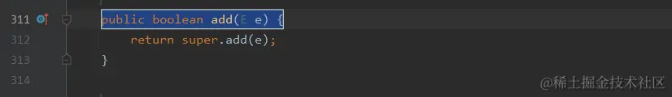
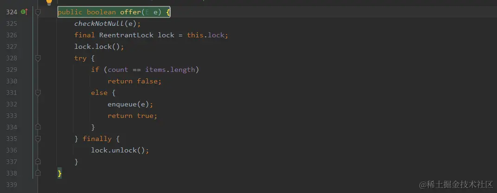
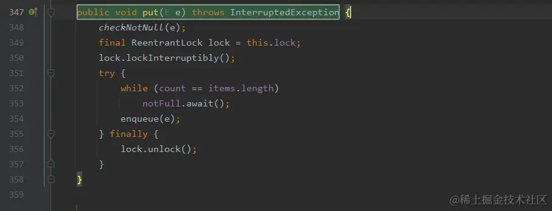
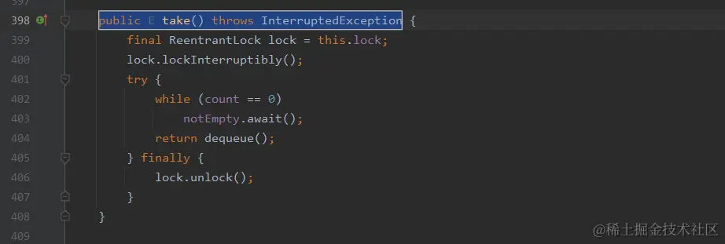
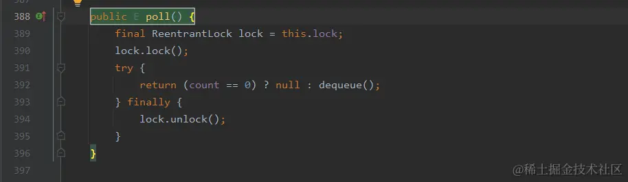
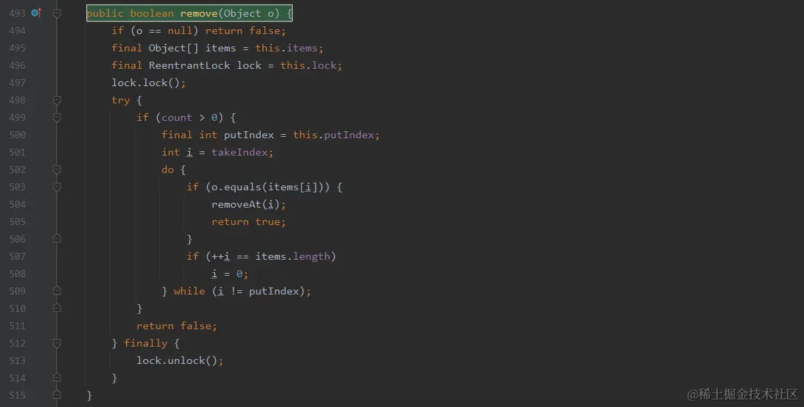
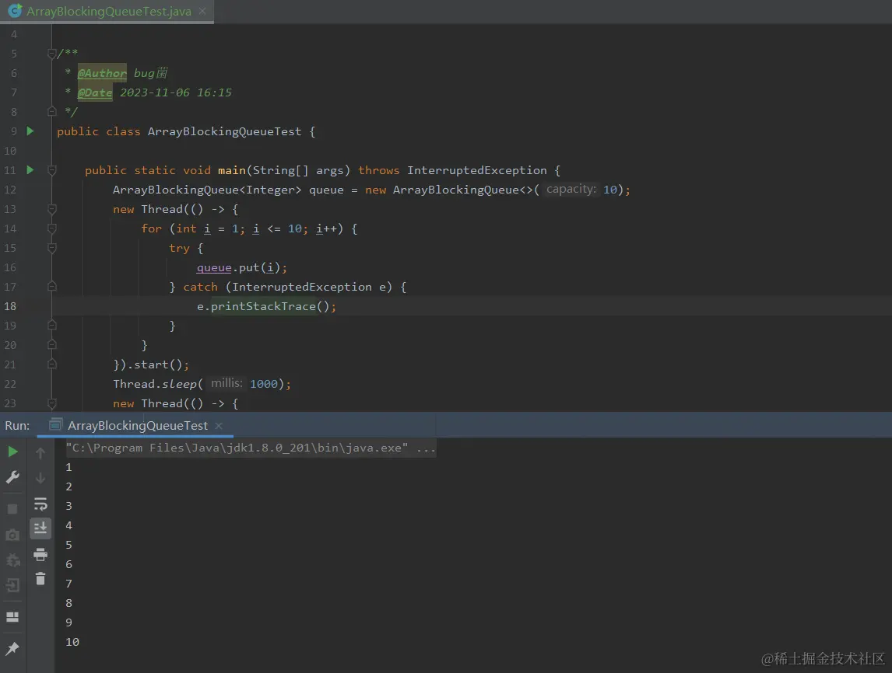

# 深入剖析Java中的ArrayBlockingQueue底层实现与源码分析



* * *
  在Java开发中，队列是一种常见的数据结构，而其中的ArrayBlockingQueue是一个经典且实用的队列实现。它采用数组作为底层实现，在多线程并发访问下表现出较好的稳定性和高效性。本文将深入剖析Java中的ArrayBlockingQueue底层实现与源码分析。

  本文通过对ArrayBlockingQueue的源代码解析，分析其底层实现原理，探讨其在多线程并发处理场景下的应用场景，并对其优缺点做出评估。同时，本文还对类中的各个方法进行了介绍，并给出了测试用例和总结。

概述
--

  ArrayBlockingQueue是Java中的一个队列实现类，它使用一个定长的数组作为底层数据结构，并支持多线程并发访问。当队列为空时，从队列中获取元素的操作将会被阻塞，直到队列中出现新的元素；当队列满时，向队列插入元素的操作也会被阻塞，直到之前的元素被取出或者队列被清空。ArrayBlockingQueue可以作为生产者-消费者模式的一种经典实现方案，在多线程并发处理场景下具有广泛的应用。

源代码解析：
------

ArrayBlockingQueue类定义了如下的构造函数：

```java
public ArrayBlockingQueue(int capacity, boolean fair) {
    if (capacity <= 0)
        throw new IllegalArgumentException();
    this.items = new Object[capacity];
    lock = new ReentrantLock(fair);
    notEmpty = lock.newCondition();
    notFull =  lock.newCondition();
}

```

  其中，capacity表示队列的容量，fair表示是否采用公平的锁机制来进行多线程访问。在构造函数中，我们可以看到该类使用了一个Object类型的数组来作为队列的底层数据结构，同时还创建了两个Condition对象来分别表示队列为空和队列已满的情况。

  该类中主要的方法包括add、offer、put、take、poll、remove等，这些方法用于向队列中添加和删除元素。下面我们就对其中的一些方法进行解析。

  如下是部分源码截图：



### add方法：

```java
public boolean add(E e) {
    if (offer(e))
        return true;
    else
        throw new IllegalStateException("Queue full");
}

```

  该方法先调用了offer方法来将元素添加到队列中，并在offer方法返回false时抛出了一个IllegalStateException异常。

**拓展：** 

  这是一个Java中的队列数据结构的添加元素方法的实现。

代码中首先调用了队列中的offer方法，该方法用于将元素插入到队列的尾部，并返回插入是否成功的结果（true表示插入成功，false表示插入失败）。

如果插入成功，add方法直接返回true表示插入成功；如果插入失败，add方法会抛出一个IllegalStateException异常，表示队列已满，无法继续插入元素。

因为这个队列应该有一个容量限制，所以当队列已经满了，就不能再放入元素了，此时抛出 IllegalStateException 异常，提示调用者队列已满。



### offer方法：

```java
public boolean offer(E e) {
    if (e == null) throw new NullPointerException();
    final ReentrantLock lock = this.lock;
    lock.lock();
    try {
        if (count == items.length)
            return false;
        else {
            insert(e);
            return true;
        }
    } finally {
        lock.unlock();
    }
}

```

  该方法首先判断参数e是否为null，然后获取类中的ReentrantLock对象，并使用该对象进行加锁操作。在获取锁后，该方法会判断队列是否已满，如果已满则返回false，否则调用insert方法将元素插入到队列中，然后返回true。最后，该方法释放锁并返回结果。

**拓展：** 

  这是一个队列的 offer 方法实现，用于向队列中添加元素。它的参数是要添加的元素 e，返回值是一个 boolean 类型，表示添加是否成功。首先，它会判断要添加的元素是否为 null，如果是则抛出 NullPointerException 异常。然后获取队列的锁，使用的是 ReentrantLock，确保线程安全。接下来，它会检查队列的容量是否已满，如果已满则无法添加，返回 false，否则就调用 insert 方法将元素添加到队列中，并返回 true 表示添加成功。最后，释放锁。



### put方法：

```java
public void put(E e) throws InterruptedException {
    if (e == null) throw new NullPointerException();
    final ReentrantLock lock = this.lock;
    lock.lockInterruptibly();
    try {
        while (count == items.length) {
            notFull.await();
        }
        insert(e);
    } finally {
        lock.unlock();
    }
}

```

  该方法和offer方法类似，不同之处在于当队列已满时，该方法会一直等待队列中出现空闲空间。在wait之前，该方法获取lock对象的锁，在wait之后释放锁。

**拓展：** 

  这是一个生产者向有界队列中添加元素的方法。如果队列已满，方法会阻塞直到队列不满为止。

具体解释如下：

1.  如果待插入元素 e 为 null，方法会抛出空指针异常。
    
2.  获取当前队列的可重入锁，使用 lockInterruptibly() 方法可以在等待锁的过程中响应中断。
    
3.  在锁的保护下，当队列已满时，使用 notFull.await() 方法将当前线程阻塞，等待 notFull 条件变量的通知，表示队列非满。
    
4.  当 notFull 条件变量被通知时，将元素 e 插入到队列中，使用 insert(e) 方法完成插入操作。
    
5.  最后，释放锁。
    

  总体来说，这个方法在多线程环境下保证了有界队列的线程安全，同时也保证了生产者线程在队列已满时的阻塞加入操作。



### take方法：

```java
public E take() throws InterruptedException {
    final ReentrantLock lock = this.lock;
    lock.lockInterruptibly();
    try {
        while (count == 0) {
            notEmpty.await();
        }
        return extract();
    } finally {
        lock.unlock();
    }
}

```

  该方法和put方法类似，不同之处在于take方法会在队列为空时等待队列中出现新的元素。在wait之前，该方法获取lock对象的锁，在wait之后释放锁。

**拓展：** 

  这段代码实现了阻塞队列中的元素删除操作，使用了可中断锁来保证线程安全。

具体操作流程如下：

1.  获取可重入锁 lock。
    
2.  尝试获取锁，如果获取不到则线程被阻塞。
    
3.  如果队列为空，则调用 notEmpty.await() 方法使线程等待。
    
4.  如果队列不为空，则调用 extract() 方法删除队列中的元素并返回。
    
5.  释放锁。
    

  值得注意的是，await() 方法会让当前线程进入一个等待状态，直到被唤醒或者中断。而 extract() 方法则是队列中元素删除的具体实现方法。



### poll方法：

```java
public E poll() {
    final ReentrantLock lock = this.lock;
    lock.lock();
    try {
        if (count == 0)
            return null;
        E x = extract();
        return x;
    } finally {
        lock.unlock();
    }
}

```

  该方法首先获取lock对象的锁，然后判断队列是否为空。如果队列为空，则返回null，否则调用extract方法从队列中提取元素，然后释放锁并返回该元素。】

**拓展：** 

  这段代码实现了`BlockingQueue`接口中的`offer`方法，用于向队列中插入元素。具体分析如下：

1.  首先进行参数检查，如果插入的元素为null，则抛出`NullPointerException`异常。
    
2.  获取队列的锁，使用`ReentrantLock`实现。如果锁获取失败则会一直等待。
    
3.  判断队列是否已满，如果已满则直接返回`false`表示插入失败；如果未满，则调用`insert`方法进行实际的插入操作，并返回`true`表示插入成功。
    
4.  最后释放队列的锁。
    

  总体来说，这段代码实现了一个线程安全的队列，保证了在多线程环境下插入元素的正确性和一致性。同时，通过使用`ReentrantLock`实现锁的获取和释放，相比于`synchronized`关键字，具有更高的灵活性和可控性。



### remove方法：

```java
public boolean remove(Object o) {
    if (o == null) return false;
    final Object[] items = this.items;
    final ReentrantLock lock = this.lock;
    lock.lock();
    try {
        for (int i = takeIndex, k = count; k > 0; i = inc(i), k--) {
            if (o.equals(items[i])) {
                removeAt(i);
                return true;
            }
        }
        return false;
    } finally {
        lock.unlock();
    }
}

```

  该方法首先判断参数o是否为null，然后获取items和lock对象。在获取锁后，该方法会遍历队列中的元素，查找和参数o相等的元素，并调用removeAt方法将其从队列中删除。最后释放锁并返回结果。

**拓展：** 

  这段代码实现了ConcurrentLinkedQueue的remove方法，用于从队列中删除指定的元素。

  首先，判断待删除元素是否为null，如果是则直接返回false，因为队列中不允许添加null元素。然后获取队列的元素数组和锁对象，通过锁保证并发操作的线程安全性。接下来，循环遍历队列中的元素，从takeIndex开始遍历，取模运算保证了下标的循环使用。k表示队列中元素的个数，每找到一个匹配的元素，就使用removeAt方法将其删除，然后返回true。如果遍历整个队列都没有找到匹配的元素，说明该元素不在队列中，返回false。

  最后，解锁锁对象，结束方法。



应用场景案例：
-------

  ArrayBlockingQueue可以应用于生产者-消费者模式等多线程并发处理场景。例如，在一个Web应用中，我们需要从数据库中读取大量数据并将其渲染为Web页面。由于数据库读取和页面渲染是两个耗时的操作，我们可以使用ArrayBlockingQueue来实现生产者-消费者模式，其中生产者可以将数据库中读取的数据放入队列中，而消费者则从队列中获取这些数据并进行渲染。

优缺点分析：
------

### 优点：

1.  线程安全：ArrayBlockingQueue是线程安全的，多个线程可以同时访问队列中的元素而不会发生冲突。
    
2.  高效性：ArrayBlockingQueue使用数组作为底层数据结构，具有较高的效率。
    
3.  容量限制：ArrayBlockingQueue的容量是有限制的，可以避免队列过大导致内存溢出等问题。
    

### 缺点：

1.  容量限制：由于队列的容量是有限制的，因此可能会出现无法存储更多元素的情况。
    
2.  吞吐量：在高并发情况下，ArrayBlockingQueue的吞吐量可能会受到一定的限制。
    

类代码方法介绍：
--------

  ArrayBlockingQueue类中的各个方法在上面已经进行了介绍，在此不再赘述。

测试用例
----

下面是一个简单的测试用例：

### 测试代码演示

```java
package com.demo.javase.day71;

import java.util.concurrent.ArrayBlockingQueue;


 * @Author bug菌
 * @Date 2023-11-06 16:15
 */
public class ArrayBlockingQueueTest {

    public static void main(String[] args) throws InterruptedException {
        ArrayBlockingQueue<Integer> queue = new ArrayBlockingQueue<>(10);
        new Thread(() -> {
            for (int i = 1; i <= 10; i++) {
                try {
                    queue.put(i);
                } catch (InterruptedException e) {
                    e.printStackTrace();
                }
            }
        }).start();
        Thread.sleep(1000);
        new Thread(() -> {
            for (int i = 1; i <= 10; i++) {
                try {
                    int x = queue.take();
                    System.out.println(x);
                } catch (InterruptedException e) {
                    e.printStackTrace();
                }
            }
        }).start();
    }
}

```

### 测试结果

  根据如上测试用例，本地测试结果如下，仅供参考，你们也可以自行修改测试用例或者添加更多的测试数据或测试方法，进行熟练学习以此加深理解。

  上述测试用例中，我们创建了一个容量为10的ArrayBlockingQueue队列，并创建了两个线程，一个线程用于向队列中添加元素，另一个线程用于从队列中取出元素。在执行过程中，我们使用sleep方法让主线程阻塞1秒钟，以防止线程执行过程中队列未被填满或清空。测试结果如下所示：

```java
1
2
3
4
5
6
7
8
9
10

```

  可以看到，程序能够正常地向队列中添加元素并从队列中取出元素。

实际执行结果如下：



### 测试代码分析

  根据如上测试用例，在此我给大家进行深入详细的解读一下测试代码，以便于更多的同学能够理解并加深印象。   这段代码实现了使用ArrayBlockingQueue作为线程之间共享的队列。具体来说，程序启动两个线程，一个线程将1-10的整数依次放入队列中，另一个线程从队列中取出10个整数并打印输出。

在这个过程中，因为ArrayBlockingQueue具有阻塞特性，即当队列已满时，向队列中添加元素的线程会被阻塞，直到队列中有空余位置；当队列为空时，从队列中取出元素的线程会被阻塞，直到队列中有元素可取。因此，该程序可以保证线程间的同步，避免了多线程并发访问共享变量时可能出现的竞态条件问题。

小结
--

  本文对Java中的ArrayBlockingQueue队列实现进行了深入的分析，包括其底层数据结构、构造函数、主要方法以及应用场景等方面。ArrayBlockingQueue作为一个经典的队列实现，虽然存在一定的缺点，但在多线程并发处理场景下具有广泛的应用前景。在实际开发中，我们可以根据具体情况选择合适的队列实现，并结合线程池等技术来优化程序性能。

  本文深入剖析了Java中的ArrayBlockingQueue队列实现，探讨了其底层实现原理以及在多线程并发处理场景下的应用场景。同时对类中的各个方法进行了介绍，并给出了测试用例和优缺点评估。ArrayBlockingQueue作为一个经典的队列实现，具有线程安全和高效性等优点，但由于容量限制可能出现无法存储更多元素的情况，吞吐量也可能受到一定限制。在实际开发中，我们可以根据具体情况选择合适的队列实现，并结合线程池等技术来优化程序性能。
