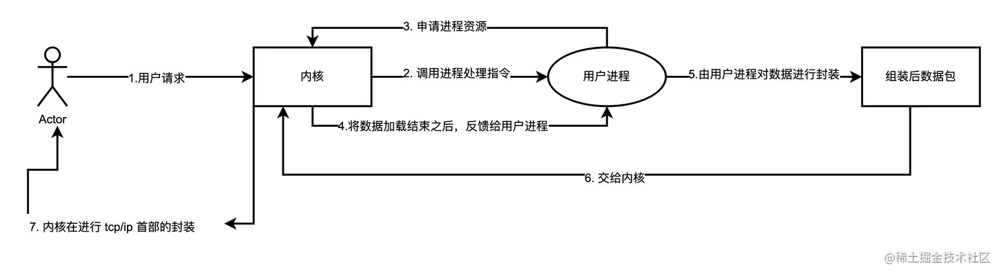
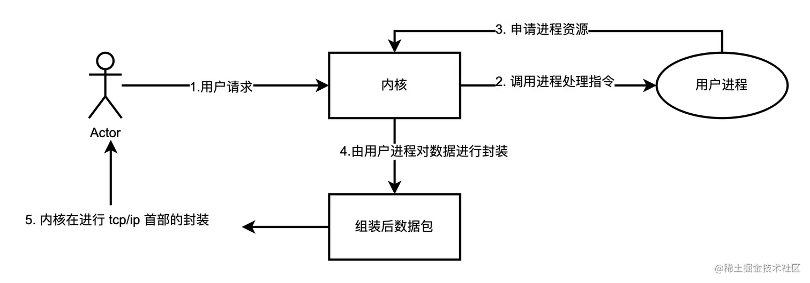
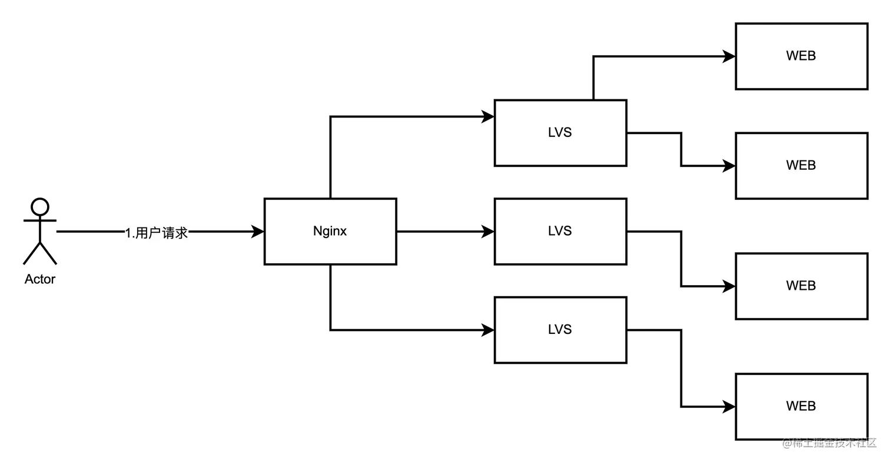

# 深入浅出学习透析Nginx服务器的架构分析及原理分析「底层技术原理+运作架构机制」
Nginx再次回顾
---------

### 多协议反向代理

Nginx是个高性能的Web和反向代理服务器及HTTP服务器，它能反向代理HTTP，HTTPS和邮件相关(SMTP，POP3，IMAP)的协议链接，还可以提供了负载均衡以及HTTP缓存。

### 它的功能特点

*   功能丰富：优秀的反向代理功能和灵活的负载均衡策略
*   异步事件模型：削减上下文调度的开销，提高服务器并发能力，官方数据每秒支持 5 万并发。
*   模块化：具有良好的扩展性，可以通过模块方式进行功能扩展。
*   高可靠性：主控进程和 worker 是同步实现的，一个 worker 出现问题，会立刻启动另一个 worker。
*   内存低损耗：10000个keep-alive长连接，大致会消耗3MB左右的内存。

Ngnix高可用服务架构
------------

分布式系统中，应用只部署一台服务器会存在单点故障，负载均衡同样有类似的问题。一般可采用主备或负载均衡设备集群的方式节约单点故障或高并发请求分流。

Ngnix 高可用，至少包含两个 Ngnix 服务器，一台主服务器，一台备服务器，之间使用 Keepalived 做健康监控和故障检测。开放 VIP 端口，通过防火墙进行外部映射。

### 主从模式

大多数场景下，Nginx采用一主多从的主从架构，如下图所示。

#### Nginx服务节点

##### Master节点负责范围

*   Master节点主要负责的作用只是启动worker，加载配置文件，负责系统的平滑升级。
    
*   Master节点不负责具体的工作，而是调用 worker 工作，他只是负责读取配置文件，因此当一个模块修改或者配置文件发生变化，是由 master 进行读取，因此此时不会影响到 worker 工作。
    

##### Worker节点负责范围

*   Worker节点被启动之后，负责一些Web最简单的工作，而其他的工作都是有worker 中调用的模块来实现的。模块之间是以流水线的方式实现功能的。
    
*   Master节点进行读取配置文件之后，不会立即的把修改的配置文件告知Worker。而是让被修改的Worker继续使用老的配置文件工作，当Worker工作完毕之后，直接当掉这个子进程，更换新的子进程，使用新的规则。
    

> 流水线，指的是一个用户请求，由多个模块组合各自的功能依次实现完成的。比如：第一个模块只负责分析请求首部，第二个模块只负责查找数据，第三个模块只负责压缩数据，依次完成各自工作。来实现整个工作的完成。

Nginx 通信模型采用 I/O 复用机制
---------------------

*   开发模型：epoll和kqueue。
    
*   事件机制：kqueue、epoll、rt signals、/dev/poll 、event ports、select 以及 poll。
    

### 事件模型

Nginx支持如下处理连接的方法（I/O复用方法），这些方法可以通过use指令指定。

*   select - 标准方法。 如果当前平台没有更有效的方法，它是编译时默认的方法。你可以使用配置参数 —with-select\_module 和 —without-select\_module 来启用或禁用这个模块。
*   poll - 标准方法。 如果当前平台没有更有效的方法，它是编译时默认的方法。你可以使用配置参数 —with-poll\_module 和 —without-poll\_module 来启用或禁用这个模块。
*   kqueue - 高效的方法，使用于 FreeBSD 4.1+, OpenBSD 2.9+, NetBSD 2.0 和 MacOS X. 使用双处理器的MacOS X系统使用kqueue可能会造成内核崩溃。
*   epoll - 高效的方法，使用于Linux内核2.6版本及以后的系统。在某些发行版本中，如SuSE 8.2, 有让2.4版本的内核支持epoll的补丁。

支持的kqueue特性包括 EV\_CLEAR、EV\_DISABLE、NOTE\_LOWAT、EV\_EOF，可用数据的数量，错误代码.

> 支持sendfile、sendfile64 和 sendfilev文件AIO；DIRECTIO，支持Accept-filters 和 TCP\_DEFER\_ACCEP.

Nginx支持sendfile机制
-----------------

一般情况下的数据处理模型和流程，如下所示。

1.  用户将请求发给内核。
2.  内核根据用户的请求调用相应用户进程，用户进程在处理时需要申请对应的资源。
3.  用户进程需要把请求再次发给内核（进程没有直接IO的能力），由内核加载数据。
4.  内核查找到数据之后，会把数据复制给用户进程，由用户进程对数据进行封装，交给内核。
5.  内核在进行 tcp/ip 首部的封装，最后再发给客户端。

这个功能用户进程只是发生了一个封装报文的过程，却要绕一大圈， 所以有了Sendfile，它的总体工作流程，如下所示。

因此，Nginx引入了sendfile 机制，使得内核在接受到数据之后，不再依靠用户进程给予封装，而是自己查找自己封装，减少了一个很长一段时间的浪费，这是一个提升性能的核心点。

> **目前高并发的处理，一般都采用 sendfile 模式。通过直接操作内核层数据，减少应用与内核层数据传递**。

Nginx 场景
--------

Ngnix 一般作为入口负载均衡或内部负载均衡，结合反向代理服务器使用。

### 入口负载均衡架构

Ngnix 服务器在用户访问的最前端。根据用户请求再转发到具体的应用服务器或二级负载均衡服务器（LVS）。

### 内部负载均衡架构

LVS 作为入口负载均衡，将请求转发到二级 Ngnix 服务器，Ngnix 再根据请求转发到具体的应用服务器。

