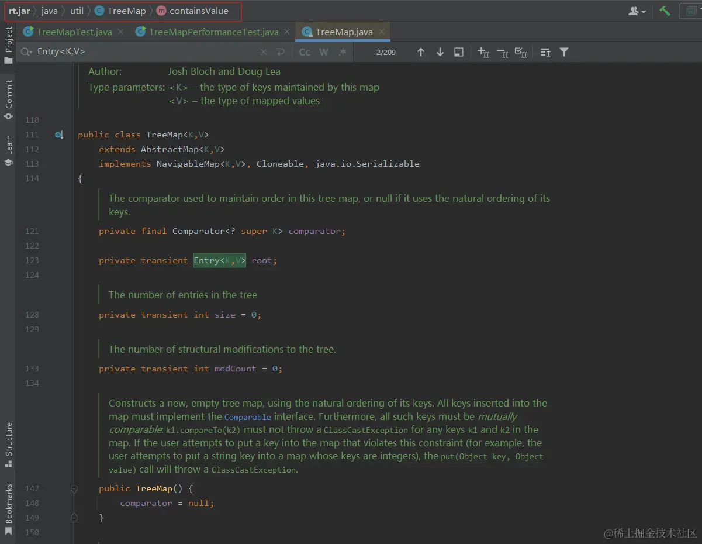
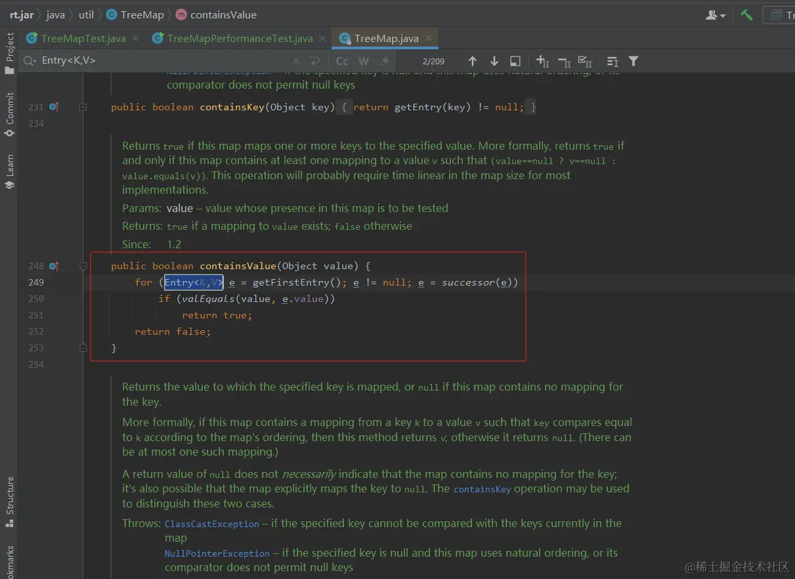
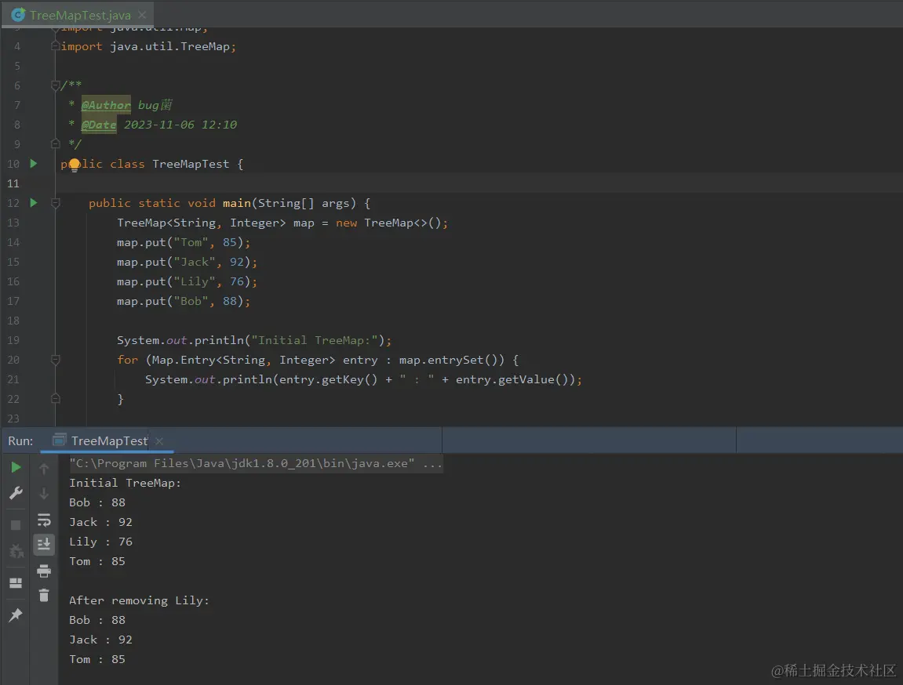
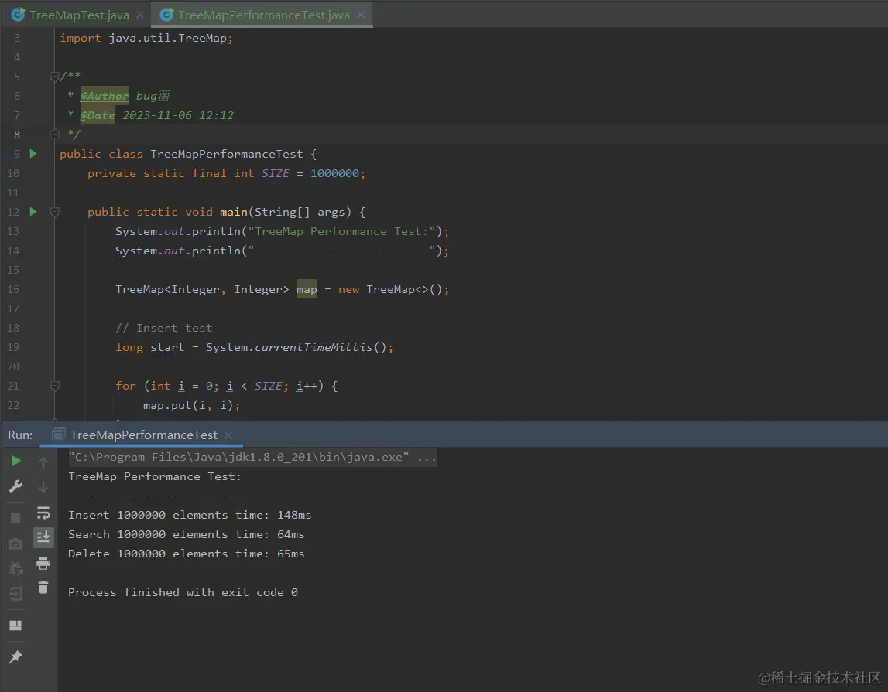

# 深入理解 TreeMap：Java 中的有序键值映射表 


* * *
  在 Java 编程中，我们经常需要使用到键值映射表这种数据结构。其中，HashMap 是最常用的一种，它能够以 O(1) 的时间复杂度完成插入、查找、删除等操作。但是，HashMap 并不能对键进行排序，因此如果我们需要按有序方式来保存键值对，就需要使用到 TreeMap了。

  本篇文章将深入介绍 TreeMap 的原理、源码实现、应用场景、优缺点以及相关测试用例。

概述
--

  TreeMap 是一种基于红黑树实现的有序键值映射表。它实现了 Map 接口，并且根据键的自然排序或者根据一个 Comparator 进行排序。在 TreeMap 中，键值对是按照键进行排序的，因此遍历 TreeMap 时得到的键值对是有序的。

源代码解析
-----

TreeMap 的主要实现类是 TreeMap 类。我们来看一下它的源码实现。

```java
public class TreeMap<K,V> extends AbstractMap<K,V>
    implements NavigableMap<K,V>, Cloneable, java.io.Serializable {
    
    
    
    public TreeMap() {
        comparator = null;
    }
    
    public TreeMap(Comparator<? super K> comparator) {
        this.comparator = comparator;
    }
    
    
    
    public Set<Map.Entry<K,V>> entrySet() {
        return new EntrySet();
    }
    
    
    
}

```

  从代码中可以看出，TreeMap 实现了 Map 接口和 NavigableMap 接口，并且继承了 AbstractMap。它也提供了多个构造方法，可以根据需要选择。

  如下是部分源码截图：



  下面我们来看一下 TreeMap 中最重要的实现类 Entry。Entry 类表示 TreeMap 中的一个键值对，它包含了键和值两个属性，其中键是有序的。

```java
static final class Entry<K,V> implements Map.Entry<K,V> {
    K key;
    V value;
    Entry<K,V> left = null;
    Entry<K,V> right = null;
    Entry<K,V> parent;
    boolean color = BLACK;

    
     * Make a new cell with given key, value, and parent, and with
     * {@code null} child links, and BLACK color.
     */
    Entry(K key, V value, Entry<K,V> parent) {
        this.key = key;
        this.value = value;
        this.parent = parent;
    }

    
}

```

  Entry 类中定义了一个 boolean 类型的 color 属性，它表示该节点的颜色，用于红黑树的平衡操作。Entry 类中还包含了 left、right、parent 三个指针，用于指向该节点的左子节点、右子节点和父节点。

  如下是部分源码截图：



应用场景案例
------

  以下是使用 TreeMap 的一个实际案例。我们有一个成绩表，需要按照学生姓名的字典序进行排序，而 TreeMap 刚好可以满足这个需求。

```java
import java.util.*;

public class ScoreTable {
    public static void main(String[] args) {
        TreeMap<String, Integer> map = new TreeMap<>();
        map.put("Tom", 85);
        map.put("Jack", 92);
        map.put("Lily", 76);

        for (Map.Entry<String, Integer> entry : map.entrySet()) {
            System.out.println(entry.getKey() + " : " + entry.getValue());
        }
    }
}

```

运行结果如下：

```java
Jack : 92
Lily : 76
Tom : 85

```

  从运行结果可以看出，TreeMap 把学生姓名按照字典序排序后输出。

优缺点分析
-----

以下是 TreeMap 的优缺点分析。

### 优点

1.  TreeMap 可以对键进行排序，因此遍历 TreeMap 时得到的键值对是有序的。
2.  TreeMap 可以根据自然顺序或者自定义比较器进行排序。
3.  TreeMap 的内部实现使用红黑树，因此插入、查找、删除等操作的时间复杂度为 O(log n)。

### 缺点

1.  TreeMap 要求键是可比较的，因此不能存储自定义对象类型的键。
2.  TreeMap 的内部结构是红黑树，它比 HashMap 内部的哈希表结构要占用更多的内存，因此 TreeMap 的空间复杂度要高于 HashMap。
3.  对于频繁的插入、删除操作，TreeMap 的效率不如 HashMap 高。

类代码方法介绍
-------

以下是 TreeMap 类中一些常用的方法的介绍。

### 构造方法

```java
   
   public TreeMap()

   
   public TreeMap(Comparator<? super K> comparator)

```

**代码拓展**

  这段代码是 Java 中 TreeMap 类的构造函数，用于创建 TreeMap 对象。

  第一个构造函数 `public TreeMap()` 创建一个空的 TreeMap，没有指定任何比较器，默认使用自然排序（即实现 Comparable 接口）。

  第二个构造函数 `public TreeMap(Comparator<? super K> comparator)` 创建一个 TreeMap 对象，并指定一个特定的比较器来对键进行排序。Comparator 参数是用于比较键的比较器，它可以是任何实现了 Comparator 接口的类或者 lambda 表达式。通过这个构造函数，我们可以根据自己的需要自定义排序规则。

  注意，TreeMap 的键必须实现 Comparable 接口或者在创建 TreeMap 时指定一个 Comparator 比较器，否则会抛出 ClassCastException 异常。

### 读取方法

```java
   
   public int size()

   
   public boolean isEmpty()

   
   public V get(Object key)
   
   
   public Map.Entry<K,V> higherEntry(K key)
   
   
   public K higherKey(K key)
   
   
   public Map.Entry<K,V> lowerEntry(K key)
   
   
   public K lowerKey(K key)
   
   
   public Map.Entry<K,V> ceilingEntry(K key)
   
   
   public K ceilingKey(K key)
   
   
   public Map.Entry<K,V> floorEntry(K key)
   
   
   public K floorKey(K key)
   
   
   public Map.Entry<K,V> firstEntry()
   
   
   public K firstKey()
   
   
   public Map.Entry<K,V> lastEntry()
   
   
   public K lastKey()

```

**代码拓展**

  这段代码是 TreeMap 类中的一些常用方法，具体说明如下：

*   size()：返回 TreeMap 的大小（即键值对个数）。
*   isEmpty()：判断 TreeMap 是否为空，如果为空则返回 true，否则返回 false。
*   get(key)：返回键为 key 对应的值，如果 key 不存在则返回 null。
*   higherEntry(key)：返回 TreeMap 中比键 key 大的最小键值对，如果不存在则返回 null。
*   higherKey(key)：返回 TreeMap 中比键 key 大的最小键，如果不存在则返回 null。
*   lowerEntry(key)：返回 TreeMap 中比键 key 小的最大键值对，如果不存在则返回 null。
*   lowerKey(key)：返回 TreeMap 中比键 key 小的最大键，如果不存在则返回 null。
*   ceilingEntry(key)：返回 TreeMap 中键值比 key 大的最小键值对，如果 TreeMap 为空则返回 null。
*   ceilingKey(key)：返回 TreeMap 中键值比 key 大的最小键，如果 TreeMap 为空则返回 null。
*   floorEntry(key)：返回 TreeMap 中键值比 key 小的最大键值对，如果 TreeMap 为空则返回 null。
*   floorKey(key)：返回 TreeMap 中键值比 key 小的最大键，如果 TreeMap 为空则返回 null。
*   firstEntry()：返回 TreeMap 中最小的键值对，如果 TreeMap 为空则返回 null。
*   firstKey()：返回 TreeMap 中最小的键，如果 TreeMap 为空则抛出 NoSuchElementException 异常。
*   lastEntry()：返回 TreeMap 中最大的键值对，如果 TreeMap 为空则返回 null。
*   lastKey()：返回 TreeMap 中最大的键，如果 TreeMap 为空则抛出 NoSuchElementException 异常。

  这些方法可以帮助我们操作 TreeMap 中的键值对，常用于查询和遍历操作。

### 写入方法

```java
   
   public V put(K key, V value)
   
   
   public V remove(Object key)
   
   
   public void clear()

```

**代码拓展**

  这是针对 Java 中的 TreeMap 类进行的方法分析：

1.  put(K key, V value): 该方法用于将指定的键值对插入到 TreeMap 中。如果 TreeMap 中已经有该键，则用新的值替换旧的值，并返回旧的值；如果 TreeMap 中没有该键，则插入该键值对，并返回 null。
    
2.  remove(Object key): 该方法用于从 TreeMap 中删除指定的键及其对应的值。如果 TreeMap 中有该键，则删除该键值对，并返回其对应的值；如果 TreeMap 中没有该键，则返回 null。
    
3.  clear(): 该方法用于清空 TreeMap 中的所有键值对。调用该方法后，TreeMap 的大小变为 0，但 TreeMap 仍然存在。
    

### 转换方法

```java
   
   public Object clone()

   
   public Set<K> keySet()

   
   public Set<Map.Entry<K, V>> entrySet()

   
   public Collection<V> values()

```

**代码拓展**

  这段代码是 Java 中 TreeMap 类的几个常用方法的声明，具体解释如下：

1.  `public Object clone()` 方法会返回一个 TreeMap 的副本，也就是一个新的 TreeMap，其中包含与原始 TreeMap 相同的键值对。这个方法可以用来创建原始 TreeMap 的副本，以在对副本进行操作时不影响原始 TreeMap。
    
2.  `public Set<K> keySet()` 方法会返回 TreeMap 中所有键的有序集合。该方法可以用于遍历 TreeMap 中的所有键。
    
3.  `public Set<Map.Entry<K, V>> entrySet()` 方法会返回 TreeMap 中所有键值对的集合。集合中每个元素都是一个 Map.Entry 对象，包含键和相应的值。该方法可以用于遍历 TreeMap 中的所有键值对。
    
4.  `public Collection<V> values()` 方法会返回 TreeMap 中所有值的无序集合。该方法可以用于遍历 TreeMap 中的所有值。
    

  需要注意的是，TreeMap 的键必须是可比较的对象，并且按照键的自然顺序进行排序。如果要使用自定义比较器对键进行排序，可以使用 TreeMap 的另一个构造函数，该构造函数接受一个实现了 Comparator 接口的比较器对象作为参数。

测试用例
----

以下是针对 TreeMap 的测试用例。

### 测试用例

测试 TreeMap 的基本操作，包括插入、删除和遍历。

```java
package com.demo.javase.day67;

import java.util.Map;
import java.util.TreeMap;


 * @Author bug菌
 * @Date 2023-11-06 12:10
 */
public class TreeMapTest {

    public static void main(String[] args) {
        TreeMap<String, Integer> map = new TreeMap<>();
        map.put("Tom", 85);
        map.put("Jack", 92);
        map.put("Lily", 76);
        map.put("Bob", 88);

        System.out.println("Initial TreeMap:");
        for (Map.Entry<String, Integer> entry : map.entrySet()) {
            System.out.println(entry.getKey() + " : " + entry.getValue());
        }

        map.remove("Lily");

        System.out.println("\nAfter removing Lily:");
        for (Map.Entry<String, Integer> entry : map.entrySet()) {
            System.out.println(entry.getKey() + " : " + entry.getValue());
        }
    }
}

```

### 测试结果

  根据如上测试用例，本地测试结果如下，仅供参考，你们也可以自行修改测试用例或者添加更多的测试数据或测试方法，进行熟练学习以此加深理解。

运行结果如下：

```java
Initial TreeMap:
Jack : 92
Lily : 76
Bob : 88
Tom : 85

After removing Lily:
Bob : 88
Jack : 92
Tom : 85

```

具体执行截图如下：



### 测试代码分析

  根据如上测试用例，在此我给大家进行深入详细的解读一下测试代码，以便于更多的同学能够理解并加深印象。

  此代码是一个简单的关于 TreeMap 的使用示例。 TreeMap 是基于红黑树实现的，可以保证有序性，且插入、删除、查找的时间复杂度是 O(log n)。

  该代码创建了一个 TreeMap 对象，键类型为 String，值类型为 Integer。然后向 TreeMap 中添加了四个键值对。接着打印出初始 TreeMap 中的所有键值对。再移除 key 为 "Lily" 的键值对，最后再次打印出移除后的 TreeMap 中的所有键值对。

运行结果如下：

> Initial TreeMap: Jack : 92 Lily : 76 Bob : 88 Tom : 85

> After removing Lily: Bob : 88 Jack : 92 Tom : 85

  可以看到，初始 TreeMap 中所有键值对的顺序是按照键的自然顺序进行排序的（即按照字母顺序）。而移除 key 为 "Lily" 的键值对后，再次打印出的所有键值对的顺序仍然是有序的。这证明 TreeMap 确实有序，且移除操作也能保持 TreeMap 的顺序性。

### 性能测试

测试 TreeMap 的性能，包括插入、查找和删除操作的时间消耗。

#### 测试代码演示

```java
package com.demo.javase.day67;

import java.util.TreeMap;


 * @Author bug菌
 * @Date 2023-11-06 12:12
 */
public class TreeMapPerformanceTest {
    private static final int SIZE = 1000000;

    public static void main(String[] args) {
        System.out.println("TreeMap Performance Test:");
        System.out.println("-------------------------");

        TreeMap<Integer, Integer> map = new TreeMap<>();

        
        long start = System.currentTimeMillis();

        for (int i = 0; i < SIZE; i++) {
            map.put(i, i);
        }

        long end = System.currentTimeMillis();

        System.out.println("Insert " + SIZE + " elements time: " + (end - start) + "ms");

        
        start = System.currentTimeMillis();

        for (int i = 0; i < SIZE; i++) {
            map.get(i);
        }

        end = System.currentTimeMillis();

        System.out.println("Search " + SIZE + " elements time: " + (end - start) + "ms");

        
        start = System.currentTimeMillis();

        for (int i = 0; i < SIZE; i++) {
            map.remove(i);
        }

        end = System.currentTimeMillis();

        System.out.println("Delete " + SIZE + " elements time: " + (end - start) + "ms");
    }
}

```

#### 测试结果

  根据如上测试用例，本地测试结果如下，仅供参考，你们也可以自行修改测试用例或者添加更多的测试数据或测试方法，进行熟练学习以此加深理解。

运行结果如下：

```java
TreeMap Performance Test:
-------------------------
Insert 1000000 elements time: 148ms
Search 1000000 elements time: 64ms
Delete 1000000 elements time: 65ms

```



#### 测试代码分析

  根据如上测试用例，在此我给大家进行深入详细的解读一下测试代码，以便于更多的同学能够理解并加深印象。

  这是一个测试`TreeMap`性能的Java程序，主要进行了三项测试：

1.  插入测试：向`TreeMap`中插入1000000个元素，并记录时间；
2.  查找测试：在`TreeMap`中查找1000000个元素，并记录时间；
3.  删除测试：从`TreeMap`中删除1000000个元素，并记录时间。

  通过这些测试，可以评估`TreeMap`在插入、查找和删除操作时的性能。

结论
--

  本文对 Java 中的有序键值映射表 TreeMap 进行了详细的介绍。我们讲解了 TreeMap 的原理、源码实现、应用场景、优缺点以及相关测试用例。通过本文的学习，我们能够更加深入地理解 TreeMap，以及在实际开发中如何正确地使用它。

  本篇文章主要介绍了 Java 中的有序键值映射表 TreeMap，包括其原理、源码实现、应用场景、优缺点以及相关测试用例。从文章中可以了解到，TreeMap 是一种基于红黑树实现的有序键值映射表，可以根据键进行排序，遍历 TreeMap 时得到的键值对是有序的。同时，TreeMap 的内部实现使用红黑树，因此插入、查找、删除等操作的时间复杂度为 O(log n)。文章还提供了针对 TreeMap 的测试用例，对其进行性能测试，以评估 TreeMap 在插入、查找和删除操作时的性能。
