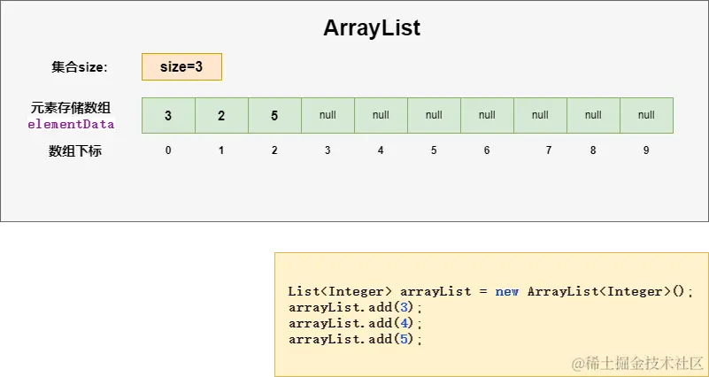
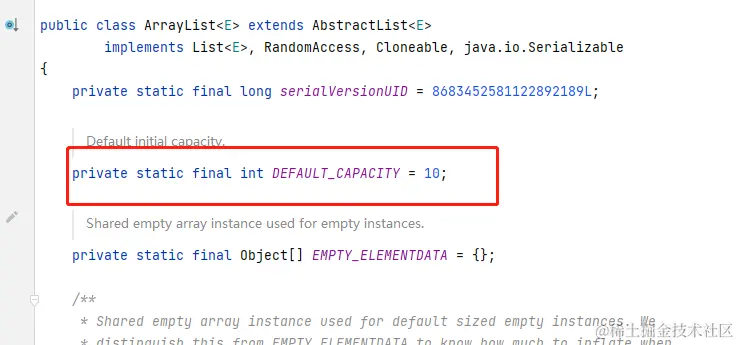
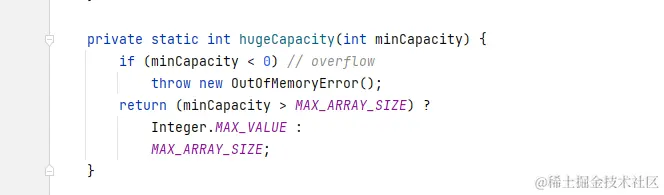
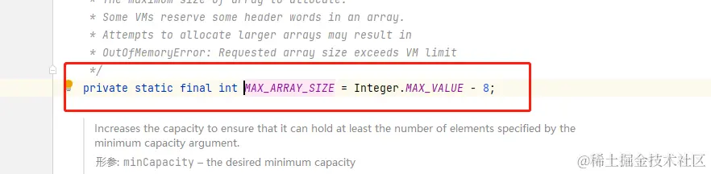

# 深度解析ArrayList：灵活高效的动态数组实现
在 Java 集合框架中，ArrayList 是一个常用而强大的类，它提供了动态数组的实现，允许在运行时动态调整数组的大小。 ArrayList 是 List 接口的实现类，基于动态数组的数据结构。它可以存储任意类型的对象，并提供了丰富的方法，包括添加、删除、遍历等，使其在各种场景下都能发挥重要作用。


### 底层数据结构

`ArrayList` 的底层数据结构是动态数组，其容量是动态调整的。这意味着 ArrayList 可以根据需要自动增长或缩小。

比如有一个ArrayList,size = 3;



arrayList.png

ArrayList属性源码如下：

```java
public class ArrayList<E> extends AbstractList<E>
        implements List<E>, RandomAccess, Cloneable, java.io.Serializable
{
    private static final long serialVersionUID = 8683452581122892189L;
    
    
    private static final int DEFAULT_CAPACITY = 10;
    
    
    private static final Object[] EMPTY_ELEMENTDATA = {};

    
    private static final Object[] DEFAULTCAPACITY_EMPTY_ELEMENTDATA = {};

    
    
    
    
    transient Object[] elementData; 

    
    private int size;
    
    
    public ArrayList(int initialCapacity) {
        if (initialCapacity > 0) {
            this.elementData = new Object[initialCapacity];
        } else if (initialCapacity == 0) {
            this.elementData = EMPTY_ELEMENTDATA;
        } else {
            throw new IllegalArgumentException("Illegal Capacity: "+
                                               initialCapacity);
        }
    }

    
    public ArrayList() {
        this.elementData = DEFAULTCAPACITY_EMPTY_ELEMENTDATA;
    }
    
    .
    .
    .
}

```

从源码可以看到，`elementData`数组是实际存储元素的地方。`size`变量跟踪`ArrayList`的大小。当你向`ArrayList`中添加元素时，它们会存储在`elementData`数组中，并相应地更新`size`。

对于 ArrayList 中的 elementData 字段，它被声明为 transient 的目的是在序列化时避免将数组内容直接序列化到持久存储中。这是因为 ArrayList 的实际元素可能只占用数组的一部分，而不是整个数组。在反序列化时，elementData 会在构造对象时被重新初始化。

在 ArrayList 类中，具体的反序列化过程是通过实现 readObject 方法来完成的。在该方法中，elementData 被重新赋值，以便在反序列化后正确恢复 ArrayList 对象。

以下是 ArrayList 中的关键部分，用于反序列化：

```scss
private void readObject(java.io.ObjectInputStream s)
    throws java.io.IOException, ClassNotFoundException {
    
    elementData = EMPTY_ELEMENTDATA;

    
    s.defaultReadObject();

    
    s.readInt(); 

    if (size > 0) {
        
        int capacity = calculateCapacity(elementData, size);
        SharedSecrets.getJavaOISAccess().checkArray(s, Object[].class, capacity);
        ensureCapacityInternal(size);

        Object[] a = elementData;
        
        for (int i=0; i<size; i++) {
            a[i] = s.readObject();
        }
    }
}
                                

```

### 初始化容量

在使用 new ArrayList() 初始化时，ArrayList 的内部数组 elementData 初始化为一个空数组（EMPTY_ELEMENTDATA），并在添加第一个元素时才进行实际的初始化和分配。默认情况下，ArrayList 的初始容量为 10，即创建一个长度为 10 的空数组。当向 ArrayList 添加元素时，如果容量不足，会触发扩容机制，将数组长度扩大为原来的 1.5 倍。

```csharp
                              

public ArrayList(int initialCapacity) {
    if (initialCapacity > 0) {
        this.elementData = new Object[initialCapacity];
    } else if (initialCapacity == 0) {
        this.elementData = EMPTY_ELEMENTDATA;
    } else {
        throw new IllegalArgumentException("Illegal Capacity: "+
                                           initialCapacity);
    }
}


public ArrayList() {
    this.elementData = DEFAULTCAPACITY_EMPTY_ELEMENTDATA;
}                              

```

### 扩容机制

ArrayList 的扩容机制是在 ensureCapacityInternal 和 grow 方法中实现的。当元素个数达到当前容量时，会触发扩容，将数组长度扩大为原来的 1.5 倍。

当我们向ArrayList 中添加元素(调用add()或者addAll())时,都调用了一个`ensureCapacityInternal（）`方法

我们来看源码：

add()

```arduino
public boolean add(E e) {
    ensureCapacityInternal(size + 1);  
    elementData[size++] = e;
    return true;
}

```

addAll()

```ini
public boolean addAll(Collection<? extends E> c) {
    Object[] a = c.toArray()
    int numNew = a.length
    ensureCapacityInternal(size + numNew)
    System.arraycopy(a, 0, elementData, size, numNew)
    size += numNew
    return numNew != 0
}

```

从源码可以看到，这两个方法都调用了`ensureCapacityInternal（）`这个方法，参数是当前list的长度加上要插入的对象个数（单个对象的话为1，对象集合的话是集合的长度），既集合添加元素所需最小的长度

ensureCapacityInternal（）

```arduino
private void ensureCapacityInternal(int minCapacity) {
    ensureExplicitCapacity(calculateCapacity(elementData, minCapacity));
}

```

`ensureExplicitCapacity()` 方法的入参是`calculateCapacity（）`（参数是存储实际元素的数组和集合添加元素所需最小的长度） 方法处理后的值。

calculateCapacity（）

```typescript
private static int calculateCapacity(Object[] elementData, int minCapacity) {
    if (elementData == DEFAULTCAPACITY_EMPTY_ELEMENTDATA) {
        return Math.max(DEFAULT_CAPACITY, minCapacity);
    }
    return minCapacity;
}

```

当前方法返回的值是如果源集合是空的，则返回 默认容量（10）和元素集合添加元素所需最小的长度值比较，值大的一个，若不为空则返回minCapacity。



_20230828230112.png

ensureExplicitCapacity()

```scss
private void ensureExplicitCapacity(int minCapacity) {
    modCount++;

    
    if (minCapacity - elementData.length > 0)
        grow(minCapacity);
}

```

**grow()**

```ini
private void grow(int minCapacity) {
    // overflow-conscious code
    int oldCapacity = elementData.length
    int newCapacity = oldCapacity + (oldCapacity >> 1)
    if (newCapacity - minCapacity < 0)
        newCapacity = minCapacity
    if (newCapacity - MAX_ARRAY_SIZE > 0)
        newCapacity = hugeCapacity(minCapacity)
    // minCapacity is usually close to size, so this is a win:
    elementData = Arrays.copyOf(elementData, newCapacity)
}

```

我们来详细解读下这段代码

*   int oldCapacity = elementData.length;

获取当前数组的容量，也就是elementData数组的长度，即当前存储元素的数组长度。

*   int newCapacity = oldCapacity + (oldCapacity >> 1);

计算新的容量。这里使用位运算右移1位（相当于除以2）的方式，将当前容量扩大1.5倍。

*   if (newCapacity - minCapacity < 0)

检查计算得到的新容量是否满足最小容量要求。如果不满足，则将新容量设置为最小容量minCapacity。

*   if (newCapacity - MAX\_ARRAY\_SIZE > 0)

检查新容量是否超过了最大数组容量限制。MAX\_ARRAY\_SIZE是ArrayList内部定义的一个常量，表示数组的最大容量。如果新容量超过这个限制，就调用hugeCapacity(minCapacity)方法来获得一个足够大的容量。



_20230828230251.png



_20230828230304.png

*   elementData = Arrays.copyOf(elementData, newCapacity);

使用Arrays.copyOf()方法将原有的elementData数组复制到一个新数组中，新数组的容量为计算得到的新容量newCapacity。这实现了实际的数组扩容操作。

### 特点

随机访问元素效率高，因为底层是数组。

添加、删除元素效率较低，因为可能需要移动元素。

允许存储重复元素。

允许存储 null 元素。

支持动态调整容量。

### 适用场景

适用于频繁读取元素和随机访问的场景。

不适用于频繁添加和删除元素的大规模操作，因为这可能导致性能下降。

ArrayList不是线程安全的，不适合在多线程环境下使用。

总结：
---

ArrayList 是 Java 集合框架中一款强大而灵活的动态数组实现，它的设计和性能特点使得它在许多场景下都能发挥重要作用。在实际开发中，根据具体需求选择合适的集合类是至关重要的，而 ArrayList 无疑是一个常用的选择。

通过本文的深度解析，希望读者能更全面地了解 ArrayList，并在实际项目中充分发挥其优势，提高代码的效率和可维护性。