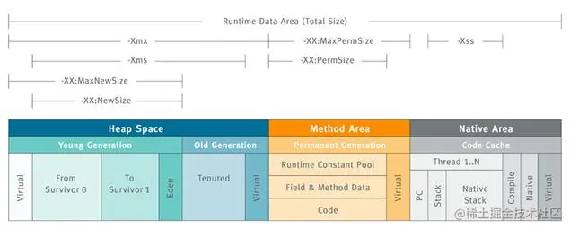
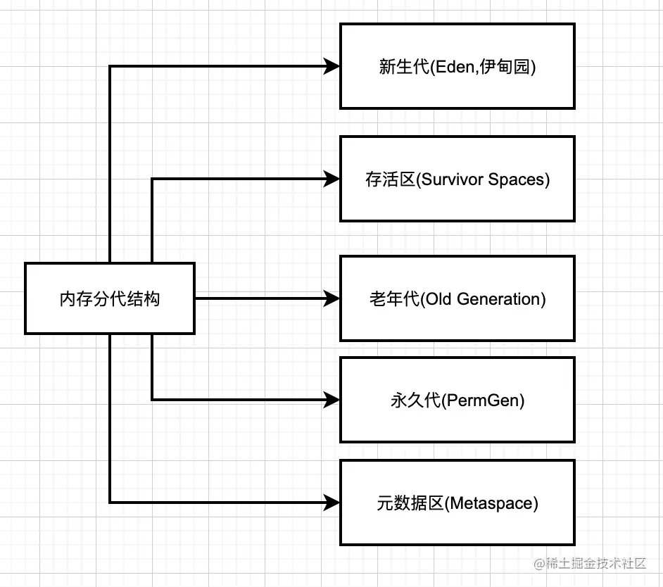
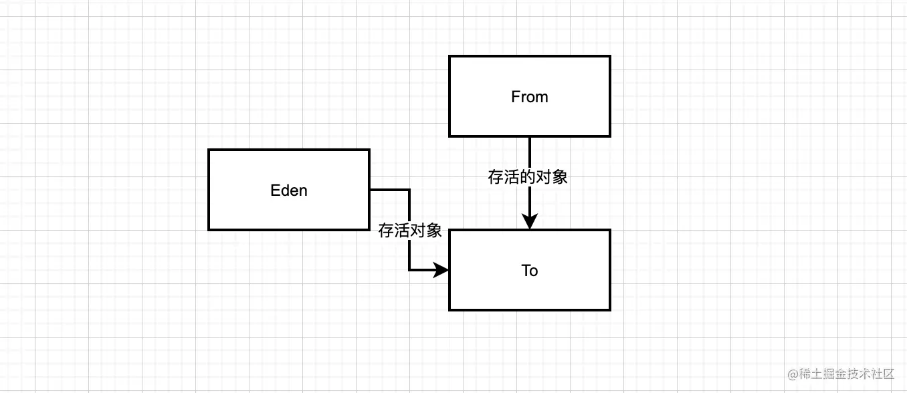
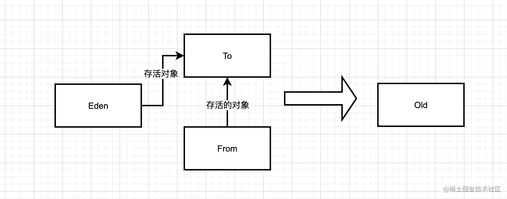
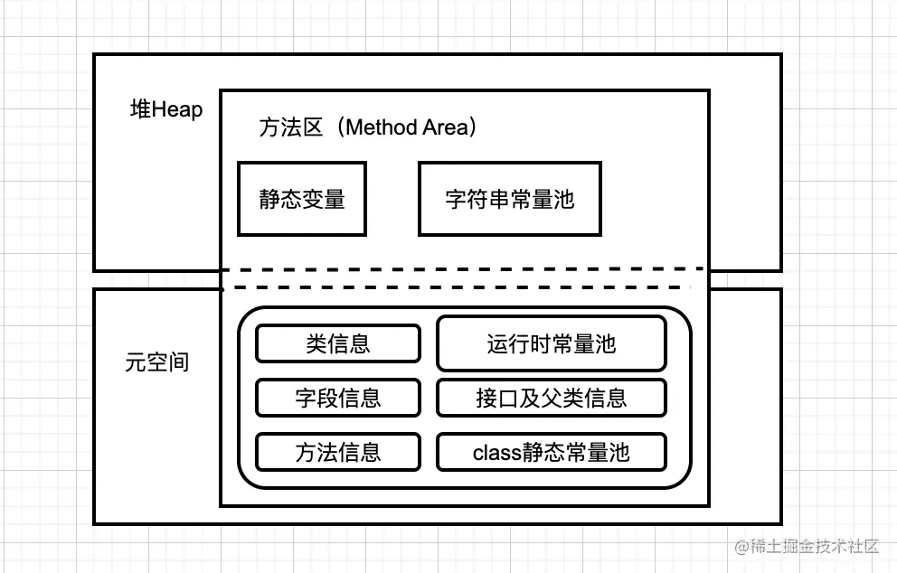
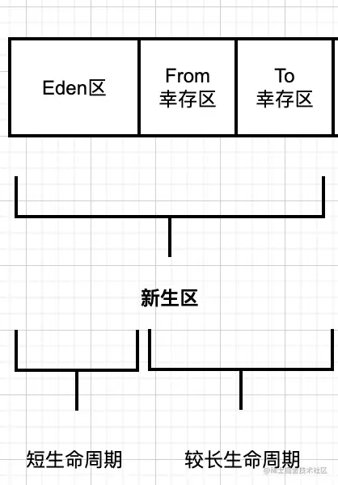
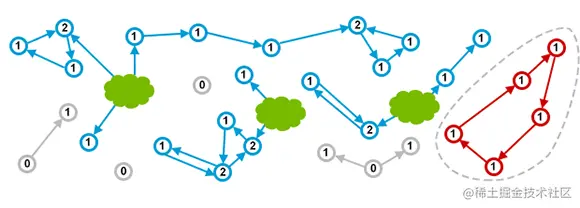

# 精华推荐 | 【JVM深层系列】「GC底层调优专题」一文带你彻底加强夯实底层原理之GC垃圾回收技术的分析指南（GC原理透析）

什么是垃圾收集（GC)
-----------

> **在JVM领域中GC（Garbage Collection）翻译为 “垃圾收集“，Garbage Collector翻译为 “垃圾收集器”**。

分代模型(Generational Model)
------------------------

我们都知道在JVM中，执行垃圾收集需要停止整个应用（STW）。对象越多则收集所有垃圾消耗的时间就越长。程序中的大多数可回收的内存可归为两类:

1.  **大部分对象很快就不再使用**
2.  **还有一部分不会立即无用，但也不会持续(太)长时间**

这形成了分代数据模型。基于这一结构, VM中的内存被分为年轻代(Young Generation)和老年代(Old Generation)，老年代有时候也称为年老区(Tenured)。如下所示。

从上图可以看出拆分为这样两个可清理的单独区域，允许采用不同的算法来大幅提高GC的性能。

### 分代模型出现问题

在不同分代中的对象可能会互相引用, 在收集某一个分代时就会成为 “事实上的” GC root。当然，要着重强调的是，分代假设并不适用于所有程序。

### 分代模型适合场景

GC算法专门针对“总体生命周期较短”，“总体生命周期较长” 这类特征的对象来进行优化, JVM对收集那种存活时间半长不长的对象就显得非常尴尬了，如下图对象分布。

堆内存中的内存池划分也是类似的。不太容易理解的地方在于各个内存池中的垃圾收集是如何运行的。

#### 新生代(Eden,伊甸园)

Eden是内存中的一个区域， 用来分配新创建的对象。通常会有多个线程同时创建多个对象，所以Eden区被划分为多个线程本地分配缓冲区(Thread Local Allocation Buffer, 简称TLAB)。通过这种缓冲区划分，大部分对象直接由JVM 在对应线程的TLAB中分配, 避免与其他线程的同步操作。

如果 TLAB 中没有足够的内存空间, 就会在共享Eden区(shared Eden space)之中分配。如果共享Eden区也没有足够的空间, 就会触发一次 年轻代GC 来释放内存空间。如果GC之后 Eden 区依然没有足够的空闲内存区域, 则对象就会被分配到老年代空间(Old Generation)。

当Eden区进行垃圾收集时，GC将所有从root可达的对象过一遍, 并标记为存活对象。

对象间可能会有跨代的引用，所以需要一种方法来标记从其他分代中指向Eden的所有引用。这样做又会遭遇各个分代之间一遍又一遍的引用。JVM在实现时采用了卡片标记(card-marking)。

##### 卡片标记

JVM只需要记住Eden区中 “脏”对象的粗略位置，可能有老年代的对象引用指向这部分区间。

#### 存活区(Survivor Spaces)

Eden区的旁边是两个存活区, 称为 from 空间和 to 空间。需要着重强调的的是, 任意时刻总有一个存活区是空的(empty)。

空的那个存活区用于在下一次年轻代GC时存放收集的对象。年轻代中所有的存活对象(包括Edenq区和非空的那个 “from” 存活区)都会被复制到 ”to“ 存活区。GC过程完成后, ”to“ 区有对象,而 ‘from’ 区里没有对象。两者的角色进行正好切换 。

存活的对象会在两个存活区之间复制多次，直到某些对象的存活时间达到一定的阀值。分代理论假设, 存活超过一定时间的对象很可能会继续存活更长时间。

这类“ 年老” 的对象因此被提升(promoted )到老年代。提升的时候， 存活区的对象不再是复制到另一个存活区,而是迁移到老年代, 并在老年代一直驻留, 直到变为不可达对象。

此外GC会跟踪记录每个存活区对象存活的次数，每次分代GC完成后，存活对象的年龄就会+1。当年龄超过提升阈值(tenuring threshold)，就会被提升到老年代区域。

##### MaxTenuringThreshold的判定

具体的提升阈值由JVM动态调整,但也可以用参数 `-XX:+MaxTenuringThreshold`来指定上限。如果设置 `-XX:+MaxTenuringThreshold=0` , 则GC时存活对象不在存活区之间复制，直接提升到老年代。现代 JVM 中这个阈值默认设置为15个GC周期。这也是HotSpot中的最大值。

#### 老年代(Old Generation)

老年代内存空间一般情况下，里面的对象是垃圾的概率也更小。

老年代GC发生的频率比年轻代小很多。同时, 因为预期老年代中的对象大部分是存活的, 所以不再使用标记和复制(Mark and Copy)算法。而是采用移动对象的方式来实现最小化内存碎片。老年代空间的清理算法通常是建立在不同的基础上的。原则上,会执行以下这些步骤:

1.  通过标志位(marked bit),标记所有通过 GC roots 可达的对象.
2.  删除所有不可达对象
3.  整理老年代空间中的内容，方法是将所有的存活对象复制,从老年代空间开始的地方,依次存放。

通过上面的描述可知, 老年代GC必须明确地进行整理,以避免内存碎片过多。

#### 永久代(PermGen)

> Java8之前有一个特殊的空间，称为“永久代”(Permanent Generation)。

它存储元数据(metadata)的地方,比如 class 信息等。此外,这个区域中也保存有其他的数据和信息, 包括内部化的字符串(internalized strings)等等。

#### 元数据区(Metaspace)

Java 8直接删除了永久代(Permanent Generation)，改用Metaspace。将静态变量和字符串常量都放到其中。像类定义(class definitions)之类的信息会被加载到Metaspace 中。

元数据区位于本地内存(native memory)，不再影响到普通的Java对象。默认情况下, Metaspace的大小只受限于Java进程可用的本地内存。

### 常见的垃圾回收思想的误区

在我们的日常生活中垃圾收集主要就是找到垃圾并进行清理，这与我们JVM的运作机制恰恰相反，JVM中的垃圾收集器跟踪和标记所有正在使用的对象，并把其余部分的对象当做垃圾对象。

> 所以这里一定要区分清楚，我们这里的标记：是指**标记可用对象，而不是垃圾对象**。常常会有人吧这两者理解错误和混乱。

记住这一点以后，我们再深入讲解内存自动回收的原理，探究JVM中垃圾收集的具体实现。先从基础开始, 介绍垃圾收集的一般特征、核心概念以及实现算法。

### 常见的垃圾回收类型

垃圾回收类型主要是通过回收的范围进行界定和划分。具体的JVM回收区域如下图所示。

#### Java8之前

#### Java8之后

垃圾收集（Garbage Collection）通常分为：Minor GC - Major GC - Full GC 。接下来介绍这些事件及其区别，然后你会发现这些区别也不是特别清晰。

*   Minor GC：年轻代垃圾回收机制，属于轻量级GC，主要面向于年轻代区域的垃圾对象进行回收。
*   Major GC：老年代垃圾回收机制，属于重量级GC，主要面向于老年代区域的垃圾对象进行回收。
*   Full GC：完全化GC，属于全量极GC，大致角度而言**Major GC**和**Full GC**差不多，其实具体分析，FullGC的范围是面向于整体的Heap堆内存。

GC的优点和缺点（GC Benefits/Cost）
--------------------------

#### 好处

1.  提高系统的可靠性和稳定性
2.  内存管理与程序设计的解耦
3.  调试内存错误所花费的时间更少
4.  悬挂程序点/内存泄漏不会发生

> 注意：Java程序没有内存泄漏；“不意味着对象存储地址”更准确）

#### 坏处

*   GC暂停的时间长度
*   CPU/内存利用率

#### Minor GC

> **年轻代内存的垃圾收集称为Minor GC。那什么时候会触发MinorG以及出发MinorGC得我条件是什么？**

##### 触发MinorGC的时机

当JVM无法为新对象分配Eden区的内存空间时/达到了Eden存放阈值的时候会触发 Minor GC，所以新对象分配频率越高，Minor GC的频率就越高。并且Minor GC每次都会引起全线停顿(stop-the-world )，暂停所有的应用线程，对大多数程序而言,暂停时长基本上是可以忽略不计的。

##### MinorGC回收的瓶颈

Eden区的对象基本上都是垃圾，也不怎么复制到Survior区/老年代。如果情况不是这样, 大部分新创建的对象不能被垃圾回收清理掉，则 Minor GC的停顿就会持续更长的时间。

##### MinorGC回收的范围

Minor GC实际上忽略了老年代，主要面向的对象范围有两部分组成：

1.  主要是面向于老年代到年轻代的所引用的对象范围，例如，它会将从老年代指向年轻代的引用都被认为是GC Root，**（而从年轻代指向老年代的引用在标记阶段全部被忽略）**。
    
2.  **主要面向的是Survior区之间的相互引用，此种场景的生命周期较短，属于年轻代之内的对象之间的引用关系。** 
    

所以，Minor GC的定义很简单、清理的就是年轻代，如下图所示。

#### Major GC vs Full GC

从上面我们知道了Minor GC清理的是年轻代空间(Young space)，相应的其他区域也有对应的回收机制和策略。

*   Major GC清理的是老年代空间(Old space)，MajorGC是由Minor GC触发的，所以很多情况下这两者是不可分离的，G1这样的垃圾收集算法执行的是部分区域垃圾回收。
    
*   Full GC清理的是整个堆，包括年轻代和老年代空间。
    

#### Minor GC、MajorGC和FullGC执行效果

大部分情况下，发生在年轻代的Minor GC次数会很多，会引起STW，也就是全局化暂停执行业务线程的行为，但是时间很短（几乎可以忽略不计）。而Major GC和Full GC也会造成全局化暂停的效果。所以一般情况下尽可能减少MajorGC和FullGC是什么必要的，但是也不能“一棒子打死一船人”。必要的时候还是需要触发少量几次Major GC以及FullGC，进而释放一些RSS常驻内存。

垃圾收集(GC)的原理
-----------

### 自动内存管理(Automated Memory Management)

如果要显式地声明什么时候需要进行内存管理，实现自动进行收集垃圾，那样就太方便了，开发者不再耗费脑细胞去考虑要在何处进行内存清理。运行时环境会自动算出哪些内存不再使用，并将其释放，历史上第一款垃圾收集器是1959年为Lisp语言开发的。

#### 引用计数(Reference Counting)

共享指针方式的引用计数法， 可以应用到所有对象。许多语言都采用这种方法，包括 Perl、Python 和 PHP 等。下图很好地展示了这种方式：

上图中所展示的GC ROOTS，表示程序正在使用的对象。主要（**这里指的不是全部**）集中在于当前正在执行的方法中的局部变量或者是静态变量等。在这里主要我指的是Java。

*   **蓝色的圆圈表示可以引用到的对象，里面的数字就是被引用计数器**。
*   **灰色的圆圈是各个作用域都不再引用的对象，可以被认为是垃圾，随时会被垃圾收集器清理。** 

##### 循环引用（detached cycle）的问题

引用计数器无法针对于循环引用这种场景进行正确的处理和探测。任何作用域中都没有引用指向这些对象，但由于循环引用, 导致引用计数一直大于零，如下图所示。

*   红色线路和红色圆圈对象实际上属于垃圾引用以及垃圾对象，但由于引用计数的局限，所以存在内存泄漏，永远都无法进行回收该区域的对象内存。

##### 循环引用（detached cycle）的解决方案

比如说可以针对于一些这种循环模式进行加入到 “弱引用”(‘weak’ references)的体系中，所以即使无法进行解决循环引用计数的场景，也可以通过弱引用实现内存回收。
