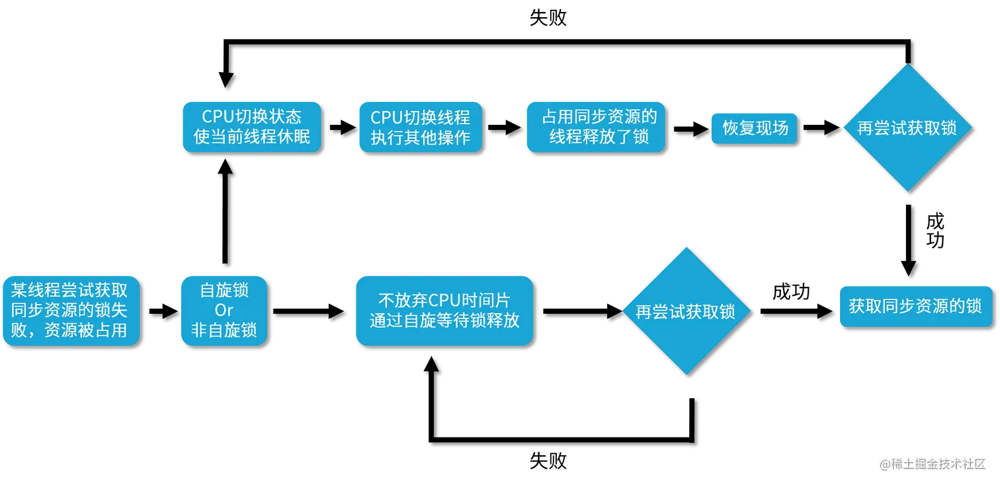

# 聊聊Java中常见的锁概念
根据分类标准我们把锁分为以下 7 大类别，分别是：

*   偏向锁/轻量级锁/重量级锁；
*   可重入锁/非可重入锁；
*   共享锁/独占锁；
*   公平锁/非公平锁；
*   悲观锁/乐观锁；
*   自旋锁/非自旋锁；
*   可中断锁/不可中断锁。

对于 Java 中的锁而言，一把锁也有可能同时占有多个标准，符合多种分类，比如 **ReentrantLock 既是可中断锁，又是可重入锁。** 

偏向锁/轻量级锁/重量级锁
-------------

第一种分类是偏向锁/轻量级锁/重量级锁，这三种锁特指 synchronized 锁的状态，**通过在对象头中的 mark word 来表明锁的状态。** 

### 偏向锁

如果自始至终，对于这把锁都不存在竞争，那么其实就没必要上锁，只需要打个标记就行了，这就是偏向锁的思想。一个对象被初始化后，还没有任何线程来获取它的锁时，那么它就是可偏向的，当有第一个线程来访问它并尝试获取锁的时候，它就将这个线程记录下来，以后如果尝试获取锁的线程正是偏向锁的拥有者，就可以直接获得锁，开销很小，性能最好。

### 轻量级锁

JVM 开发者发现在很多情况下，synchronized 中的代码是被多个线程交替执行的，而不是同时执行的，也就是说并不存在实际的竞争，或者是只有短时间的锁竞争，用 CAS 就可以解决，这种情况下，用完全互斥的重量级锁是没必要的。轻量级锁是指当锁原来是偏向锁的时候，被另一个线程访问，说明存在竞争，那么偏向锁就会升级为轻量级锁，线程会通过自旋的形式尝试获取锁，而不会陷入阻塞。

### 重量级锁

重量级锁是互斥锁，它是利用操作系统的同步机制实现的，所以开销相对比较大。当多个线程直接有实际竞争，且锁竞争时间长的时候，轻量级锁不能满足需求，锁就会膨胀为重量级锁。重量级锁会让其他申请却拿不到锁的线程进入阻塞状态。

可重入锁/非可重入锁
----------

第 2 个分类是可重入锁和非可重入锁。可重入锁指的是线程当前已经持有这把锁了，能在不释放这把锁的情况下，再次获取这把锁。同理，不可重入锁指的是虽然线程当前持有了这把锁，但是如果想再次获取这把锁，也必须要先释放锁后才能再次尝试获取。

共享锁/独占锁
-------

第 3 种分类标准是共享锁和独占锁。共享锁指的是我们同一把锁可以被多个线程同时获得，而独占锁指的就是，这把锁只能同时被一个线程获得。我们的读写锁，就最好地诠释了共享锁和独占锁的理念。读写锁中的读锁，是共享锁，而写锁是独占锁。读锁可以被同时读，可以同时被多个线程持有，而写锁最多只能同时被一个线程持有。

公平锁/非公平锁
--------

第 4 种分类是公平锁和非公平锁。公平锁的公平的含义在于如果线程现在拿不到这把锁，那么线程就都会进入等待，开始排队，在等待队列里等待时间长的线程会优先拿到这把锁，有先来先得的意思。而非公平锁就不那么“完美”了，它会在一定情况下，忽略掉已经在排队的线程，发生插队现象。 

悲观锁/乐观锁
-------

第 5 种分类是悲观锁，以及与它对应的乐观锁。悲观锁的概念是在获取资源之前，必须先拿到锁，以便达到“独占”的状态，当前线程在操作资源的时候，其他线程由于不能拿到锁，所以其他线程不能来影响我。而乐观锁恰恰相反，它并不要求在获取资源前拿到锁，也不会锁住资源；相反，乐观锁利用 CAS 理念，在不独占资源的情况下，完成了对资源的修改。 举例：

*   悲观锁：synchronized 关键字和 Lock 接口.
*   乐观锁：Atomic 原子类

自旋锁/非自旋锁
--------

第 6 种分类是自旋锁与非自旋锁。自旋锁的理念是如果线程现在拿不到锁，并不直接陷入阻塞或者释放 CPU 资源，而是开始利用循环，不停地尝试获取锁，这个循环过程被形象地比喻为“自旋”，就像是线程在“自我旋转”。相反，非自旋锁的理念就是没有自旋的过程，如果拿不到锁就直接放弃，或者进行其他的处理逻辑，例如去排队、陷入阻塞等。

### 对比自旋和非自旋的获取锁的流程



可中断锁/不可中断锁
----------

第 7 种分类是可中断锁和不可中断锁。在 Java 中，synchronized 关键字修饰的锁代表的是不可中断锁，一旦线程申请了锁，就没有回头路了，只能等到拿到锁以后才能进行其他的逻辑处理。而我们的 ReentrantLock 是一种典型的可中断锁，例如使用 lockInterruptibly 方法在获取锁的过程中，突然不想获取了，那么也可以在中断之后去做其他的事情，不需要一直傻等到获取到锁才离开。

相比于 JDK 1.5，在 JDK 1.6 中 HotSopt 虚拟机对 synchronized 内置锁的性能进行了很多优化，包括自适应的自旋、锁消除、锁粗化、偏向锁、轻量级锁等。有了这些优化措施后，synchronized 锁的性能得到了大幅提高。

自适应的自旋锁
-------

在 JDK 1.6 中引入了自适应的自旋锁来解决长时间自旋的问题。自适应意味着自旋的时间不再固定，而是会根据最近自旋尝试的成功率、失败率，以及当前锁的拥有者的状态等多种因素来共同决定。自旋的持续时间是变化的，自旋锁变“聪明”了。

锁消除
---

是指虚拟机即时编译器JIT在运行时，对一些代码上要求同步，但是会**将检测到不可能存在共享数据竞争的锁进行消除**。锁消除的主要判定依据来源于逃逸分析的数据支持，如果判断在一段代码中， 堆上的所有数据都不会逃逸出去从而被其他线程访问到，那就可以把它们当做栈上数据对待，认为它们是线程私有的，同步加锁自然就无须进行。变鼂是否逃逸，对于虚拟机来说需要使用数据流分析来确定，但是程序员自己应该是很清楚的，怎么会在明知道不存在数据争用的情况下要求同步呢？实际上有许多同步措施并不是程序员自己加入的，同步的代码在Java程序中的普遍程度也许超过了大部分读者的想象。

```java
public class MySynchronizedTest07 {

    public void method() {
        Object object = new Object();
        synchronized (object) {
            System.out.println("hello  world");
        }
    }
}

```

上述代码我们可知将object变成了局部变量，在方法中，方法的的局部变量时线程独立的，并发的场景每个线程都有各自的object对象，这个时候的锁就无意义的。

锁粗化
---

```java
public void lockCoarsening() {
    synchronized (this) {
        
    }
    synchronized (this) {
        
    }
    synchronized (this) {
        
    }
}

```

那么其实这种释放和重新获取锁是完全没有必要的，如果我们把同步区域扩大，也就是只在最开始加一次锁，并且在最后直接解锁，那么就可以把中间这些无意义的解锁和加锁的过程消除，相当于是把几个 synchronized 块合并为一个较大的同步块。这样做的好处在于在线程执行这些代码时，就无须频繁申请与释放锁了，这样就减少了性能开销。

锁升级的路径
------


 你可以发现锁升级的路径：无锁→偏向锁→轻量级锁→重量级锁。 综上所述：**偏向锁性能最好，可以避免执行 CAS 操作。而轻量级锁利用自旋和 CAS 避免了重量级锁带来的线程阻塞和唤醒，性能中等。重量级锁则会把获取不到锁的线程阻塞，性能最差。** 

1.  永远只在更新对象的成员变量时加锁
2.  永远只在访问可变的成员变量时加锁
3.  永远不在调用其他对象的方法时加锁
4.  减少锁的持有时间、减小锁的粒度
