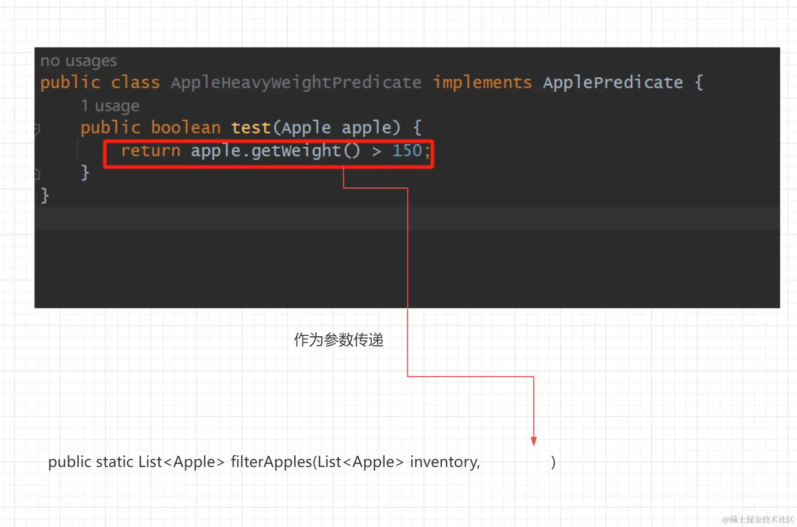

# 行为参数化—Java程序员必须掌握的开发模式 
前言
--

该文章主要是书《Java实战（第2版）》的读书笔记，例子是使用书上的，不过文章主要是自己的一些语言以见解，方便自己理解。有兴趣的同学可以去看这部书，力荐。

频繁变更的需求
-------

我们知道，在实际的业务开发中，我们需要面对不断变更的需求。为了说明这样的场景，我举例了苹果的例子，方便大家理解。  
假设我们定义了一个枚举，以及Apple类。代码如下：

```java
public enum Color {
    RED,
    GREEN;
}

```

```java
public class Apple {

    private Color color;  
    private int weight;  

    public Color getColor() {
        return color;
    }

    public void setColor(Color color) {
        this.color = color;
    }

    public int getWeight() {
        return weight;
    }

    public void setWeight(int weight) {
        this.weight = weight;
    }
}

```

如果我们要筛选绿色的苹果，可能会这样做

```java
public static List<Apple> filterApples(List<Apple> inventory) {
    List<Apple> result = new ArrayList<Apple>();
    for (Apple apple : inventory) {
        if (Color.GREEN.equals(apple.getColor())) {
            result.add(apple);
        }
    }
    return result;
}

```

这样做的弊端是显而易见的，如果我们要筛选红色的苹果呢？那么需要额外定义方法了。一般程序员会通过参数的形式，将需要筛选的颜色传递给函数，在函数里面进行判断。像下面的代码展示的那样。

```Java
public static List<Apple> filterApples(List<Apple> inventory, Color color) {
    List<Apple> result = new ArrayList<Apple>();
    for (Apple apple : inventory) {
        if (color.equals(apple.getColor())) {
            result.add(apple);
        }
    }
    return result;
}

```

这样我们就可以筛选不同颜色的苹果了。  
万一，农民说，要是可以通过重量的来筛选苹果就好了，比如我想要150g的苹果。  
程序员又要定义一个方法来针对重量的筛选了，但是这样会造成的代码冗余了。有没有更好的解决方案呢？答案是肯定的，那就是把行为抽象出来。  
如下图所示，如果我们可把Color这个参数，改成传入我们需要的特定行为，比如筛选不同颜色的苹果，或者根据指定重量来筛选苹果等一系列行为，并且在if语句中，进行行为的判断，如果符合某一种行为，那么就执行if语句里面的。 这样，我们就不需要针对不同的行为去拷贝那么多重复的代码了。


行为参数化
-----

行为参数化是帮助程序员处理频繁变更的需求的一种开发模式。意味着，程序员可以将代码准备好，却不去执行它。这个代码可以留着被程序的其他部分调用。  
可以理解为，我们把行为（如上面说的那些行为）作为参数，利用参数的形式传给一个函数，函数内部可以通过这个参数去执行相应的行为。  
在探讨如何进行行为参数化之前，可以来了解下**谓词**。  
我们知道，在if语句里需要一个boolean值，**也就是说，我们需要把我们的行为定义成一个布尔值的函数，并且是根据Apple的某些属性来返回的。**   
我们把它称为谓词（即一个返回boolean值的函数）。  
了解了我们需要的谓词，那么我们该如何来进行行为参数化呢？下面会一步步探讨，如何进行参数行为化，并不断简化我们的代码。

### 使用策略模式

首先，我们知道，我们需要定义一个返回布尔值的函数。所以我们定义顶层接口，代码如下：

```java
public interface ApplePredicate {
    boolean test(Apple apple);
}

```

现在就利用不同的实现类来表示不同的行为了，如下面的代码所示：

```java
public class AppleGreenColorPredicate implements ApplePredicate{
    public boolean test(Apple apple) {
        return Color.GREEN.equals(apple.getColor());
    }
}

public class AppleHeavyWeightPredicate implements ApplePredicate {
    public boolean test(Apple apple) {
        return apple.getWeight() > 150;
    }
}

```

上面就是我们所熟悉的策略设计模式，这个模式在实际的业务开发中十分常见。在这里，我们把顶级接口称为算法族，而具体的实现类就是不同的策略。  
那么如何利用ApplePredicate的不同实现？很简单，我们可以看下面的代码：

```java
public static List<Apple> filterApples(List<Apple> inventory, ApplePredicate p) {

    List<Apple> result = new ArrayList<Apple>();
    for (Apple apple : inventory) {
        if (p.test(apple)) {
            result.add(apple);
        }
    }
    return result;
}

```

我们可以看到，我们把之前的Color参数改成了ApplePredicate，这样我们传入不同的实现类，就可以实现不同的行为了，这就是**行为参数化：让方法接受多种行为（策略）作为参数，并在内部使用，来完成不同的行为。**   
这样，一旦需求再次改变的话，我们就可以定义不同的策略，然后把策略作为参数穿进去就可以了。  
不过遗憾的是，filterApples方法，只能接受对象，所以我们必须把代码包裹在ApplePredicate对象里面，并且在内部调用test方法。  
同时，还有一个致命的问题，就是我们每次定义一个问题，都要新建一个新的策略类。如果行为一旦多起来了，那么要定义很多类，那么能不能做得更好一些呢？  
答案是肯定的，就是使用Java的匿名类。

### 使用匿名类

```java
public static void main(String[] args) {
    List<Apple> inventory = new ArrayList<Apple>();
    
    filterApples(inventory, new ApplePredicate() {
        public boolean test(Apple apple) {
            return Color.RED.equals(apple.getColor());
        }
    });
}

```

使用了匿名类我们就不需要定义太多的策略类了。但是匿名类还是太啰嗦了，有没有更加简洁的方法？  
这个时候，就要提到我们大名鼎鼎的Lambda表达式了。  
我们观察我们先前定义的策略，可以看到，我们需要的就是test方法里面的那部分代码，如下图所示：


  
也就是说，我们可以把apple.getWeight() > 150这行代码直接传递给filteApples方法，不需要定义那么多的ApplePredicate的实现类了，删除不必要的代码了。  
就像下面的代码：

```java
filterApples(inventory, (Apple apple) -> apple.getWeight() > 150);

```

这样是不是简洁了很多，这样就解决了Java代码啰嗦的问题了。

### 把List类型抽象化

我们还可以进一步抽象化，比如filterApples方法只适用Apple。我们可以超越我们眼前需要处理的问题，代码如下：

```java
public interface Predicate<T> {
    boolean test(T t);
}
public static <T> List<T> filter(List<T> list, Predicate<T> p) {
    List<T> result = new ArrayList<>();
    for (T t : list) {
        if (p.test(t)) {
            result.add(t);
        }
    }
    return result;
}

```

这样就能把filter方法用在任何类型上了，并且搭配lambda表达式来使用，我们的代码不仅简洁还抽象。

总结
--

其实行为参数化的相关概念很简单，但是它是我们通往抽象的路上必不可少的，只有了解到了相关的概念，我们才可以在追求抽象的概念上越走越远！