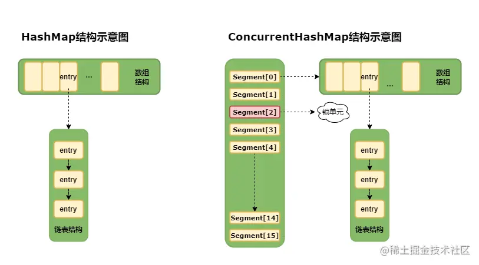
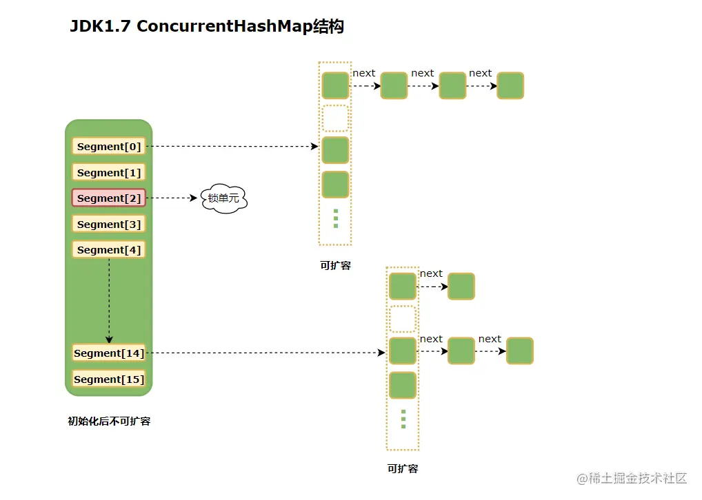
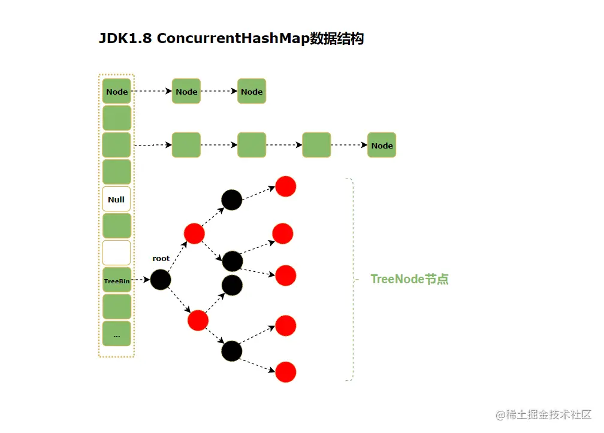

# 说说HashMap and ConcurrentHashMap的原理和实现
概念
--

✔在多线程高并发环境下，使用`HashMap`进行**put、remove**操作时存在数据丢失的情况，也就是说`HashMap`是非线程安全的，因为`HashMap`底层代码操作数组的数据并未加锁，为了避免这个隐患，强烈推荐使用`ConcurrentHashMap`代替`HashMap`。

`HashTable`是一个线程安全类，实际上它底层使用`synchronized`来锁住整张`hash`表来实现线程安全，即每次锁住整张表让线程独占，相当一所有的线程进行读写时都去竞争同一把锁，导致效率非常低下，而**ConcurrentHashMap**可以做到读取数据的时候不加锁，并且其内部结果可以让其在进行写操作的时候能把锁的颗粒度保持尽量最小，允许多个修改操作同时进行，其关键于使用了`分段锁机制`，它使用了多个锁来控制对`hash`表的不同部分就那些修改，对于`JDK1.7`版本的实现，**ConcurrentHashMap**内部使用段`（Segemnt）`来说表示不同的16个部分，也就是一个 **Segment** 数组，一个 **Segment** 数组里面包含 **HashEntry** 数组，当对某个 `HashEntry`数组中的元素进行修改时，必须首先获得该元素所属`HashEntry`数组对应的`Segment`锁，每个Segment都有自己独立的锁，只要多个修改操作发生在不同段上，它们就可以并行执行，👏**JDK1.8的实现降低了锁的颗粒度，不同于JDK1.7版本的Segemnt数组+HashEntry链表，JDK1.8版本中的ConcurrentHashMap直接抛弃了Segment锁，一个ConcurrentHashMap包含一个Node数组（和HashEntry实现差不多），每个Node是一个链表结构，并且在链表长度大于一定值时会自动转换为红黑树结构（TreeBin）。** 

🌈JDK1.7和JDK1.8对比
-----------------

### HashMap

_**JDK 1.7**_

*   数据结构：**数组+链表**
*   安全性：非线程安全，操作数组的数据并未加锁。

_**JDK 1.8**_

*   数据结构：**数组+链表+红黑树**
*   安全性：非线程安全，操作数组的数据并未加锁。

> 🔥为了减少链表遍历的开销，Java 8对HashMa进行了优化，将数据结构改成数组+链表或红黑树，在链表中当元素长度>=8时，HashMap会将链表结构转换成红黑树结构以提高查询效率，哈希表扩容时，如果发现链表长度<=6的时候，则会将红黑树退化成链表。

### ConcurrentHashMap

_**JDK1.7**_

*   数据结构：**Segment 分段数组 + HashEntry 数组**
*   线程安全：线程安全，因为底层代码在操作每一个`Segment`时都会加锁，保证线程安全
*   性能：读取数据不加锁、效，且因为`map`中的`value`变量值是添加`volatile`关键字修饰，可保证读取到最新值，降低`CPU`负载。

_**JDK1.8**_

*   数据结构：**Node数组 + 链表 + 红黑树（TreeBin）**
*   线程安全：线程安全，并发操作使用的是`synchronized`和`CAS`来控制，引入了红黑树结构降低哈希冲突和时间复杂度。

> **JDK1.7当中**，`Segment`数组的意义就是将一个大的`hashTable`分割成多个小的`hashTable`来进行加锁，**减低的锁的粒度，也就是所说的锁分离技术**，每一个Segment元素存储的是`HashEntry数组+链表`，这个和`HashMap`的数据存储结构是一致的。
> 
> **JDK 1.7中的put/get操作**  
> put操作：对于`ConcurrentHashMap`的数据插入，这里需要进行两次的`hash`计算`index`值，第一次是计算当前key存在当哪一块小的segment中，第二次`hash`操作找相应的`HashEntry`位置。  
> get操作：对于数据获取，`ConcurrentHashMap`第一次需要经过一次`hash`定位到`Segment`的位置，然后再`hash`定位到指定的`HashEntry`，遍历该`HashEntry`下的链表进行对比，成功就返回，不成功就返回null。

**JDK1.7 HashMap和ConcurrentHashMap示意图**： 

> JDK1.7 `HashMap`的数据结构图如上所示，其内部实际上是一个数组，数组中的每个元素都是一个单向链表，链表中的每个元素都是嵌套类`Entry`的实例，`Entry`实例包含了4个属性：key、value、hash值和用于指向单向链表下一个元素的`next`节点。

> 🙋‍♂️与`HashMap`不同，`ConcurrentHashMap`采用分段锁的思想实现并发操作，因此是线程安全的。`ConcurrentHashMap`是由多个`Segment`组成（`Segment`的数量也就是锁的并发度），每个`Segment`都是继承自`ReentrantLock`并单独加锁，索引每次进行加锁操作锁住的都是一个`Segemnt`，这样保证了每个`Segment`都是线程安全的，进而实现了全局的线程安全。

🎈ConcurrentHashMap在JDK 7和8之间的区别
--------------------------------

*   `JDK1.8`的实现降低锁的粒度，`JDK1.7`版本锁的粒度是基于`Segment`的，包含多个`HashEntry`，而JDK1.8锁的粒度就是`HashEntry`（首节点）。
*   `JDK1.8`中`ConcurrentHashMap` 取消了 `Segment` 分段锁，采用`CAS`和 `synchronized` 来保证并发安全。数据结构跟`HashMap1.8`的结构类似，数组+链表/红黑二叉树。Java 8 在链表长度超过一定阈值（8）时将链表（寻址时间复杂度为`O(N)`）转换为红黑树（寻址时间复杂度为`O(log(N))`）。
*   `JDK1.8`使用红黑树来优化链表，基于长度很长的链表的遍历是一个很漫长的过程，而红黑树的遍历效率是很快的，代替一定阈值的链表，这样形成一个最佳拍档。